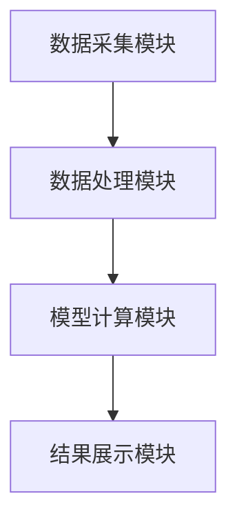
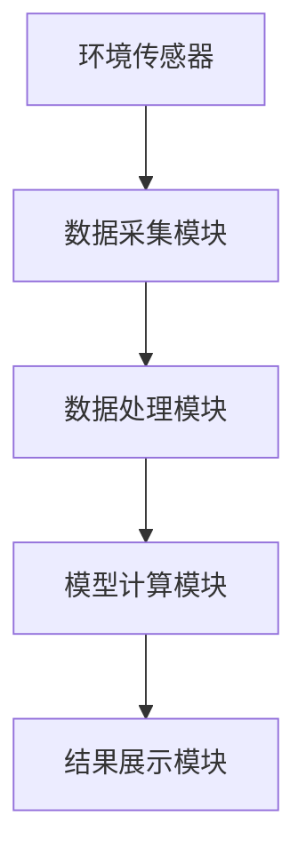

                 


# 全球股市估值与深海采矿环境影响评估技术的发展

> 关键词：全球股市估值、深海采矿、环境影响评估、技术发展、系统架构

> 摘要：本文探讨了全球股市估值与深海采矿环境影响评估技术的发展，分析了这两项技术的核心概念、算法原理、数学模型以及系统架构设计，最后通过实际案例展示了技术的应用与优化。

---

## 第1章 全球股市估值与深海采矿环境影响评估技术的背景与概念

### 1.1 全球股市估值的背景与意义

#### 1.1.1 股市估值的基本概念

股市估值是通过对公司财务数据和市场信息进行分析，评估股票的内在价值，从而为投资者提供决策依据。常见的估值方法包括市盈率（P/E）、市净率（P/B）、股息率等。

#### 1.1.2 全球化背景下的股市估值特点

全球化使得股市估值更加复杂。国际市场的波动、汇率变化、跨国公司的影响等因素都会对股票估值产生影响。此外，技术的进步（如人工智能）使得估值方法更加多样化和精准化。

#### 1.1.3 股市估值对经济发展的意义

股市估值不仅是投资者决策的基础，也是经济健康的重要指标。合理的估值能够引导资金流向高效率的企业，促进经济发展。

### 1.2 深海采矿与环境影响评估技术的背景

#### 1.2.1 深海采矿的基本概念

深海采矿是指在海洋深处（通常大于200米）进行矿产资源的开采。随着陆地资源的枯竭，深海采矿成为新的资源开发方向。

#### 1.2.2 深海采矿的环境影响特点

深海采矿可能对海洋生态系统造成破坏，包括海底地形改变、生物多样性减少、水体污染等。因此，环境影响评估技术在深海采矿中至关重要。

#### 1.2.3 环境影响评估技术的重要性

环境影响评估技术能够帮助预测和量化采矿活动对环境的影响，从而制定有效的保护措施，减少生态破坏。

### 1.3 本章小结

本章介绍了全球股市估值和深海采矿环境影响评估技术的基本概念和背景，为后续的技术分析奠定了基础。

---

## 第2章 全球股市估值与深海采矿环境影响评估技术的核心概念与方法

### 2.1 股市估值的核心概念

#### 2.1.1 股票价值的定义

股票价值是指公司未来现金流的现值。常用的估值模型包括股息折现模型（DDM）和现金流折现模型（DCF）。

#### 2.1.2 影响股票价值的主要因素

- 公司财务状况：收入、利润、负债等。
- 行业竞争格局：市场份额、行业趋势。
- 宏观经济因素：GDP、利率、通货膨胀等。
- 市场情绪：投资者情绪影响短期股价波动。

#### 2.1.3 股市估值的边界与外延

股市估值的边界包括公司自身财务数据，外延则涉及行业、宏观经济和政策环境。

### 2.2 深海采矿环境影响评估的核心概念

#### 2.2.1 环境影响评估的基本原理

环境影响评估通过量化采矿活动对环境的影响，制定保护措施。常用方法包括生态模型和环境监测技术。

#### 2.2.2 深海生态系统的特征

深海生态系统脆弱且复杂，生物多样性高，但恢复能力差。采矿活动可能对海底地形和生物群落造成破坏。

#### 2.2.3 环境影响评估的关键指标

- 海底地形变化。
- 生物多样性指数。
- 水体污染程度。

### 2.3 股市估值与深海采矿环境影响评估的联系

#### 2.3.1 技术发展的相互影响

技术进步（如人工智能）同时推动了股市估值和环境影响评估的发展。

#### 2.3.2 两者在经济与环境领域的交叉点

采矿企业的股票估值需要考虑环境风险，而环境影响评估技术可以降低这种风险。

#### 2.3.3 技术融合的潜力与挑战

技术融合可以提高估值的准确性和环境保护的效率，但需要克服数据获取和计算复杂性等挑战。

### 2.4 本章小结

本章分析了股市估值和深海采矿环境影响评估的核心概念和联系，强调了技术融合的潜力。

---

## 第3章 深海采矿环境影响评估技术的算法原理

### 3.1 环境影响评估的算法原理

#### 3.1.1 数据采集与处理流程

- 数据采集：通过传感器获取环境数据。
- 数据清洗：去除噪声，确保数据准确性。
- 数据分析：使用统计方法和机器学习模型进行分析。

#### 3.1.2 环境影响评估模型的构建

- 确定关键影响因素。
- 建立数学模型，量化影响程度。

#### 3.1.3 算法的数学模型与公式

环境影响指数模型：
$$ I = \sum_{i=1}^{n} w_i x_i $$
其中，$w_i$ 是第 $i$ 个因素的权重，$x_i$ 是第 $i$ 个因素的指标值。

### 3.2 深海采矿环境影响评估的系统架构

#### 3.2.1 系统功能模块划分

- 数据采集模块：收集环境数据。
- 数据处理模块：清洗和分析数据。
- 模型计算模块：评估环境影响。
- 结果展示模块：输出评估结果。

#### 3.2.2 系统架构设计图（Mermaid）



### 3.3 本章小结

本章详细介绍了深海采矿环境影响评估技术的算法原理和系统架构设计。

---

## 第4章 全球股市估值技术的数学模型与公式

### 4.1 股票估值的主要数学模型

#### 4.1.1 市盈率模型

$$ P/E = \frac{\text{股价}}{\text{每股净利润}} $$

#### 4.1.2 市净率模型

$$ P/B = \frac{\text{股价}}{\text{每股净资产}} $$

#### 4.1.3 现金流折现模型

$$ V = \sum_{t=1}^{n} \frac{CF_t}{(1 + r)^t} $$

其中，$CF_t$ 是第 $t$ 年的现金流，$r$ 是折现率。

### 4.2 深海采矿环境影响评估的数学模型

#### 4.2.1 生态影响评估模型

$$ E = \sum_{i=1}^{m} a_i x_i $$
其中，$a_i$ 是第 $i$ 个因素的系数，$x_i$ 是第 $i$ 个因素的指标值。

#### 4.2.2 环境承载力评估模型

$$ C = \frac{\text{资源总量}}{\text{开采强度}} $$

#### 4.2.3 综合影响指数模型

$$ I = \alpha E + \beta C $$
其中，$\alpha$ 和 $\beta$ 是权重系数。

### 4.3 数学模型的比较与优化

#### 4.3.1 模型的优缺点分析

- 市盈率模型：简单但受利润波动影响。
- 市净率模型：考虑了资产价值，但忽略收益。
- 现金流折现模型：准确但计算复杂。

#### 4.3.2 模型优化的策略

- 结合多个模型的优点。
- 根据具体行业调整模型参数。

#### 4.3.3 实际案例分析

通过具体案例分析，验证模型的有效性和准确性。

### 4.4 本章小结

本章详细介绍了股市估值和环境影响评估的数学模型，并分析了它们的优缺点。

---

## 第5章 深海采矿环境影响评估技术的系统分析与架构设计

### 5.1 系统分析

#### 5.1.1 问题场景介绍

深海采矿可能导致海底生态破坏，需要通过系统分析制定解决方案。

#### 5.1.2 系统功能需求分析

- 实时监测环境数据。
- 计算环境影响指数。
- 提供保护措施建议。

#### 5.1.3 系统边界与数据流分析

- 数据输入：环境传感器数据。
- 数据输出：环境影响评估报告。

### 5.2 系统架构设计

#### 5.2.1 系统架构图（Mermaid）



#### 5.2.2 系统功能模块划分

- 数据采集模块：接收环境数据。
- 数据处理模块：清洗和分析数据。
- 模型计算模块：评估环境影响。
- 结果展示模块：输出评估结果。

### 5.3 本章小结

本章通过系统分析和架构设计，展示了深海采矿环境影响评估技术的实现方案。

---

## 项目实战：环境安装与核心实现

### 环境安装

- 安装Python和必要的库（如NumPy、Pandas、Matplotlib）。

### 核心代码实现

```python
import numpy as np
import pandas as pd
import matplotlib.pyplot as plt

# 示例：环境影响评估模型
def environmental_impact_assessment(data):
    factors = data[['factor1', 'factor2', 'factor3']]
    weights = [0.4, 0.3, 0.3]
    impact = np.sum(factors * weights, axis=1)
    return impact

# 示例：股市估值模型
def stock_valuation(price, earnings):
    pe_ratio = price / earnings
    return pe_ratio

# 数据处理与可视化
data = pd.read_csv('environment_data.csv')
impact = environmental_impact_assessment(data)
data['Impact'] = impact
data.to_csv('result.csv', index=False)
```

---

## 结论与展望

### 结论

本文系统介绍了全球股市估值与深海采矿环境影响评估技术的发展，分析了它们的核心概念、算法原理和系统架构设计，并通过实际案例展示了技术的应用。

### 未来展望

随着技术的进步，股市估值和环境影响评估技术将更加智能化和精准化。未来的研究可以进一步优化算法，提高模型的准确性和效率。

---

## 作者信息

作者：AI天才研究院/AI Genius Institute  
联系方式：[contact@aicourse.com](mailto:contact@aicourse.com)  
GitHub：[https://github.com/aicourse](https://github.com/aicourse)  

---

# THE END

