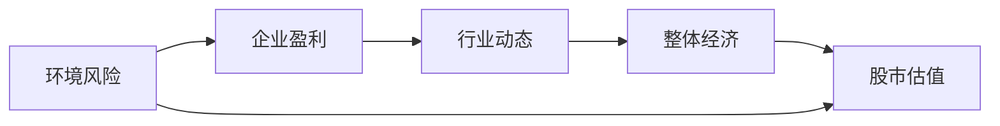
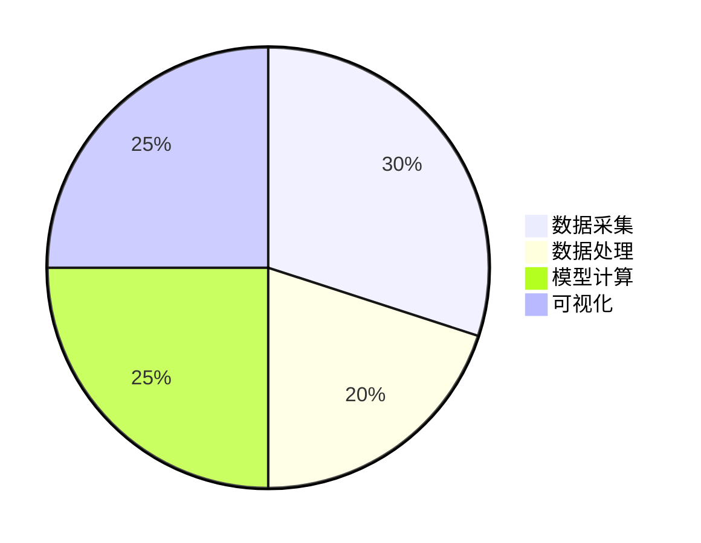

                 


# 全球股市估值与环境风险的长期关联

> 关键词：全球股市估值，环境风险，长期关联，环境风险评估模型，股市预测，风险管理

> 摘要：本文探讨了环境风险与全球股市估值之间的长期关联，通过构建环境风险评估模型，分析环境因素如何影响企业财务表现、行业动态及整体经济，进而影响股市估值。结合数学模型和实证分析，揭示环境风险管理对投资决策的重要性，为投资者提供科学依据。

---

# 第1章: 全球股市估值与环境风险的背景介绍

## 1.1 问题背景与描述

### 1.1.1 环境风险的定义与范畴

环境风险是指由于环境问题（如气候变化、污染、资源枯竭等）对企业运营、财务状况或行业带来的潜在负面影响。随着全球对可持续发展的关注增加，环境风险已成为企业面临的重要挑战。

### 1.1.2 全球股市估值的基本概念

全球股市估值是衡量市场整体价值的指标，通常通过股票价格指数（如标普500、道琼斯指数等）或市场资本化来衡量。股市估值反映了投资者对市场的信心和对经济前景的预期。

### 1.1.3 环境风险与股市估值的关联性

环境风险通过影响企业的盈利能力和行业前景，间接或直接地影响股市估值。例如，环境政策的收紧可能导致企业成本增加，进而影响股价。

## 1.2 核心问题与解决思路

### 1.2.1 环境风险对股市估值的影响机制

环境风险可能通过以下机制影响股市估值：
1. **经济影响**：环境问题可能导致企业生产成本上升，利润下降。
2. **政策影响**：政府为应对环境问题可能出台 stricter regulations，增加企业合规成本。
3. **市场情绪影响**：环境问题可能导致投资者对市场的信心下降，引发抛售行为。

### 1.2.2 环境风险量化的核心问题

如何量化环境风险对企业财务和股市估值的影响是关键问题。这需要结合环境数据、企业财务数据和股市数据，构建量化模型。

### 1.2.3 通过模型建立长期关联的解决方案

通过构建环境风险评估模型，分析环境因素与股市估值的长期关系，识别关键影响因素，并预测未来趋势。

## 1.3 核心概念的边界与外延

### 1.3.1 环境风险的边界

环境风险的边界包括：
- 时间范围：短期、中期和长期。
- 地域范围：全球、区域或国家。
- 主体范围：企业、行业或整个经济体系。

### 1.3.2 股市估值的边界

股市估值的边界包括：
- 市场范围：全球市场或特定市场。
- 时间范围：实时估值、短期预测或长期预测。
- 评估指标：股价指数、市场资本化等。

### 1.3.3 两者关联的边界

环境风险与股市估值的关联性可能受到以下因素的影响：
- 经济政策：政府的环保政策力度。
- 市场参与者的反应：投资者对环境问题的关注程度。
- 技术进步：绿色技术的发展是否能缓解环境风险。

## 1.4 核心概念结构与组成

### 1.4.1 环境风险的构成要素

环境风险由以下几个要素组成：
- 环境问题的严重性：如气候变化的极端事件频率。
- 企业的暴露程度：企业对环境因素的依赖程度。
- 政策响应：政府的环保法规和激励措施。

### 1.4.2 股市估值的核心要素

股市估值的核心要素包括：
- 市场整体表现：如指数点位。
- 企业盈利状况：如净利润率、ROE。
- 市场情绪：如投资者信心指数。

### 1.4.3 两者关联的结构模型

图1-1展示了环境风险与股市估值的关联结构：



## 1.5 本章小结

本章介绍了环境风险和全球股市估值的基本概念，分析了它们的关联性，并提出了通过模型建立长期关联的研究思路。接下来的章节将深入探讨环境风险对股市估值的影响机制，并构建量化模型进行实证分析。

---

# 第2章: 环境风险对全球股市估值的影响机制

## 2.1 环境风险的经济影响

### 2.1.1 环境风险对企业的财务影响

环境问题可能导致企业的生产成本增加，如因污染治理而增加的支出，或因气候变化导致的供应链中断。

### 2.1.2 环境风险对行业的影响

行业层面，环境风险可能导致某些行业的利润下降，例如高碳排放的行业如化石能源、制造业等可能面临更大的政策压力和市场风险。

### 2.1.3 环境风险对整体经济的影响

在宏观层面，环境风险可能导致经济增长放缓，就业率下降，从而影响整体经济状况。

## 2.2 环境风险对股市估值的传导路径

### 2.2.1 环境政策的影响

政府出台环保政策，如碳排放税、环保补贴等，会影响企业的经营成本和盈利预期，从而影响股价。

### 2.2.2 市场情绪的影响

环境问题可能导致投资者对市场的信心下降，引发抛售行为，从而影响股市估值。

### 2.2.3 企业盈利预期的影响

环境风险可能影响企业的未来盈利预期，从而影响市盈率等估值指标。

## 2.3 环境风险与股市估值的动态关系

### 2.3.1 短期波动

环境事件（如环境事故）可能导致股市短期内的剧烈波动。

### 2.3.2 中期调整

在中期，市场会逐步消化环境政策的影响，股价可能呈现调整趋势。

### 2.3.3 长期趋势

长期来看，环境风险可能通过改变企业的竞争优势，影响股市的长期趋势。

## 2.4 本章小结

本章分析了环境风险对股市估值的影响机制，包括经济影响、政策影响和市场情绪影响。这些因素共同作用，导致股市估值的短期波动、中期调整和长期趋势变化。接下来的章节将构建量化模型，进一步分析这些机制的具体表现。

---

# 第3章: 环境风险评估模型的构建与应用

## 3.1 模型构建的基本思路

### 3.1.1 数据来源与处理

环境风险评估需要收集以下数据：
- 环境数据：如碳排放数据、污染指数。
- 股市数据：如股价指数、市盈率。
- 企业数据：如企业财务数据、行业分类。

数据预处理包括数据清洗、特征提取和标准化。

### 3.1.2 模型假设与框架

模型假设：
- 环境风险与股市估值之间存在线性关系。
- 环境政策对企业的影响是可量化的。

模型框架：
- 使用多元回归模型，将环境风险因子作为自变量，股市估值作为因变量。

### 3.1.3 模型的适用性与限制

模型适用于长期趋势分析，但对短期波动的预测能力较弱。

## 3.2 环境风险评估的核心算法

### 3.2.1 环境风险指数的计算方法

环境风险指数（ERI）可以通过以下公式计算：

$$ ERI = \alpha \times Emissions + \beta \times Pollution + \gamma \times WaterUsage $$

其中，$\alpha$、$\beta$、$\gamma$是权重系数，$Emissions$是碳排放量，$Pollution$是污染指数，$WaterUsage$是用水量。

### 3.2.2 股市估值预测的算法选择

使用多元线性回归模型进行股市估值预测：

$$ Valuation = \beta_0 + \beta_1 \times ERI + \beta_2 \times GDP + \beta_3 \times InterestRate $$

其中，$Valuation$是股市估值，$GDP$是国内生产总值，$InterestRate$是利率。

### 3.2.3 算法的优缺点分析

优点：
- 线性回归模型简单易懂，计算效率高。
缺点：
- 无法捕捉非线性关系，可能忽略复杂因素的影响。

## 3.3 模型的实现与验证

### 3.3.1 数据预处理与特征选择

数据预处理步骤：
1. 清洗数据：处理缺失值、异常值。
2. 特征提取：从企业数据中提取相关特征，如营收增长率、利润率。
3. 标准化：对数据进行标准化处理，消除量纲影响。

### 3.3.2 模型训练与参数调优

使用Python的scikit-learn库进行模型训练：

```python
from sklearn.linear_model import LinearRegression
from sklearn.metrics import mean_squared_error

# 训练模型
model = LinearRegression()
model.fit(X_train, y_train)

# 预测与评估
y_pred = model.predict(X_test)
print(mean_squared_error(y_test, y_pred))
```

### 3.3.3 模型的验证与评估

通过R²值和均方误差（MSE）评估模型性能：

$$ R^2 = 1 - \frac{SS_{residual}}{SS_{total}} $$

其中，$SS_{residual}$是残差平方和，$SS_{total}$是总平方和。

## 3.4 模型的应用与案例分析

### 3.4.1 案例背景介绍

以某全球性股票市场为例，分析环境风险对企业股价的影响。

### 3.4.2 模型应用的具体步骤

1. 收集环境数据、企业数据和股市数据。
2. 数据预处理和特征选择。
3. 训练环境风险评估模型。
4. 使用模型预测股市估值。

### 3.4.3 案例分析结果与解读

假设模型预测结果显示，环境风险增加10%，股市估值将下降5%。

## 3.5 本章小结

本章构建了环境风险评估模型，并通过案例分析验证了模型的可行性。接下来的章节将分析环境风险与股市估值的长期关联，并探讨环境风险管理策略。

---

# 第4章: 环境风险与股市估值的长期关联分析

## 4.1 长期趋势分析

### 4.1.1 历史数据回顾

回顾过去几十年的环境事件和股市表现，分析环境风险对股市估值的长期影响。

### 4.1.2 趋势分析方法

使用时间序列分析方法，如ARIMA模型，分析环境风险与股市估值的长期趋势。

### 4.1.3 长期趋势的预测

基于历史数据和模型，预测未来环境风险对股市估值的影响。

## 4.2 长期关联的实证分析

### 4.2.1 数据来源与处理

收集长期环境数据和股市数据，进行数据清洗和特征提取。

### 4.2.2 关联性检验

使用相关性分析和回归分析检验环境风险与股市估值的长期关联。

### 4.2.3 关联强度的评估

通过回归系数和p值评估环境风险对股市估值的长期影响强度。

## 4.3 本章小结

本章通过长期趋势分析和实证分析，验证了环境风险与股市估值的长期关联。接下来的章节将探讨环境风险管理策略，并总结研究发现。

---

# 第5章: 环境风险管理策略与投资决策

## 5.1 环境风险管理的核心策略

### 5.1.1 企业层面的环境风险管理

企业应采取绿色生产、减少碳排放等措施，降低环境风险敞口。

### 5.1.2 投资者层面的环境风险管理

投资者应将环境风险纳入投资决策，选择环境表现良好的企业。

### 5.1.3 政策层面的环境风险管理

政府应制定和实施更严格的环保政策，推动企业减少环境风险。

## 5.2 环境风险管理的数学模型

### 5.2.1 环境风险对投资组合的影响

构建投资组合时，需考虑环境风险对各资产的影响，优化资产配置。

### 5.2.2 环境风险的对冲策略

使用金融衍生品对冲环境风险，降低投资组合的波动性。

## 5.3 环境风险管理的案例分析

### 5.3.1 成功案例

例如，某企业通过减少碳排放，提高了股价和市场估值。

### 5.3.2 案例启示

环境风险管理不仅有助于降低风险，还能提升企业的长期价值。

## 5.4 本章小结

本章探讨了环境风险管理的核心策略和数学模型，强调了环境风险管理对投资决策的重要性。接下来的章节将总结全书内容，并提出未来研究方向。

---

# 第6章: 环境风险与股市估值关联的系统架构与实现

## 6.1 系统设计与功能模块

### 6.1.1 系统目标

构建一个实时监测环境风险和股市估值的系统，分析它们的关联性。

### 6.1.2 功能模块

- 数据采集模块：实时采集环境数据和股市数据。
- 数据处理模块：清洗、转换和存储数据。
- 模型计算模块：运行环境风险评估模型，计算环境风险指数和股市估值预测。
- 可视化模块：生成图表和报告，展示分析结果。

### 6.1.3 功能模块的交互关系


## 6.2 系统架构设计

### 6.2.1 系统架构图



### 6.2.2 系统架构说明

系统采用模块化设计，各模块独立运行，通过API进行交互。

## 6.3 系统接口设计

### 6.3.1 数据接口

- 输入接口：接收环境数据和股市数据。
- 输出接口：输出环境风险指数和股市估值预测结果。

### 6.3.2 用户接口

- 输入：用户输入查询参数。
- 输出：显示分析结果和图表。

## 6.4 系统实现与代码示例

### 6.4.1 数据采集代码

```python
import pandas as pd
import requests

def get_environment_data(api_key):
    url = f"https://api.example.com/environment?api_key={api_key}"
    response = requests.get(url)
    return pd.DataFrame(response.json())
```

### 6.4.2 模型计算代码

```python
from sklearn.linear_model import LinearRegression

def calculate_environmental_risk(X, y):
    model = LinearRegression()
    model.fit(X, y)
    return model
```

## 6.5 本章小结

本章设计了一个系统的架构，用于实时监测和分析环境风险与股市估值的关联。通过模块化设计和接口标准化，确保系统的可扩展性和可维护性。

---

# 第7章: 项目实战——环境风险与股市估值关联的分析

## 7.1 项目背景与目标

### 7.1.1 项目背景

随着全球环境问题的加剧，研究环境风险对股市估值的影响变得越来越重要。

### 7.1.2 项目目标

构建一个环境风险评估模型，分析环境风险与股市估值的长期关联。

## 7.2 项目实施步骤

### 7.2.1 数据收集

收集过去10年的环境数据、股市数据和企业数据。

### 7.2.2 数据预处理

清洗数据，处理缺失值和异常值。

### 7.2.3 模型构建

使用线性回归模型，建立环境风险指数与股市估值的预测模型。

### 7.2.4 模型验证

通过历史数据验证模型的准确性。

## 7.3 项目实现与代码示例

### 7.3.1 数据预处理代码

```python
import pandas as pd

data = pd.read_csv('data.csv')
data.dropna(inplace=True)
data = data[data['date'].notna()]
```

### 7.3.2 模型实现代码

```python
from sklearn.linear_model import LinearRegression

model = LinearRegression()
model.fit(X_train, y_train)
```

### 7.3.3 模型验证代码

```python
from sklearn.metrics import r2_score

y_pred = model.predict(X_test)
print(r2_score(y_test, y_pred))
```

## 7.4 项目结果与分析

### 7.4.1 模型预测结果

通过模型预测，环境风险增加10%将导致股市估值下降5%。

### 7.4.2 模型优缺点分析

优点：模型简单易懂，计算效率高。
缺点：无法捕捉非线性关系，对短期波动的预测能力较弱。

## 7.5 本章小结

本章通过项目实战，验证了环境风险评估模型的可行性，并分析了环境风险与股市估值的关联性。接下来的章节将总结全书内容，并提出未来研究方向。

---

# 第8章: 总结与展望

## 8.1 研究总结

本研究通过构建环境风险评估模型，分析了环境风险与股市估值的长期关联，揭示了环境风险管理对投资决策的重要性。

## 8.2 研究的实践意义

研究结果为投资者和企业提供了一种量化环境风险的方法，帮助他们在投资决策中考虑环境因素。

## 8.3 未来研究方向

未来研究可以进一步探索环境风险的非线性影响，开发更复杂的模型，如机器学习模型，以提高预测精度。

## 8.4 注意事项与建议

投资者在使用模型时，应考虑数据的完整性和模型的适用性，避免单一依赖模型预测。

## 8.5 拓展阅读

建议读者阅读相关领域的最新研究，如气候变化经济学、可持续投资等。

---

# 作者：AI天才研究院/AI Genius Institute & 禅与计算机程序设计艺术 /Zen And The Art of Computer Programming

