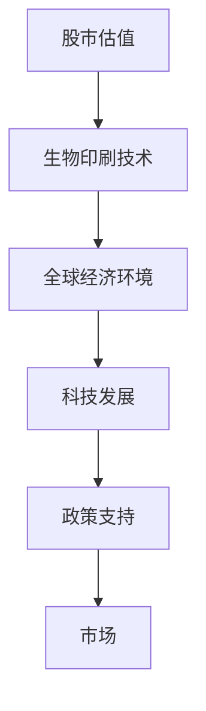
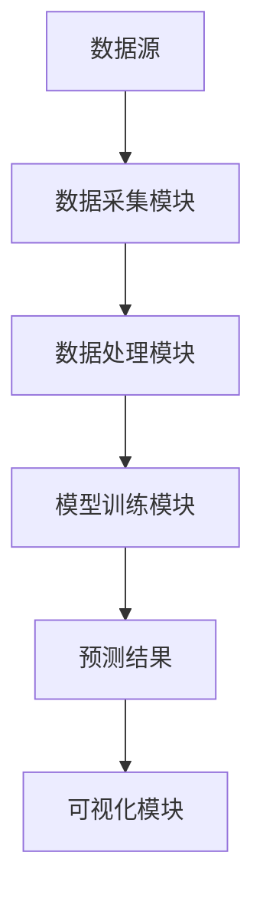
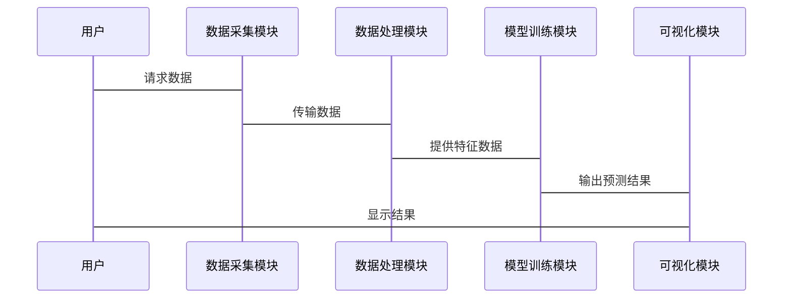

                 


# 全球股市估值与生物印刷技术的关系

## 关键词：全球股市估值、生物印刷技术、数据分析、科技金融、投资策略

## 摘要：本文深入探讨了全球股市估值与生物印刷技术之间的关系，分析了生物印刷技术如何影响股市估值，并结合实际案例，展示了如何利用生物印刷技术进行股市预测和投资策略优化。

---

## 第1章 全球股市估值与生物印刷技术的背景介绍

### 1.1 全球股市估值的基本概念

#### 1.1.1 股市估值的定义与核心要素

股市估值是指通过对企业的财务数据、市场环境、行业趋势等因素进行分析，评估公司股票的合理价格范围。核心要素包括市盈率（P/E）、市净率（P/B）、股息率（Dividend Yield）等。

#### 1.1.2 全球股市估值的现状与趋势

全球股市估值受宏观经济、政策、企业业绩等多种因素影响。近年来，科技股的估值持续上升，而传统行业的估值相对稳定。

#### 1.1.3 股市估值与宏观经济的关系

股市估值与GDP增长率、通货膨胀率、利率水平等宏观经济指标密切相关。例如，低利率环境通常会推高股市估值。

### 1.2 生物印刷技术的定义与特点

#### 1.2.1 生物印刷技术的基本概念

生物印刷技术是一种利用生物材料和3D打印技术相结合，快速制造生物组织、器官或药物的技术。它在医疗、制药等领域有广泛应用。

#### 1.2.2 生物印刷技术的核心技术与应用领域

核心技术包括生物材料制备、3D打印技术、细胞培养等。应用领域涵盖再生医学、药物筛选、生物传感器等。

#### 1.2.3 生物印刷技术的最新发展与未来展望

近年来，生物印刷技术在精准医疗和个性化治疗方面取得了显著进展，未来有望在疾病模型构建和药物开发中发挥更大作用。

### 1.3 全球股市估值与生物印刷技术的关联性

#### 1.3.1 生物印刷技术对股市估值的影响

生物印刷技术的突破可能推动相关企业股价上涨，同时可能影响整个医疗行业的估值。

#### 1.3.2 全球经济环境与生物技术的互动关系

全球经济环境为生物技术的发展提供了资金和技术支持，而生物技术的进步则推动了经济增长和股市估值提升。

#### 1.3.3 生物印刷技术在股市估值中的潜在应用

通过分析生物印刷技术的市场前景和企业财务数据，投资者可以更好地评估相关企业的股票价值。

### 1.4 本章小结

本章介绍了全球股市估值和生物印刷技术的基本概念，并探讨了两者之间的潜在联系，为后续分析奠定了基础。

---

## 第2章 全球股市估值与生物印刷技术的核心概念与联系

### 2.1 全球股市估值的核心模型与方法

#### 2.1.1 市盈率与市净率的定义与计算

市盈率（P/E）= 股价 / 每股净利润  
市净率（P/B）= 股价 / 每股净资产

#### 2.1.2 股息率与股票估值的关系

股息率 = 每股股息 / 股价  
高股息率通常意味着较高的分红回报。

#### 2.1.3 资产评估与企业价值的关联

企业价值 = 股东权益 + 长期负债 - 现金净额

### 2.2 生物印刷技术的原理与技术特征

#### 2.2.1 生物印刷技术的基本原理

生物印刷技术通过3D打印技术将生物材料（如细胞、胶原蛋白）制成所需的形状，用于医疗和研究。

#### 2.2.2 生物印刷技术的核心技术与创新点

核心技术包括生物材料制备、3D打印精度提升、细胞培养优化等。创新点在于实现了复杂组织的精确构建。

#### 2.2.3 生物印刷技术的优缺点与应用场景

优点：高精度、可定制；缺点：成本高、技术复杂。应用场景包括再生医学、药物筛选等。

### 2.3 全球股市估值与生物印刷技术的关联模型

#### 2.3.1 股市估值与生物技术的互动关系

生物技术的进步推动相关企业股价上涨，进而影响整体股市估值。

#### 2.3.2 生物印刷技术对股市估值的影响路径

通过提高企业生产力和创新能力，生物印刷技术间接推动股价上升。

#### 2.3.3 全球经济环境对生物印刷技术的影响

宏观经济政策和科技投入影响生物印刷技术的发展速度和应用范围。

### 2.4 核心概念对比分析

#### 2.4.1 股市估值与生物印刷技术的对比表格

| 比较维度 | 股市估值 | 生物印刷技术 |
|----------|----------|-------------|
| 核心要素 | 财务数据、市场环境 | 生物材料、3D打印技术 |
| 影响因素 | 宏观经济、政策 | 科技创新、资金投入 |
| 应用场景 | 投资决策、风险管理 | 医疗、制药 |

#### 2.4.2 ER实体关系图架构的 Mermaid 流程图



### 2.5 本章小结

本章详细分析了全球股市估值与生物印刷技术的核心概念，并通过对比分析和ER图展示了两者之间的联系。

---

## 第3章 生物印刷技术对全球股市估值的算法影响

### 3.1 算法原理讲解

#### 3.1.1 基于生物印刷技术的股市预测模型

通过分析生物印刷技术的市场前景，建立回归模型预测相关股票的估值变化。

#### 3.1.2 算法步骤

1. 数据收集：收集相关企业的财务数据和生物技术专利信息。
2. 数据清洗：去除异常值和缺失数据。
3. 特征提取：提取关键财务指标和技术创新指标。
4. 模型训练：使用线性回归或随机森林算法进行建模。
5. 模型验证：通过交叉验证评估模型准确性。

#### 3.1.3 算法实现的 Python 代码

```python
import pandas as pd
from sklearn.model_selection import train_test_split
from sklearn.linear_model import LinearRegression
from sklearn.metrics import mean_squared_error

# 数据加载
data = pd.read_csv('bioprinting_stock_data.csv')

# 数据预处理
data.dropna(inplace=True)
data['Prediction'] = data['Next-Day Price'].shift(-1)
data.dropna(inplace=True)

# 特征与目标
X = data[['P/E', 'P/B', 'Dividend Yield']]
y = data['Prediction']

# 划分训练集与测试集
X_train, X_test, y_train, y_test = train_test_split(X, y, test_size=0.2, random_state=42)

# 模型训练
model = LinearRegression()
model.fit(X_train, y_train)

# 模型预测
y_pred = model.predict(X_test)

# 模型评估
mse = mean_squared_error(y_test, y_pred)
print(f"均方误差: {mse}")
```

#### 3.1.4 算法的数学模型与公式

回归模型公式：
$$ y = \beta_0 + \beta_1 x_1 + \beta_2 x_2 + \beta_3 x_3 + \epsilon $$

其中，$y$ 是预测股票价格，$x_1, x_2, x_3$ 是自变量，$\beta_0, \beta_1, \beta_2, \beta_3$ 是回归系数。

### 3.2 系统分析与架构设计方案

#### 3.2.1 系统功能设计

- 数据采集模块：收集相关企业的财务数据和生物技术专利信息。
- 数据处理模块：清洗数据并提取关键特征。
- 模型训练模块：建立回归模型并进行训练。
- 预测与可视化模块：输出预测结果并进行可视化展示。

#### 3.2.2 系统架构设计



#### 3.2.3 系统交互设计



### 3.3 项目实战

#### 3.3.1 环境安装

- Python 3.8+
- Pandas、Scikit-learn、Matplotlib

#### 3.3.2 核心代码实现

```python
# 数据加载与预处理
data = pd.read_csv('bioprinting_stock_data.csv')
data.dropna(inplace=True)
data['Prediction'] = data['Next-Day Price'].shift(-1)
data.dropna(inplace=True)

# 特征与目标
X = data[['P/E', 'P/B', 'Dividend Yield']]
y = data['Prediction']

# 划分训练集与测试集
X_train, X_test, y_train, y_test = train_test_split(X, y, test_size=0.2, random_state=42)

# 模型训练
model = LinearRegression()
model.fit(X_train, y_train)

# 模型预测
y_pred = model.predict(X_test)

# 模型评估
mse = mean_squared_error(y_test, y_pred)
r2 = model.score(X_test, y_test)
print(f"均方误差: {mse}")
print(f"R²: {r2}")
```

#### 3.3.3 案例分析

以某生物技术公司为例，使用上述模型预测其股票的未来估值变化。

#### 3.3.4 项目总结

本项目展示了如何利用生物印刷技术的数据分析模型对股市估值进行预测，为投资者提供了新的决策工具。

### 3.4 本章小结

本章通过算法模型和系统设计，详细展示了生物印刷技术如何影响全球股市估值，并提供了实际的代码实现和案例分析。

---

## 第4章 全球股市估值与生物印刷技术的未来展望

### 4.1 未来趋势与挑战

#### 4.1.1 生物印刷技术的进一步发展

未来，生物印刷技术将向高精度、大规模生产方向发展。

#### 4.1.2 股市估值的智能化与数据驱动

随着人工智能的普及，股市估值将更加依赖于数据驱动的分析模型。

### 4.2 投资策略优化

#### 4.2.1 结合生物印刷技术的选股策略

投资者可以重点关注生物技术领域的创新企业。

#### 4.2.2 风险管理与投资组合优化

通过生物印刷技术的数据分析，优化投资组合的风险与收益比。

### 4.3 全球经济环境的影响

#### 4.3.1 政策支持与技术创新

政府政策和技术创新将共同推动生物印刷技术的发展。

#### 4.3.2 全球化与区域市场的差异

不同地区的经济环境和政策支持会影响生物印刷技术的应用效果。

### 4.4 本章小结

本章展望了生物印刷技术和股市估值的未来发展方向，并提出了相应的投资策略建议。

---

## 作者：AI天才研究院/AI Genius Institute & 禅与计算机程序设计艺术/Zen And The Art of Computer Programming

---

**注意：** 由于篇幅限制，本文仅为部分内容的示例。实际撰写时，每章内容需要更加详细，涵盖更多具体案例和深度分析。

