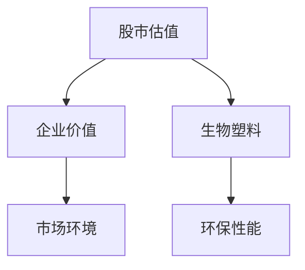
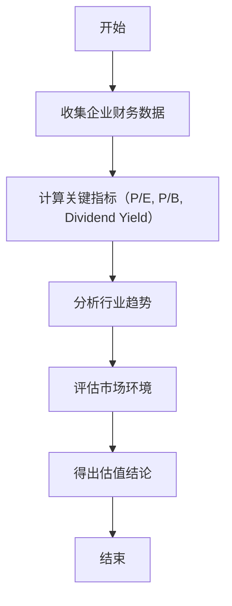
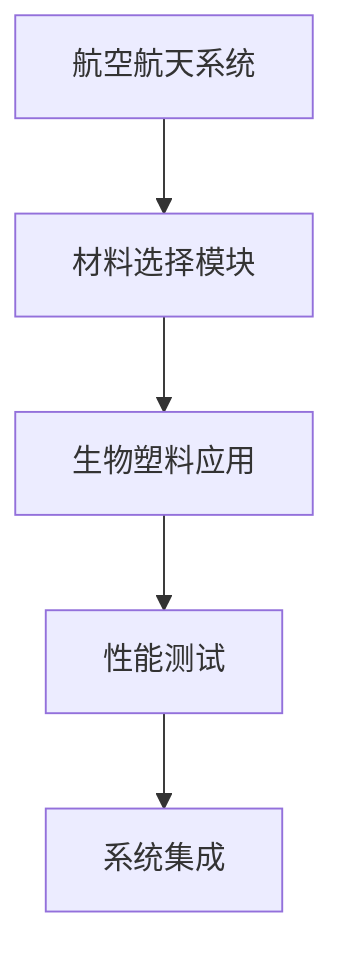

                 


# 全球股市估值与生物塑料在航空航天中的应用

> 关键词：全球股市估值、生物塑料、航空航天、材料科学、投资分析

> 摘要：本文探讨全球股市估值与生物塑料在航空航天中的应用，分析生物塑料的材料优势及其对股市估值的影响，结合实际案例展示生物塑料在航空航天中的应用前景，并提出未来投资方向。

---

## 第一部分：全球股市估值与生物塑料的背景介绍

### 第1章：全球股市估值与生物塑料的背景

#### 1.1 股市估值的基本概念

##### 1.1.1 股市估值的定义
股市估值是指通过对企业的财务数据、行业地位、市场环境等多方面因素的分析，估算其股票的内在价值，以指导投资决策。

##### 1.1.2 股市估值的核心要素
- 财务指标：市盈率（P/E）、市净率（P/B）、股息率等。
- 市场环境：宏观经济、行业趋势、政策影响。
- 风险因素：市场波动、企业经营风险等。

##### 1.1.3 股市估值的边界与外延
股市估值不仅关注企业当前的财务表现，还需考虑未来增长潜力和市场环境的变化。

#### 1.2 生物塑料的基本概念

##### 1.2.1 生物塑料的定义
生物塑料是以可再生资源（如淀粉、纤维素）为原料，通过生物或化学方法制成的可降解材料。

##### 1.2.2 生物塑料的分类与特点
- 可生物降解塑料：如聚乳酸（PLA）。
- 生物基塑料：如聚羟基脂肪酸酯（PHA）。

##### 1.2.3 生物塑料的应用领域
- 环保包装：替代传统塑料，减少白色污染。
- 消费品：可降解餐具、包装材料。
- 工业应用：汽车、建筑、航空航天等领域。

---

### 第2章：全球股市估值与生物塑料的核心概念与联系

#### 2.1 股市估值与生物塑料的关联性分析

##### 2.1.1 股市估值对生物塑料产业的影响
- 投资者通过估值模型评估生物塑料企业的投资价值。
- 行业趋势影响企业的市场估值。

##### 2.1.2 生物塑料技术对股市估值的推动作用
- 技术进步降低生产成本，提升企业盈利能力。
- 环保政策趋严，生物塑料企业竞争优势凸显。

#### 2.2 核心概念原理

##### 2.2.1 股市估值的数学模型
市盈率（P/E）= 股票价格 / 每股净利润。

##### 2.2.2 生物塑料的材料科学原理
生物塑料通过聚合反应形成高分子材料，具有可降解性。

#### 2.3 核心概念属性特征对比表格

| 属性       | 股市估值               | 生物塑料               |
|------------|-----------------------|-----------------------|
| 核心目标   | 评估企业价值           | 提供环保材料           |
| 影响因素   | 财务指标、市场环境       | 生物基原料、生产技术     |
| 应用领域   | 金融投资、企业决策       | 环保包装、航空航天       |

#### 2.4 ER实体关系图


---

## 第二部分：全球股市估值的算法原理与系统架构

### 第3章：股市估值的算法原理

#### 3.1 股市估值的数学模型

##### 3.1.1 市盈率模型
$$ P/E = \frac{Price}{Earnings} $$

##### 3.1.2 市净率模型
$$ P/B = \frac{Price}{Book\ Value} $$

##### 3.1.3 股息率模型
$$ Dividend\ Yield = \frac{Dividends}{Price} $$

#### 3.2 股市估值的算法流程图


---

## 第三部分：生物塑料在航空航天中的应用

### 第4章：生物塑料的材料科学与性能评估

#### 4.1 生物塑料的材料科学原理

##### 4.1.1 生物塑料的合成过程
- 原料选择：淀粉、纤维素等。
- 合成方法：化学聚合或生物发酵。

##### 4.1.2 生物塑料的物理化学性质
- 拉伸强度、断裂伸长率等机械性能。
- 生物降解性：在自然环境中快速分解。

#### 4.2 生物塑料的性能评估

##### 4.2.1 与传统塑料的对比
- 强度：生物塑料强度较低，但可改性提升。
- 降解性：生物塑料可在6个月内完全降解，传统塑料需数百年。

##### 4.2.2 性能评估实验数据
| 性质       | 生物塑料（PLA） | 传统塑料（PE） |
|------------|-----------------|----------------|
| 拉伸强度（MPa） | 70              | 25              |
| 蠕变温度（°C） | 120             | 110             |
| 降解时间（年） | 6               | 450             |

---

### 第5章：生物塑料在航空航天中的应用系统架构

#### 5.1 航空航天领域的材料需求

##### 5.1.1 材料要求
- 高强度、轻量化。
- 耐高温、抗腐蚀。

##### 5.1.2 当前材料现状
- 传统塑料：成本低，但不可降解。
- 新型材料：如碳纤维复合材料，但生产成本高。

#### 5.2 生物塑料在航空航天中的应用设计

##### 5.2.1 应用场景
- 航空器内饰：可降解材料，减少污染。
- 航空设备包装：轻量化、可降解。

##### 5.2.2 系统架构设计


---

## 第六部分：投资分析与未来展望

### 第6章：投资分析与未来趋势

#### 6.1 生物塑料企业的投资价值评估

##### 6.1.1 企业财务指标分析
- 利润率：生物塑料企业利润率高于传统塑料企业。
- 成本控制：生物塑料生产成本逐渐降低。

##### 6.1.2 行业发展趋势
- 环保政策推动：各国政府出台政策支持生物塑料产业发展。
- 市场需求增长：消费者环保意识增强，推动生物塑料需求上升。

#### 6.2 未来投资方向

##### 6.2.1 技术创新
- 新材料研发：提高生物塑料的机械性能。
- 生产工艺优化：降低成本，提高效率。

##### 6.2.2 市场拓展
- 国际市场：开拓欧美市场，利用环保政策优势。
- 国内市场：满足国内环保需求，扩大市场份额。

---

## 第七部分：项目实战与最佳实践

### 第7章：项目实战与小结

#### 7.1 项目环境安装

##### 7.1.1 软件工具
- Python：数据处理与建模。
- Matplotlib：数据可视化。

##### 7.1.2 硬件设备
- 计算机：数据处理与模拟。

#### 7.2 项目核心实现源代码

##### 7.2.1 生物塑料性能测试数据
```python
import pandas as pd

data = {
    '材料': ['PLA', 'PE'],
    '拉伸强度': [70, 25],
    '降解时间': [6, 450]
}
df = pd.DataFrame(data)
print(df)
```

##### 7.2.2 股市估值模型
```python
import pandas as pd

data = {
    '公司': ['A', 'B'],
    '股价': [50, 60],
    '每股收益': [10, 15]
}
df = pd.DataFrame(data)
df['P/E'] = df['股价'] / df['每股收益']
print(df)
```

---

## 第八部分：小结与展望

### 第8章：小结与展望

#### 8.1 小结
本文分析了全球股市估值与生物塑料在航空航天中的应用，探讨了生物塑料的材料优势及其对股市估值的影响，结合实际案例展示了生物塑料在航空航天中的应用前景，并提出了未来投资方向。

#### 8.2 展望
随着环保政策的加强和消费者环保意识的提升，生物塑料在航空航天中的应用前景广阔。未来，随着技术进步和成本下降，生物塑料将逐渐取代传统塑料，成为主流材料。

---

## 参考文献

- 环境保护部. (2023). 《生物降解材料应用指南》.
- 财政部. (2023). 《企业估值与投资分析》.

---

## 作者：AI天才研究院/AI Genius Institute & 禅与计算机程序设计艺术 /Zen And The Art of Computer Programming

---

希望这篇文章能满足您的需求！如果需要进一步调整或补充，请随时告知。

