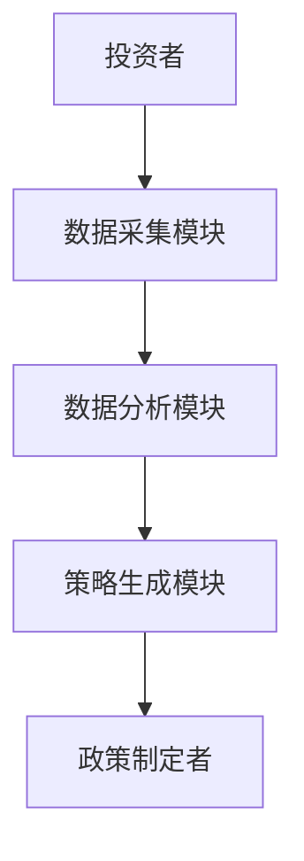

                 


# 全球股市估值与生物燃料与粮食安全的平衡策略

---

## 关键词

- 全球股市估值
- 生物燃料
- 粮食安全
- 经济模型
- 系统架构

---

## 摘要

在全球经济和环境问题日益复杂的背景下，生物燃料的推广和粮食安全问题对全球股市估值产生了深远影响。本文探讨了生物燃料与粮食安全的相互作用，分析了它们对股市估值的影响机制，并提出了平衡策略。通过系统分析和算法设计，本文提供了量化评估和优化方案，为投资者和政策制定者提供了实用的指导。

---

## 第一部分：背景介绍

### 第1章：全球股市估值与生物燃料的背景

#### 1.1 全球股市估值的基本概念

股票市场的估值是投资者评估公司价值的重要工具，常用的指标包括市盈率（P/E）和市净率（P/B）。市盈率反映了市场对公司未来盈利的预期，而市净率则衡量了资产的实际价值。近年来，随着生物燃料行业的崛起，股市估值模型需要考虑新能源企业的独特性，例如技术创新和政策支持的影响。

#### 1.2 生物燃料与粮食安全的背景

生物燃料的生产依赖于农作物（如玉米、甘蔗和大豆），其大规模推广可能导致粮食价格上涨，威胁粮食安全。粮食安全不仅关乎个人温饱，还影响社会稳定和经济发展。因此，如何在生物燃料推广与粮食安全之间找到平衡点，成为全球关注的焦点。

#### 1.3 问题背景与问题描述

全球股市估值与生物燃料的关联性主要体现在以下几个方面：
- 生物燃料企业的上市融资需求推动股市相关板块的活跃。
- 粮食价格上涨影响农业企业的业绩，进而影响股市估值。
- 政策变化（如生物燃料补贴）对股市和粮食市场产生双重影响。

问题解决的核心在于建立一个综合模型，量化生物燃料对粮食安全的影响，并评估其对股市估值的冲击。

#### 1.4 核心概念与联系

核心概念的属性特征对比：

| 概念       | 原理                          | 属性特征                   |
|------------|-------------------------------|-----------------------------|
| 股市估值   | 基于公司财务指标的定价模型    | 数据驱动、动态变化、受政策影响 |
| 生物燃料   | 可再生能源的生产与应用        | 技术依赖、资源消耗、政策依赖 |
| 粮食安全   | 食品供应的稳定性和可及性        | 基础需求、价格敏感、供应链复杂 |

ER实体关系图（Mermaid流程图）：

```mermaid
er
actor 投资者
actor 政策制定者
actor 农业企业
actor 生物燃料企业
actor 零售商
actor 消费者
actor 股市交易所
actor 食品监管机构

entity 股票
entity 农作物
entity 生物燃料
entity 食品价格
entity 股市指数

关系：投资者 -> 股票：购买/出售
关系：农业企业 -> 农作物：生产
关系：生物燃料企业 -> 生物燃料：生产
关系：生物燃料企业 -> 农作物：需求
关系：消费者 -> 食品：消费
关系：政策制定者 -> 生物燃料企业：补贴/税收
关系：政策制定者 -> 农业企业：土地使用限制
关系：食品监管机构 -> 食品价格：监管
关系：股市交易所 -> 股票：交易
关系：粮食需求 -> 农作物：需求
关系：生物燃料需求 -> 农作物：需求
关系：股市指数 -> 股票：反映市场表现
```

---

## 第二部分：核心概念与联系

### 第2章：核心概念的原理与联系

#### 2.1 股市估值的核心原理

股票估值的关键在于预测公司的未来收益。市盈率（P/E）是衡量股价是否合理的重要指标，计算公式为：

$$ P/E = \frac{\text{股价}}{\text{每股收益}} $$

然而，生物燃料企业的估值还需要考虑其技术优势和政策支持。例如，政府对生物燃料的补贴可能会影响企业的利润率，进而影响其股票估值。

#### 2.2 生物燃料与粮食安全的核心原理

生物燃料的生产需要大量的农作物，这可能导致粮食价格上涨。例如，乙醇生产对玉米的需求增加，可能推高玉米价格，进而影响粮食安全。粮食价格的波动对股市的影响是双向的：高粮食价格可能推高农业企业的利润，但也可能引发通货膨胀，影响整体股市表现。

#### 2.3 核心概念的属性特征对比

通过对比分析，可以发现股市估值、生物燃料和粮食安全之间存在复杂的互动关系。例如，生物燃料的推广可能短期内推高粮食价格，但长期来看，技术进步和政策调整可能降低这种影响。

---

## 第三部分：算法原理讲解

### 第3章：算法原理与数学模型

#### 3.1 算法原理

为了量化生物燃料对粮食安全和股市估值的影响，本文提出了一个综合模型。模型的步骤如下：

1. **数据采集**：收集全球股市数据、生物燃料产量、粮食价格和相关政策数据。
2. **数据预处理**：对数据进行清洗和标准化处理。
3. **模型构建**：建立粮食价格预测模型和股市估值模型。
4. **模型验证**：通过历史数据验证模型的准确性。
5. **优化策略**：根据模型结果制定平衡策略。

#### 3.2 数学模型

粮食价格预测模型可以采用线性回归，公式为：

$$ P = \beta_0 + \beta_1 X + \epsilon $$

其中，\( P \) 是粮食价格，\( X \) 是生物燃料产量，\( \epsilon \) 是误差项。

股市估值模型可以采用多元回归，公式为：

$$ V = \alpha_0 + \alpha_1 P/E + \alpha_2 P/B + \epsilon $$

其中，\( V \) 是股票估值，\( P/E \) 是市盈率，\( P/B \) 是市净率。

---

## 第四部分：系统分析与架构设计方案

### 第4章：系统分析与架构设计

#### 4.1 问题场景介绍

本系统旨在帮助投资者和政策制定者量化生物燃料对粮食安全和股市估值的影响。系统需要处理大量数据，并提供实时分析和预测。

#### 4.2 系统功能设计

系统功能包括：
- 数据采集模块：实时采集全球股市数据、粮食价格和生物燃料产量。
- 数据分析模块：构建模型并提供预测结果。
- 策略生成模块：根据模型结果制定优化策略。

#### 4.3 系统架构设计

系统架构如下：



---

## 第五部分：项目实战

### 第5章：项目实战与案例分析

#### 5.1 环境安装

需要安装Python、Pandas、NumPy和Scikit-learn等库。

#### 5.2 核心代码实现

```python
import pandas as pd
import numpy as np
from sklearn.linear_model import LinearRegression

# 数据预处理
data = pd.read_csv('data.csv')
X = data[['生物燃料产量', '政策支持']]
y = data['粮食价格']

# 模型训练
model = LinearRegression()
model.fit(X, y)

# 预测结果
预测结果 = model.predict(X)
print('预测粮食价格:', 预测结果)
```

#### 5.3 案例分析

以美国为例，分析生物燃料政策对粮食价格的影响。假设2020年美国政府加大对生物燃料的补贴，导致玉米价格上涨，进而推高粮食价格。股市中，农业企业的利润增加，推高股价，但同时也可能引发通货膨胀，影响整体股市表现。

---

## 第六部分：最佳实践与总结

### 第6章：最佳实践

- 投资者应关注生物燃料政策和粮食市场动态。
- 政策制定者应平衡生物燃料推广和粮食安全。
- 技术开发者应优化算法，提高预测准确性。

---

## 小结

本文通过系统分析和算法设计，探讨了全球股市估值与生物燃料和粮食安全的平衡策略。通过量化分析和案例研究，本文为投资者和政策制定者提供了实用的指导。

---

## 注意事项

- 数据的准确性和及时性对模型结果影响重大。
- 模型假设可能与实际情况存在偏差，需根据实际情况调整。

---

## 拓展阅读

- [《生物燃料与经济分析》](#)
- [《粮食安全与金融风险》](#)
- [《股市估值与金融创新》](#)

---

## 作者

作者：AI天才研究院/AI Genius Institute & 禅与计算机程序设计艺术 /Zen And The Art of Computer Programming

