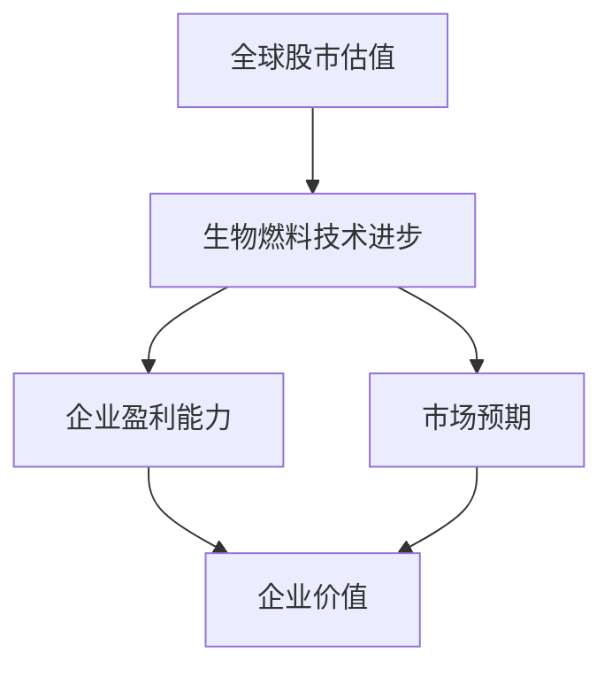
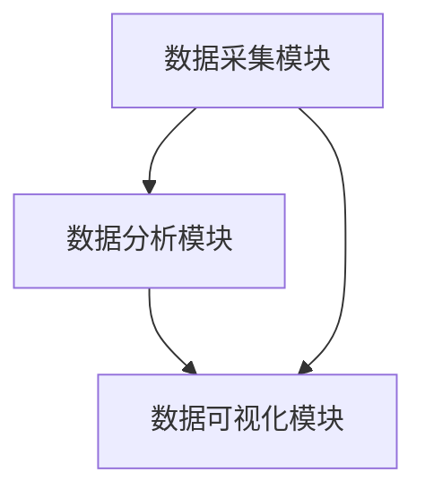

                 


```markdown
# 全球股市估值与生物燃料技术进步的关系

## 关键词
全球股市估值、生物燃料技术、技术进步、股市影响、能源市场

## 摘要
本文探讨全球股市估值与生物燃料技术进步之间的关系，分析技术进步对股市估值的影响机制，量化技术进步对股市估值的具体影响，并提出基于技术进步的股市估值模型。本文结合经济学、金融学和计算机科学的跨学科视角，通过实际案例分析和系统设计，为投资者和研究者提供新的研究思路和实践参考。

---

## 正文

### 第一部分: 全球股市估值与生物燃料技术进步的背景介绍

#### 第1章: 全球股市估值与生物燃料技术进步的背景

##### 1.1 问题背景
###### 1.1.1 全球股市估值的基本概念
全球股市估值是衡量市场整体价值的重要指标，通常通过股票指数（如标普500、纳斯达克指数）来反映。股市估值受多种因素影响，包括宏观经济指标、企业盈利状况、投资者情绪等。

###### 1.1.2 生物燃料技术进步的定义与现状
生物燃料是指通过生物转化过程获得的可再生能源，包括乙醇、生物柴油等。近年来，随着技术进步，生物燃料的生产效率和成本逐渐降低，其在能源市场中的地位日益重要。

###### 1.1.3 问题的提出与研究意义
随着全球能源需求的增长和化石能源的枯竭，生物燃料作为替代能源的重要性日益凸显。技术进步不仅影响生物燃料的生产成本，还可能对相关企业的盈利能力产生重大影响，进而影响股市估值。

##### 1.2 问题描述
###### 1.2.1 全球股市估值的影响因素
股市估值受宏观经济、企业盈利、投资者情绪等多重因素影响。其中，技术进步对企业的盈利能力和市场预期具有重要影响。

###### 1.2.2 生物燃料技术进步对能源市场的冲击
生物燃料技术进步降低了传统能源的需求，推动了能源市场的转型，对能源企业的估值产生深远影响。

###### 1.2.3 问题的边界与外延
本文仅关注生物燃料技术进步对股市估值的影响，不考虑其他能源技术或政策因素的综合影响。

##### 1.3 问题解决
###### 1.3.1 研究方法的选择
采用定量分析方法，结合回归分析和时间序列分析，量化技术进步对股市估值的影响。

###### 1.3.2 数据来源与处理
数据来源包括全球股市指数、生物燃料相关企业的研发投入、专利数量等。

###### 1.3.3 研究框架的构建
构建包含技术进步、企业盈利、市场预期的多变量回归模型，分析技术进步对股市估值的影响。

##### 1.4 概念结构与核心要素
###### 1.4.1 全球股市估值的核心要素
- 宏观经济指标
- 企业盈利状况
- 投资者情绪

###### 1.4.2 生物燃料技术进步的关键指标
- 研发投入
- 专利数量
- 技术成熟度

###### 1.4.3 两者关系的实体关系图（ER图）



---

### 第二部分: 全球股市估值与生物燃料技术进步的核心概念与联系

#### 第2章: 生物燃料技术进步对股市估值的影响机制

##### 2.1 生物燃料技术进步的经济影响
###### 2.1.1 技术进步对能源成本的降低作用
生物燃料技术的进步降低了生产成本，提高了能源效率，从而降低了能源企业的生产成本。

###### 2.1.2 技术进步对能源企业盈利能力的提升
技术进步使得能源企业能够以更低的成本生产生物燃料，提高了企业的利润率。

###### 2.1.3 技术进步对能源替代效应的增强
生物燃料技术进步促进了传统化石能源的替代，推动了能源市场的转型。

##### 2.2 技术进步对全球股市估值的影响路径
###### 2.2.1 技术进步如何影响企业价值
技术进步通过降低成本和提高效率，提升了企业的盈利能力和市场竞争力，从而提高了企业的市场价值。

###### 2.2.2 技术进步如何影响市场预期
技术进步增强了市场对能源行业的信心，改善了投资者对市场的预期，推动了股市估值的提升。

###### 2.2.3 技术进步如何影响投资者行为
技术进步使得投资者更加关注具有创新能力和技术优势的企业，推动了相关企业的股价上涨。

##### 2.3 核心概念的对比分析
###### 2.3.1 生物燃料技术与传统能源技术的对比
- 技术成熟度
- 生产成本
- 环境影响

###### 2.3.2 技术进步对股市估值的正向与负向影响
- 正向影响：技术进步提升了企业的盈利能力，增强了市场预期，推动了股价上涨。
- 负向影响：技术进步可能导致传统能源企业估值下降。

###### 2.3.3 技术进步对不同行业股市估值的差异化影响
- 对生物燃料企业的正面影响
- 对传统能源企业的负面影响

---

### 第三部分: 生物燃料技术进步对股市估值的算法原理

#### 第3章: 技术进步对股市估值的量化分析

##### 3.1 技术进步的量化指标
###### 3.1.1 技术研发投入的衡量
- 企业研发投入金额
- 研发人员数量

###### 3.1.2 技术专利数量与质量的评估
- 专利数量
- 专利质量（如专利引用次数）

###### 3.1.3 技术成熟度的分级标准
- 技术成熟度等级
- 技术商业化程度

##### 3.2 股市估值的量化模型
###### 3.2.1 基于技术进步的回归分析模型

回归模型公式：
$$
\text{Stock Value} = \beta_0 + \beta_1 \times \text{R&D Investment} + \beta_2 \times \text{Patent Count} + \epsilon
$$

其中：
- $\text{Stock Value}$ 表示股票价值
- $\text{R&D Investment}$ 表示研发投资
- $\text{Patent Count}$ 表示专利数量
- $\beta_1, \beta_2$ 为回归系数
- $\epsilon$ 为误差项

###### 3.2.2 技术进步对股市估值的正向影响
通过回归分析，可以量化技术进步对股市估值的具体影响程度。

###### 3.2.3 技术进步对股市估值的负向影响
在某些情况下，技术进步可能导致传统能源企业估值下降，需要通过模型进行调整。

##### 3.3 算法实现与案例分析
###### 3.3.1 算法实现
```python
import pandas as pd
import statsmodels.api as sm

# 加载数据
data = pd.read_csv('stock_valuation.csv')

# 构建回归模型
model = sm.OLS(data['Stock Value'], sm.add_constant(data[['R&D Investment', 'Patent Count']]))
result = model.fit()

# 输出回归结果
print(result.summary())
```

###### 3.3.2 案例分析
通过实际数据，验证模型的有效性，分析技术进步对股市估值的具体影响。

---

### 第四部分: 生物燃料技术进步对股市估值的系统分析与架构设计方案

#### 第4章: 生物燃料技术进步对股市估值的系统分析

##### 4.1 系统功能设计
###### 4.1.1 数据采集模块
- 采集全球股市数据
- 采集生物燃料相关企业的技术数据

###### 4.1.2 数据分析模块
- 构建回归模型
- 分析技术进步对股市估值的影响

###### 4.1.3 数据可视化模块
- 可视化技术进步与股市估值的关系
- 可视化回归分析结果

##### 4.2 系统架构设计



---

### 第五部分: 生物燃料技术进步对股市估值的项目实战

#### 第5章: 生物燃料技术进步对股市估值的项目实战

##### 5.1 环境安装
- 安装Python
- 安装Pandas和Statsmodels

##### 5.2 核心代码实现
```python
import pandas as pd
import statsmodels.api as sm

# 加载数据
data = pd.read_csv('stock_valuation.csv')

# 构建回归模型
model = sm.OLS(data['Stock Value'], sm.add_constant(data[['R&D Investment', 'Patent Count']]))
result = model.fit()

# 输出回归结果
print(result.summary())
```

##### 5.3 代码解读与分析
- 数据加载：读取股票估值数据
- 模型构建：构建回归模型
- 结果输出：展示回归分析结果

##### 5.4 案例分析
通过实际案例分析，验证模型的有效性，分析技术进步对股市估值的具体影响。

---

### 第六部分: 结论与展望

#### 第6章: 结论与展望

##### 6.1 研究结论
- 技术进步对股市估值具有显著影响
- 生物燃料技术进步对能源市场具有重要推动作用

##### 6.2 未来研究方向
- 探讨其他能源技术对股市估值的影响
- 研究政策因素对技术进步与股市估值的综合影响

##### 6.3 最佳实践 tips
- 投资者应关注生物燃料技术进步对股市估值的影响
- 企业应加大研发投入，提升技术竞争力

---

## 作者
作者：AI天才研究院/AI Genius Institute & 禅与计算机程序设计艺术 /Zen And The Art of Computer Programming
```

