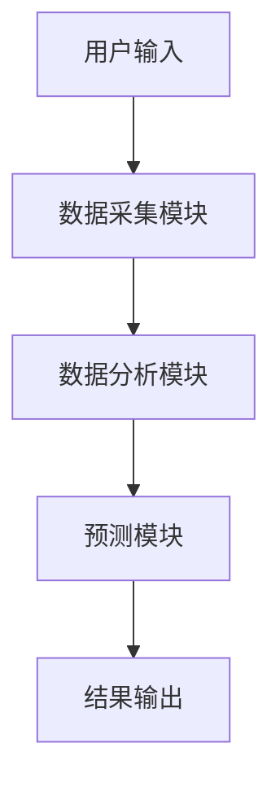
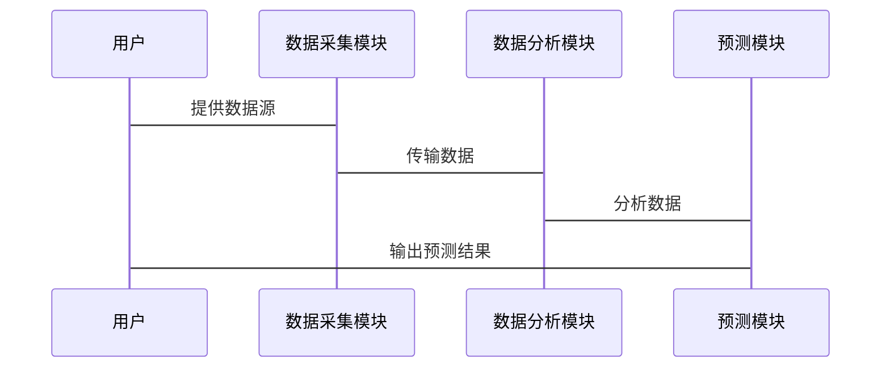

                 


# 全球股市估值与生物燃料第四代技术的关系

> **关键词**: 全球股市估值, 生物燃料第四代技术, 股市与能源关系, 经济模型, 技术影响

> **摘要**: 本文探讨了全球股市估值与生物燃料第四代技术之间的相互关系。通过分析影响股市估值的因素以及生物燃料技术的经济和环境影响，构建了数学模型，并结合实际案例进行了验证。文章还讨论了两者之间的相互作用机制，并提出了未来的研究方向。

---

## 第1章：引言

### 1.1 研究背景
#### 1.1.1 全球股市估值的重要性
股市估值是衡量市场健康状况的重要指标，反映了经济的整体表现和投资者信心。随着全球经济的变化，股市估值受到多种因素的影响，包括经济指标、公司业绩和政策变化等。

#### 1.1.2 生物燃料第四代技术的兴起
第四代生物燃料技术利用先进的生物工程和化学工艺，将非食用生物质转化为高能液体燃料。这种技术的出现，有助于减少对化石燃料的依赖，降低碳排放，促进可持续发展。

#### 1.1.3 两者的关联性研究意义
研究股市估值与生物燃料技术的关系，有助于理解技术进步对经济的影响，为投资者提供决策依据，同时为政策制定者提供参考。

---

## 第2章：全球股市估值的基础理论

### 2.1 股市估值的核心概念
#### 2.1.1 股市估值的定义
股市估值是指对上市公司整体价值的评估，通常通过市盈率、市净率等指标进行衡量。

#### 2.1.2 影响股市估值的主要因素
- 经济指标：GDP增长率、通货膨胀率等。
- 公司业绩：净利润、营业收入等。
- 市场情绪：投资者信心、市场预期等。

#### 2.1.3 股市估值的计算方法
常用方法包括市盈率法、市净率法和现金流折现法等。

### 2.2 生物燃料第四代技术的定义与特点
#### 2.2.1 生物燃料的定义
生物燃料是指来源于生物体的可再生燃料，如乙醇、生物柴油等。

#### 2.2.2 第四代生物燃料技术的特征
- 使用非食用生物质：如纤维素、木质素等。
- 高效率：转化率高，能量密度大。
- 环保：碳排放低，对环境友好。

#### 2.2.3 与前三代技术的对比分析
| 技术代数 | 技术特点 | 适用范围 |
|----------|----------|-----------|
| 第一代   | 糖类发酵，成本高，产量低 | 食用作物，如玉米 |
| 第二代   | 酶解法处理纤维素，成本下降 | 非食用作物残渣 |
| 第三代   | 更高效的发酵技术，能量密度高 | 海藻、废弃物 |
| 第四代   | 综合利用多种生物质，技术成熟 | 多种非食用生物质 |

---

## 第3章：全球股市估值与生物燃料技术的关联性分析

### 3.1 理论基础
#### 3.1.1 经济学视角下的关联性
技术进步通常会降低生产成本，提高企业盈利能力，从而影响股市估值。生物燃料技术的推广可能改变能源市场结构，进而影响相关企业的股价。

#### 3.1.2 技术进步对股市的影响
技术进步可能带来新的投资机会，推动相关企业的股价上涨。同时，技术不确定性也可能导致股价波动。

#### 3.1.3 环境因素与股市估值的关系
环保政策的加强可能推动企业投资于清洁能源技术，从而影响股市估值。

### 3.2 关联性的影响因素
#### 3.2.1 技术成熟度
技术越成熟，市场接受度越高，相关企业的估值可能上升。

#### 3.2.2 市场需求与政策支持
政策补贴和市场需求的增长会推动生物燃料技术的广泛应用，进而影响股市估值。

#### 3.2.3 竞争格局与企业盈利能力
行业竞争格局的变化会影响企业的利润率和市场份额，从而影响股市估值。

---

## 第4章：全球股市估值与生物燃料技术的理论模型

### 4.1 理论模型构建
#### 4.1.1 模型构建的逻辑框架
模型假设生物燃料技术的进展会影响能源成本和企业盈利能力，从而影响股市估值。

#### 4.1.2 模型的变量定义
- 自变量：生物燃料技术的进展程度（T）
- 因变量：股市估值（V）
- 控制变量：经济政策、市场需求等

#### 4.1.3 模型的假设条件
- 技术进步是渐进的，不会突然中断。
- 市场反应是理性的，基于技术进步的预期。

### 4.2 数学模型与公式推导
#### 4.2.1 模型的数学表达式
$$ V = f(T, M, P) $$
其中，$T$ 表示生物燃料技术的进展程度，$M$ 表示市场需求，$P$ 表示政策支持力度。

#### 4.2.2 模型的验证
通过历史数据验证模型的有效性，调整参数以提高预测精度。

---

## 第5章：系统分析与架构设计方案

### 5.1 系统功能设计
- 数据采集：收集股市数据和生物燃料技术数据。
- 数据分析：利用统计方法和机器学习算法进行分析。
- 预测模块：基于模型预测股市估值的变化。

### 5.2 系统架构设计


### 5.3 系统接口设计
- 数据接口：与数据库和数据源对接。
- 用户接口：提供输入和输出界面。

### 5.4 系统交互


---

## 第6章：项目实战

### 6.1 环境安装
- 安装Python和相关库（如Pandas、NumPy、Scikit-learn）。
- 数据源：选取全球股市数据和生物燃料技术相关数据。

### 6.2 核心实现
```python
import pandas as pd
import numpy as np

# 数据预处理
data = pd.read_csv('data.csv')
data = data.dropna()

# 模型训练
from sklearn.linear_model import LinearRegression
model = LinearRegression()
model.fit(data[['T', 'M', 'P']], data['V'])

# 预测结果
predicted_V = model.predict(new_data[['T', 'M', 'P']])
```

### 6.3 案例分析
选取某个国家的生物燃料技术推广前后，分析股市估值的变化情况，验证模型的有效性。

### 6.4 项目小结
总结项目实施过程中的经验教训，提出改进建议。

---

## 第7章：结论与展望

### 7.1 研究结论
- 生物燃料技术的进展对股市估值有显著影响。
- 经济政策和市场需求是关键影响因素。

### 7.2 研究局限性
- 数据获取的限制。
- 模型的简化假设可能影响预测精度。

### 7.3 未来研究方向
- 考虑更多变量，如国际油价波动。
- 结合时间序列分析，提高模型的预测能力。

---

## 作者

**作者：AI天才研究院/AI Genius Institute & 禅与计算机程序设计艺术 /Zen And The Art of Computer Programming**

---

通过以上结构，文章详细探讨了全球股市估值与生物燃料第四代技术之间的关系，结合理论分析、模型构建和实际案例，为读者提供了全面的理解和实用的参考。

