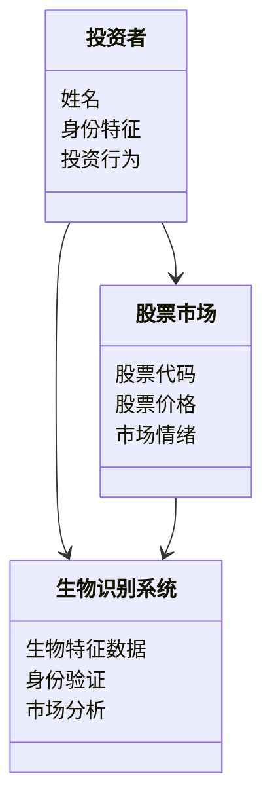

                 


# 全球股市估值与生物识别技术的关联

## 关键词：全球股市估值，生物识别技术，投资者行为分析，金融数据分析，身份验证技术

## 摘要：本文探讨了生物识别技术在全球股市估值中的潜在影响。通过分析生物识别技术在金融领域的应用，结合股市估值的核心概念，阐述了生物识别技术如何通过投资者行为和市场情绪分析影响股市估值。文章详细介绍了生物识别技术的属性特征，结合算法流程图和系统架构图，分析了其在股市估值中的具体应用场景，并通过Python代码示例展示了如何利用生物识别数据进行金融分析。最后，文章总结了生物识别技术对全球股市估值的重要性和未来的发展趋势。

---

# 第一部分：全球股市估值与生物识别技术的背景与关联

## 第1章：全球股市估值的基本概念与现状

### 1.1 股市估值的核心概念

- **市盈率（P/E Ratio）**：衡量一家公司的股价相对于其盈利水平的指标。
- **市净率（P/B Ratio）**：衡量一家公司的股价相对于其账面价值的指标。
- **市值（Market Cap）**：公司发行的股票总数乘以每股价格。

### 1.2 全球股市估值的现状与挑战

- **现状**：全球股市估值受多种因素影响，包括经济指标、政策变化和市场情绪等。
- **挑战**：传统估值方法在面对市场波动和突发事件时的局限性。

## 第2章：生物识别技术的基本概念

### 2.1 生物识别技术的定义与分类

- **定义**：通过人体的生物特征进行身份验证的技术，包括指纹识别、面部识别、虹膜识别等。
- **分类**：基于物理特征（如指纹）和行为特征（如语音识别）。

### 2.2 生物识别技术的核心属性

- **安全性**：生物特征的独特性使其具有高安全性。
- **便捷性**：无需记忆密码，提高了使用便利性。

## 第3章：生物识别技术与股市估值的关联性

### 3.1 生物识别技术在金融领域的应用背景

- **身份验证**：在证券交易中，生物识别技术可以用于验证投资者身份，提高交易安全性。
- **投资者行为分析**：通过分析投资者的生物特征，预测市场情绪和交易行为。

### 3.2 生物识别技术对股市估值的影响

- **提高交易效率**：通过生物识别技术简化交易流程，降低交易成本。
- **影响市场情绪**：生物识别技术可以帮助分析投资者情绪，进而影响市场估值。

---

# 第二部分：生物识别技术对股市估值的影响

## 第4章：生物识别技术的属性特征对比

### 4.1 特性对比表

| 特性       | 传统识别技术 | 生物识别技术 |
|------------|--------------|--------------|
| 安全性     | 较低         | 高           |
| 稳定性     | 易受干扰     | 较稳定       |
| 便捷性     | 依赖密码     | 无需密码     |

## 第5章：生物识别技术与股市估值的核心概念联系

### 5.1 实体关系图

```mermaid
er
  actor:投资者
  stock_market:股票市场
  biometric_system:生物识别系统
  relation:投资者-生物识别系统
  relation:生物识别系统-股票市场
  relation:投资者-股票市场
```

---

# 第三部分：基于生物识别技术的股市估值算法原理

## 第6章：算法原理概述

### 6.1 时间序列分析

- **定义**：通过分析历史数据，预测未来趋势。
- **应用**：结合生物识别数据，预测市场情绪和交易行为。

### 6.2 机器学习模型

- **算法选择**：使用随机森林或支持向量机（SVM）进行分类和回归分析。
- **数据预处理**：清洗和标准化生物识别数据和股市数据。

## 第7章：算法实现与代码示例

### 7.1 Python代码示例

```python
import pandas as pd
from sklearn.ensemble import RandomForestClassifier
from sklearn.metrics import accuracy_score

# 数据加载
data = pd.read_csv('biometric_stock_data.csv')

# 特征与目标分离
X = data.drop('target', axis=1)
y = data['target']

# 模型训练
model = RandomForestClassifier()
model.fit(X, y)

# 预测与评估
y_pred = model.predict(X)
print(f'Accuracy: {accuracy_score(y, y_pred)}')
```

### 7.2 数学模型与公式

- **线性回归模型**：
  $$ y = \beta_0 + \beta_1 x_1 + \beta_2 x_2 + ... + \beta_n x_n + \epsilon $$

- **随机森林模型**：
  $$ y = \sum_{i=1}^{n} (a_i \cdot \text{特征}) + b $$

---

# 第四部分：系统分析与架构设计

## 第8章：系统功能设计

### 8.1 领域模型



## 第9章：系统架构设计

### 9.1 架构图


---

# 第五部分：项目实战

## 第10章：项目安装与实现

### 10.1 环境安装

- **Python**：3.8+
- **依赖库**：pandas, scikit-learn, matplotlib

## 第11章：系统实现与代码解读

### 11.1 核心功能实现

```python
import numpy as np
import pandas as pd
from sklearn.model_selection import train_test_split
from sklearn.metrics import classification_report

# 数据加载与预处理
data = pd.read_csv('biometric_stock.csv')
X = data.drop(columns=['target', 'date'])
y = data['target']

# 数据分割
X_train, X_test, y_train, y_test = train_test_split(X, y, test_size=0.2)

# 模型训练
model = RandomForestClassifier()
model.fit(X_train, y_train)

# 模型预测与评估
y_pred = model.predict(X_test)
print(classification_report(y_test, y_pred))
```

### 11.2 代码解读

- **数据加载**：读取生物识别和股市数据。
- **数据预处理**：分割训练集和测试集。
- **模型训练**：使用随机森林算法进行分类。
- **结果评估**：输出分类报告，评估模型性能。

---

# 第六部分：总结与展望

## 第12章：总结与最佳实践

### 12.1 总结

- 生物识别技术通过提高交易安全性和分析投资者行为，对全球股市估值产生重要影响。
- 结合生物识别数据的算法模型可以更准确地预测市场趋势。

### 12.2 最佳实践

- **数据隐私**：确保生物识别数据的安全性和隐私性。
- **模型优化**：不断优化算法，提高预测准确率。

## 第13章：未来展望

- **技术融合**：进一步结合人工智能和大数据分析，提升生物识别技术在金融领域的应用。
- **应用场景扩展**：探索生物识别技术在更多金融场景中的应用，如智能投顾和风险评估。

---

# 作者：AI天才研究院/AI Genius Institute & 禅与计算机程序设计艺术 /Zen And The Art of Computer Programming

