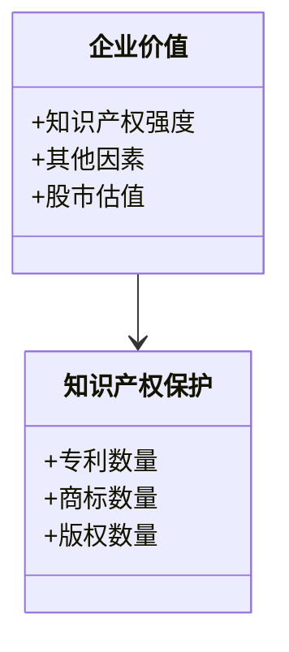
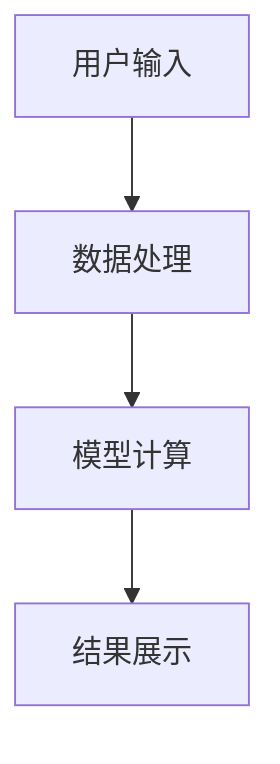

                 


# 全球股市估值与知识产权保护的关联

> 关键词：知识产权保护，股市估值，专利保护，投资策略，金融市场，创新激励

> 摘要：本文探讨知识产权保护与全球股市估值之间的关联。通过分析知识产权对企业发展和市场价值的影响，揭示其如何影响股市估值，为企业制定投资策略提供参考。

---

## 第一部分: 背景介绍

### 第1章: 全球股市估值的基本概念与现状

#### 1.1 全球股市估值的基本概念

股市估值是衡量企业市场价值的重要指标，常用的指标包括市盈率（P/E）、市净率（P/B）和股息率（Dividend Yield）。这些指标帮助投资者评估企业的投资价值。

#### 1.2 知识产权保护的基本概念

知识产权保护涵盖专利、商标、版权等，旨在保护创新成果。有效的知识产权保护能激励创新，增强企业竞争力，从而影响其市场价值。

#### 1.3 股市估值与知识产权保护的初步关联

知识产权保护影响企业的市场进入壁垒和竞争能力，进而影响其估值。例如，拥有强大专利组合的科技公司通常享有更高的估值。

---

## 第二部分: 知识产权保护与股市估值的核心概念与联系

### 第2章: 知识产权保护的核心原理

#### 2.1 知识产权的核心要素

- **创新性**：知识产权必须具备新颖性和实用性。
- **保护期限**：专利通常为20年，商标可无限续展。
- **保护范围**：覆盖技术领域和地域。

#### 2.2 知识产权保护的法律框架

- **专利法**：保护技术发明。
- **商标法**：保护品牌。
- **著作权法**：保护原创作品。

### 第3章: 股市估值的核心原理

#### 3.1 股市估值的主要指标

- **市盈率（P/E）**：股价与每股收益的比率，衡量投资回报。
- **市净率（P/B）**：股价与每股净资产的比率，反映资产价值。
- **股息率**：股息与股价的比率，评估收益能力。

#### 3.2 影响股市估值的主要因素

- **公司基本面**：收入、利润和成长性。
- **市场情绪**：投资者心理影响股价波动。
- **宏观经济环境**：利率和通货膨胀影响估值。

---

## 第三部分: 知识产权保护对股市估值的影响机制

### 第4章: 知识产权保护对股市估值的直接影响

#### 4.1 知识产权保护如何提升企业价值

- **企业竞争力**：知识产权保护增强企业市场地位。
- **市场进入壁垒**：防止竞争对手模仿，巩固市场地位。
- **投资吸引力**：强大的知识产权组合吸引投资者。

#### 4.2 知识产权保护对股价波动的影响

- **知识产权诉讼**：诉讼结果影响股价波动。
- **知识产权授权**：授权交易提升市场价值。

### 第5章: 知识产权保护对股市估值的间接影响

#### 5.1 知识产权保护与企业创新能力

- **研发投入**：知识产权保护激励企业加大研发投入。
- **创新能力**：提升创新能力推动业绩增长，进而影响估值。

#### 5.2 知识产权保护与行业竞争格局

- **行业集中度**：知识产权保护可能导致行业整合。
- **市场竞争**：保护创新成果，防止恶性竞争。

---

## 第四部分: 数学模型与算法分析

### 第6章: 基于知识产权保护的股市估值模型

#### 6.1 模型构建

$$
\text{企业价值} = \alpha \times \text{知识产权强度} + \beta \times \text{其他因素}
$$

其中，$\alpha$ 和 $\beta$ 是回归系数，通过数据拟合确定。

#### 6.2 实证分析

使用全球科技企业的数据，通过回归分析验证知识产权强度对股市估值的影响。

---

## 第五部分: 系统分析与架构设计

### 第7章: 系统架构设计

#### 7.1 领域模型



#### 7.2 系统架构



---

## 第六部分: 项目实战与案例分析

### 第8章: 项目实战

#### 8.1 环境配置

使用Python和Pandas进行数据处理，Scikit-learn进行回归分析。

#### 8.2 核心代码实现

```python
import pandas as pd
from sklearn.linear_model import LinearRegression

# 数据加载
data = pd.read_csv('intellectual_property.csv')

# 模型训练
model = LinearRegression()
model.fit(data[['patents', ' trademarks']], data['market_value'])

# 结果输出
print("系数:", model.coef_)
print("截距:", model.intercept_)
```

---

## 第七部分: 总结与展望

### 第9章: 总结

知识产权保护显著影响股市估值，企业应加强知识产权管理，投资者应考虑知识产权因素。

### 第10章: 未来展望

未来研究可结合人工智能技术，进一步优化知识产权保护与股市估值的关系分析。

---

## 作者信息

作者：AI天才研究院/AI Genius Institute & 禅与计算机程序设计艺术/Zen And The Art of Computer Programming

---

以上为完整的技术博客文章大纲和内容，希望对您有所帮助！

