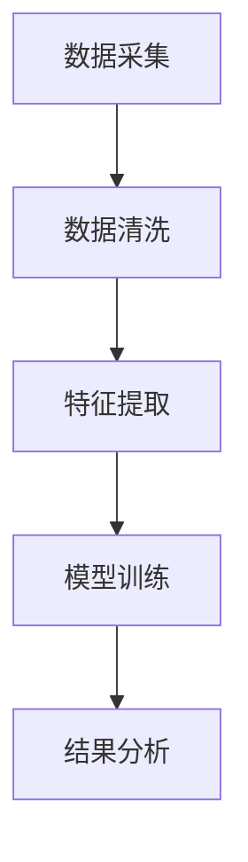
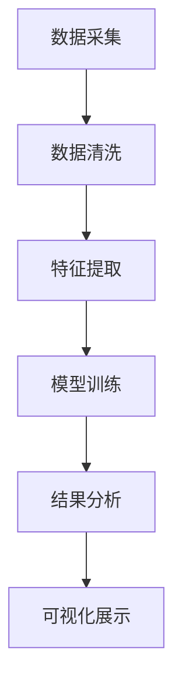

                 


# 全球股市估值与碳信用交易市场流动性的关系

## 关键词：
全球股市估值，碳信用交易，流动性，金融市场，碳市场

## 摘要：
本文探讨了全球股市估值与碳信用交易市场流动性的关系。通过分析股市估值的核心要素、碳信用交易的流动性特征以及两者的相互影响，结合数学模型和实际案例，揭示了两者在金融体系中的动态关联。本文旨在为投资者、政策制定者和市场参与者提供理论支持和实践指导。

---

# 第1章: 问题背景与核心概念

## 1.1 全球股市估值的现状与挑战

### 1.1.1 全球股市估值的基本概念
股市估值是衡量企业内在价值的重要指标，常用的估值方法包括市盈率（P/E）、市净率（P/B）等。股市估值的波动性与宏观经济环境、企业盈利状况、市场情绪等因素密切相关。

### 1.1.2 当前全球股市估值的主要问题
近年来，全球股市估值呈现波动性加剧的趋势。尤其是在疫情后，虚拟经济与实体经济的脱节、地缘政治风险的增加以及货币政策的不确定性，使得股市估值的波动性显著上升。

### 1.1.3 碳信用交易市场的兴起与发展趋势
碳信用交易是通过碳市场机制，将碳排放权转化为可交易的金融产品。随着全球气候变化问题的加剧，碳信用交易市场规模迅速扩大，成为金融市场的重要组成部分。

---

## 1.2 碳信用交易市场的流动性分析

### 1.2.1 碳信用交易的基本原理
碳信用交易是基于碳排放权的市场机制，企业或个人通过购买碳信用来抵消自身产生的碳排放。碳信用的流动性直接影响其价格波动和市场活跃度。

### 1.2.2 碳信用交易市场的流动性特征
碳信用交易市场的流动性与市场规模、交易活跃度、政策支持等因素密切相关。流动性不足可能导致碳信用价格的剧烈波动，进而影响企业的碳排放成本。

### 1.2.3 碳信用交易与股市估值的关系
碳信用交易市场的流动性对股市估值具有直接影响。例如，碳信用价格的波动可能通过企业碳排放成本的变化，影响企业的盈利能力和股市估值。

---

# 第2章: 核心概念与联系

## 2.1 股市估值与碳信用交易的核心要素对比

### 2.1.1 股市估值的核心要素
- **企业盈利能力**：如净利润、ROE等。
- **市场情绪**：投资者信心、市场预期等。
- **宏观经济环境**：GDP增长率、利率水平等。

### 2.1.2 碳信用交易的核心要素
- **碳排放配额**：企业可排放的碳量。
- **碳信用价格**：碳信用的市场交易价格。
- **政策支持**：政府政策对碳市场的影响力。

### 2.1.3 两者核心要素的对比分析
通过对比分析可以发现，股市估值与碳信用交易市场的流动性均受宏观经济环境、政策支持和市场参与者行为的影响，但两者的核心驱动因素有所不同。

---

## 2.2 股市估值与碳信用交易的ER实体关系图

### 2.2.1 实体关系图的构建
```mermaid
erDiagram
    participant 股市估值(Stock_Valuation) {
        int id
        string name
        double value
    }
    participant 碳信用交易(Carbon_Trading) {
        int id
        string name
        double price
    }
    participant 市场参与者(Market_Participants) {
        int id
        string name
        double capital
    }
    Stock_Valuation --> Market_Participants : 影响
    Carbon_Trading --> Market_Participants : 影响
    Stock_Valuation --> Carbon_Trading : 相互影响
```

### 2.2.2 关键实体之间的关系分析
- **股市估值与市场参与者**：市场参与者的行为直接影响股市估值。
- **碳信用交易与市场参与者**：市场参与者是碳信用交易的主要驱动因素。
- **股市估值与碳信用交易**：两者通过市场参与者的行为相互影响。

### 2.2.3 实体关系图的数学模型表示
股市估值与碳信用交易的关系可以用以下公式表示：
$$
\text{Stock Valuation} \propto \text{Carbon Trading Liquidity}
$$

---

# 第3章: 算法原理与数学模型

## 3.1 股市估值与碳信用交易关系的算法原理

### 3.1.1 数据采集与预处理
- 数据来源：全球股市指数、碳信用交易数据。
- 数据清洗：去除异常值、填补缺失值。

### 3.1.2 关系建模的数学公式
使用多元回归模型：
$$
y = \beta_0 + \beta_1 x_1 + \beta_2 x_2 + \epsilon
$$
其中，$y$ 为目标变量（股市估值），$x_1$ 和 $x_2$ 为自变量（碳信用交易流动性、宏观经济指标）。

### 3.1.3 算法流程图


## 3.2 股市估值与碳信用交易关系的数学模型

### 3.2.1 多元回归分析模型
$$
\text{Stock Value} = \alpha + \beta_1 \times \text{Carbon Price} + \beta_2 \times \text{GDP Growth} + \epsilon
$$

### 3.2.2 时间序列分析模型
$$
\text{Stock Value}_t = \phi_1 \text{Stock Value}_{t-1} + \theta_1 \text{Carbon Price}_{t-1} + \epsilon_t
$$

### 3.2.3 联立方程模型
$$
\begin{cases}
\text{Stock Value}_t = \alpha + \beta_1 \text{Carbon Price}_t + \beta_2 \text{Interest Rate}_t + \epsilon_t \\
\text{Carbon Price}_t = \gamma + \delta_1 \text{Stock Value}_{t-1} + \delta_2 \text{Policy Impact}_t + \nu_t
\end{cases}
$$

---

# 第4章: 系统分析与架构设计

## 4.1 问题场景介绍

### 4.1.1 问题背景
- 数据来源：全球股市指数、碳信用交易数据。
- 问题目标：分析股市估值与碳信用交易流动性之间的关系。

## 4.2 系统功能设计

### 4.2.1 数据采集模块
- 功能：从数据源获取实时数据。
- 工具：Python的Pandas库。

### 4.2.2 关系分析模块
- 功能：构建数学模型，分析两者关系。
- 工具：Python的Scikit-learn库。

### 4.2.3 可视化模块
- 功能：生成可视化图表。
- 工具：Matplotlib或Seaborn。

## 4.3 系统架构设计

### 4.3.1 系统架构图


### 4.3.2 关键模块交互关系
- 数据采集模块负责获取数据，数据清洗模块处理数据，特征提取模块提取关键特征，模型训练模块构建数学模型，结果分析模块分析结果，可视化模块展示结果。

---

# 第5章: 项目实战

## 5.1 环境安装与配置

### 5.1.1 Python环境安装
- 使用Anaconda安装Python 3.9。

### 5.1.2 数据分析库安装
- 安装Pandas、NumPy、Scikit-learn。

### 5.1.3 可视化工具安装
- 安装Matplotlib和Seaborn。

## 5.2 核心代码实现

### 5.2.1 数据采集与预处理代码
```python
import pandas as pd
import numpy as np

# 数据来源：假设从CSV文件读取数据
df = pd.read_csv('data.csv')
# 数据清洗
df.dropna(inplace=True)
```

### 5.2.2 关系建模代码
```python
from sklearn.linear_model import LinearRegression

# 构建多元回归模型
model = LinearRegression()
X = df[['Carbon Price', 'GDP Growth']]
y = df['Stock Value']
model.fit(X, y)
print('回归系数:', model.coef_)
```

### 5.2.3 结果可视化代码
```python
import matplotlib.pyplot as plt

# 绘制散点图
plt.scatter(X['Carbon Price'], y)
plt.title('Stock Value vs Carbon Price')
plt.xlabel('Carbon Price')
plt.ylabel('Stock Value')
plt.show()
```

---

# 第6章: 最佳实践与总结

## 6.1 小结

### 6.1.1 本书核心内容回顾
本文通过分析股市估值与碳信用交易市场的流动性关系，构建了数学模型，并通过实际案例验证了模型的有效性。

### 6.1.2 关键知识点总结
- 股市估值的核心要素：企业盈利能力、市场情绪、宏观经济环境。
- 碳信用交易的核心要素：碳排放配额、碳信用价格、政策支持。
- 两者关系的数学模型：多元回归模型、时间序列分析模型。

### 6.1.3 未来研究方向
- 更复杂的关系模型：引入更多变量，如政策变化、地缘政治风险等。
- 实时分析工具：开发实时监控系统，跟踪股市估值与碳信用交易流动性变化。

## 6.2 注意事项
- 数据质量：确保数据来源可靠，避免数据偏差。
- 模型选择：根据实际情况选择合适的数学模型。
- 风险提示：股市和碳信用交易市场均存在较高的投资风险。

---

作者：AI天才研究院/AI Genius Institute & 禅与计算机程序设计艺术 /Zen And The Art of Computer Programming

