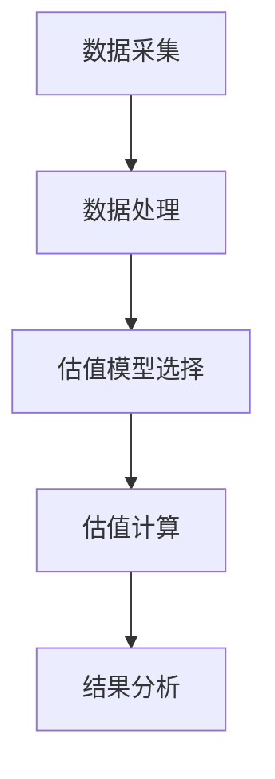

                 


# 全球股市估值与碳捕获与封存技术的经济可行性

> 关键词：全球股市估值、碳捕获技术、经济可行性、环境效益、经济成本

> 摘要：本文系统地探讨了全球股市估值与碳捕获与封存技术的经济可行性之间的关系。首先，我们介绍了全球股市估值的基本概念和方法，以及碳捕获与封存技术的定义、分类及其经济可行性。接着，我们深入分析了股市估值的核心原理，包括股票定价模型和数学模型，以及碳捕获技术的经济性分析。最后，我们通过具体案例分析和系统设计，展示了如何将这些理论应用于实际场景中。本文旨在为读者提供一个全面的视角，帮助他们理解这两者在经济与环境可持续性方面的相互作用。

---

## 第一部分: 全球股市估值与碳捕获与封存技术的经济可行性概述

### 第1章: 背景介绍与核心概念

#### 1.1 全球股市估值的现状与挑战
##### 1.1.1 股市估值的基本概念与方法
股市估值是指对上市公司股票的内在价值进行评估的过程。常见的股票估值方法包括市盈率（P/E）、市净率（P/B）、股息率等。这些方法通过不同的指标来衡量股票的价值，帮助投资者做出更明智的投资决策。

##### 1.1.2 全球化背景下的股市估值特点
在全球化背景下，股市估值呈现出以下特点：
- **全球化与多元化**：随着全球化的发展，股市估值需要考虑跨国公司的业绩、全球宏观经济环境等因素。
- **技术驱动**：科技公司的估值越来越依赖于未来盈利潜力和技术创新。
- **复杂性增加**：随着金融工具的多样化，股市估值需要考虑更多复杂的因素，如衍生品、杠杆收购等。

##### 1.1.3 股市估值面临的挑战与问题
股市估值面临的主要挑战包括：
- **信息不对称**：投资者获取的信息不全面或不及时，影响估值的准确性。
- **市场波动性**：股市的波动性可能导致估值结果的不稳定。
- **模型选择**：不同估值模型适用于不同的市场环境，选择合适的模型是关键。

#### 1.2 碳捕获与封存技术的经济可行性
##### 1.2.1 碳捕获与封存技术的定义与分类
碳捕获与封存技术（Carbon Capture and Storage，CCS）是指将工业过程中产生的二氧化碳捕获并将其封存在地下或转化为其他用途的过程。CCS技术可以分为以下几类：
- **燃烧后捕获**：在烟气排放后捕获二氧化碳。
- **燃烧前捕获**：在燃烧前对气体进行处理，捕获二氧化碳。
- **富氧燃烧**：通过富氧空气燃烧，提高二氧化碳的浓度，便于捕获。

##### 1.2.2 碳捕获技术的经济性分析
碳捕获技术的经济性分析需要考虑以下几个方面：
- **成本构成**：设备投资、运营成本、维护费用等。
- **经济性模型**：通过建立数学模型，评估碳捕获技术的经济效益。
- **影响因素**：政府补贴、碳交易价格、技术进步等都会影响碳捕获技术的经济性。

##### 1.2.3 碳捕获技术的环境效益与经济成本的平衡
碳捕获技术的环境效益主要体现在减少温室气体排放，但其经济成本较高。因此，如何在环境效益与经济成本之间找到平衡点是关键。可以通过政策支持、技术改进和市场机制来降低经济成本，提高环境效益。

#### 1.3 本章小结
本章介绍了全球股市估值和碳捕获技术的基本概念和现状，分析了两者面临的挑战和经济可行性。为后续的深入分析奠定了基础。

---

## 第二部分: 股市估值的核心概念与方法

### 第2章: 股市估值的核心原理

#### 2.1 股市估值的基本原理
##### 2.1.1 股票价值的决定因素
股票价值的决定因素包括：
- **公司基本面**：收入、利润、资产负债状况等。
- **市场情绪**：投资者的心理预期和市场波动。
- **宏观经济环境**：经济增长、利率、通货膨胀等。

##### 2.1.2 股票定价模型的分类
股票定价模型可以分为以下几类：
- **内在价值模型**：如股息折现模型（DDM）、自由现金流模型（DCF）。
- **相对价值模型**：如市盈率（P/E）、市净率（P/B）。
- **技术分析模型**：通过价格和成交量的变化预测未来走势。

##### 2.1.3 股票估值的常见方法
股票估值的常见方法包括：
- **市盈率法**：通过比较公司市盈率与行业平均水平，判断估值高低。
- **股息率法**：通过股息与股票价格的比率，评估投资回报。
- **现金流折现法**：通过预测未来现金流，折现计算内在价值。

#### 2.2 股市估值的数学模型与公式
##### 2.2.1 常见股票估值公式
- **股息折现模型（DDM）**：
  \[
  V = \frac{D}{k - g}
  \]
  其中，\( V \) 是股票价值，\( D \) 是股息，\( k \) 是折现率，\( g \) 是股息增长率。

- **自由现金流模型（DCF）**：
  \[
  V = \sum_{t=1}^{n} \frac{CF_t}{(1 + r)^t} + \frac{TV}{(1 + r)^n}
  \]
  其中，\( CF_t \) 是第 \( t \) 年的自由现金流，\( r \) 是折现率，\( TV \) 是终值。

##### 2.2.2 股票估值模型的比较与选择
股票估值模型的选择取决于公司的特点和数据的可得性。对于成长型公司，DCF模型更为合适；对于成熟公司，DDM模型更为合适。

#### 2.3 股市估值的系统分析与架构设计
##### 2.3.1 股票估值系统的功能模块
- **数据采集模块**：采集公司财务数据、市场数据等。
- **估值模型选择模块**：根据具体情况选择合适的估值模型。
- **结果分析模块**：输出估值结果，并与市场价格进行比较。

##### 2.3.2 股票估值系统的架构设计


##### 2.3.3 股票估值系统的接口设计
- **输入接口**：接收公司财务数据和市场数据。
- **输出接口**：输出估值结果和分析报告。

---

## 第三部分: 算法原理与系统实现

### 第3章: 碳捕获与封存技术的经济可行性分析

#### 3.1 碳捕获技术的经济性分析
##### 3.1.1 碳捕获技术的成本构成
碳捕获技术的成本构成包括：
- **设备投资**：捕获设备、管道、存储设施等。
- **运营成本**：能源消耗、维护费用、人工成本等。
- **间接成本**：如碳交易成本、政策合规成本等。

##### 3.1.2 碳捕获技术的经济性模型
碳捕获技术的经济性模型可以表示为：
\[
\text{总成本} = \text{设备投资} + \text{运营成本} + \text{间接成本}
\]
##### 3.1.3 碳捕获技术的经济性影响因素
- **碳价格**：碳交易价格越高，碳捕获技术的经济性越强。
- **技术进步**：技术进步可以降低设备投资和运营成本。
- **政策支持**：政府补贴和税收优惠可以提高碳捕获技术的经济性。

#### 3.2 碳捕获技术的环境效益与经济成本的平衡
##### 3.2.1 碳捕获技术的环境效益分析
碳捕获技术可以减少温室气体排放，缓解气候变化问题。

##### 3.2.2 碳捕获技术的经济成本分析
碳捕获技术的经济成本较高，但随着技术进步和规模效应，成本会逐渐降低。

##### 3.2.3 环境效益与经济成本的平衡策略
- **政府支持**：通过补贴和税收优惠降低经济成本。
- **市场机制**：利用碳交易市场实现环境效益与经济成本的平衡。
- **技术创新**：通过技术改进降低经济成本，提高环境效益。

---

## 第四部分: 项目实战与案例分析

### 第4章: 项目实战与案例分析

#### 4.1 环境与数据准备
##### 4.1.1 环境安装
- 安装Python和相关库（如pandas、numpy、matplotlib）。
- 安装Mermaid工具和LaTeX编辑器。

##### 4.1.2 数据准备
- 收集相关公司的财务数据和市场数据。
- 收集碳捕获技术的成本数据和碳交易价格。

#### 4.2 核心实现
##### 4.2.1 股票估值核心代码
```python
import pandas as pd
import numpy as np

def stock_valuation(method, financial_data):
    if method == 'DDM':
        dividend = financial_data['dividend']
        growth_rate = financial_data['growth_rate']
        discount_rate = financial_data['discount_rate']
        return dividend / (discount_rate - growth_rate)
    elif method == 'DCF':
        cash_flows = financial_data['cash_flows']
        discount_rate = financial_data['discount_rate']
        horizon = financial_data['horizon']
        tv = financial_data['terminal_value']
        return (cash_flows / (1 + discount_rate)**np.arange(horizon+1)).sum() + tv / (1 + discount_rate)**horizon
    else:
        return None
```

##### 4.2.2 碳捕获技术经济性分析核心代码
```python
def carbon_capture_cost(method, cost_data):
    if method == 'total_cost':
        return cost_data['equipment_cost'] + cost_data['operating_cost'] + cost_data['indirect_cost']
    elif method == 'cost_per_ton':
        return (cost_data['total_cost'] / cost_data['captured_CO2'])
    else:
        return None
```

#### 4.3 案例分析与解读
##### 4.3.1 股票估值案例
假设某公司财务数据如下：
- 股息：$1.0
- 股息增长率：5%
- 折现率：10%

使用DDM模型计算股票价值：
\[
V = \frac{1.0}{0.10 - 0.05} = \$20.0
\]

##### 4.3.2 碳捕获技术经济性分析案例
假设某碳捕获项目成本数据如下：
- 设备投资：$100 million
- 运营成本：$20 million/年
- 间接成本：$10 million/年
- 捕获的二氧化碳量：1 million吨/年
- 碳交易价格：$50/吨

总成本：
\[
\text{总成本} = 100 + 20 + 10 = \$130 \text{ million}
\]
单位成本：
\[
\text{单位成本} = \frac{130}{1} = \$130/\text{吨}
\]
碳捕获技术的经济性可以通过与碳交易价格的比较来评估。如果碳交易价格高于单位成本，碳捕获技术具有经济可行性。

---

## 第五部分: 结论与展望

### 5.1 结论
本文系统地探讨了全球股市估值与碳捕获与封存技术的经济可行性。通过分析股市估值的核心原理和碳捕获技术的经济性模型，我们得出以下结论：
- 股市估值需要结合公司基本面和市场环境进行综合分析。
- 碳捕获技术的经济性取决于成本构成和碳交易价格，政府支持和技术创新可以提高其经济可行性。

### 5.2 展望
未来，随着技术进步和政策支持，碳捕获技术的经济性将逐渐提高，成为实现碳中和目标的重要手段。同时，股市估值也将更加依赖于数据驱动的模型和人工智能技术，以应对复杂多变的市场环境。

---

作者：AI天才研究院/AI Genius Institute & 禅与计算机程序设计艺术 /Zen And The Art of Computer Programming

