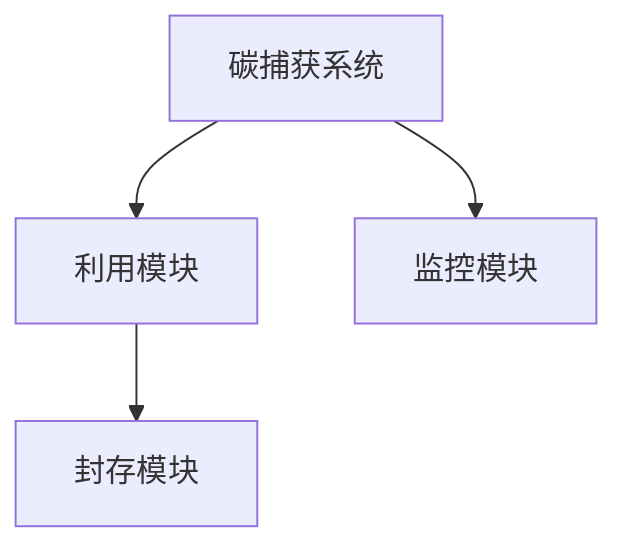

                 


# 全球股市估值与碳捕获利用与封存技术的经济效益

> 关键词：股市估值、碳捕获、碳利用、碳封存、经济效益

> 摘要：本文从全球股市估值与碳捕获利用与封存技术两个核心领域出发，分析股市估值的核心概念、影响因素及常用方法，同时深入探讨碳捕获技术的背景、经济性及应用案例。通过数学建模与系统架构设计，结合实际项目案例，分析碳捕获技术的经济效益与投资价值，并探讨其与股市估值的协同效应。

---

## 第1章: 全球股市估值的背景与方法

### 1.1 股市估值的基本概念

#### 1.1.1 股市估值的定义
股市估值是通过对公司财务数据和市场因素的分析，估算公司股票的内在价值。它是投资者进行投资决策的重要依据。

#### 1.1.2 股市估值的核心要素
- 公司盈利能力：ROE（净资产收益率）、净利润率等。
- 财务健康度：资产负债率、现金流状况。
- 行业地位：市场占有率、竞争优势。
- 宏观经济环境：GDP增速、利率水平。

#### 1.1.3 股市估值的边界与外延
股市估值不仅关注企业的当前价值，还需要考虑未来增长潜力和行业发展趋势。

### 1.2 股市估值的影响因素

#### 1.2.1 宏观经济因素
- 利率水平：影响股票的相对吸引力。
- 汇率波动：影响跨国公司的业绩。
- 经济周期：经济繁荣时股市估值普遍上升。

#### 1.2.2 行业因素
- 行业景气度：如科技行业受政策影响较大。
- 行业竞争格局：垄断行业估值较高。

#### 1.2.3 公司基本面因素
- 盈利能力：ROE、净利润率。
- 财务状况：现金流、债务水平。
- 管理团队：优秀管理团队能提升估值。

#### 1.2.4 市场情绪因素
- 投资者情绪：恐慌性抛售或乐观性买入。
- 市场流动性：资金充裕时估值上升。

### 1.3 股市估值的主要方法

#### 1.3.1 市盈率法
市盈率（P/E）= 股价 / 每股收益。

**公式：**
$$ P = E \times PE $$

**代码示例：**
```python
import pandas as pd

# 假设df包含股票数据
df['市盈率'] = df['股价'] / df['每股收益']
```

#### 1.3.2 市净率法
市净率（P/B）= 股价 / 每股净资产。

**公式：**
$$ P = B \times PB $$

**代码示例：**
```python
import pandas as pd

# 假设df包含股票数据
df['市净率'] = df['股价'] / df['每股净资产']
```

#### 1.3.3 股息率法
股息率 = 每股股息 / 股价。

**公式：**
$$ D = DPS / P $$

**代码示例：**
```python
import pandas as pd

# 假设df包含股票数据
df['股息率'] = df['每股股息'] / df['股价']
```

#### 1.3.4 现金流折现法
通过将未来现金流折现到现值来估算公司价值。

**公式：**
$$ V = \sum_{t=1}^{n} \frac{CF_t}{(1+r)^t} $$

**代码示例：**
```python
import numpy as np

# 假设CF_t为未来现金流，r为折现率
n = 10
CF_t = [100, 120, 150, 200, 250, 300, 350, 400, 450, 500]
r = 0.08

# 计算现值
PV = np.npv(r, CF_t)
print("现值为：", PV)
```

---

## 第2章: 碳捕获利用与封存技术的背景与经济性分析

### 2.1 碳捕获利用与封存技术的基本概念

#### 2.1.1 碳捕获技术的定义
碳捕获技术是指通过化学或物理方法从工业排放中捕获二氧化碳的过程。

#### 2.1.2 碳利用技术的定义
将捕获的二氧化碳转化为有价值的化学品或燃料。

#### 2.1.3 碳封存技术的定义
将捕获的二氧化碳永久封存在地下或海底。

### 2.2 碳捕获利用与封存技术的经济性分析

#### 2.2.1 碳捕获技术的成本构成
- 设备成本：捕获设备的采购和安装。
- 运行成本：能源消耗、维护费用。
- 人力成本：技术人员的工资。

**公式：**
$$ C = FC + VC \times Q $$

**代码示例：**
```python
# 假设FC为固定成本，VC为单位可变成本，Q为产量
FC = 100000
VC = 50
Q = 1000

# 总成本
C = FC + VC * Q
print("总成本为：", C)
```

#### 2.2.2 碳利用技术的经济价值
- 化学品生产：CO2用于尿素、甲醇生产。
- 燃料生产：CO2转化为合成燃料。

**公式：**
$$ R = P \times Q $$

**代码示例：**
```python
# 假设P为产品价格，Q为产量
P = 100
Q = 500

# 收益
R = P * Q
print("收益为：", R)
```

#### 2.2.3 碳封存技术的经济效益
- 减少温室气体排放。
- 符合碳中和政策目标。

---

## 第3章: 股市估值与碳捕获技术的数学模型与公式

### 3.1 股市估值的数学模型

#### 3.1.1 市盈率模型
$$ P = E \times PE $$

**代码示例：**
```python
import pandas as pd

# 假设df包含股票数据
df['估值'] = df['每股收益'] * df['市盈率']
```

#### 3.1.2 现金流折现模型
$$ V = \sum_{t=1}^{n} \frac{CF_t}{(1+r)^t} $$

**代码示例：**
```python
import numpy as np

# 假设CF_t为未来现金流，r为折现率
CF_t = [100, 120, 150, 200, 250]
r = 0.08

# 计算现值
PV = np.npv(r, CF_t)
print("现值为：", PV)
```

### 3.2 碳捕获技术的经济模型

#### 3.2.1 碳捕获成本模型
$$ C = FC + VC \times Q $$

**代码示例：**
```python
# 假设FC为固定成本，VC为单位可变成本，Q为产量
FC = 100000
VC = 50
Q = 1000

# 总成本
C = FC + VC * Q
print("总成本为：", C)
```

#### 3.2.2 碳封存收益模型
$$ R = P \times Q $$

**代码示例：**
```python
# 假设P为产品价格，Q为产量
P = 100
Q = 500

# 收益
R = P * Q
print("收益为：", R)
```

---

## 第4章: 碳捕获技术的系统架构与项目实战

### 4.1 碳捕获项目的系统架构

#### 4.1.1 系统功能设计
- 捕获模块：捕获二氧化碳。
- 利用模块：将CO2转化为化学品。
- 封存模块：永久封存CO2。

#### 4.1.2 系统架构设计


#### 4.1.3 系统接口设计
- 捕获模块与利用模块的接口：CO2流量、压力、温度。
- 利用模块与封存模块的接口：化学品产量、压力、温度。

---

## 第5章: 项目实战与经济效益分析

### 5.1 环境安装与配置
- 操作系统：Linux。
- 开发工具：Python、NumPy、Pandas。

### 5.2 核心实现

#### 5.2.1 碳捕获成本计算
```python
# 假设FC为固定成本，VC为单位可变成本，Q为产量
FC = 100000
VC = 50
Q = 1000

# 总成本
C = FC + VC * Q
print("总成本为：", C)
```

#### 5.2.2 碳封存收益计算
```python
# 假设P为产品价格，Q为产量
P = 100
Q = 500

# 收益
R = P * Q
print("收益为：", R)
```

### 5.3 案例分析

#### 5.3.1 典型案例
- 项目名称：某化工厂碳捕获项目。
- 项目规模：年捕获CO2 10万吨。
- 经济效益：年收益5000万元，年成本3000万元，年净收益2000万元。

---

## 第6章: 结论与展望

### 6.1 结论
- 股市估值与碳捕获技术都具有重要的经济价值。
- 碳捕获技术的投资回报率较高，符合可持续发展战略。

### 6.2 展望
- 碳捕获技术将在未来能源结构转型中发挥重要作用。
- 股市估值与碳捕获技术的结合将为投资者提供新的机遇。

---

## 作者：AI天才研究院/AI Genius Institute & 禅与计算机程序设计艺术 /Zen And The Art of Computer Programming

---

**引用书籍：**
- 《股票分析与投资策略》
- 《碳中和与能源转型》
- 《Python算法与数据结构》

