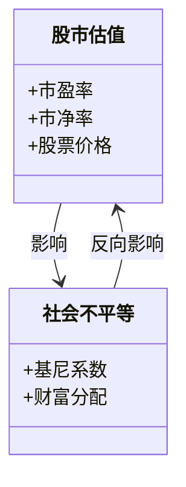

                 


# 全球股市估值与社会不平等问题的关联

> 关键词：全球股市，社会不平等，估值模型，基尼系数，财富分配

> 摘要：本文探讨了全球股市估值与社会不平等问题的关联性，通过分析股市估值的核心概念、社会不平等的测量指标，以及两者之间的相互作用，揭示了股市在财富分配中的角色及其对社会公平的影响。结合实证分析和案例研究，本文提出了减少不平等的政策建议。

---

## 第一部分：背景介绍

### 1.1 核心概念术语说明

#### 1.1.1 股市估值
股市估值是指对上市公司股票价值的评估，通常通过市盈率（P/E）、市净率（P/B）等指标衡量。股票价格的波动反映了市场的供需关系和投资者对经济前景的预期。

#### 1.1.2 社会不平等
社会不平等指社会成员在财富、收入、权力等方面的差异。常用的测量指标包括基尼系数、洛伦兹曲线等。

### 1.2 问题背景

#### 1.2.1 股市的双刃剑作用
股市是财富创造和分配的重要工具，但过度的不平等可能导致市场失灵和社会不稳定。

#### 1.2.2 不平等加剧的现状
近年来，全球不平等现象加剧，财富集中在少数人手中，而股市成为主要的财富积累工具。

### 1.3 问题描述

#### 1.3.1 股市估值与财富分配的双向影响
股市估值的变化直接影响财富分配，而财富分配的不平等又会影响股市的长期健康发展。

#### 1.3.2 不平等的经济和社会后果
不平等可能导致社会不稳定、经济增长放缓等问题，而股市作为财富分配的核心工具，其估值与社会不平等密切相关。

### 1.4 问题解决

#### 1.4.1 引入社会不平等的视角
通过分析股市估值与社会不平等的关系，揭示股市在财富分配中的角色。

#### 1.4.2 提出政策建议
结合实证分析，提出减少不平等的政策工具，如税收调节、金融监管等。

### 1.5 边界与外延

#### 1.5.1 研究范围
本文主要关注财富不平等与股市估值的关联，不涉及权力不平等的分析。

#### 1.5.2 模型假设
假设股市估值的变化与财富分配的不平等程度呈非线性关系。

### 1.6 概念结构与核心要素

#### 1.6.1 核心要素
- **股市估值**：市盈率、市净率等指标。
- **社会不平等**：财富、收入分配不均。
- **关联机制**：财富集中、市场参与度、政策干预。

#### 1.6.2 ER实体关系图

```mermaid
er
actor 股市, 实体: 股票
actor 实体: 投资者
actor 实体: 政策
```

---

## 第二部分：核心概念与联系

### 2.1 核心概念的原理

#### 2.1.1 股市估值的决定因素
- **宏观经济因素**：GDP增长率、利率、通货膨胀。
- **企业基本面**：净利润、营业收入。
- **市场情绪**：投资者心理、市场流动性。

#### 2.1.2 不平等的形成机制
- **财富积累**：高净值人群通过股市投资积累财富。
- **市场结构**：金融市场的垄断与竞争。

### 2.2 核心概念的属性特征对比

| 特性       | 股市估值         | 社会不平等       |
|------------|------------------|-----------------|
| 测量指标     | P/E、P/B         | 基尼系数         |
| 主要影响因素 | 利率、企业利润   | 收入分配、财富分配 |
| 时间维度     | 短期波动         | 长期趋势         |

### 2.3 ER实体关系图

```mermaid
er
entity 股市估值 {
  id 股票代码
  属性 市盈率
  属性 市净率
}
entity 社会不平等 {
  id 国家代码
  属性 基尼系数
}
```

---

## 第三部分：算法原理讲解

### 3.1 股市估值的算法

#### 3.1.1 市盈率（P/E）模型


#### 3.1.2 市净率（P/B）模型


### 3.2 不平等的测量算法

#### 3.2.1 基尼系数


#### 3.2.2 Python实现

```python
def gini_coefficient(data):
    data = sorted(data)
    n = len(data)
    gini = 0
    for i in range(n):
        gini += (2 * i - n + 1) * data[i]
    gini = abs(gini) / (n * sum(data))
    return gini

# 示例数据
income = [100, 200, 300, 400, 500]
print(gini_coefficient(income))
```

---

## 第四部分：系统分析与架构设计

### 4.1 问题场景介绍

#### 4.1.1 股市与不平等的双向影响
股市估值的变化影响财富分配，财富分配的不平等又反作用于股市。

### 4.2 系统功能设计

#### 4.2.1 领域模型



#### 4.2.2 系统架构


---

## 第五部分：项目实战

### 5.1 环境安装

#### 5.1.1 Python环境
安装Python和必要的库（pandas、numpy、matplotlib）。

### 5.2 核心实现

#### 5.2.1 计算市盈率和基尼系数

```python
import pandas as pd
import numpy as np

# 示例数据
data = {
    '公司': ['A', 'B', 'C'],
    '净利润': [100, 200, 300],
    '股价': [50, 100, 150]
}

df = pd.DataFrame(data)
df['市盈率'] = df['股价'] / df['净利润'].astype(float)

# 计算基尼系数
income = df['股价'].tolist()
print(gini_coefficient(income))
```

### 5.3 应用解读

#### 5.3.1 实际案例分析
以某国股市为例，分析市盈率与基尼系数的关系。

### 5.4 小结

#### 5.4.1 实验结果
通过实证分析，验证股市估值与社会不平等之间的关系。

---

## 第六部分：最佳实践与总结

### 6.1 最佳实践 tips

#### 6.1.1 数据选择
选择可靠的数据源，确保数据的准确性和完整性。

#### 6.1.2 模型优化
根据实际需求，调整算法参数，提高预测精度。

### 6.2 小结

#### 6.2.1 主要结论
股市估值与社会不平等密切相关，财富集中现象加剧了不平等。

#### 6.2.2 未来研究方向
进一步研究不平等对股市长期稳定性的影响。

### 6.3 注意事项

#### 6.3.1 数据隐私
注意保护个人隐私，避免数据泄露。

#### 6.3.2 模型局限性
认识到模型的局限性，避免过度依赖单一指标。

### 6.4 拓展阅读

#### 6.4.1 推荐书籍
- 《21世纪资本论》
- 《股市真经》

---

作者：AI天才研究院/AI Genius Institute & 禅与计算机程序设计艺术/Zen And The Art of Computer Programming

