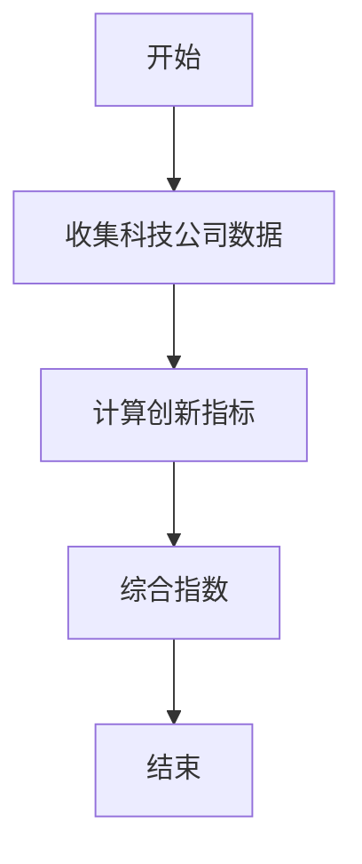
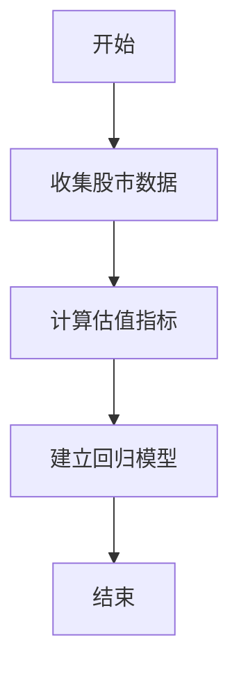
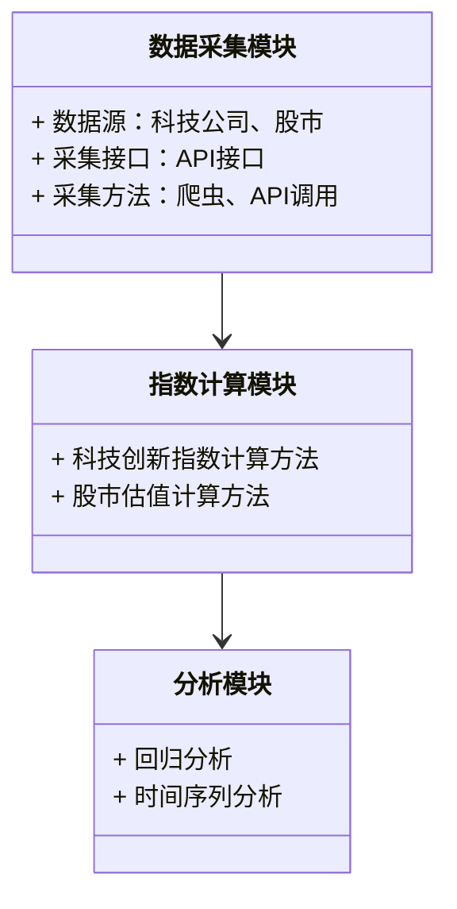

                 


# 全球股市估值与科技创新指数的关系

## 关键词：全球股市、科技创新指数、股市估值、经济指标、科技企业、投资分析

## 摘要：  
本文探讨了全球股市估值与科技创新指数之间的关系。通过分析科技创新指数的构成、股市估值的核心要素，以及两者之间的相互影响，本文揭示了科技创新如何影响股市估值，并提出了基于数学模型的分析方法。通过对实际案例的分析，本文展示了如何利用科技创新指数预测股市走势，并为投资者提供了实践建议。

---

# 第一部分: 全球股市估值与科技创新指数的关系概述

## 第1章: 问题背景与研究意义

### 1.1 问题背景

#### 1.1.1 股市估值的基本概念
股市估值是衡量市场整体价值的重要指标，通常通过市盈率（P/E）、市净率（P/B）等指标来衡量。股市估值反映了市场对企业的未来盈利能力的预期。

#### 1.1.2 科技创新指数的定义
科技创新指数是衡量一个地区或行业科技创新能力的综合指标，通常包括研发投入、专利数量、科技企业数量等因素。

#### 1.1.3 问题的提出与研究意义
随着科技的快速发展，科技创新已成为推动经济增长的核心动力。然而，科技创新对股市估值的影响机制尚未完全明确，研究这一关系有助于投资者更好地把握市场趋势。

### 1.2 问题描述

#### 1.2.1 股市估值的核心要素
- 市盈率（P/E）：衡量股票价格是否合理。
- 市净率（P/B）：衡量股票价格与账面价值的关系。
- 股息率：衡量股票的收益能力。

#### 1.2.2 科技创新指数的影响因素
- 研发投入强度：企业的研发投入占营收的比例。
- 专利数量：企业拥有的专利数量。
- 科技人才数量：企业的科技人才数量。

#### 1.2.3 问题的边界与外延
- 研究范围：全球主要股市和科技公司。
- 研究时间跨度：近十年的数据。
- 研究目标：揭示科技创新指数对股市估值的影响机制。

### 1.3 问题解决

#### 1.3.1 研究目标与方法
- 目标：建立科技创新指数与股市估值之间的量化关系模型。
- 方法：通过回归分析、时间序列分析等方法进行研究。

#### 1.3.2 数据来源与处理
- 数据来源：全球主要股市的估值数据、科技公司的专利数据、研发投入数据等。
- 数据处理：数据清洗、标准化处理。

#### 1.3.3 研究框架与流程
1. 数据收集与整理。
2. 构建科技创新指数。
3. 建立股市估值模型。
4. 分析两者的关系。

---

## 第2章: 核心概念与联系

### 2.1 核心概念原理

#### 2.1.1 科技创新指数的构成
科技创新指数通常包括以下几个方面：
- 研发投入强度：企业的研发投入占营收的比例。
- 专利数量：企业拥有的专利数量。
- 科技人才数量：企业的科技人才数量。
- 技术创新速度：企业新技术的推出速度。

#### 2.1.2 股市估值的计算方法
股市估值的计算方法包括：
- 市盈率（P/E）：市盈率 = 股价 / 每股净利润。
- 市净率（P/B）：市净率 = 股价 / 每股净资产。
- 股息率：股息率 = 每股股息 / 股价。

#### 2.1.3 两者的相互关系
科技创新指数和股市估值之间存在正相关关系。科技创新能力强的公司，通常具有更高的市盈率和市净率。

### 2.2 核心概念对比

#### 2.2.1 科技创新指数与股市估值的属性特征对比
| 特性               | 科技创新指数 | 股市估值 |
|--------------------|--------------|----------|
| 数据类型           | 数值型       | 数值型   |
| 时间跨度           | 年度或季度   | 日度或月度|
| 主要影响因素       | 研发投入、专利数量 | 盈利能力、市场情绪 |

#### 2.2.2 科技创新指数与传统经济指标的差异
| 指标               | 科技创新指数 | 传统经济指标 |
|--------------------|--------------|-------------|
| 反映的内容         | 科技创新能力 | 经济总量     |
| 数据来源           | 专利、研发数据 | GDP、就业数据 |
| 影响因素           | 技术创新     | 工业生产     |

### 2.3 ER实体关系图

```mermaid
er
    作用域: 科技创新指数与股市估值关系
    项目:
        科技创新指数
        股市估值
        科技公司
        投资者
        市场环境
    关系:
        科技创新指数 --> 科技公司: 影响
        科技公司 --> 股市估值: 影响
        投资者 --> 股市估值: 影响
        市场环境 --> 股市估值: 影响
```

---

## 第3章: 算法原理与实现

### 3.1 算法原理

#### 3.1.1 科技创新指数的计算方法
科技创新指数的计算方法如下：
1. 收集科技公司的研发投入、专利数量、科技人才数量等数据。
2. 对各指标进行标准化处理。
3. 计算各指标的加权和，得到科技创新指数。

#### 3.1.2 股市估值模型的构建
股市估值模型的构建方法如下：
1. 收集股票的市盈率、市净率等数据。
2. 对数据进行时间序列分析。
3. 建立回归模型，分析科技创新指数对股市估值的影响。

#### 3.1.3 两者关系的数学表达式
科技创新指数对股市估值的影响可以用回归模型表示：
$$ y = \beta_0 + \beta_1 x + \epsilon $$
其中，\( y \) 为股市估值，\( x \) 为科技创新指数，\( \beta_0 \) 和 \( \beta_1 \) 为回归系数。

### 3.2 算法实现

#### 3.2.1 科技创新指数计算流程



#### 3.2.2 股市估值模型构建流程



#### 3.2.3 代码实现

```python
import pandas as pd
import numpy as np
from sklearn.linear_model import LinearRegression

# 假设我们有科技创新指数和股市估值的数据
X = pd.DataFrame({'科技创新指数': [x1, x2, x3, ...]})
y = pd.DataFrame({'股市估值': [y1, y2, y3, ...]})

# 建立回归模型
model = LinearRegression()
model.fit(X, y)

# 输出回归系数
print('回归系数:', model.coef_)
print('截距:', model.intercept_)
```

---

## 第4章: 系统分析与架构设计

### 4.1 系统功能设计

#### 4.1.1 功能模块
- 数据采集模块：负责收集科技公司和股市的数据。
- 指数计算模块：计算科技创新指数和股市估值。
- 分析模块：分析两者的关系，生成报告。

#### 4.1.2 系统功能类图



### 4.2 系统架构设计

#### 4.2.1 系统架构图


---

## 第5章: 项目实战

### 5.1 实际案例分析

#### 5.1.1 案例介绍
以某科技公司为例，分析其科技创新指数对股市估值的影响。

#### 5.1.2 数据准备

```python
import pandas as pd

# 假设我们有以下数据
data = {
    '科技创新指数': [85, 90, 75, 95],
    '股市估值': [100, 105, 90, 110]
}
df = pd.DataFrame(data)
```

#### 5.1.3 模型分析

```python
import matplotlib.pyplot as plt

# 绘制散点图
plt.scatter(df['科技创新指数'], df['股市估值'])
plt.xlabel('科技创新指数')
plt.ylabel('股市估值')
plt.title('科技创新指数与股市估值的关系')
plt.show()
```

---

## 第6章: 结论与展望

### 6.1 研究发现
科技创新指数对股市估值有显著的正向影响。科技创新能力强的公司，其股市估值通常较高。

### 6.2 展望
未来的研究可以进一步探讨不同行业的科技创新指数对股市估值的影响差异。

### 6.3 注意事项
在实际应用中，需考虑市场情绪、宏观经济等因素的影响。

### 6.4 拓展阅读
推荐阅读《科技与金融的结合》、《大数据与金融分析》等书籍。

---

## 作者：AI天才研究院/AI Genius Institute & 禅与计算机程序设计艺术 /Zen And The Art of Computer Programming

