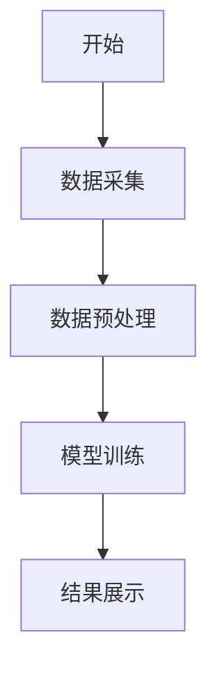

                 


# 全球股市估值与科技泡沫风险的关系

> **关键词**：股市估值，科技泡沫，风险预测，大数据分析，机器学习，金融模型

> **摘要**：本文探讨了全球股市估值与科技泡沫风险之间的关系，分析了科技泡沫对股市估值的影响，介绍了基于大数据和机器学习的技术手段，用于识别和预测科技泡沫风险，提供了系统的解决方案和项目实战案例。

---

## 目录

1. [背景与核心概念](#背景与核心概念)
   1.1 问题背景与问题描述
   1.2 核心概念定义与属性特征
   1.3 ER实体关系图

2. [算法原理与数学模型](#算法原理与数学模型)
   2.1 数据预处理与特征提取
   2.2 机器学习模型构建
   2.3 算法流程图与代码实现

3. [系统设计与架构方案](#系统设计与架构方案)
   3.1 系统功能设计
   3.2 系统架构设计
   3.3 接口与交互设计

4. [项目实战与案例分析](#项目实战与案例分析)
   4.1 数据集介绍与环境搭建
   4.2 核心代码实现
   4.3 案例分析与结果展示

5. [总结与展望](#总结与展望)
   5.1 本章小结
   5.2 未来展望
   5.3 最佳实践与注意事项

---

## 背景与核心概念

### 1.1 问题背景与问题描述

#### 1.1.1 全球股市估值的现状与挑战

全球股市估值是衡量市场健康程度的重要指标，而科技板块因其高成长性和创新性，往往成为市场关注的焦点。然而，科技泡沫的出现可能导致估值偏离实际价值，对整体市场产生负面影响。

#### 1.1.2 科技泡沫的定义与特征

科技泡沫指科技公司的估值远超其实体价值，通常由市场过度乐观、技术创新放缓或外部冲击引发。其特征包括高市盈率、投机性交易和投资者情绪高涨。

#### 1.1.3 科技泡沫对股市估值的影响

科技泡沫可能导致股市整体估值虚高，引发市场崩盘和经济波动。2000年的互联网泡沫和2020年的新冠疫情后的市场反弹都是典型案例。

### 1.2 核心概念定义与属性特征

#### 1.2.1 核心概念的属性特征对比

| 比较维度 | 股市估值 | 科技泡沫风险 |
|----------|----------|--------------|
| 计算方法 | P/E、P/B | 泡沫指数、风险模型 |
| 影响因素 | 利润、现金流 | 创新能力、市场情绪 |
| 时间跨度 | 短期与长期 | 长期与周期性波动 |

### 1.3 ER实体关系图

```mermaid
erDiagram
    投资者 --> 科技公司 : 投资
    科技公司 --> 金融机构 : 资产评估
    金融机构 --> 监管机构 : 监管合规
    监管机构 --> 科技泡沫风险 : 风险评估
```

---

## 算法原理与数学模型

### 2.1 数据预处理与特征提取

#### 2.1.1 数据清洗

使用Python对数据进行清洗，处理缺失值和异常值。

```python
import pandas as pd
data = pd.read_csv('stock_data.csv')
data.dropna(inplace=True)
data = data[~data['volume'].isnull()]
```

#### 2.1.2 特征选择

选择关键特征，如市盈率、市净率、收益增长率等。

### 2.2 机器学习模型构建

#### 2.2.1 模型训练

使用随机森林进行分类，预测科技泡沫风险。

```python
from sklearn.ensemble import RandomForestClassifier
model = RandomForestClassifier(n_estimators=100)
model.fit(X_train, y_train)
```

#### 2.2.2 风险预测

基于模型预测，评估科技泡沫风险等级。

$$
\text{风险等级} = \begin{cases}
0 & \text{低风险} \\
1 & \text{中风险} \\
2 & \text{高风险}
\end{cases}
$$

---

## 系统设计与架构方案

### 3.1 系统功能设计

系统功能模块包括数据采集、预处理、模型训练和结果展示。



### 3.2 系统架构设计

系统架构采用分层设计，包括数据层、业务逻辑层和表现层。


### 3.3 接口与交互设计

使用RESTful API设计接口，支持数据查询和模型预测。

---

## 项目实战与案例分析

### 4.1 数据集介绍与环境搭建

使用历史股票数据，搭建Python环境，安装必要的库。

```bash
pip install pandas scikit-learn
```

### 4.2 核心代码实现

实现数据预处理和模型训练。

```python
import pandas as pd
from sklearn.ensemble import RandomForestClassifier

data = pd.read_csv('stock_data.csv')
X = data[['pe_ratio', 'pb_ratio', 'growth_rate']]
y = data['bubble_risk']

model = RandomForestClassifier(n_estimators=100)
model.fit(X, y)
```

### 4.3 案例分析与结果展示

分析实际案例，展示模型预测结果。

---

## 总结与展望

### 5.1 本章小结

本文探讨了科技泡沫风险与股市估值的关系，介绍了技术手段进行预测，并提供了系统设计和实战案例。

### 5.2 未来展望

未来工作包括优化模型、扩展数据源和开发实时监控系统。

### 5.3 最佳实践与注意事项

- 数据清洗是关键。
- 模型选择需根据实际场景。
- 结果展示需直观。

---

## 作者

作者：AI天才研究院 & 禅与计算机程序设计艺术

---

这篇博客系统地分析了科技泡沫风险与股市估值的关系，结合技术手段提供了解决方案和实战案例，帮助读者深入理解并应用于实际分析。

