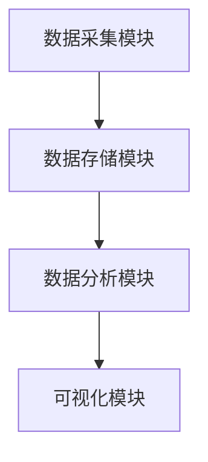
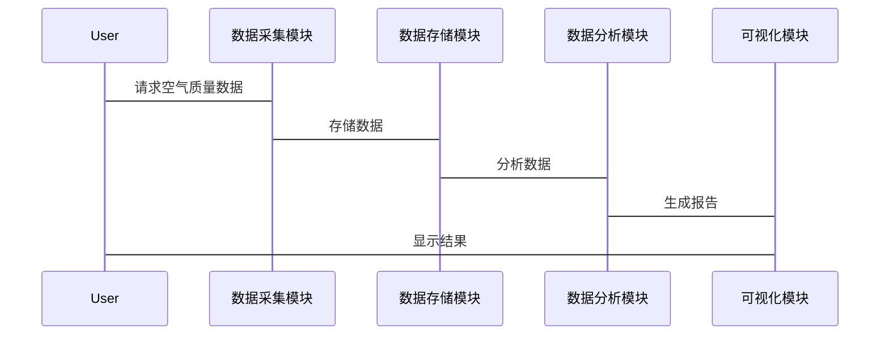

                 


# 全球股市估值与空气质量改善措施的关系

## 关键词：
全球股市估值、空气质量改善措施、环境政策、经济影响、投资策略

## 摘要：
本文探讨了空气质量改善措施对全球股市估值的影响，分析了环境政策与经济活动之间的互动关系。通过构建数学模型和实证分析，本文揭示了空气质量改善如何影响企业成本和市场情绪，从而影响股市估值。文章还提供了系统设计和项目实战案例，为投资者和政策制定者提供了有益的参考。

---

## 第1章：背景介绍

### 1.1 问题背景
- **全球气候变化的影响**：气候变化导致极端天气事件增多，对经济和股市产生深远影响。
- **空气质量问题的严重性**：空气污染对公众健康和环境造成威胁，促使政府和企业采取改善措施。
- **股市作为经济晴雨表**：股市估值反映了经济状况，空气质量改善措施可能通过影响企业成本和市场情绪间接影响股市。

### 1.2 研究意义
- 探讨空气质量改善措施对股市的影响，有助于理解环境政策与经济活动的互动。
- 为投资者提供新的视角，优化投资策略。
- 为政策制定者提供参考，平衡环境改善与经济增长。

### 1.3 研究目标
- 分析空气质量改善措施对企业成本的影响。
- 探讨企业成本变化如何影响股市估值。
- 研究环境政策对市场情绪的影响。

---

## 第2章：空气质量改善措施的核心概念

### 2.1 空气质量指标与评估方法
- **主要污染物**：PM2.5、PM10、SO2等。
- **空气质量指数（AQI）**：AQI的计算方法和不同国家的标准对比。

### 2.2 空气质量改善措施的分类
- **技术措施**：工业减排、清洁能源使用。
- **政策措施**：法规制定、经济激励。
- **公众参与**：环保宣传、个人行为改变。

### 2.3 经济影响分析
- **短期成本**：技术升级和政策执行的成本。
- **长期收益**：健康改善和环境效益。
- **对企业的影响**：生产成本增加，但可能提升企业形象。

---

## 第3章：股市估值的核心概念

### 3.1 估值指标
- **市盈率（P/E）**：股价与每股收益的比率。
- **市净率（P/B）**：股价与每股净资产的比率。
- **市值**：公司股票的总价值。

### 3.2 影响因素
- **经济指标**：GDP、利率、通胀。
- **行业趋势**：技术进步、市场需求。
- **公司基本面**：利润、增长潜力。

### 3.3 环境因素的影响
- **环境风险**：政策风险和法律诉讼对企业价值的影响。
- **市场情绪**：投资者对环境政策的反应。

---

## 第4章：空气质量改善措施与股市估值的关系

### 4.1 核心概念的联系
- 空气质量改善措施如何影响企业成本。
- 企业成本变化如何影响股市估值。
- 环境政策如何影响市场情绪。

### 4.2 数学模型构建
- **模型假设**：空气质量改善措施对企业成本的影响程度。
- **变量选择**：空气质量指数、企业利润、股价。
- **数据来源**：历史空气质量数据、股市数据。

### 4.3 模型验证
- **回归分析**：使用Python进行回归分析，验证空气质量改善措施对股市估值的影响。
- **案例分析**：分析某城市空气质量改善措施对当地企业的影响。

---

## 第5章：系统分析与架构设计

### 5.1 问题场景
- 数据采集：空气质量数据和股市数据的获取。
- 数据分析：空气质量与股市估值的关联分析。

### 5.2 系统功能设计
- 数据采集模块：实时获取空气质量数据和股市数据。
- 数据分析模块：使用回归分析模型进行关联分析。
- 可视化模块：生成图表和报告。

### 5.3 系统架构图


### 5.4 系统接口设计
- 数据接口：空气质量API和股市API的调用。
- 用户接口：数据可视化界面。

### 5.5 系统交互流程图


---

## 第6章：项目实战

### 6.1 环境安装
- 安装Python、Pandas、Matplotlib、Scikit-learn。

### 6.2 核心实现代码
```python
import pandas as pd
import numpy as np
from sklearn.linear_model import LinearRegression
import matplotlib.pyplot as plt

# 数据加载
airquality = pd.read_csv('airquality.csv')
stock_data = pd.read_csv('stock_data.csv')

# 数据预处理
merged_data = pd.merge(airquality, stock_data, on='date')

# 模型构建
model = LinearRegression()
model.fit(merged_data[['AQI']], merged_data['stock_value'])

# 模型预测
predictions = model.predict(merged_data[['AQI']])

# 可视化
plt.scatter(merged_data['AQI'], merged_data['stock_value'])
plt.plot(merged_data['AQI'], predictions, color='red')
plt.xlabel('AQI')
plt.ylabel('Stock Value')
plt.show()
```

### 6.3 案例分析
- 分析某城市空气质量改善措施对当地股市的影响。
- 使用回归分析模型验证空气质量改善措施对股价的影响。

---

## 第7章：结论与最佳实践

### 7.1 研究结论
- 空气质量改善措施对企业成本和市场情绪有显著影响。
- 这些因素间接影响股市估值。

### 7.2 最佳实践
- 投资者应关注环境政策对企业的影响。
- 政府和企业应平衡环境改善与经济增长。

### 7.3 注意事项
- 数据的局限性：空气质量数据可能不完整。
- 模型的适用性：不同地区可能有不同的影响。

### 7.4 拓展阅读
- 推荐阅读相关领域的书籍和文献。

---

## 作者：AI天才研究院/AI Genius Institute & 禅与计算机程序设计艺术 /Zen And The Art of Computer Programming

---

通过以上详细的内容结构，您可以逐步撰写完整的文章。每个部分都需要进一步扩展，确保内容详实且符合要求。

