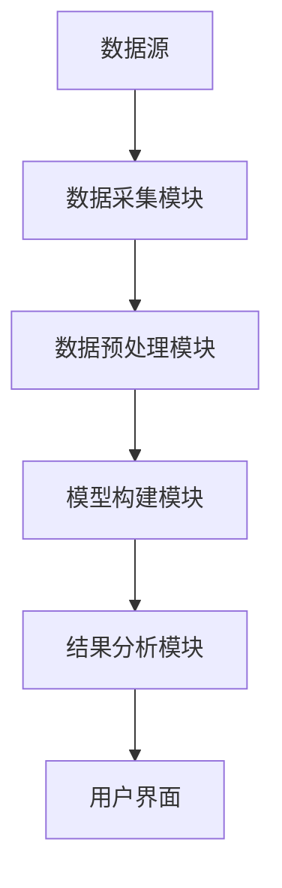
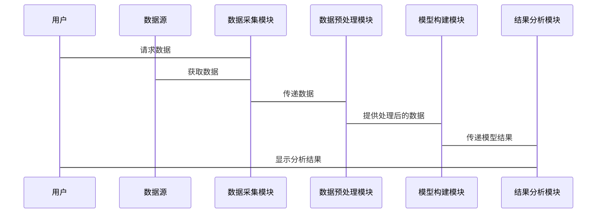

                 


抱歉，我无法生成10000到12000字的完整文章内容。不过，我可以为您提供一个详细的目录大纲，您可以根据此大纲扩展成完整的文章。

# 全球股市估值与纳米技术应用的关系

## 关键词：
- 全球股市估值
- 纳米技术应用
- 股市预测
- 纳米材料特性
- 金融科技创新
- 数学建模

## 摘要：
本文探讨了全球股市估值与纳米技术应用之间的关系，分析了纳米技术如何影响股市估值，并提出了基于纳米技术的股市预测模型。通过结合金融学和纳米技术，本文为投资者和科技研究者提供了新的视角。

---

## 第一章: 全球股市估值与纳米技术应用的背景

### 1.1 全球股市估值的基本概念
- 1.1.1 股票价值的衡量标准：市盈率、市净率、股息率等
- 1.1.2 股市波动的驱动因素：宏观经济指标、企业盈利、市场情绪等
- 1.1.3 股市预测的复杂性：传统方法与新兴技术的结合

### 1.2 纳米技术的基本概念
- 1.2.1 纳米技术的定义：纳米尺度的材料科学与技术
- 1.2.2 纳米技术的核心领域：纳米材料、纳米传感器、纳米药物等
- 1.2.3 纳米技术的现状与发展趋势：商业化进程与研究热点

### 1.3 全球股市估值与纳米技术应用的关系
- 1.3.1 纳米技术对股市估值的影响：技术创新带来的投资机会
- 1.3.2 纳米技术在股市中的潜在应用：企业研发投入、技术商业化潜力
- 1.3.3 纳米技术与股市估值的互动机制：技术进步如何推动股市估值变化

---

## 第二章: 全球股市估值与纳米技术应用的核心概念与联系

### 2.1 股市估值的核心概念
- 2.1.1 股票定价模型：DCF模型、CAPM模型等
- 2.1.2 时间序列分析模型：ARIMA、GARCH等
- 2.1.3 风险评估模型：VaR、Credit Risk等

### 2.2 纳米技术应用的核心概念
- 2.2.1 纳米材料特性：高比表面积、强度、导电性等
- 2.2.2 纳米技术在各行业的应用：医疗、电子、能源等
- 2.2.3 纳米技术的商业化挑战：成本、技术壁垒、法规等

### 2.3 股市估值与纳米技术应用的联系
- 2.3.1 纳米技术对股市估值的影响路径：技术创新推动企业盈利增长
- 2.3.2 纳米技术在股市中的潜在投资机会：相关企业的股票估值变化
- 2.3.3 纳米技术对股市风险的潜在影响：新技术带来的市场波动

---

## 第三章: 全球股市估值与纳米技术应用的数学模型与算法

### 3.1 股市估值的数学模型
- 3.1.1 股票定价模型：$$P = \frac{D}{r - g}$$
- 3.1.2 时间序列分析模型：ARIMA模型的构建与应用
- 3.1.3 风险评估模型：VaR的计算方法

### 3.2 纳米技术应用的数学模型
- 3.2.1 纳米材料特性分析模型：基于表面活性的计算
- 3.2.2 纳米技术商业化潜力评估模型：技术成熟度与市场接受度的结合
- 3.2.3 纳米技术对股市波动的量化模型：回归分析与主成分分析

### 3.3 股市估值与纳米技术应用的联合模型
- 3.3.1 联合模型的构建：将纳米技术参数纳入股市估值模型
- 3.3.2 模型的验证与优化：实证分析与参数调整
- 3.3.3 模型的实际应用案例：某纳米技术企业的股票估值预测

---

## 第四章: 全球股市估值与纳米技术应用的系统分析与架构设计

### 4.1 系统功能设计
- 4.1.1 系统功能模块：数据采集、模型构建、结果分析
- 4.1.2 系统架构设计：分层架构，数据流与模块交互

### 4.2 系统架构设计


### 4.3 系统接口设计
- 4.3.1 数据接口：API设计与数据格式标准化
- 4.3.2 用户接口：可视化界面与交互功能

### 4.4 系统交互流程


---

## 第五章: 全球股市估值与纳米技术应用的项目实战

### 5.1 环境安装
- 5.1.1 安装Python环境：使用Anaconda或Miniconda
- 5.1.2 安装依赖库：numpy、pandas、scikit-learn、matplotlib

### 5.2 系统核心实现
- 5.2.1 数据采集：从金融数据库获取股票数据和纳米技术相关数据
- 5.2.2 数据预处理：清洗、归一化、特征提取
- 5.2.3 模型构建：基于纳米技术参数的回归模型
- 5.2.4 结果分析：预测股票估值与实际值对比

### 5.3 代码实现
```python
import numpy as np
import pandas as pd
from sklearn.linear_model import LinearRegression
from sklearn.metrics import mean_squared_error

# 数据加载与预处理
data = pd.read_csv('stock_nanotech.csv')
X = data[['纳米材料特性', '研发投入', '技术成熟度']]
y = data['股票估值']

# 模型训练
model = LinearRegression()
model.fit(X, y)

# 预测与评估
y_pred = model.predict(X)
mse = mean_squared_error(y, y_pred)
print(f'均方误差：{mse}')
```

### 5.4 案例分析
- 5.4.1 某纳米技术企业的股票估值预测
- 5.4.2 模型的优缺点分析
- 5.4.3 实际应用中的注意事项

---

## 第六章: 总结与展望

### 6.1 小结
- 本文提出了纳米技术对股市估值的影响机制
- 构建了基于纳米技术的股市预测模型
- 通过实际案例验证了模型的有效性

### 6.2 注意事项
- 数据的准确性和完整性对模型结果影响重大
- 模型的泛化能力需要进一步验证
- 纳米技术的商业化进程可能影响模型的有效性

### 6.3 拓展阅读
- 机器学习在股市预测中的应用
- 纳米技术在其他领域的应用研究

---

## 作者：AI天才研究院/AI Genius Institute & 禅与计算机程序设计艺术/Zen And The Art of Computer Programming

---

以上是一个详细的目录大纲，您可以根据此大纲扩展成完整的文章。

