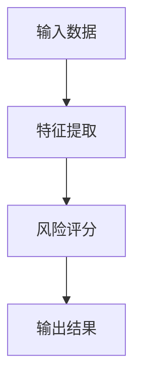

                 


# 全球股市估值与网络安全风险的关联

> **关键词**：全球股市，网络安全风险，市场估值，金融建模，数据安全，系统架构，风险管理

> **摘要**：本文探讨了全球股市估值与网络安全风险之间的深层关联，分析了网络安全事件对股市波动的影响机制，构建了网络安全风险对股市估值影响的数学模型，并提出了基于实时数据流的预警系统设计方案。通过实际案例分析，验证了模型的有效性，并为投资者和企业提供了风险管理的实践建议。

---

## 第一部分: 全球股市估值与网络安全风险的关联概述

### 第1章: 背景介绍

#### 1.1 问题背景
- **全球化经济与金融市场的复杂性**  
  全球化使得金融市场高度互联，一家公司的网络安全问题可能迅速影响整个市场的信心。
- **网络安全在现代金融体系中的重要性**  
  网络攻击可能导致数据泄露、交易中断，进而引发市场波动。
- **问题解决的必要性与紧迫性**  
  随着数字化转型的推进，网络安全风险已成为影响股市估值的重要因素。

#### 1.2 核心概念
- **股市估值的核心要素**  
  包括市盈率（P/E）、市净率（P/B）、股价收益比（Price/Earnings to Growth，PEG）等。
- **网络安全风险的定义与分类**  
  分为内部威胁、外部攻击、数据泄露等类型，其中外部攻击是主要风险来源。
- **问题背景的边界与外延**  
  研究范围涵盖主要股市（如标普500、纳斯达克、沪深指数）和关键行业（如金融科技、云计算）。

---

## 第二部分: 核心概念与联系

### 第2章: 核心概念与联系

#### 2.1 核心概念原理
- **股市估值的数学模型**  
  市场参与者通过分析公司基本面和市场情绪来确定股票价值。  
  $$ V = \frac{E}{P/E} $$  
  其中，$E$ 是公司收益，$P/E$ 是市盈率。
- **网络安全风险的评估方法**  
  使用风险评分模型（如CVSS，网络安全漏洞严重性评分系统）进行量化。

#### 2.2 概念属性对比
- **表2-1: 股市估值与网络安全风险属性对比**  
  | 属性       | 股市估值                     | 网络安全风险               |
  |------------|------------------------------|-----------------------------|
  | 影响因素   | 公司业绩、市场情绪、政策      | 攻击事件、漏洞、防护能力   |
  | 测度方式   | 市盈率、市净率等             | 风险评分、损失金额等         |
  | 时间跨度   | 短期波动、长期趋势           | 即时影响、持续威胁           |

#### 2.3 ER实体关系图


---

## 第三部分: 股市估值与网络安全风险的关联机制

### 第3章: 股市波动与网络安全风险的相互作用

#### 3.1 网络安全事件对股市的影响
- **网络攻击如何引发股价波动**  
  例如，2017年的Equifax数据泄露事件导致其股价在事件后的一个月内下跌超过40%。
- **企业网络安全风险与投资者信心的关系**  
  网络安全事件会削弱投资者对公司的信任，导致股价下跌。

#### 3.2 股市波动对网络安全投资的影响
- **股价波动对网络安全投资的影响**  
  股价波动会迫使公司增加网络安全预算，以降低风险。

---

## 第四部分: 数学模型与算法原理

### 第4章: 数学模型与算法原理

#### 4.1 股市波动预测模型


#### 4.2 网络安全风险评估算法


---

## 第五部分: 系统分析与架构设计

### 第5章: 系统分析与架构设计

#### 5.1 系统功能设计
- **领域模型**  
  ```mermaid
  classDiagram
      class 股市数据 {
          股价指数
          市场情绪
      }
      class 网络安全数据 {
          攻击事件
          风险指标
      }
      class 预警系统 {
          风险评估
          股市预测
      }
      股市数据 --> 预警系统
      网络安全数据 --> 预警系统
  ```

---

## 第六部分: 项目实战

### 第6章: 项目实战

#### 6.1 环境配置与代码实现
- **代码实现**  
  ```python
  import pandas as pd
  import numpy as np
  from sklearn.linear_model import LinearRegression

  # 示例数据
  df = pd.DataFrame({
      '网络安全风险': np.random.rand(100),
      '股价波动': np.random.rand(100)
  })

  # 建立回归模型
  model = LinearRegression()
  model.fit(df[['网络安全风险']], df['股价波动'])
  print('回归系数:', model.coef_)
  ```

#### 6.2 实际案例分析
- **案例分析**  
  以某上市公司的网络安全事件为例，分析其对股价的影响。

---

## 第七部分: 总结与展望

### 第7章: 总结与展望

#### 7.1 小结
- **核心内容总结**  
  网络安全风险对股市估值的影响是双向的，需要构建综合模型进行评估。

#### 7.2 注意事项
- **模型的局限性**  
  仅考虑了网络安全事件的直接影响，未涉及长期影响和市场反馈机制。

#### 7.3 拓展阅读
- 推荐阅读相关领域的书籍和论文，深入学习网络安全和金融市场建模的知识。

---

**作者：AI天才研究院/AI Genius Institute & 禅与计算机程序设计艺术 /Zen And The Art of Computer Programming**

---

以上是《全球股市估值与网络安全风险的关联》的完整目录大纲，涵盖背景、核心概念、关联机制、数学模型、系统架构、项目实战和总结等内容，希望对您有所帮助！

