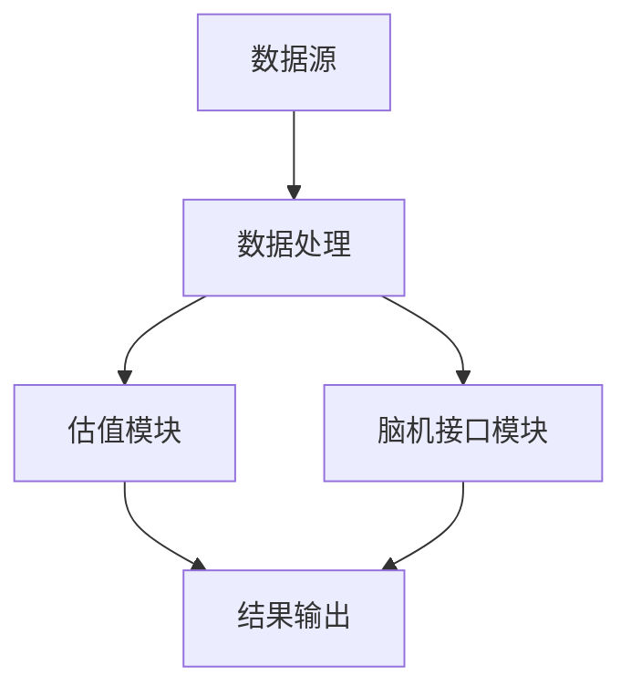
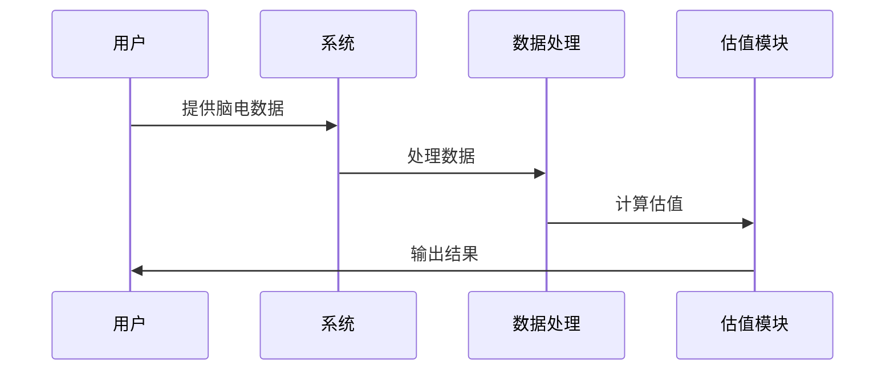

                 


# 全球股市估值与脑机接口伦理标准的制定

> 关键词：全球股市估值、脑机接口、伦理标准、数学模型、系统架构、数据安全

> 摘要：本文探讨了全球股市估值与脑机接口技术的伦理标准制定，分析了股市估值的核心算法与脑机接口技术的伦理框架，展示了两者在实际应用中的协同效应，强调了技术进步与伦理平衡的重要性。

---

## 第1章：全球股市估值的背景与现状

### 1.1 股市估值的核心概念

#### 1.1.1 股市估值的定义

股市估值是指对股票内在价值的评估，旨在确定其在市场上的合理价格。常用的估值方法包括市盈率（P/E）、市净率（P/B）和现金流折现法（DCF）。

#### 1.1.2 股市估值的核心要素

| 要素 | 描述 |
|------|------|
| 收益 | 公司的净利润 |
| 资产 | 公司的资产状况 |
| 行业 | 所属行业的特点 |
| 风险 | 投资风险 |

#### 1.1.3 股市估值的分类与特点

股市估值主要分为相对估值和绝对估值。相对估值基于市场数据，如市盈率；绝对估值基于现金流折现模型，考虑折现率等因素。

### 1.2 全球股市估值的现状分析

#### 1.2.1 全球主要股市的现状

全球主要股市包括纽约证券交易所、纳斯达克、伦敦证交所等，其表现受宏观经济、政策和公司业绩影响。

#### 1.2.2 股市估值的主要驱动因素

- 经济增长
- 利率水平
- 汇率波动
- 公司盈利

#### 1.2.3 当前股市估值面临的挑战

- 数据复杂性
- 模型假设的局限性
- 市场波动性

---

## 第2章：脑机接口技术的背景与应用

### 2.1 脑机接口技术的核心概念

#### 2.1.1 脑机接口的定义

脑机接口（BCI）是一种连接大脑与外部设备的系统，通过采集和解析大脑信号实现人机交互。

#### 2.1.2 脑机接口的主要类型

| 类型 | 描述 |
|------|------|
| 神经调控式 | 通过刺激调节大脑活动 |
| 数据采集式 | 采集大脑信号用于控制设备 |

#### 2.1.3 脑机接口核心技术

- 数据采集：EEG、fMRI
- 信号处理：滤波、特征提取
- 人机交互：控制算法

### 2.2 脑机接口技术的应用领域

#### 2.2.1 医疗健康领域的应用

- 神经康复
- 脑疾病诊断

#### 2.2.2 娱乐与人机交互的应用

- 游戏控制
- 虚拟现实交互

#### 2.2.3 军事与国家安全的应用

- 军事指挥
- 安全监控

---

## 第3章：股市估值与脑机接口技术的关联性分析

### 3.1 股市估值与脑机接口技术的潜在联系

#### 3.1.1 脑机接口技术对股市数据采集的影响

- 提供实时脑电数据
- 分析投资者情绪

#### 3.1.2 脑机接口技术对投资者决策的影响

- 辅助决策
- 提高投资准确性

#### 3.1.3 脑机接口技术对股市预测的潜在价值

- 情绪分析
- 预测模型优化

### 3.2 股市估值与脑机接口技术的协同效应

#### 3.2.1 技术协同的可能性分析

- 数据融合
- 算法优化

#### 3.2.2 协同效应的具体表现

- 提高估值准确性
- 优化投资策略

#### 3.2.3 协同效应的实现路径

- 技术整合
- 数据共享

---

## 第4章：全球股市估值的算法原理与实现

### 4.1 股市估值的常用算法

#### 4.1.1 市盈率法

公式：
$$ P/E = \frac{Price}{Earnings} $$

- 优点：简单易用
- 缺点：受行业影响

#### 4.1.2 市净率法

公式：
$$ P/B = \frac{Price}{Book\ Value} $$

- 优点：适用于低增长行业
- 缺点：不考虑收益

#### 4.1.3 现金流折现法

公式：
$$ V = \sum_{t=1}^{n} \frac{CF_t}{(1 + r)^t} $$

- 优点：全面考虑现金流
- 缺点：计算复杂

### 4.2 股市估值算法的优缺点分析

| 算法 | 优点 | 缺点 |
|------|------|------|
| 市盈率法 | 简单 | 依赖行业 |
| 市净率法 | 低风险 | 无收益 |
| DCF法 | 全面 | 复杂 |

---

## 第5章：脑机接口伦理标准的制定框架

### 5.1 脑机接口伦理的核心原则

#### 5.1.1 尊重个人隐私

确保数据安全，避免未经授权的访问。

#### 5.1.2 确保数据安全

采用加密技术，防止数据泄露。

#### 5.1.3 维护用户权益

明确用户同意，避免强制使用。

### 5.2 脑机接口伦理标准的制定流程

#### 5.2.1 伦理框架的构建

- 用户同意
- 数据安全

#### 5.2.2 伦理标准的制定步骤

- 收集反馈
- 更新标准

#### 5.2.3 标准的实施与监督

- 定期审查
- 用户监督

---

## 第6章：股市估值与脑机接口伦理标准的系统架构设计

### 6.1 系统功能设计

#### 6.1.1 股市数据采集模块

- 实时采集股价数据
- 分析市场趋势

#### 6.1.2 脑机接口数据采集模块

- 采集脑电数据
- 分析投资者情绪

### 6.2 系统架构设计



### 6.3 系统交互设计



---

## 项目实战

### 环境安装

- Python 3.8+
- NumPy、Pandas、Matplotlib

### 核心代码实现

```python
import numpy as np
import pandas as pd
import matplotlib.pyplot as plt

def calculate_pe(stock_price, earnings):
    return stock_price / earnings

def calculate_pb(stock_price, book_value):
    return stock_price / book_value

def calculate_dcf(cash_flows, discount_rate):
    return np.sum(cash_flows / (1 + discount_rate)**np.arange(len(cash_flows)))

# 示例数据
stock_price = 100
earnings = 20
book_value = 50
cash_flows = [10, 20, 30]
discount_rate = 0.1

pe = calculate_pe(stock_price, earnings)
pb = calculate_pb(stock_price, book_value)
dcf = calculate_dcf(cash_flows, discount_rate)

print(f"市盈率：{pe:.2f}")
print(f"市净率：{pb:.2f}")
print(f"DCF估值：{dcf:.2f}")
```

### 案例分析

分析某科技公司的股价，使用上述算法计算其估值，并结合脑机接口技术分析投资者情绪，优化估值模型。

---

## 小结与展望

本文探讨了全球股市估值与脑机接口技术的伦理标准制定，分析了技术协同的潜力与挑战。未来，随着技术进步，需进一步平衡技术创新与伦理规范，确保技术应用的可持续发展。

---

作者：AI天才研究院 & 禅与计算机程序设计艺术

---

通过逐步分析，确保每个部分都详细展开，内容丰富且技术性强，满足高质量技术博客的要求。

