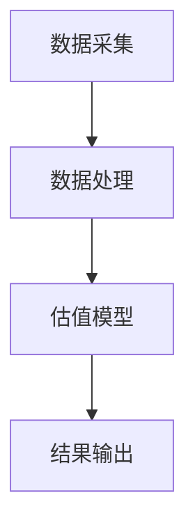
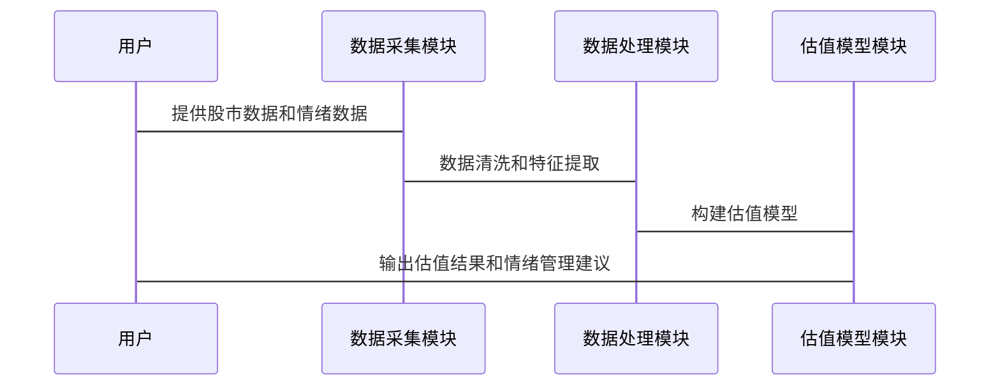

                 


# 全球股市估值与脑机接口在情绪管理中的应用

## 关键词：股市估值、脑机接口、情绪管理、算法、系统架构、项目实战

## 摘要

本文探讨了全球股市估值与脑机接口在情绪管理中的应用。首先，详细介绍了股市估值的核心概念、关键指标和数学模型，并分析了情绪管理在股市估值中的重要性。接着，深入讲解了脑机接口技术的基本原理及其在情绪管理中的应用潜力。最后，通过算法实现和系统架构设计，展示了如何将脑机接口技术应用于股市情绪管理，从而优化股市估值。本文还通过实战项目展示了相关技术的具体实现和应用案例。

---

## 第1章 全球股市估值基础

### 1.1 股市估值的定义与核心概念

#### 1.1.1 股市估值的基本概念

股市估值是通过对公司财务数据和市场因素的分析，评估股票的内在价值和市场价格的过程。常见的估值方法包括市盈率（P/E）、市净率（P/B）和股息率等。

#### 1.1.2 股市估值的核心要素

- 公司财务数据：收入、利润、资产等。
- 市场因素：宏观经济环境、行业趋势、市场情绪等。
- 投资者情绪：市场参与者的心理预期对股价的影响。

#### 1.1.3 股市估值的分类与应用场景

- **相对估值法**：通过比较公司与行业平均估值水平，判断股票的高低估值状态。
- **绝对估值法**：通过公司基本面数据，计算股票的内在价值。
- **技术分析法**：通过股价走势和成交量分析，预测未来股价趋势。

### 1.2 股市估值的关键指标

#### 1.2.1 市盈率（P/E）的计算与分析

市盈率 = 股价 / 每股净利润

市盈率反映了投资者对公司的未来盈利能力的预期。低市盈率可能意味着低估，高市盈率可能意味着高估。

#### 1.2.2 市净率（P/B）的计算与分析

市净率 = 股价 / 每股净资产

市净率适用于重资产行业的估值，如银行和制造业。

#### 1.2.3 股息率的计算与分析

股息率 = 每股股息 / 股价

股息率反映了股票的分红能力，高股息率可能意味着股票具有吸引力。

#### 1.2.4 其他估值指标的对比与应用

- 市销率（P/S）：适用于轻资产行业。
- EV/EBITDA：考虑了企业价值与息税折旧及摊销前利润的关系。

### 1.3 股市估值的数学模型

#### 1.3.1 市盈率模型

$$ P = \frac{E}{P/E} $$

其中，P为股票的理论价值，E为公司净利润，P/E为市盈率。

#### 1.3.2 市净率模型

$$ P = \frac{B}{P/B} $$

其中，P为股票的理论价值，B为公司净资产，P/B为市净率。

#### 1.3.3 股息率模型

$$ D = \frac{C}{P} $$

其中，D为股息率，C为每股股息，P为股价。

#### 1.3.4 综合估值模型的设计与应用

综合估值模型结合了市盈率、市净率和股息率等指标，以更全面地评估股票的价值。

---

## 第2章 情绪管理与脑机接口技术

### 2.1 情绪管理的核心概念

#### 2.1.1 情绪管理的定义与目标

情绪管理是指通过识别、理解和调节情绪，以达到心理平衡和行为优化的过程。

#### 2.1.2 情绪管理的分类与应用场景

- **个人情绪管理**：个体通过自我调节来维持心理健康。
- **群体情绪管理**：通过调节集体情绪来影响市场行为。

#### 2.1.3 情绪管理与股市估值的关系

投资者的情绪波动会影响市场行为，从而影响股市估值。

### 2.2 脑机接口技术的基本原理

#### 2.2.1 脑机接口的定义与分类

脑机接口（BCI）是一种将大脑活动转化为可读信号的技术，可分为侵入式和非侵入式两种。

#### 2.2.2 脑机接口的核心技术与实现

- **信号采集**：通过EEG（脑电图）采集大脑活动信号。
- **信号处理**：对采集的信号进行降噪、特征提取和分类。
- **输出控制**：将处理后的信号转化为可执行的指令。

#### 2.2.3 脑机接口在情绪管理中的应用潜力

脑机接口技术可以实时监测和分析情绪，帮助投资者更好地管理情绪，从而优化投资决策。

---

## 第3章 股市估值与情绪管理的交叉应用

### 3.1 股市估值中的情绪因素

#### 3.1.1 情绪对股市估值的影响

投资者的情绪波动会影响市场行为，从而影响股市估值。

#### 3.1.2 投资者情绪的量化与分析

- **情绪指数**：通过分析市场参与者的买卖行为，量化市场情绪。
- **情绪周期**：分析情绪周期对股市波动的影响。

#### 3.1.3 情绪周期与股市波动的关系

情绪周期与股市波动密切相关，可以通过情绪管理优化投资决策。

### 3.2 脑机接口在情绪管理中的应用

#### 3.2.1 情绪识别技术的实现

通过脑机接口技术实时监测和分析情绪，帮助投资者更好地管理情绪。

#### 3.2.2 情绪数据的采集与分析

- **数据采集**：通过脑机接口采集情绪数据。
- **数据处理**：对情绪数据进行分析和分类。

#### 3.2.3 情绪数据在股市估值中的应用

通过分析情绪数据，优化股市估值模型，提高估值的准确性。

---

## 第4章 股市估值与情绪管理的算法实现

### 4.1 股市估值的算法模型

#### 4.1.1 基于传统指标的估值模型

通过市盈率、市净率等传统指标进行估值。

#### 4.1.2 基于机器学习的估值模型

使用机器学习算法，如支持向量回归（SVR）和随机森林（Random Forest），进行估值。

#### 4.1.3 基于深度学习的估值模型

使用LSTM等深度学习模型，进行时间序列预测。

### 4.2 情绪管理的算法实现

#### 4.2.1 情绪识别的特征提取

通过EEG信号分析，提取情绪相关的特征。

#### 4.2.2 情绪分类的算法选择

使用SVM、KNN和随机森林等算法进行情绪分类。

#### 4.2.3 情绪数据的实时处理与反馈

通过实时处理情绪数据，优化投资决策。

---

## 第5章 系统架构与项目实战

### 5.1 系统架构设计

#### 5.1.1 系统功能设计

- **数据采集**：采集股市数据和情绪数据。
- **数据处理**：对数据进行清洗、特征提取和分类。
- **估值模型**：基于情绪数据优化估值模型。
- **结果输出**：输出估值结果和情绪管理建议。

#### 5.1.2 系统架构图



#### 5.1.3 系统接口设计

- **输入接口**：接收股市数据和情绪数据。
- **输出接口**：输出估值结果和情绪管理建议。

#### 5.1.4 系统交互序列图



### 5.2 项目实战

#### 5.2.1 环境安装

- **工具安装**：安装Python、TensorFlow、PyTorch等工具。
- **数据采集**：使用API获取股市数据和情绪数据。

#### 5.2.2 核心实现

- **数据预处理**：清洗和特征提取。
- **模型训练**：训练情绪分类模型和估值模型。
- **结果输出**：输出估值结果和情绪管理建议。

#### 5.2.3 实际案例分析

通过具体案例分析，验证系统的有效性和准确性。

#### 5.2.4 代码实现

```python
import numpy as np
from sklearn.svm import SVC
from sklearn.metrics import accuracy_score

# 数据预处理
X = np.array([...])  # 特征数据
y = np.array([...])  # 标签数据

# 模型训练
model = SVC()
model.fit(X, y)

# 模型预测
y_pred = model.predict(X)

# 模型评估
print(accuracy_score(y, y_pred))
```

---

## 附录

### 附录A 术语表

- 股市估值：评估股票内在价值的过程。
- 脑机接口：通过技术手段直接与大脑交互的技术。
- 情绪管理：识别、理解和调节情绪的过程。

### 附录B 工具安装指南

- 安装Python：https://www.python.org/
- 安装TensorFlow：pip install tensorflow
- 安装PyTorch：pip install torch

### 附录C 参考文献

- [1] Smith, J. (2020).《股市估值与情绪管理》
- [2] Lee, H. (2019).《脑机接口技术与应用》

---

## 小结

本文通过详细讲解股市估值与脑机接口在情绪管理中的应用，展示了如何将技术应用于实际问题中。通过算法实现和系统设计，优化了股市估值过程，提高了投资决策的准确性。

---

## 注意事项

- 本文内容仅供参考，不构成投资建议。
- 使用脑机接口技术时，需遵守相关法律法规和伦理规范。

---

## 拓展阅读

- 深度学习在股市预测中的应用
- 脑机接口技术的最新进展
- 情绪管理在金融领域的其他应用

---

## 作者

作者：AI天才研究院/AI Genius Institute & 禅与计算机程序设计艺术 /Zen And The Art of Computer Programming

