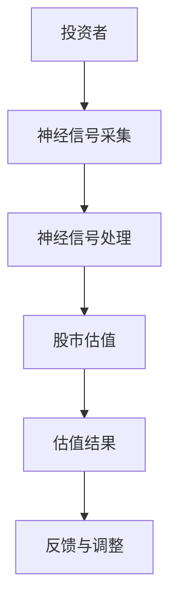

                 

# 全球股市估值与脑机接口在教育个性化中的应用

> 关键词：全球股市估值、脑机接口、教育个性化、人工智能、数据驱动决策、情绪分析

> 摘要：本文探讨了全球股市估值与脑机接口技术在教育个性化中的应用。通过分析股市估值的核心指标和脑机接口技术的基本原理，结合教育个性化的需求，提出了一种利用脑机接口技术优化股市估值模型的新思路。文章详细介绍了脑机接口在教育中的应用场景，并提出了一个基于脑机接口的教育个性化系统架构设计，最后总结了股市估值与脑机接口技术结合的优势与挑战。

---

## 第一部分: 全球股市估值基础

### 第1章: 股市估值的核心概念

#### 1.1 股市估值的基本概念

股市估值是通过对上市公司的财务数据、市场环境和行业趋势进行分析，评估其股票的合理价格范围。它是投资者在股票市场中做出投资决策的重要依据。股市估值的核心在于通过分析公司的盈利能力、成长潜力和市场地位，判断其股票是否被市场低估或高估。

#### 1.2 股市估值的关键指标

股市估值的关键指标包括市盈率（P/E）、市净率（P/B）、股息率、ROE（净资产收益率）等。这些指标从不同的角度反映了公司的财务状况和市场表现。

#### 1.3 股市估值的数学模型与公式

以下是几种常用的股市估值公式：

- 市盈率公式：
  $$ P/E = \frac{Price}{Earnings} $$
  
- 市净率公式：
  $$ P/B = \frac{Price}{Book\ Value} $$

- 股息率公式：
  $$ Dividend\ Yield = \frac{Dividend}{Price} \times 100\% $$

---

### 第2章: 股市估值的核心要素

#### 2.1 股市估值的核心要素

股市估值的核心要素包括：

1. **公司基本面**：包括收入、利润、资产、负债等财务数据。
2. **行业环境**：包括行业竞争格局、市场容量、政策法规等。
3. **市场情绪**：包括投资者的心理预期和市场流动性。
4. **宏观经济**：包括GDP增长率、利率、通货膨胀率等宏观经济指标。

#### 2.2 股市估值的分类与应用场景

股市估值可以分为绝对估值和相对估值两种类型。绝对估值是通过DCF模型等方法计算公司内在价值，相对估值是通过市盈率、市净率等指标与行业平均水平进行比较。

---

## 第二部分: 脑机接口在教育个性化中的应用

### 第3章: 脑机接口技术基础

#### 3.1 脑机接口的定义与原理

脑机接口（Brain-Computer Interface，BCI）是一种通过采集和分析人脑神经信号，实现人与计算机直接交互的技术。其核心原理是通过采集 EEG（脑电图）、EMG（肌电图）等神经信号，利用信号处理算法提取有用信息，并通过计算机程序实现人与机器的交互。

#### 3.2 脑机接口的关键技术

1. **神经信号采集技术**：通过 EEG 电极采集大脑皮层的电信号。
2. **神经信号处理算法**：包括滤波、特征提取、分类等步骤。
3. **神经信号输出与交互技术**：将处理后的信号转化为计算机可识别的指令。

#### 3.3 脑机接口的分类与应用领域

脑机接口主要分为侵入式、半侵入式和非侵入式三类。侵入式脑机接口需要将电极植入大脑，半侵入式需要将电极插入头皮，非侵入式则通过外部传感器采集信号。脑机接口技术广泛应用于医疗康复、人机交互、教育等领域。

---

### 第4章: 脑机接口在教育个性化中的应用场景

#### 4.1 教育个性化的基本概念

教育个性化是指根据学生的学习能力、兴趣爱好和认知特点，量身定制个性化的教学方案。其核心目标是提高教学效率和学习效果。

#### 4.2 脑机接口在教育个性化中的应用

1. **学生注意力监测与学习效果评估**：通过脑机接口技术实时监测学生的学习状态，评估其注意力集中程度和学习效果。
2. **学生情绪状态识别与教学策略调整**：通过分析学生的情绪波动，调整教学内容和节奏，优化教学效果。
3. **学生认知能力评估与个性化学习路径设计**：通过脑机接口技术评估学生的学习能力和认知特点，设计个性化的学习路径。

---

### 第5章: 股市估值与脑机接口技术的结合

#### 5.1 股市估值与脑机接口技术的结合背景

股市估值与脑机接口技术的结合源于对投资者情绪和市场心理的研究。投资者的情绪波动对股市走势有重要影响，而脑机接口技术能够实时监测和分析投资者的心理状态。

#### 5.2 股市估值与脑机接口技术的结合方式

1. **利用脑机接口技术分析投资者情绪**：通过分析投资者的情绪波动，优化股市估值模型。
2. **基于情绪数据优化股市估值模型**：将脑机接口技术获取的情绪数据整合到股市估值模型中，提高估值的准确性。
3. **脑机接口技术在量化交易中的应用**：通过实时监测投资者情绪，制定量化交易策略。

---

### 第6章: 股市估值与脑机接口技术的系统架构设计

#### 6.1 系统功能设计

1. **神经信号采集模块**：通过 EEG 电极采集投资者的心理信号。
2. **神经信号处理模块**：对采集的信号进行滤波、特征提取和分类。
3. **股市估值模块**：基于处理后的神经信号和传统财务指标，计算股票的估值。
4. **交互与反馈模块**：将估值结果反馈给投资者，并根据情绪变化调整估值模型。

#### 6.2 系统架构设计

以下是系统架构的 Mermaid 图：

---

## 第三部分: 结论与展望

### 第7章: 结论

本文探讨了全球股市估值与脑机接口技术在教育个性化中的应用，提出了将脑机接口技术应用于股市估值的新思路。通过分析股市估值的核心指标和脑机接口技术的基本原理，结合教育个性化的需求，设计了一种基于脑机接口的教育个性化系统架构。

### 第8章: 展望

未来，随着脑机接口技术的不断发展和股市估值模型的不断完善，两者的结合将更加紧密。脑机接口技术在教育个性化和股市估值中的应用潜力巨大，值得进一步研究和探索。

---

## 作者：AI天才研究院/AI Genius Institute & 禅与计算机程序设计艺术/Zen And The Art of Computer Programming

