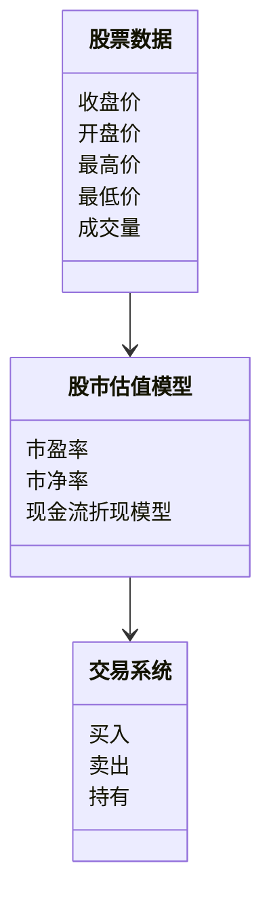
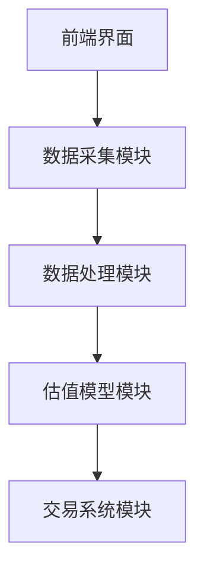
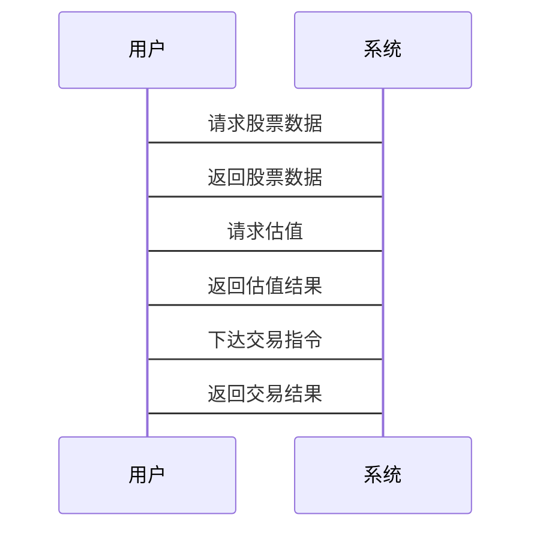
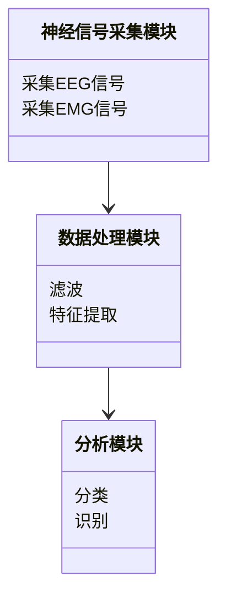
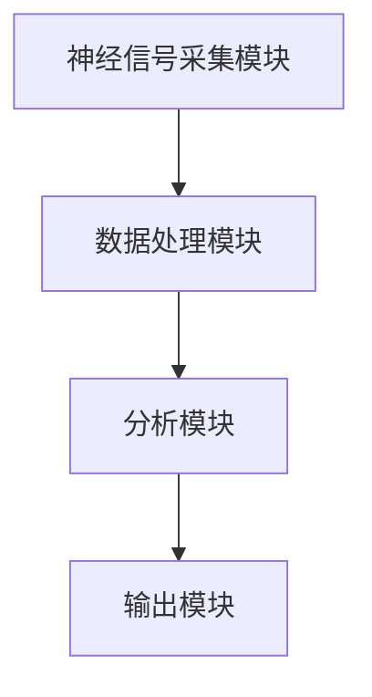
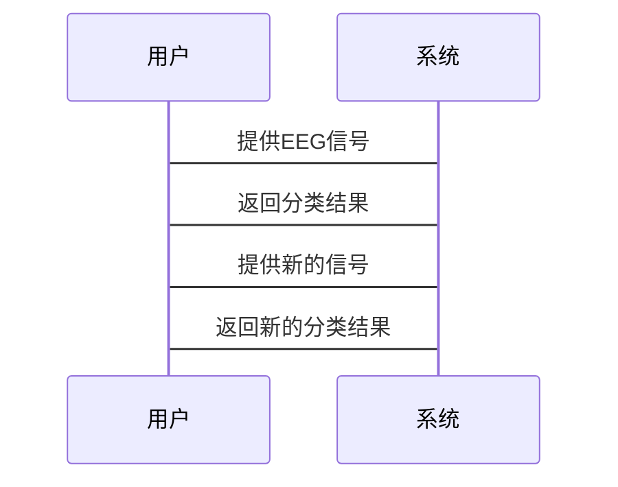

                 


# 全球股市估值与脑机接口在认知增强中的应用

> **关键词**：全球股市估值、脑机接口、认知增强、人工智能、大数据分析、金融建模、神经科学  
> 
> **摘要**：本文探讨了全球股市估值与脑机接口在认知增强中的应用，分析了股市估值的核心概念、算法原理以及脑机接口的技术基础、应用场景。通过结合这两者，文章揭示了如何利用人工智能和神经科学提升股市估值的准确性和效率，同时探讨了脑机接口在认知增强中的潜力和未来发展方向。

---

## 第一部分: 全球股市估值与脑机接口概述

### 第1章: 全球股市估值概述

#### 1.1 股市估值的基本概念

##### 1.1.1 股市估值的定义
股市估值是指通过对上市公司的财务数据、市场环境、行业趋势等多方面因素进行分析，估算其股票的合理价格范围。常见的估值方法包括市盈率（P/E）、市净率（P/B）、现金流折现模型（DCF）等。

##### 1.1.2 股市估值的核心要素
- **公司基本面**：包括收入、利润、资产、负债等。
- **市场环境**：宏观经济指标、行业趋势、政策变化等。
- **市场情绪**：投资者情绪、市场流动性等。

##### 1.1.3 股市估值的分类与特点
股市估值可以分为基本面估值和市场估值。基本面估值注重公司的内在价值，而市场估值则关注市场的实际交易价格。两者结合可以更全面地评估股票的价值。

#### 1.2 股市估值的技术演进

##### 1.2.1 传统估值方法
传统的估值方法主要包括：
- **市盈率法**：基于公司的净利润与股价的比值。
- **市净率法**：基于公司的净资产与股价的比值。
- **股息率法**：基于股息与股价的比值。

##### 1.2.2 现代量化估值方法
现代量化估值方法利用大数据和人工智能技术，通过算法分析市场数据，预测股票价格走势。例如：
- **机器学习模型**：使用回归分析、支持向量机（SVM）等算法。
- **深度学习模型**：使用LSTM（长短期记忆网络）预测股票价格。

##### 1.2.3 人工智能在股市估值中的应用
人工智能通过分析海量数据，发现传统方法难以察觉的市场规律，从而提高估值的准确性。例如，利用自然语言处理（NLP）分析新闻和社交媒体数据，预测市场情绪。

### 第2章: 脑机接口在认知增强中的应用

#### 2.1 脑机接口的基本概念

##### 2.1.1 脑机接口的定义
脑机接口（Brain-Computer Interface，BCI）是一种连接大脑与外部设备的系统，能够将大脑的神经信号转化为指令，控制设备的运行。

##### 2.1.2 脑机接口的工作原理
脑机接口通过采集大脑的电活动（如EEG信号），将其转化为数字信号，再通过算法分析，生成控制指令。

##### 2.1.3 脑机接口的应用领域
- **医疗领域**：帮助瘫痪患者恢复部分行动能力。
- **教育领域**：辅助学生集中注意力。
- **娱乐领域**：通过脑电波控制游戏。

#### 2.2 脑机接口在认知增强中的潜力

##### 2.2.1 认知增强的定义
认知增强是指通过技术手段提升人类的认知能力，包括记忆、注意力、决策能力等。

##### 2.2.2 脑机接口如何实现认知增强
通过实时监测大脑活动，脑机接口可以识别用户的注意力状态，并提供相应的反馈，帮助用户提高注意力和学习效率。

##### 2.2.3 脑机接口在认知增强中的优势
- **实时反馈**：用户可以实时了解自己的认知状态。
- **个性化优化**：通过数据分析，为用户提供个性化的增强方案。

### 第3章: 全球股市估值与脑机接口的结合

#### 3.1 股市估值与脑机接口的联系

##### 3.1.1 股市数据的特征分析
股市数据具有高度的不确定性和复杂性，需要通过多种技术手段进行分析。

##### 3.1.2 脑机接口在数据处理中的应用
脑机接口可以通过分析交易者的脑电活动，预测其决策行为，从而优化交易策略。

##### 3.1.3 脑机接口如何提升股市估值的准确性
通过结合脑机接口和大数据分析，可以更准确地预测市场走势，提高估值的准确性。

#### 3.2 股市估值与脑机接口的协同效应

##### 3.2.1 数据驱动的股市估值模型
通过大数据分析和机器学习，构建数据驱动的估值模型。

##### 3.2.2 脑机接口在模型优化中的作用
脑机接口可以通过分析交易者的心理状态，优化估值模型的参数。

##### 3.2.3 股市估值与脑机接口结合的未来趋势
随着人工智能和脑机接口技术的进步，两者结合将更加紧密，为股市估值提供更强大的技术支持。

---

## 第二部分: 股市估值的核心概念与算法原理

### 第4章: 股市估值的核心概念

#### 4.1 股市估值的关键因素

##### 4.1.1 股票的基本面分析
基本面分析包括对公司的财务状况、行业地位、管理团队等的分析。

##### 4.1.2 市场情绪的影响
市场情绪可以通过分析新闻、社交媒体数据等来预测。

##### 4.1.3 宏观经济指标的作用
宏观经济指标如GDP、利率、通货膨胀率等对股市估值有重要影响。

#### 4.2 股市估值的核心模型

##### 4.2.1 市盈率模型
市盈率（P/E）= 股价 / 每股净利润。

##### 4.2.2 市净率模型
市净率（P/B）= 股价 / 每股净资产。

##### 4.2.3 现金流折现模型
现金流折现模型（DCF）通过预测未来现金流的现值来估算公司价值。

### 第5章: 脑机接口的核心算法

#### 5.1 脑机接口的核心算法

##### 5.1.1 基于EEG的信号处理算法
通过EEG信号处理，提取有用的神经特征。

##### 5.1.2 基于机器学习的分类算法
使用支持向量机（SVM）等算法对EEG信号进行分类。

##### 5.1.3 基于深度学习的模型优化算法
通过深度学习模型优化脑机接口的分类性能。

#### 5.2 股市估值中的算法应用

##### 5.2.1 机器学习在股市预测中的应用
使用回归分析、随机森林等算法预测股票价格。

##### 5.2.2 深度学习在股市估值中的应用
通过LSTM网络分析时间序列数据，预测股票价格。

##### 5.2.3 脑机接口在股市数据处理中的应用
通过脑机接口分析交易者的心理状态，优化交易策略。

---

## 第三部分: 算法原理与系统架构设计

### 第6章: 股市估值的算法原理

#### 6.1 机器学习在股市预测中的应用

##### 6.1.1 算法原理
通过训练数据，机器学习模型可以预测股票价格走势。

##### 6.1.2 Python代码实现
```python
import pandas as pd
from sklearn.linear_model import LinearRegression

# 加载数据
data = pd.read_csv('stock.csv')

# 训练模型
model = LinearRegression()
model.fit(data[['open', 'high', 'low']], data['close'])

# 预测价格
predicted_price = model.predict([[data.iloc[-1]['open'], data.iloc[-1]['high'], data.iloc[-1]['low']]])
```

#### 6.2 深度学习在股市估值中的应用

##### 6.2.1 算法原理
通过LSTM网络分析时间序列数据，预测股票价格。

##### 6.2.2 Python代码实现
```python
import tensorflow as tf
from tensorflow.keras.layers import LSTM, Dense

# 构建模型
model = tf.keras.Sequential([
    LSTM(64, input_shape=(1, 1)),
    Dense(1)
])

# 编译模型
model.compile(optimizer='adam', loss='mean_squared_error')

# 训练模型
model.fit(x_train, y_train, epochs=100, batch_size=32)
```

#### 6.3 脑机接口在股市数据处理中的应用

##### 6.3.1 算法原理
通过分析EEG信号，预测交易者的决策行为。

##### 6.3.2 Python代码实现
```python
import numpy as np
from sklearn.svm import SVC

# 加载EEG数据
eeg_data = np.load('eeg.npy')

# 训练模型
model = SVC()
model.fit(eeg_data[:, :-1], eeg_data[:, -1])

# 预测决策
predicted_decision = model.predict(new_eeg_data)
```

### 第7章: 脑机接口的算法实现

#### 7.1 基于EEG的信号处理算法

##### 7.1.1 算法原理
通过滤波和特征提取，处理EEG信号。

##### 7.1.2 Python代码实现
```python
import numpy as np
from scipy.signal import butterworth

# 加载EEG信号
eeg_signal = np.load('eeg_signal.npy')

# 应用 butterworth 滤波器
filtered_signal = butterworth(eeg_signal, cutoff=50, order=2)
```

#### 7.2 基于机器学习的分类算法

##### 7.2.1 算法原理
通过支持向量机（SVM）对EEG信号进行分类。

##### 7.2.2 Python代码实现
```python
from sklearn import svm

# 加载特征数据
features = np.load('features.npy')

# 训练SVM模型
model = svm.SVC()
model.fit(features, labels)

# 预测类别
predicted_class = model.predict(new_features)
```

#### 7.3 基于深度学习的模型优化算法

##### 7.3.1 算法原理
通过深度学习模型优化脑机接口的分类性能。

##### 7.3.2 Python代码实现
```python
import tensorflow as tf
from tensorflow.keras.layers import Dense, Dropout

# 构建模型
model = tf.keras.Sequential([
    Dense(64, activation='relu'),
    Dropout(0.5),
    Dense(10, activation='softmax')
])

# 编译模型
model.compile(optimizer='adam', loss='sparse_categorical_crossentropy', metrics=['accuracy'])

# 训练模型
model.fit(x_train, y_train, epochs=100, batch_size=32)
```

---

## 第四部分: 系统架构设计与项目实战

### 第8章: 股市估值的系统架构设计

#### 8.1 系统功能设计

##### 8.1.1 领域模型设计


#### 8.2 系统架构设计

##### 8.2.1 系统架构图


#### 8.3 系统接口设计

##### 8.3.1 API接口设计
- `/api/stock_data`：获取股票数据
- `/api/valuation`：获取股票估值
- `/api/trade`：执行交易指令

#### 8.4 系统交互设计

##### 8.4.1 交互流程图


### 第9章: 脑机接口的系统架构设计

#### 9.1 脑机接口的系统功能设计

##### 9.1.1 领域模型设计


#### 9.2 脑机接口的系统架构设计

##### 9.2.1 系统架构图


#### 9.3 系统接口设计

##### 9.3.1 API接口设计
- `/api/eeg_data`：获取EEG信号
- `/api/feature`：获取特征数据
- `/api/classification`：进行分类分析

#### 9.4 系统交互设计

##### 9.4.1 交互流程图


### 第10章: 项目实战

#### 10.1 环境安装

##### 10.1.1 安装Python环境
```bash
python -m pip install --upgrade pip
pip install numpy pandas scikit-learn tensorflow
```

##### 10.1.2 安装脑机接口工具包
```bash
pip install mne scipy
```

#### 10.2 系统核心实现

##### 10.2.1 股市估值模型实现
```python
import pandas as pd
from sklearn.linear_model import LinearRegression

# 加载数据
data = pd.read_csv('stock.csv')

# 训练模型
model = LinearRegression()
model.fit(data[['open', 'high', 'low']], data['close'])

# 预测价格
predicted_price = model.predict([[data.iloc[-1]['open'], data.iloc[-1]['high'], data.iloc[-1]['low']])
```

##### 10.2.2 脑机接口算法实现
```python
import numpy as np
from scipy.signal import butterworth

# 加载EEG数据
eeg_data = np.load('eeg.npy')

# 应用 butterworth 滤波器
filtered_signal = butterworth(eeg_data, cutoff=50, order=2)
```

#### 10.3 项目小结

##### 10.3.1 项目总结
通过结合股市估值和脑机接口技术，可以提高股市估值的准确性和交易的智能化水平。

##### 10.3.2 项目意义
本文的研究为未来股市估值和认知增强技术的结合提供了理论和实践基础。

---

## 第五部分: 最佳实践与展望

### 第11章: 最佳实践

#### 11.1 技术实现中的注意事项

##### 11.1.1 数据质量的重要性
数据的质量直接影响模型的性能，需要确保数据的完整性和准确性。

##### 11.1.2 模型的可解释性
在实际应用中，模型的可解释性非常重要，尤其是在金融领域。

##### 11.1.3 系统的实时性
股市交易需要实时性，系统必须能够快速响应。

#### 11.2 拓展阅读

##### 11.2.1 推荐书籍
- 《股票投资的数学分析》
- 《脑机接口：从原理到应用》

##### 11.2.2 推荐论文
- "Deep Learning for Stock Market Prediction"
- "Brain-Computer Interfaces for Financial Applications"

### 第12章: 小结

#### 12.1 项目总结
本文详细探讨了全球股市估值与脑机接口在认知增强中的应用，分析了两者的核心概念、算法原理和系统架构设计，并通过项目实战展示了技术实现的过程。

#### 12.2 未来展望
随着人工智能和脑机接口技术的不断发展，两者结合的应用将更加广泛，为金融领域带来更大的变革。

---

## 作者

**作者：AI天才研究院/AI Genius Institute & 禅与计算机程序设计艺术 /Zen And The Art of Computer Programming**

---

**注**：本文为技术博客文章，旨在通过清晰的逻辑和详细的分析，帮助读者理解全球股市估值与脑机接口在认知增强中的应用。文章内容基于现有技术进行分析，未来的技术发展可能会进一步提升相关应用的效果和范围。

