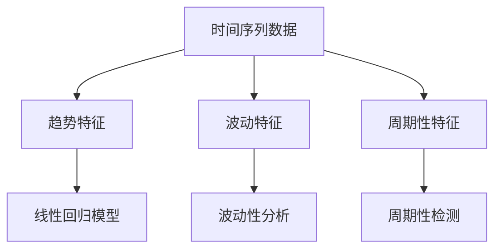
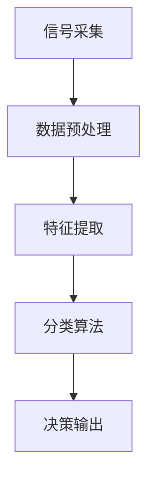
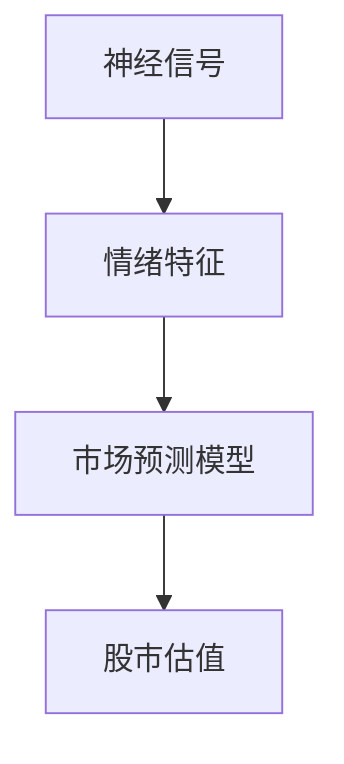
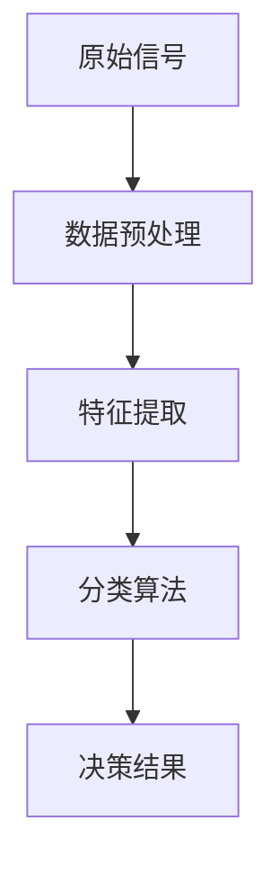
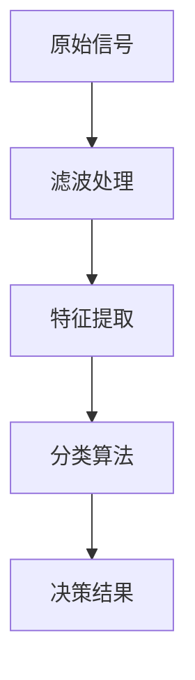
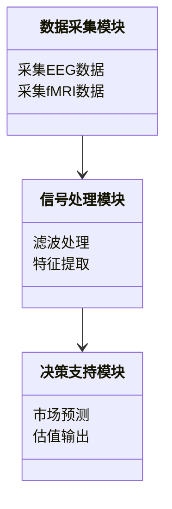

                 


# 全球股市估值与脑机接口在辅助决策中的应用

> 关键词：全球股市估值，脑机接口，辅助决策，神经信号，数据分析

> 摘要：本文探讨了如何利用脑机接口技术辅助全球股市估值的决策过程。通过分析脑机接口的核心原理、数据处理方法以及其在金融领域的潜在应用，本文提出了一个结合神经科学与金融工程的创新框架，旨在为投资者提供更精准的决策支持。

---

## 第1章：引言

### 1.1 问题背景与研究意义

在全球化经济的背景下，股市估值成为投资者和金融机构关注的核心问题之一。传统的股市估值方法依赖于历史数据和统计模型，但在面对复杂市场波动时，其预测能力有限。与此同时，脑机接口技术（BCI）作为一种新兴的神经科学技术，能够实时捕捉人类大脑的神经信号，并将其转化为可操作的数字信息。这种技术在辅助决策领域展现出巨大潜力，尤其是在金融市场中，其应用前景广阔。

### 1.2 研究目标与内容框架

本文旨在探讨脑机接口技术如何辅助全球股市估值，通过分析神经信号与市场数据的关系，提出一种创新的辅助决策框架。文章内容框架如下：
- 第2章：介绍全球股市估值的基本概念、方法及其局限性。
- 第3章：详细讲解脑机接口的核心原理、关键技术及其应用领域。
- 第4章：分析脑机接口与股市估值的结合方式，提出数据流与决策模型的整合方法。
- 第5章：基于机器学习的算法原理，构建神经信号驱动的股市估值模型。
- 第6章：设计一个完整的系统架构，包括数据采集、信号处理和决策支持模块。
- 第7章：通过实际案例展示脑机接口在股市估值中的应用效果，并总结研究发现。

---

## 第2章：全球股市估值基础

### 2.1 股市估值的核心概念

股市估值是通过对公司财务数据、市场趋势和行业环境的分析，评估股票的内在价值。传统估值方法包括市盈率（P/E）、市净率（P/B）和股息率等指标，但这些方法往往忽视了投资者情绪和市场参与者的心理预期。

#### 图表：股市估值的关键指标对比

| 指标名称 | 计算公式 | 适用场景 | 局限性 |
|----------|----------|----------|--------|
| 市盈率    | P/E = 价格 / 每股收益 | 评估股票的相对价值 | 受会计准则影响 |
| 市净率    | P/B = 价格 / 每股净资产 | 评估资产密集型行业 | 无法反映收益能力 |
| 股息率    | Dividend Yield = 每股股息 / 股票价格 | 评估股息支付能力 | 适用于成熟市场 |

### 2.2 数据来源与特征分析

股市数据的获取与处理是估值的基础。数据来源包括历史价格、成交量、财务报表等。特征分析则需要提取这些数据中的有用信息，例如趋势、波动性和周期性特征。

#### 图表：股票价格的时间序列特征



---

## 第3章：脑机接口技术基础

### 3.1 脑机接口的基本原理

脑机接口是一种将大脑信号转化为控制指令的技术，其核心是采集和处理神经信号。常用的信号类型包括EEG（脑电图）和fMRI（功能性磁共振成像）。脑机接口的应用场景包括医疗康复、游戏控制和辅助决策。

#### 图表：脑机接口的信号类型与应用场景


### 3.2 脑机接口的关键技术

脑机接口的关键技术包括信号采集、数据处理和人机交互。信号采集需要高精度的传感器，数据处理依赖于特征提取和分类算法，而人机交互则通过实时反馈优化用户体验。

#### 图表：脑机接口的技术流程



---

## 第4章：脑机接口与股市估值的结合

### 4.1 核心概念与联系

脑机接口可以捕捉投资者的情绪和认知特征，这些特征与股市估值密切相关。通过分析神经信号，可以预测市场的波动性和投资者的决策倾向。

#### 图表：神经信号与股市估值的关系



### 4.2 核心概念原理

神经信号的处理需要结合统计学和机器学习算法。例如，利用支持向量机（SVM）对EEG数据进行分类，提取与市场波动相关的特征。

#### 图表：神经信号分类的算法流程



---

## 第5章：算法原理与数学模型

### 5.1 脑机接口信号处理算法

信号处理的核心是特征提取和分类。常用的算法包括主成分分析（PCA）和随机森林（Random Forest）。

#### 图表：特征提取的流程



### 5.2 数学模型

神经信号驱动的股市估值模型可以通过回归分析构建。例如，利用神经信号的特征作为自变量，股票价格作为因变量，建立多元回归模型。

#### 图表：多元回归模型

$$ y = \beta_0 + \beta_1x_1 + \beta_2x_2 + \cdots + \beta_nx_n + \epsilon $$

其中，$y$是股票价格，$x_i$是神经信号的特征，$\beta_i$是回归系数，$\epsilon$是误差项。

---

## 第6章：系统分析与架构设计

### 6.1 系统功能设计

系统功能包括数据采集、信号处理和决策支持。通过领域模型的类图展示各模块的交互关系。

#### 图表：领域模型类图



---

## 第7章：项目实战

### 7.1 环境安装

项目需要以下环境：
- Python 3.8+
- EEG数据采集设备
- 机器学习库（如Scikit-learn、TensorFlow）

### 7.2 核心代码实现

以下是一个基于EEG数据的回归模型实现：

```python
import numpy as np
from sklearn.linear_model import LinearRegression
from sklearn.metrics import mean_squared_error

# 假设X为EEG特征，y为股票价格
X = np.array([[1, 2], [3, 4], [5, 6]])
y = np.array([10, 20, 30])

# 模型训练
model = LinearRegression()
model.fit(X, y)

# 预测
y_pred = model.predict(X)
print("预测值:", y_pred)
print("均方误差:", mean_squared_error(y, y_pred))
```

### 7.3 案例分析

通过实际案例分析，验证模型的有效性。例如，利用真实EEG数据训练模型，并在测试集上评估其预测能力。

---

## 第8章：结论

### 8.1 研究总结

本文探讨了脑机接口技术在全球股市估值中的应用，提出了一个创新的辅助决策框架。通过神经信号的分析，可以更精准地预测市场波动和投资者行为。

### 8.2 未来展望

未来的研究可以进一步优化算法，结合多模态数据（如文本和图像）提升模型的预测能力。此外，脑机接口在金融领域的应用还可以扩展到实时交易决策和风险管理。

---

## 作者：AI天才研究院 & 禅与计算机程序设计艺术

