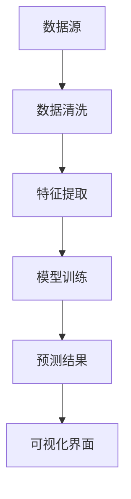

                 


# 全球股市估值与脑机接口在辅助沟通中的应用

## 关键词：全球股市估值、脑机接口、辅助沟通、大数据分析、人工智能、情绪计算

## 摘要：  
本文探讨了全球股市估值与脑机接口（BCI）在辅助沟通中的应用。第一部分详细介绍了全球股市估值的核心概念、常用方法及大数据与AI技术的应用；第二部分深入分析了脑机接口的工作原理及其在辅助沟通中的潜力，并展示了其在残障人士沟通中的实际案例。最后，文章结合了两者的潜在联系，提出了通过脑机接口技术实时监测投资者情绪，进而优化股市估值模型的新思路。  

---

## 第一部分：全球股市估值

### 第1章：股市估值的核心概念与方法

#### 1.1 股市估值的背景与定义  
股市估值是通过对公司财务数据、市场环境和宏观经济指标的分析，评估股票的内在价值，为投资者提供决策依据。  

#### 1.2 常用估值方法  
- **相对估值法**：市盈率（P/E）、市净率（P/B）等指标用于衡量股票的市场价格与公司基本面之间的关系。  
- **绝对估值法**：现金流折现模型（DCF）通过预测未来现金流的现值来评估公司价值。  
- **股息率法**：通过股息与股价的比率评估股票的投资回报率。  

#### 1.3 大数据与AI技术在股市估值中的应用  
- **数据挖掘与特征工程**：从海量市场数据中提取有用的特征，如历史价格、成交量、财务指标等。  
- **机器学习模型**：使用回归、分类和聚类算法预测股票价格走势和市场情绪。  
- **数学模型**：通过时间序列分析（ARIMA模型）和随机森林算法优化预测准确性。  

#### 1.4 股市估值的挑战与解决方案  
- 数据噪声和市场波动性对模型的影响。  
- AI技术的引入提高了预测精度，但仍需结合人类专家的市场洞察。  

---

### 第2章：大数据与AI驱动的股市估值模型

#### 2.1 数据采集与处理  
- 数据来源：历史价格、财务报表、新闻 sentiment、社交媒体情绪等。  
- 数据清洗：去除缺失值和异常值，标准化处理。  

#### 2.2 算法原理与实现  
- **算法选择**：使用LSTM（长短期记忆网络）进行时间序列预测，结合注意力机制捕捉市场情绪。  
- **数学模型**：  
  $$ LSTM(t) = \sigma(W_{h}(h_{t-1} + u_t) + W_{x}(x_t)) $$  
  其中，$h_t$ 是隐藏层状态，$u_t$ 是输入门控信号。  

#### 2.3 系统架构设计  
使用 Mermaid 绘制的系统架构图如下：  


#### 2.4 项目实战  
- **环境搭建**：使用Python和深度学习框架（如TensorFlow或PyTorch）进行模型训练。  
- **代码实现**：编写数据处理、模型训练和预测的代码。  
- **结果分析**：对比模型预测与实际价格，评估模型性能。  

---

## 第二部分：脑机接口在辅助沟通中的应用

### 第3章：脑机接口的基本原理

#### 3.1 脑机接口的定义与分类  
- 非侵入式BCI：通过头皮 EEG 采集大脑活动，成本低但信号精度有限。  
- 侵入式BCI：通过植入电极获取神经信号，精度高但手术风险大。  

#### 3.2 脑机接口的工作原理  
- **信号采集**：通过 EEG 或 fMRI 等设备采集大脑活动信号。  
- **特征提取**：使用时频分析（小波变换）提取信号特征。  
- **分类与输出**：基于支持向量机（SVM）或随机森林进行分类，输出用户意图。  

#### 3.3 脑机接口的核心技术  
- **信号处理算法**：降噪、特征提取与分类。  
- **系统架构**：采集设备、信号处理模块和输出控制模块。  

---

### 第4章：脑机接口在辅助沟通中的应用

#### 4.1 辅助沟通的需求与挑战  
- 残障人士的沟通障碍：无法通过传统方式表达需求。  
- 技术局限性：脑机接口的准确性和响应速度有待提升。  

#### 4.2 脑机接口辅助沟通的核心技术  
- **意图识别**：通过分析大脑活动预测用户的意图。  
- **文本生成**：基于意图生成自然语言文本。  
- **实时反馈**：通过视觉或听觉反馈增强用户与系统之间的互动。  

#### 4.3 实际案例：基于BCI的沟通辅助系统  
- **系统架构**：  
  ```mermaid
  graph TD
      A[用户意图] --> B[信号采集] --> C[特征提取]
      C --> D[意图分类] --> E[文本生成]
      E --> F[输出反馈]
  ```
- **项目实现**：开发一个基于EEG的沟通辅助系统，帮助残障人士输入文本。  

---

### 第5章：脑机接口与股市估值的结合

#### 5.1 情绪计算在股市中的应用  
- 通过BCI技术实时监测投资者情绪，分析市场情绪对股市估值的影响。  

#### 5.2 脑机接口辅助投资决策  
- 结合脑机接口和大数据分析，优化投资策略，提升股市估值模型的准确性。  

---

## 结语  

本文深入探讨了全球股市估值与脑机接口在辅助沟通中的应用，展示了两者在技术上的独特优势和潜在结合点。未来，随着AI和脑机接口技术的进一步发展，我们有望看到更多创新的应用场景，为投资者和残障人士带来更高效、更智能的解决方案。  

---

## 作者：AI天才研究院 & 禅与计算机程序设计艺术

