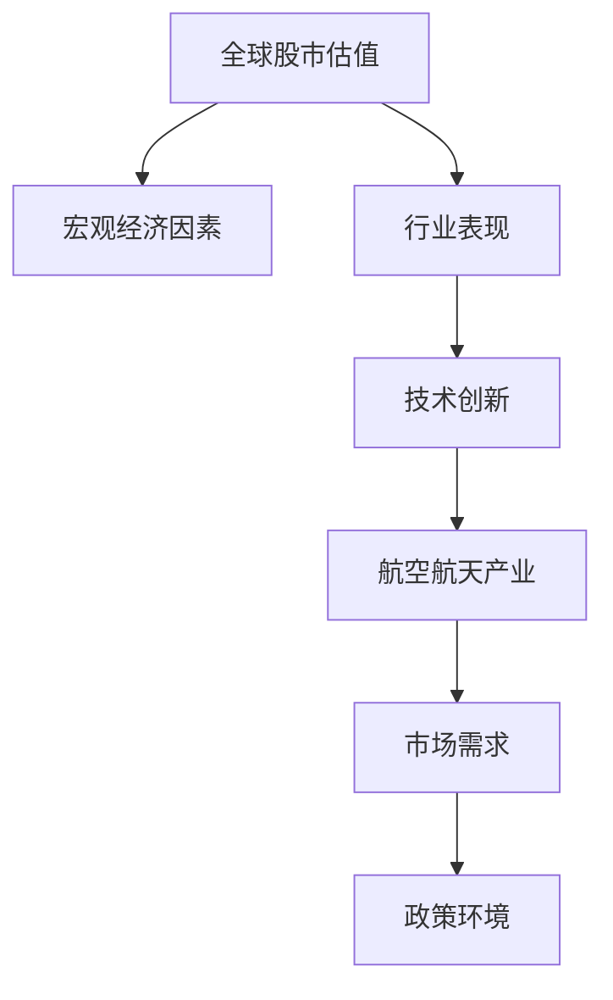

                 

# 全球股市估值与航空航天产业的关联

---

## 关键词
全球股市估值、航空航天产业、经济关联、投资分析、市场动态、技术驱动

---

## 摘要
本文探讨了全球股市估值与航空航天产业之间的关联性，分析了影响股市估值波动的关键因素，以及航空航天产业如何通过技术进步、政策变化和市场动态影响全球股市。文章从背景介绍、关联机制、市场分析、技术分析、算法原理、系统设计和项目实战等多维度展开，深入剖析了两者之间的复杂关系。通过结合实际案例和数学模型，本文为投资者和研究者提供了全面的分析框架和实用的工具。

---

# 第1章 全球股市估值与航空航天产业的关联概述

## 1.1 背景介绍

### 1.1.1 全球股市估值的定义与意义
全球股市估值是指对全球股票市场整体价值的评估，通常通过市盈率（P/E）、市净率（P/B）等指标衡量。股市估值的波动受到宏观经济、行业动态和投资者情绪等多种因素的影响。理解股市估值的变化对投资者和政策制定者具有重要意义。

### 1.1.2 航空航天产业的定义与特征
航空航天产业涵盖民用航空、军用航空和航天技术等领域，具有高技术门槛、高投入和长周期的特点。该产业对国家经济和科技实力有显著影响，同时也是全球贸易和国际合作的重要领域。

### 1.1.3 问题提出的背景与现实意义
近年来，航空航天产业的快速发展和技术突破（如无人机、卫星互联网和新一代飞机技术）引发了对其对股市估值影响的关注。与此同时，全球经济波动和地缘政治风险也增加了研究的必要性。

## 1.2 核心概念与问题描述

### 1.2.1 全球股市估值的核心要素
- 市场整体表现：指数波动、成交量变化。
- 行业表现：各行业股票的涨跌趋势。
- 宏观经济指标：GDP、利率、通货膨胀。

### 1.2.2 航空航天产业的核心要素
- 技术创新：新材料、航空发动机、航天器技术。
- 市场需求：客运、货运、国防需求。
- 政策环境：政府补贴、贸易政策、国际法规。

### 1.2.3 问题的边界与外延
本文研究范围限定于全球主要股票市场和航空航天产业，重点关注技术进步、政策变化和经济波动对股市估值的影响。

## 1.3 核心概念的结构与组成

### 1.3.1 股市估值的构成要素
| 要素 | 描述 |
|------|------|
| 市盈率 | 每股价格与每股收益的比率 |
| 市净率 | 每股价格与每股净资产的比率 |
| 市值 | 总市值与GDP的比率 |

### 1.3.2 航空航天产业的构成要素
| 要素 | 描述 |
|------|------|
| 技术创新 | 新材料、航空发动机 |
| 市场需求 | 民用航空、国防需求 |
| 政策环境 | 补贴、税收优惠 |

### 1.3.3 两者的关联结构

---

# 第2章 全球股市估值与航空航天产业的关联机制

## 2.1 关联机制的定义与分类

### 2.1.1 股市估值波动与产业周期的关系
股市估值受航空航天产业周期的影响，例如行业扩张期和衰退期对股价的影响。

### 2.1.2 航空航天产业对股市估值的影响路径
通过技术创新和市场需求变化影响股价。

### 2.1.3 两者关联的动态特征
周期性波动、技术驱动和政策驱动。

## 2.2 关联机制的影响因素

### 2.2.1 宏观经济因素
GDP增长率、利率水平对股市估值的影响。

### 2.2.2 产业政策因素
政府补贴和税收优惠对航空航天产业的影响。

### 2.2.3 技术创新因素
新材料和发动机技术进步对股价的推动作用。

### 2.2.4 市场预期因素
投资者对未来的预期对股价的影响。

## 2.3 关联机制的传导路径

### 2.3.1 产业周期对股市估值的影响
行业扩张期带来股价上涨，衰退期则反之。

### 2.3.2 技术创新对股市估值的影响
技术创新提升企业竞争力，推动股价上升。

### 2.3.3 宏观经济波动对股市估值的影响
经济下行可能导致股价下跌。

---

# 第3章 航空航天产业的全球市场分析

## 3.1 全球航空航天市场的现状

### 3.1.1 市场规模与结构
全球航空航天市场规模庞大，民用航空占据主导地位。

### 3.1.2 主要国家与地区市场分布
美国、欧洲和亚洲是主要市场，具有不同的政策和产业结构。

### 3.1.3 市场增长的驱动因素
技术创新、全球化和政策支持推动市场增长。

## 3.2 航空航天产业的技术趋势

### 3.2.1 新材料的应用
碳纤维材料在飞机制造中的应用。

### 3.2.2 航空发动机技术的进步
高效率、低排放发动机的开发。

### 3.2.3 航天技术的发展
卫星互联网和深空探测技术的进步。

## 3.3 技术创新对股市估值的影响

### 3.3.1 技术创新对股价的直接影响
技术创新提升企业竞争力，推动股价上升。

### 3.3.2 技术创新对行业的影响
推动行业整体增长，吸引更多投资者。

### 3.3.3 技术创新对市场的长期影响
奠定行业长期增长的基础。

---

# 第4章 全球股市估值与航空航天产业的技术关联

## 4.1 技术创新对股市估值的直接影响

### 4.1.1 技术创新如何提升企业价值
通过提高效率和降低成本提升企业盈利能力。

### 4.1.2 技术创新如何影响市场预期
技术创新引发市场对企业未来表现的积极预期。

### 4.1.3 技术创新对股价波动的影响
技术创新可能导致股价短期内波动，长期上升。

## 4.2 技术创新对行业的影响

### 4.2.1 行业结构的变化
技术创新可能导致行业集中度变化。

### 4.2.2 技术创新对市场进入壁垒的影响
技术创新提高市场进入壁垒，巩固领先企业的地位。

### 4.2.3 技术创新对产业链的影响
技术创新推动上下游产业协同发展。

## 4.3 技术关联的数学模型

### 4.3.1 股价与技术创新的回归模型
$$ \text{股价} = \beta_0 + \beta_1 \times \text{技术创新指数} + \epsilon $$

### 4.3.2 技术创新对股价的动态影响
使用ARIMA模型分析技术创新对股价的滞后效应。

---

# 第5章 全球股市估值与航空航天产业的政策关联

## 5.1 政策变化对股市估值的影响

### 5.1.1 政府补贴对企业的支持
政府补贴提升企业利润，推动股价上涨。

### 5.1.2 政策不确定性对市场的冲击
政策变化可能导致市场预期波动，影响股价。

## 5.2 政策对航空航天产业的特殊影响

### 5.2.1 国防政策对产业的影响
国防预算增加推动军用航空市场增长。

### 5.2.2 贸易政策对全球市场的影响
贸易政策变化可能导致国际合作项目的变化，影响股价。

## 5.3 政策关联的数学模型

### 5.3.1 政策变量对股价的回归分析
$$ \text{股价} = \gamma_0 + \gamma_1 \times \text{政策变量} + \epsilon $$

### 5.3.2 政策不确定性对市场情绪的影响
通过文本挖掘分析政策新闻对市场情绪的影响。

---

# 第6章 全球股市估值与航空航天产业的项目实战

## 6.1 项目背景与目标

### 6.1.1 项目背景
研究航空航天产业对股市估值的影响，提供投资决策参考。

## 6.2 数据收集与处理

### 6.2.1 数据来源
使用全球主要股票指数和航空航天产业的财务数据。

### 6.2.2 数据清洗
去除异常值，处理缺失数据。

## 6.3 系统功能设计

### 6.3.1 数据分析模块
实现对股票数据和产业数据的关联分析。

### 6.3.2 模型构建模块
构建回归模型和时间序列模型。

### 6.3.3 可视化模块
展示分析结果，帮助用户理解关联性。

## 6.4 系统架构设计

### 6.4.1 模块划分
数据采集、数据处理、模型构建、结果展示。

### 6.4.2 交互设计
用户输入参数，系统输出分析结果和可视化图表。

---

# 第7章 结论与展望

## 7.1 研究结论

### 7.1.1 航空航天产业对股市估值的影响
技术创新和政策变化是主要影响因素。

## 7.2 研究局限性

### 7.2.1 数据限制
样本数据的局限性可能影响结果的普适性。

## 7.3 未来研究方向

### 7.3.1 更复杂模型的构建
引入机器学习模型进行深度分析。

### 7.3.2 更多因素的纳入
考虑更多变量，如地缘政治风险。

---

# 作者

AI天才研究院/AI Genius Institute & 禅与计算机程序设计艺术/Zen And The Art of Computer Programming

