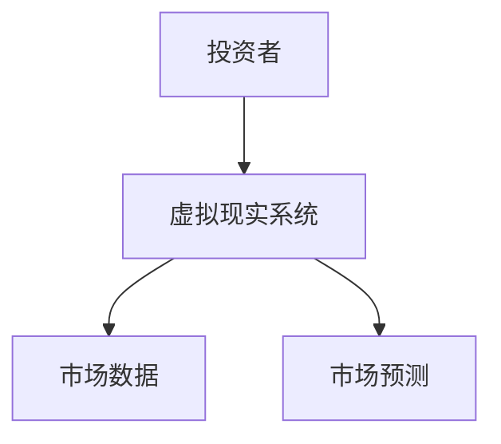
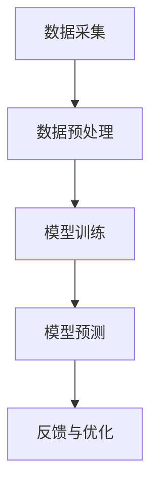
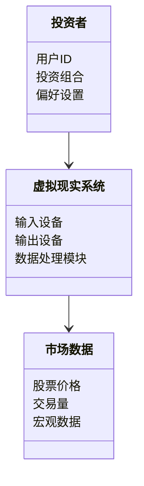
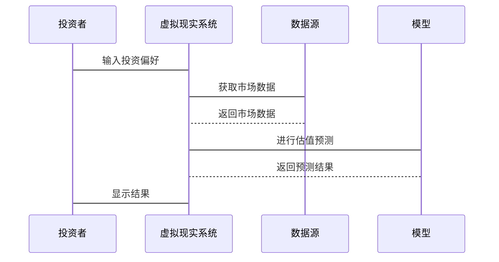

                 


# 全球股市估值与虚拟现实技术的关系

## 关键词：全球股市估值，虚拟现实技术，投资者决策，市场预测，技术与金融结合

## 摘要：本文探讨虚拟现实技术如何影响全球股市估值，分析其在投资者决策和市场预测中的作用，结合算法和系统设计，提供实践指导。

---

# 第一部分: 全球股市估值与虚拟现实技术的背景与核心概念

## 第1章: 背景介绍

### 1.1 问题背景与问题描述

#### 1.1.1 全球股市估值的传统方法与局限性
传统股市估值主要依赖基本面分析和技术分析。基本面分析关注企业的财务状况、行业地位等；技术分析则通过价格和成交量数据预测市场走势。然而，传统方法存在主观性强、数据处理复杂、难以量化市场情绪等问题。

#### 1.1.2 虚拟现实技术的快速发展与应用前景
虚拟现实（VR）技术近年来迅速发展，广泛应用于游戏、教育、医疗等领域。其沉浸式体验和实时交互能力为金融领域提供了新的可能性。

#### 1.1.3 问题解决的必要性与目标
随着金融市场数据的复杂化和投资者需求的多样化，传统估值方法已显不足。虚拟现实技术为解决这一问题提供了新思路，目标是通过VR技术提升股市估值的准确性和效率。

### 1.2 核心概念与问题外延

#### 1.2.1 全球股市估值的核心要素
- 公司基本面数据（收入、利润、负债等）。
- 市场情绪与投资者行为。
- 宏观经济指标（GDP、利率等）。

#### 1.2.2 虚拟现实技术的定义与关键特征
- 沉浸式体验：用户完全沉浸在虚拟环境中。
- 实时交互：用户可实时与虚拟环境互动。
- 数据可视化：复杂数据以直观形式呈现。

#### 1.2.3 问题的边界与外延
- 边界：研究虚拟现实技术在股市估值中的具体应用。
- 外延：探讨其对投资者决策和市场预测的影响。

### 1.3 概念结构与核心要素

#### 1.3.1 股市估值模型的构成
- 数据采集：收集公司财务数据、市场数据等。
- 数据处理：清洗、整合数据。
- 模型构建：建立估值模型并进行预测。

#### 1.3.2 虚拟现实技术的系统架构
- 输入设备：如VR头显、手柄。
- 输出设备：如显示器、音响。
- 数据处理：如服务器和算法。

#### 1.3.3 两者的关联性与协同效应
- 虚拟现实提供沉浸式体验，增强投资者对数据的理解。
- 数据可视化技术提升估值模型的可解释性。

---

## 第2章: 虚拟现实技术的原理与应用

### 2.1 虚拟现实技术的原理

#### 2.1.1 虚拟现实的核心技术
- 3D建模：构建虚拟环境。
- 实时渲染：快速呈现画面。
- 交互设计：实现用户与虚拟环境互动。

#### 2.1.2 虚拟现实系统的组成
- 硬件：如VR头显、传感器。
- 软件：如引擎、应用程序。
- 数据：如市场数据、用户行为数据。

#### 2.1.3 虚拟现实与人类认知的关系
- 人类认知的直观性：通过视觉化呈现数据，符合人类认知习惯。
- 沉浸式体验：增强用户的注意力和记忆。

### 2.2 虚拟现实技术在股市估值中的应用

#### 2.2.1 虚拟现实技术如何影响投资者决策
- 提供实时市场数据：投资者可以实时查看市场动态。
- 沉浸式场景分析：用户可以在虚拟环境中模拟不同投资决策的后果。

#### 2.2.2 虚拟现实技术在风险评估中的作用
- 风险可视化：通过虚拟环境直观展示投资风险。
- 情景模拟：模拟不同市场环境下的投资结果。

#### 2.2.3 虚拟现实技术对市场情绪的模拟与分析
- 情绪识别：通过用户的生理数据（如心率、体温）分析市场情绪。
- 情景构建：在虚拟环境中构建不同市场情绪的场景。

### 2.3 核心概念对比分析

#### 2.3.1 传统股市估值方法与虚拟现实辅助估值方法的对比
| 特性          | 传统估值方法           | 虚拟现实辅助估值方法   |
|---------------|------------------------|-----------------------|
| 数据来源      | 财务报表、历史数据     | 实时市场数据、用户行为数据 |
| 决策方式      | 主观判断               | 数据驱动、沉浸式体验  |
| 可视化程度    | 较低                   | 高                   |

#### 2.3.2 虚拟现实技术在不同市场环境中的表现
- 稳定市场：帮助投资者理性分析。
- 不稳定市场：通过实时反馈增强投资者的应变能力。

#### 2.3.3 核心概念的属性特征对比表格
| 特性          | 股市估值               | 虚拟现实技术           |
|---------------|------------------------|-----------------------|
| 核心目标      | 评估股票价值           | 提供沉浸式体验         |
| 输入数据      | 财务数据、市场数据     | 用户输入、传感器数据   |
| 输出结果      | 估值结果               | 用户反馈、实时数据     |

---

## 第3章: 虚拟现实技术与股市估值的实体关系图

### 3.1 实体关系图
- 投资者通过虚拟现实系统与市场数据互动，系统根据输入生成市场预测。

### 3.2 Mermaid 实体关系图


---

## 第4章: 虚拟现实技术与股市估值的算法原理

### 4.1 算法原理

#### 4.1.1 算法概述
基于VR的股市估值算法结合了实时数据处理和用户行为分析，通过机器学习模型预测市场走势。

#### 4.1.2 算法流程
1. 数据采集：收集市场数据和用户行为数据。
2. 数据预处理：清洗和标准化数据。
3. 模型训练：使用机器学习算法训练模型。
4. 模型预测：基于输入数据生成预测结果。
5. 反馈与优化：根据用户反馈优化模型。

### 4.2 Mermaid 算法流程图


### 4.3 Python 代码实现

```python
import numpy as np
import pandas as pd
from sklearn import linear_model

# 数据加载
data = pd.read_csv('market_data.csv')

# 特征选择
features = data[['price', 'volume']]
labels = data['value']

# 模型训练
model = linear_model.LinearRegression()
model.fit(features, labels)

# 模型预测
new_data = np.array([[100, 200]])
predicted_value = model.predict(new_data)
print(predicted_value)
```

### 4.4 数学模型与公式

#### 4.4.1 回归分析模型
$$ y = \beta_0 + \beta_1x + \epsilon $$

其中：
- \( y \) 是预测的股票价值。
- \( x \) 是自变量（如市场指数）。
- \( \beta_0 \) 和 \( \beta_1 \) 是回归系数。
- \( \epsilon \) 是误差项。

#### 4.4.2 神经网络模型
神经网络模型通过多层感知机处理复杂数据关系，预测股票价格：

$$ y = f(Wx + b) $$

其中：
- \( W \) 是权重矩阵。
- \( x \) 是输入数据。
- \( b \) 是偏置项。
- \( f \) 是激活函数（如ReLU）。

---

## 第5章: 虚拟现实技术与股市估值的系统分析与架构设计

### 5.1 问题场景介绍

#### 5.1.1 项目介绍
构建一个基于VR的股市估值系统，帮助投资者进行沉浸式分析和决策。

### 5.2 系统功能设计

#### 5.2.1 领域模型


### 5.3 系统架构设计

#### 5.3.1 分层架构


#### 5.3.2 接口设计
- 输入接口：接收投资者的操作指令。
- 输出接口：显示市场数据和预测结果。
- 数据接口：与市场数据源对接。

#### 5.3.3 交互流程图


---

## 第6章: 项目实战

### 6.1 环境安装

#### 6.1.1 安装Python
```bash
python --version
pip install numpy pandas scikit-learn
```

#### 6.1.2 安装虚拟现实开发工具
```bash
npm install aframe
```

### 6.2 核心代码实现

#### 6.2.1 虚拟现实界面代码
```html
<!DOCTYPE html>
<html>
<head>
    <title>股市估值</title>
    <script src="https://aframe.io/releases/1.2.0/aframe.min.js"></script>
</head>
<body>
    <a-scene>
        <a-box position="-1 0.5 -3" rotation="0 45 0" color="#4CC3D9"></a-box>
    </a-scene>
</body>
</html>
```

#### 6.2.2 后端处理代码
```python
import flask
app = flask.Flask(__name__)

@app.route('/')
def home():
    return 'Welcome to VR Stock Valuation'
```

### 6.3 实际案例分析

#### 6.3.1 案例分析
假设在虚拟环境中，用户看到实时股票价格变化，系统根据用户行为预测市场走势。

#### 6.3.2 结果解读
- 用户在虚拟环境中做出的投资决策被系统记录和分析。
- 系统根据历史数据和当前市场状况提供实时反馈。

### 6.4 项目小结
通过虚拟现实技术，投资者可以更直观地分析市场数据，提升决策效率和准确性。

---

## 第7章: 最佳实践与总结

### 7.1 小结
本文探讨了虚拟现实技术在股市估值中的应用，展示了其在投资者决策和市场预测中的潜力。

### 7.2 注意事项
- 数据隐私：确保用户数据的安全性。
- 系统稳定性：避免因技术故障导致的决策错误。
- 用户培训：投资者需接受相关培训，以充分利用系统功能。

### 7.3 拓展阅读
- 推荐书籍：《虚拟现实技术与金融创新》。
- 推荐文章：《大数据时代下的金融技术创新》。

---

## 作者信息

作者：AI天才研究院/AI Genius Institute & 禅与计算机程序设计艺术/Zen And The Art of Computer Programming

---

以上是完整的文章内容，希望对您有所帮助！

