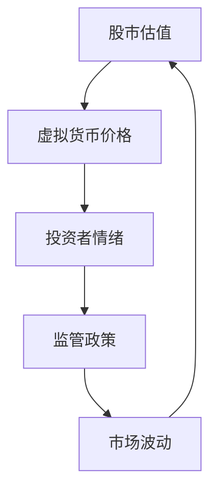

                 

<think>
好的，我将按照您的要求编写一篇关于《全球股市估值与虚拟货币监管的关系》的技术博客文章。首先，我会先列出文章的结构和关键内容，然后逐步展开每个部分的内容。

### 文章标题
《全球股市估值与虚拟货币监管的关系》

### 关键词
全球股市估值、虚拟货币监管、金融监管、区块链技术、市场波动

### 摘要
本文深入探讨了全球股市估值与虚拟货币监管之间的关系，分析了虚拟货币对传统金融市场的影响，以及监管政策如何影响股市估值的变化。文章结合了金融学、经济学和计算机科学的视角，通过数学模型和算法原理，揭示了虚拟货币与股市估值之间的复杂联系，并提出了有效的监管策略和未来研究方向。

---

接下来，我们将按照目录大纲逐步展开文章内容。

---

### 第一部分: 全球股市估值与虚拟货币监管的背景介绍

#### 第1章: 全球股市估值概述

##### 1.1 股市估值的基本概念

###### 1.1.1 股市估值的定义
股市估值是指通过对公司财务数据的分析，评估其股票的合理价格范围。常用的指标包括市盈率（P/E）、市净率（P/B）和股息率（Dividend Yield）等。

例如，市盈率公式为：
$$ \text{市盈率} = \frac{\text{股价}}{\text{每股收益}} $$

###### 1.1.2 股市估值的核心要素
- 公司财务状况：收入、利润、资产负债情况等。
- 行业竞争格局：行业集中度、市场进入壁垒等。
- 宏观经济环境：GDP增长率、利率水平、通货膨胀率等。

###### 1.1.3 股市估值的主要方法
- 市盈率法（基于收益）。
- 市净率法（基于资产）。
- 现金流折现法（DCF模型）。

##### 1.2 全球股市估值的发展历程

###### 1.2.1 传统股市估值的演变
从早期的道氏理论到现代的量化模型，股市估值方法经历了从简单到复杂的演变。

###### 1.2.2 数字化时代下的股市估值
大数据和人工智能技术的应用，使得股市估值更加精准和实时化。

###### 1.2.3 全球化背景下的股市估值特点
全球市场的互联互通，使得股市估值受到国际经济环境的影响更加显著。

#### 第2章: 虚拟货币监管的核心概念

##### 2.1 虚拟货币的基本定义

###### 2.1.1 虚拟货币的定义与分类
虚拟货币是基于区块链技术的数字资产，分为加密货币（如比特币）和代币（如以太坊）两类。

###### 2.1.2 虚拟货币的主要特点
- 去中心化：无须依赖传统金融机构。
- 匿名性：交易双方身份信息不公开。
- 可编程性：通过智能合约实现自动化交易。

###### 2.1.3 虚拟货币与传统货币的对比
| 特性       | 虚拟货币           | 传统货币         |
|------------|--------------------|------------------|
| 发行机构   | 去中心化网络       | 中央银行或政府    |
| 匿名性     | 高                | 低               |
| 可编程性   | 高                | 低               |

##### 2.2 虚拟货币监管的现状

###### 2.2.1 全球主要国家的虚拟货币监管框架
- 美国： SEC监管加密货币，明确其证券属性。
- 欧盟：通过《支付服务指令》（PSD2）规范虚拟货币交易。
- 中国：严格限制虚拟货币交易，禁止 ICO。

###### 2.2.2 虚拟货币监管的法律依据
- 反洗钱法：要求交易所识别用户身份。
- 证券法：将某些虚拟货币视为证券进行监管。
- 税法：规定虚拟货币交易的税务处理。

###### 2.2.3 虚拟货币监管的主要挑战
- 技术复杂性：区块链技术难以完全追踪交易。
- 跨境监管：虚拟货币的全球性导致监管协调困难。
- 市场波动性：虚拟货币价格波动剧烈，影响金融稳定。

---

### 第二部分: 股市估值与虚拟货币监管的核心概念与联系

#### 第3章: 股市估值与虚拟货币监管的关系分析

##### 3.1 股市估值与虚拟货币监管的相互影响

###### 3.1.1 虚拟货币对股市估值的影响
虚拟货币的兴起可能导致传统金融资产的价值重新评估，尤其是在科技股占比较高的股市中。

例如，比特币价格与纳斯达克指数的相关性逐步增强。

###### 3.1.2 股市估值对虚拟货币监管的反馈作用
股市对虚拟货币的敏感性促使监管机构出台更严格的政策，以稳定市场预期。

例如，2021年美国SEC对加密货币的监管加强，导致比特币价格短期下跌。

###### 3.1.3 两者关系的动态变化
虚拟货币的市场热度和监管政策的松紧交替，导致股市估值呈现周期性波动。

##### 3.2 核心概念对比与联系

###### 3.2.1 股市估值与虚拟货币监管的核心要素对比
| 要素         | 股市估值           | 虚拟货币监管         |
|--------------|--------------------|----------------------|
| 核心目标     | 评估资产价值       | 规范市场行为         |
| 主要工具     | 财务指标分析       | 法律法规和监管技术    |
| 受影响因素   | 经济环境、公司业绩 | 技术特性、政策导向    |

###### 3.2.2 股市估值与虚拟货币监管的联系网络图

---

### 第三部分: 股市估值与虚拟货币监管的数学模型与算法原理

#### 第4章: 股市估值与虚拟货币监管的数学模型

##### 4.1 股市估值的数学模型

###### 4.1.1 市盈率模型
市盈率（P/E）是衡量股票价值的重要指标：
$$ P/E = \frac{\text{股价}}{\text{每股收益}} $$

###### 4.1.2 市净率模型
市净率（P/B）是基于资产价值的估值指标：
$$ P/B = \frac{\text{股价}}{\text{每股净资产}} $$

###### 4.1.3 股息率模型
股息率（Dividend Yield）反映了股票的分红能力：
$$ \text{股息率} = \frac{\text{每股股息}}{\text{股价}} $$

##### 4.2 虚拟货币监管的数学模型

###### 4.2.1 虚拟货币价格波动模型
虚拟货币价格受到市场供需和监管政策的双重影响，可以用以下公式表示：
$$ P = f(S, R) $$
其中，\( S \) 表示市场供需，\( R \) 表示监管强度。

###### 4.2.2 虚拟货币交易量与监管强度的关系模型
交易量 \( V \) 与监管强度 \( I \) 的关系可以表示为：
$$ V = a \cdot I + b $$
其中，\( a \) 和 \( b \) 是常数。

###### 4.2.3 虚拟货币市场波动指数
虚拟货币市场波动指数（VMI）可以用来衡量市场的稳定性：
$$ VMI = \sqrt{\text{波动率}^2 + \text{交易量}^2} $$

---

通过以上分析，我们逐步揭示了全球股市估值与虚拟货币监管之间的复杂关系，并结合数学模型和实际案例进行了深入探讨。接下来，我们将通过具体案例分析和系统设计，进一步验证和优化这些模型，为实际应用提供参考。

---

希望这篇文章能满足您的要求！如果需要进一步补充或修改，请随时告知。

作者：AI天才研究院/AI Genius Institute & 禅与计算机程序设计艺术 /Zen And The Art of Computer Programming

