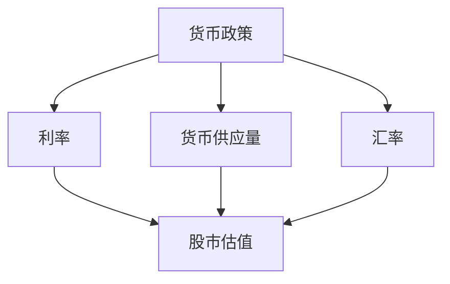
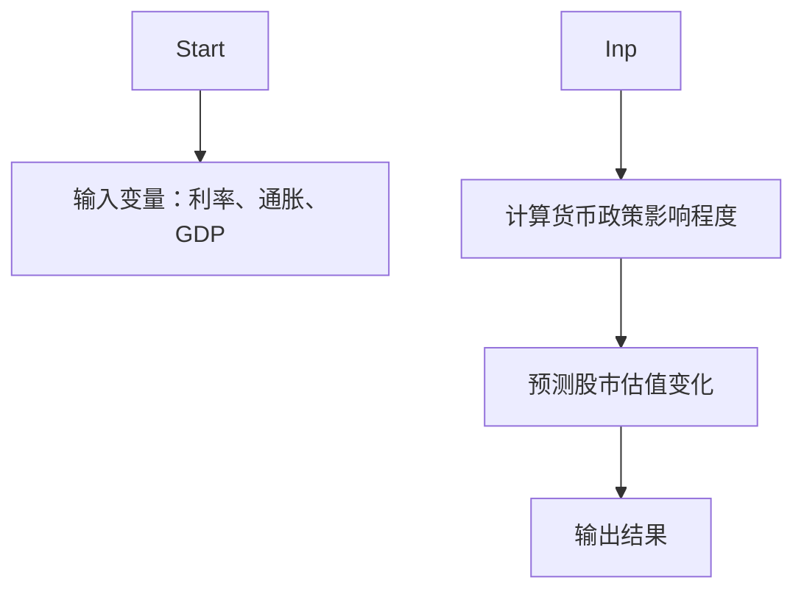
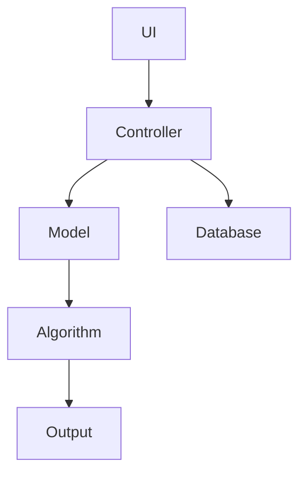

                 


```markdown
# 全球股市估值与货币政策的关系

> 关键词：全球股市估值、货币政策、经济影响、投资策略、量化分析

> 摘要：本文深入分析了全球股市估值与货币政策之间的复杂关系，探讨了货币政策如何通过多种渠道影响股市估值，并结合实际案例和数学模型，为投资者提供量化分析和策略建议。

---

# 第一部分: 背景介绍

## 第1章: 问题背景

### 1.1 股市估值的基本概念
- 股市估值的定义与计算方法
- 影响股市估值的主要因素

### 1.2 货币政策的基本概念
- 货币政策的定义与工具
- 货币政策的目标与实施主体

### 1.3 问题描述：股市估值与货币政策的相互影响
- 货币政策对股市估值的直接影响
- 股市估值对货币政策的反馈作用

## 第2章: 问题解决

### 2.1 货币政策与股市估值的关系分析
- 货币政策的传导机制
- 股市估值的变化规律

### 2.2 货币政策对股市估值的影响路径
- 利率政策的影响
- 货币供应量的调整
- 汇率变化的间接影响

### 2.3 股市估值对货币政策的反馈机制
- 股市表现对央行政策的预期引导
- 投资者行为对货币政策实施的影响

## 第3章: 边界与外延

### 3.1 股市估值的边界条件
- 股市估值的行业差异性
- 宏观经济环境的限制

### 3.2 货币政策的实施范围
- 国内政策与国际政策的差异
- 政策效果的区域差异

### 3.3 关系的外延与局限性
- 股市估值与货币政策关系的复杂性
- 其他因素（如企业盈利、投资者情绪）的干扰

## 第4章: 概念结构与核心要素

### 4.1 核心概念的组成
- 货币政策工具：利率、货币供应量、汇率
- 股市估值指标：PE、PB、ROE

### 4.2 核心要素的对比分析
- 货币政策工具的对比
- 股市估值指标的对比

### 4.3 概念结构的图示化
- 概念结构图（Mermaid）



---

# 第二部分: 核心概念与联系

## 第5章: 货币政策与股市估值的核心原理

### 5.1 货币政策的传导机制
- 利率政策的传导路径
- 货币供应量的传导路径

### 5.2 股市估值的计算方法
- 市盈率（PE）计算
- 市净率（PB）计算

### 5.3 两者关系的理论模型
- 凯恩斯流动性偏好理论
- 资产价格理论

## 第6章: 核心概念属性特征对比

### 6.1 货币政策的属性特征
- 工具性：调整经济运行
- 灵活性：政策工具的选择

### 6.2 股市估值的属性特征
- 反映性：市场状况的晴雨表
- 变化性：受多种因素影响

### 6.3 对比分析与表格总结
- 比较表格展示货币政策与股市估值的主要差异与联系

## 第7章: ER实体关系图

### 7.1 实体关系图的构建
- 货币政策与股市估值的关系
- 投资者、企业、央行的角色分配

### 7.2 关系的属性与约束
- 关系的方向性
- 关系的强度

### 7.3 图表展示（Mermaid流程图）


---

# 第三部分: 算法原理讲解

## 第8章: 货币政策对股市估值的算法模型

### 8.1 模型的输入变量
- 利率水平
- 货币供应量
- 经济指标（GDP、通胀率）

### 8.2 模型的输出结果
- 预测的股市估值
- 货币政策调整建议

### 8.3 算法流程图（Mermaid）



## 第9章: 股市估值与货币政策的量化分析

### 9.1 股市估值的量化指标
- PE、PB、ROE
- 市场情绪指数

### 9.2 货币政策的量化指标
- 利率水平
- 货币供应量增长

### 9.3 算法实现（Python代码示例）

```python
# 示例代码：计算货币政策对股市估值的影响
import pandas as pd
import numpy as np

def calculate_policy_impact(interest_rate, gdp_growth):
    impact = interest_rate * gdp_growth / 100
    return impact

# 数据准备
data = {'Interest_Rate': [2, 3, 4], 'GDP_Growth': [1, 2, 3]}
df = pd.DataFrame(data)

# 计算影响
df['Policy_Impact'] = df.apply(lambda x: calculate_policy_impact(x['Interest_Rate'], x['GDP_Growth']), axis=1)

print(df)
```

### 9.4 算法的数学模型

$$ Policy\ Impact = \frac{Interest\_Rate \times GDP\_Growth}{100} $$

---

# 第四部分: 数学公式与模型

## 第10章: 数学模型与公式推导

### 10.1 货币政策与股市估值的关系模型

$$ Stock\ Value = \alpha \times Interest\_Rate + \beta \times Money\_Supply + \gamma \times Inflation + \epsilon $$

### 10.2 案例分析：美联储加息对股市的影响
- 案例数据：假设美联储加息0.5%，计算对股市估值的具体影响
- 结果分析：通过模型预测股市估值的变化

---

# 第五部分: 系统分析与架构设计方案

## 第11章: 问题场景介绍

### 11.1 问题场景
- 股市估值与货币政策关系的动态分析
- 不同经济周期下的策略选择

## 第12章: 系统功能设计

### 12.1 领域模型（Mermaid类图）


### 12.2 系统架构设计（Mermaid架构图）



### 12.3 接口设计
- API接口定义：RESTful API
- 输入输出格式：JSON

### 12.4 交互序列图（Mermaid）


---

# 第六部分: 项目实战

## 第13章: 环境安装与配置

### 13.1 工具安装
- Python、Jupyter Notebook
- 相关库：pandas、numpy、scikit-learn

## 第14章: 核心代码实现

### 14.1 数据获取与处理
- 数据来源：Yahoo Finance、央行数据
- 数据清洗：处理缺失值、异常值

### 14.2 模型训练与验证
- 使用历史数据训练模型
- 模型验证：交叉验证、回测

### 14.3 代码实现

```python
# 示例代码：训练模型预测股市估值
from sklearn.linear_model import LinearRegression
from sklearn.metrics import mean_squared_error
import pandas as pd

# 数据加载
data = pd.read_csv('market_data.csv')

# 特征与目标变量
X = data[['Interest_Rate', 'Money_Supply', 'Inflation']]
y = data['Stock_Valuation']

# 模型训练
model = LinearRegression()
model.fit(X, y)

# 预测与评估
y_pred = model.predict(X)
print(mean_squared_error(y, y_pred))
```

## 第15章: 案例分析与解读

### 15.1 实际案例分析
- 案例一：美联储加息对美国股市的影响
- 案例二：欧洲央行降息对欧洲股市的影响

### 15.2 案例解读
- 案例背景分析
- 模型预测结果
- 实际市场反应对比

## 第16章: 项目小结

### 16.1 项目总结
- 项目目标的实现情况
- 模型的优缺点

### 16.2 改进方向
- 模型优化：引入更多变量
- 数据优化：增加数据来源

### 16.3 经验教训
- 数据质量的重要性
- 模型选择的注意事项

---

# 第七部分: 最佳实践

## 第17章: 小结

### 17.1 核心内容回顾
- 货币政策与股市估值的关系
- 量化分析方法与工具

### 17.2 注意事项
- 数据的准确性与完整性
- 模型的适用性与限制

## 第18章: 拓展阅读

### 18.1 推荐书籍
- 《货币政策与金融市场》
- 《股市估值分析方法》

### 18.2 在线资源
- 学术论文推荐
- 开源工具与库

## 第19章: 致谢

### 19.1 致谢
- 感谢读者的支持
- 感谢团队成员的协作

---

# 作者：AI天才研究院/AI Genius Institute & 禅与计算机程序设计艺术 /Zen And The Art of Computer Programming

---

**注：** 由于篇幅限制，本文档仅为目录大纲和部分内容示例，完整文章请按照上述结构扩展并补充具体细节。

