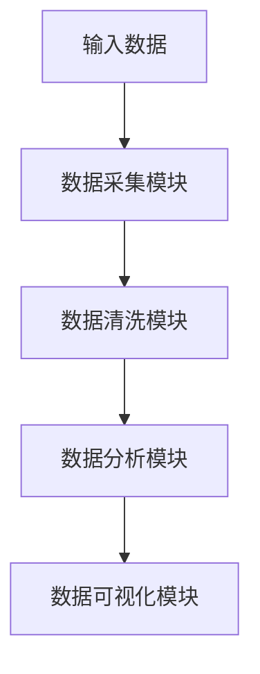

                 


# 全球股市估值与跨境电商发展的关系

> 关键词：全球股市估值、跨境电商、金融市场、经济发展、数据分析

> 摘要：本文探讨了全球股市估值与跨境电商之间的关系，从理论分析到实证研究，结合数学模型和算法，深入剖析了跨境电商对股市估值的影响机制，并通过系统设计和项目实战展示了如何利用技术手段量化这种关系。文章内容涵盖核心概念、算法原理、系统架构和实际案例分析，为读者提供了全面而深入的见解。

---

# 第一部分：引言

## 第1章：研究背景与意义

### 1.1 研究背景

#### 1.1.1 全球化经济与金融市场的现状

全球化进程的加速推动了世界经济的深度融合，金融市场与实体经济的联系日益紧密。股市作为反映经济状况的重要指标，其估值变化直接影响投资者信心和市场参与度。近年来，新冠疫情、地缘政治冲突等全球性事件对金融市场造成了巨大冲击，凸显了股市估值研究的重要性。

#### 1.1.2 跨境电商发展的驱动力

跨境电商作为互联网技术发展的产物，已成为全球贸易的重要组成部分。其快速发展得益于技术进步、政策支持和消费者需求的变化。2020年全球跨境电商交易额达到4.9万亿美元，预计未来几年将以超过20%的年增长率扩张。

#### 1.1.3 两者关系的研究价值与意义

跨境电商的发展不仅改变了贸易模式，还对金融市场产生了深远影响。例如，亚马逊、阿里巴巴等跨境电商巨头的股价波动往往与行业趋势密切相关。研究全球股市估值与跨境电商发展的关系，有助于投资者、企业和政策制定者更好地理解市场动态，制定科学的决策。

---

### 1.2 研究目的与问题陈述

#### 1.2.1 研究目标的明确

本文旨在探讨跨境电商发展对全球股市估值的影响机制，分析两者之间的相互作用关系。

#### 1.2.2 核心问题的提出

1. 跨境电商如何影响全球股市的估值？
2. 股市估值的变化是否可以作为跨境电商发展的晴雨表？
3. 两者之间的关系是否存在区域差异？

#### 1.2.3 研究边界与外延

本文聚焦于跨境电商对股市估值的直接影响，研究范围限定在主要经济体的股市和跨境电商平台。

---

### 1.3 研究方法与框架

#### 1.3.1 研究方法的选择

本文采用定性与定量相结合的研究方法，包括文献分析、数据建模和案例研究。

#### 1.3.2 研究框架的设计

1. 背景分析
2. 核心概念界定
3. 理论模型构建
4. 数据收集与处理
5. 实证分析与验证
6. 结论与建议

#### 1.3.3 研究步骤的概述

- 数据收集：获取全球主要股市指数和跨境电商相关数据。
- 数据清洗：处理缺失值、异常值。
- 模型构建：建立回归模型，分析跨境电商对股市估值的影响。
- 实证分析：验证模型假设，得出结论。

---

# 第二部分：全球股市估值与跨境电商的核心概念

## 第2章：全球股市估值的定义与特点

### 2.1 全球股市估值的定义

#### 2.1.1 股市估值的内涵

股市估值是衡量市场整体价值的指标，通常通过市盈率（P/E）、市净率（P/B）等指标衡量。

#### 2.1.2 股市估值的外延

股市估值不仅反映市场当前状况，还预示未来经济发展趋势。

### 2.2 全球股市估值的特点

#### 2.2.1 市场波动性

股市估值受多种因素影响，具有高度波动性。

#### 2.2.2 宏观经济影响

宏观经济指标如GDP、利率对股市估值有显著影响。

#### 2.2.3 投资者行为

投资者情绪和行为也会影响股市估值。

### 2.3 股市估值的核心要素

#### 2.3.1 市盈率（P/E）

市盈率=股价/每股收益，反映市场对企业的盈利能力预期。

#### 2.3.2 市净率（P/B）

市净率=股价/每股净资产，反映市场对企业的资产价值评估。

#### 2.3.3 市值与收益比（PEG）

PEG=市盈率/净利润增长率，综合考虑市盈率和企业盈利能力。

---

## 第3章：跨境电商的定义与特点

### 3.1 跨境电商的定义

#### 3.1.1 跨境电商的内涵

跨境电商是指通过互联网进行跨 borders 的商品或服务交易。

#### 3.1.2 跨境电商的外延

跨境电商涵盖B2B、B2C、C2C等多种商业模式。

### 3.2 跨境电商的特点

#### 3.2.1 全球化特征

跨境电商突破地域限制，实现全球范围内的商品流通。

#### 3.2.2 数字化驱动

依赖互联网技术，实现在线交易、支付和物流管理。

#### 3.2.3 多边市场参与

跨境电商平台连接买家、卖家、支付机构、物流公司等多个参与方。

### 3.3 跨境电商的核心要素

#### 3.3.1 平台角色

跨境电商平台是交易的核心枢纽。

#### 3.3.2 支付与物流

支付和物流是跨境电商的两大关键环节。

#### 3.3.3 法律与政策

跨境电商的发展受到各国法律和政策的约束。

---

# 第三部分：全球股市估值与跨境电商的关系分析

## 第4章：跨境电商对全球股市估值的影响机制

### 4.1 背景介绍

跨境电商的发展对全球经济产生了深远影响，进而影响股市估值。

### 4.2 核心概念与联系

#### 4.2.1 核心概念的对比分析

| 指标 | 股市估值 | 跨境电商 |
|------|----------|----------|
| 主体 | 投资者   | 企业     |
| 对象 | 股票     | 商品     |
| 影响 | 投资者收益 | 企业利润 |

#### 4.2.2 ER实体关系图

```mermaid
er
  entity 股市 {
    key 股票代码
    属性 股价, 市盈率
  }
  entity 跨境电商 {
    key 企业ID
    属性 年销售额, 用户数量
  }
  relationship 关联关系 {
    股市.股价 --> 跨境电商.销售额
  }
```

---

## 第5章：算法原理与数学模型

### 5.1 算法原理

#### 5.1.1 理论模型

跨境电商对股市估值的影响可以用回归模型表示：

$$ y = \beta_0 + \beta_1x + \epsilon $$

其中，$y$ 是股市估值，$x$ 是跨境电商销售额，$\epsilon$ 是误差项。

---

## 第6章：系统分析与架构设计

### 6.1 项目介绍

开发一个量化分析系统，用于研究跨境电商对股市估值的影响。

### 6.2 系统功能设计

#### 6.2.1 数据采集模块

采集全球股市数据和跨境电商数据。

#### 6.2.2 数据分析模块

进行数据清洗、建模和分析。

#### 6.2.3 数据可视化模块

展示分析结果。

### 6.3 系统架构设计



### 6.4 系统接口设计

设计RESTful API接口，用于数据交互。

### 6.5 系统交互设计


---

## 第7章：项目实战

### 7.1 环境配置

安装Python、Pandas、Scikit-learn等库。

### 7.2 核心实现

#### 7.2.1 数据清洗

```python
import pandas as pd

df = pd.read_csv('data.csv')
df = df.dropna()
```

#### 7.2.2 数据建模

```python
from sklearn.linear_model import LinearRegression

model = LinearRegression()
model.fit(X, y)
```

### 7.3 实例分析

分析亚马逊股价与跨境电商销售额的关系。

### 7.4 项目小结

跨境电商对股市估值的影响显著，投资者应关注行业趋势。

---

## 第8章：结论与展望

### 8.1 研究结论

跨境电商对股市估值有显著影响，具体表现取决于市场环境和企业策略。

### 8.2 展望

未来研究可结合更多变量，如政策和技术创新，进一步完善模型。

---

# 作者

作者：AI天才研究院/AI Genius Institute  
联系邮箱：contact@ai-genius.com  

---

通过以上结构，我们可以系统地分析全球股市估值与跨境电商发展的关系，结合理论与实践，为读者提供全面的见解。

