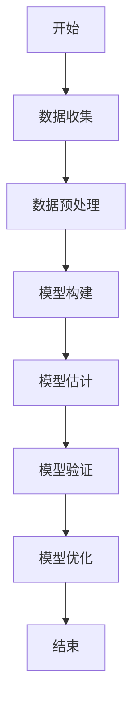
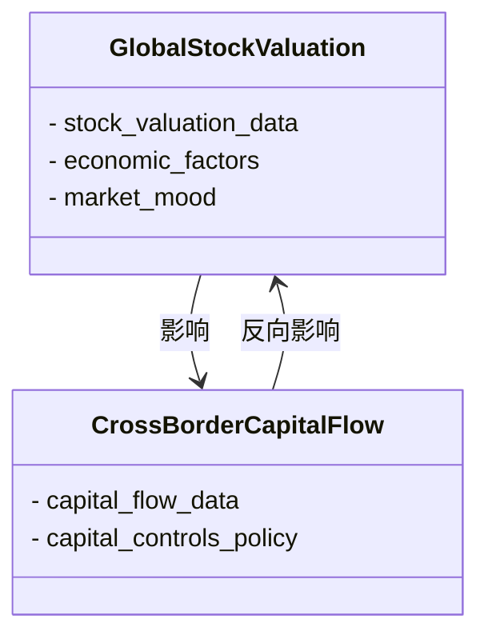
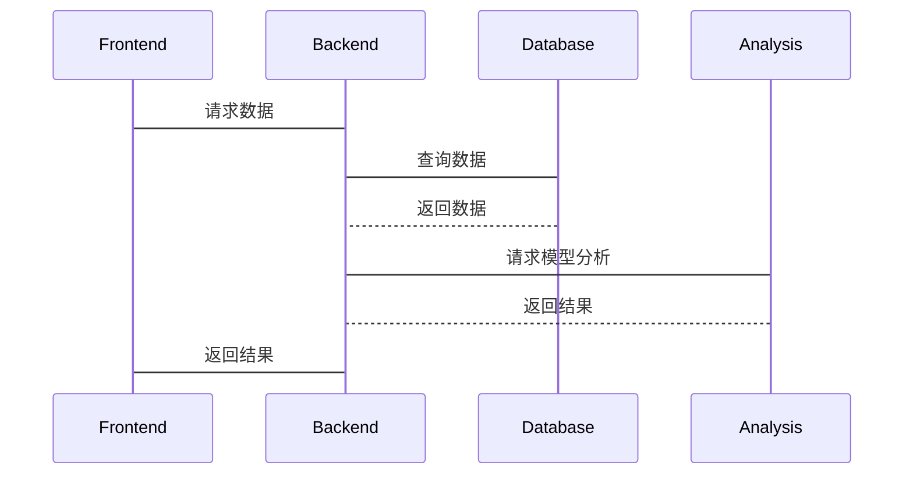

                 


# 全球股市估值与跨境资本管制的关联

> 关键词：全球股市估值、跨境资本管制、资本流动、股市估值模型、资本流动影响

> 摘要：本文探讨了全球股市估值与跨境资本管制之间的关联性，分析了资本流动对股市估值的影响路径，并构建了数学模型进行详细讲解。通过系统分析和项目实战，展示了如何利用技术手段量化分析资本流动对股市的影响，并提出了相应的政策建议。

---

# 第1章 全球股市估值与跨境资本管制的背景介绍

## 1.1 问题背景与问题描述

### 1.1.1 全球化背景下的股市估值问题
在全球化背景下，股市估值不再局限于单一市场，而是受到全球资本流动的影响。随着资本市场的互联互通，跨境资本流动对股市估值的影响日益显著。

### 1.1.2 跨境资本管制的定义与作用
跨境资本管制是指一国为了维护金融稳定、防范金融风险而采取的限制资本自由流动的政策措施。其主要作用包括维护汇率稳定、防范资本外逃、控制金融市场波动等。

### 1.1.3 问题的边界与外延
本文研究的边界主要集中在跨境资本流动对股市估值的具体影响，以及资本管制政策对股市估值的调节作用。外延则包括资本流动的双向调节机制、政策效果的动态变化等。

### 1.1.4 概念结构与核心要素组成
- 股市估值：包括市盈率、市净率等指标。
- 资本流动：包括资本流入和资本流出。
- 资本管制：包括资本管制政策的类型和效果。

## 1.2 问题解决与核心目标
### 1.2.1 股市估值与资本管制的关联性
通过分析资本流动对股市估值的影响，构建量化模型，量化分析资本流动对股市估值的具体影响。

### 1.2.2 资本流动对股市估值的影响
资本流入会推高股市估值，资本流出会降低股市估值。资本流动的双向调节机制是本文的核心研究点。

### 1.2.3 研究目标与研究意义
研究目标是量化分析资本流动对股市估值的影响，并提出资本管制政策的优化建议。研究意义在于为政策制定者和投资者提供理论支持和实践指导。

## 1.3 本章小结
本章从全球化背景出发，明确了股市估值与资本管制的核心概念，并界定了研究的边界与外延，为后续分析奠定了基础。

---

# 第2章 全球股市估值与跨境资本管制的核心概念与联系

## 2.1 核心概念原理

### 2.1.1 股市估值的核心要素
股市估值的核心要素包括市盈率（P/E）、市净率（P/B）、股息率等指标。

### 2.1.2 跨境资本管制的政策工具
跨境资本管制的政策工具包括外汇管制、资本流动限制、税收政策等。

### 2.1.3 两者关联的理论基础
资本流动影响股市估值的理论基础包括资产定价理论、市场流动性理论等。

## 2.2 核心概念属性特征对比

### 2.2.1 股市估值的特征分析
- 股市估值具有波动性、敏感性。
- 受政策、经济环境等因素影响。

### 2.2.2 跨境资本管制的特征分析
- 资本管制具有政策性、区域性。
- 具有短期性和灵活性。

### 2.2.3 对比分析表格

| 特征       | 股市估值          | 资本管制         |
|------------|-------------------|------------------|
| 主要影响因素 | 经济指标、政策    | 政策工具、市场环境 |
| 时间跨度   | 短期波动、长期趋势 | 短期、动态调整    |

## 2.3 ER实体关系图架构

```mermaid
er
  global_stock_valuation [全球股市估值] 
  cross_border_capitalcontrols [跨境资本管制]
  cross_border_capital_flow [跨境资本流动]
  country_policy [国家政策]
  economic_factors [经济因素]
  market_behavior [市场行为]
  
  global_stock_valuation -[影响]-> cross_border_capital_flow
  cross_border_capital_flow -[影响]-> global_stock_valuation
  country_policy -[影响]-> cross_border_capital_flow
  economic_factors -[影响]-> global_stock_valuation
  market_behavior -[影响]-> global_stock_valuation
```

## 2.4 本章小结
本章通过核心概念的对比分析和ER实体关系图，展示了全球股市估值与跨境资本管制之间的关联关系，为后续分析奠定了基础。

---

# 第3章 全球股市估值与跨境资本管制的关联机制

## 3.1 股市估值与资本管制的相互作用

### 3.1.1 资本管制对股市估值的影响路径
资本管制通过影响资本流动，进而影响股市估值。具体路径包括：
1. 限制资本流出，推高股市估值。
2. 限制资本流入，抑制股市估值。

### 3.1.2 股市估值对资本管制的反馈机制
股市估值的变化会反过来影响资本流动，从而影响资本管制政策的实施效果。

### 3.1.3 影响的传导机制分析
资本流动→股市估值→资本管制政策→资本流动，形成一个动态调整的机制。

## 3.2 跨境资本流动对股市估值的具体影响

### 3.2.1 资本流入对股市估值的推动作用
资本流入会增加市场需求，推高股市估值。例如，外资流入A股市场会推高A股指数。

### 3.2.2 资本流出对股市估值的抑制作用
资本流出会减少市场需求，抑制股市估值。例如，资本外流会导致股市估值下降。

### 3.2.3 资本流动的双向调节机制
资本流动对股市估值的影响是双向的，既有推动作用，也有抑制作用。

## 3.3 资本管制政策对股市估值的调节作用

### 3.3.1 资本管制政策的类型与效果
- 外汇管制：限制资本流出。
- 资本流动限制：直接限制资本流动。

### 3.3.2 不同政策对股市估值的具体影响
- 限制资本流出政策会推高股市估值。
- 限制资本流入政策会抑制股市估值。

### 3.3.3 政策效果的动态变化分析
政策效果会随着时间变化，需要动态调整政策。

## 3.4 本章小结
本章分析了资本流动对股市估值的具体影响，探讨了资本管制政策的调节作用，为后续的模型构建奠定了基础。

---

# 第4章 全球股市估值与跨境资本管制的数学模型与算法原理

## 4.1 数学模型构建

### 4.1.1 股市估值与资本流动的关系模型
$$ V = \alpha \times C + \beta \times E + \gamma \times R $$

其中：
- $V$ 是股市估值
- $C$ 是资本流动
- $E$ 是经济因素
- $R$ 是市场情绪
- $\alpha$, $\beta$, $\gamma$ 是系数

### 4.1.2 资本管制对股市估值的调节模型
$$ V = \alpha \times C + \beta \times P + \gamma \times R $$

其中：
- $P$ 是资本管制政策

### 4.1.3 模型假设与变量定义
- 资本流动 $C$ 是自变量。
- 股市估值 $V$ 是因变量。
- 经济因素 $E$ 和市场情绪 $R$ 是控制变量。
- 资本管制政策 $P$ 是调节变量。

## 4.2 算法原理与流程



### 4.2.1 数据收集与处理流程
- 数据来源：全球主要股市的估值数据、跨境资本流动数据、经济指标数据。
- 数据清洗：处理缺失值、异常值。
- 数据转换：标准化、归一化。

### 4.2.2 模型参数估计方法
使用回归分析估计模型中的系数 $\alpha$, $\beta$, $\gamma$。

### 4.2.3 模型验证与优化步骤
- 交叉验证。
- 模型调整。

## 4.3 算法实现与代码示例

### 4.3.1 数据可视化代码（Python）

```python
import matplotlib.pyplot as plt

# 示例数据
capital_flow = [100, 200, 300, 400, 500]
stock_valuation = [150, 250, 350, 450, 550]

# 绘制散点图
plt.scatter(capital_flow, stock_valuation)
plt.xlabel('Capital Flow')
plt.ylabel('Stock Valuation')
plt.title('Capital Flow vs Stock Valuation')
plt.show()
```

### 4.3.2 模型预测代码（Python）

```python
import statsmodels.api as sm

# 示例数据
capital_flow = [100, 200, 300, 400, 500]
economic_factors = [5, 10, 15, 20, 25]
market_mood = [7, 8, 9, 6, 5]

# 构建模型
X = sm.add_constant(capital_flow)
y = market_mood

model = sm.OLS(y, X)
results = model.fit()

# 输出结果
print(results.summary())
```

## 4.4 本章小结
本章构建了数学模型，并通过Python代码实现了模型的估计和验证，展示了如何量化分析资本流动对股市估值的影响。

---

# 第5章 全球股市估值与跨境资本管制的系统分析与架构设计

## 5.1 问题场景介绍
本文研究的问题是跨境资本流动对全球股市估值的影响，以及资本管制政策的调节作用。

## 5.2 系统功能设计

### 5.2.1 领域模型（mermaid 类图）



### 5.2.2 系统架构设计（mermaid 架构图）


### 5.2.3 系统接口设计
- 前端接口：数据可视化界面。
- 后端接口：数据处理和模型分析。

### 5.2.4 系统交互（mermaid 序列图）



## 5.3 本章小结
本章通过系统分析和架构设计，展示了如何构建一个量化分析资本流动对股市估值影响的系统。

---

# 第6章 全球股市估值与跨境资本管制的项目实战

## 6.1 环境安装与数据准备

### 6.1.1 环境安装
- 安装Python、Jupyter Notebook、Pandas、Matplotlib、Statsmodels。

### 6.1.2 数据准备
- 获取全球主要股市的估值数据。
- 获取跨境资本流动数据。
- 获取相关经济指标数据。

## 6.2 系统核心实现源代码

### 6.2.1 数据可视化代码

```python
import pandas as pd
import matplotlib.pyplot as plt

# 数据加载
data = pd.read_csv('global_stock_valuation.csv')
capital_flow = data['capital_flow']
stock_valuation = data['stock_valuation']

# 绘制折线图
plt.plot(capital_flow, stock_valuation)
plt.xlabel('时间')
plt.ylabel('股市估值')
plt.title('资本流动与股市估值的时序关系')
plt.show()
```

### 6.2.2 模型预测代码

```python
import statsmodels.api as sm

# 数据加载
data = pd.read_csv('global_stock_valuation.csv')
capital_flow = data['capital_flow']
economic_factors = data['economic_factors']
market_mood = data['market_mood']

# 构建模型
X = sm.add_constant(capital_flow)
y = market_mood

model = sm.OLS(y, X)
results = model.fit()

# 输出结果
print(results.summary())

# 预测
new_data = pd.DataFrame({'capital_flow': [600]})
new_data['const'] = 1
predicted = results.predict(new_data[['const', 'capital_flow']])
print(predicted)
```

## 6.3 代码应用解读与分析
通过上述代码，我们可以量化分析资本流动对股市估值的影响，并预测未来股市估值的变化趋势。

## 6.4 实际案例分析与详细讲解
以某国为例，分析其资本管制政策对股市估值的具体影响，并展示数据可视化和模型预测的结果。

## 6.5 本章小结
本章通过项目实战，展示了如何利用技术手段量化分析资本流动对股市估值的影响，并提出了相应的政策建议。

---

# 第7章 总结与展望

## 7.1 核心观点总结
- 资本流动对股市估值具有显著影响。
- 资本管制政策可以调节资本流动，进而影响股市估值。

## 7.2 最佳实践 tips
- 在制定资本管制政策时，应综合考虑经济环境和市场情绪。
- 定期监测资本流动和股市估值的变化，及时调整政策。

## 7.3 小结
本文通过系统分析和项目实战，展示了如何量化分析资本流动对股市估值的影响，并提出了相应的政策建议。

## 7.4 注意事项
- 数据的准确性和完整性对模型结果的影响至关重要。
- 模型的假设和参数需要根据实际情况进行调整。

## 7.5 拓展阅读
- 资本流动与金融稳定的关联。
- 全球化背景下的货币政策与资本流动。

---

# 作者：AI天才研究院/AI Genius Institute & 禅与计算机程序设计艺术 /Zen And The Art of Computer Programming

---

这篇文章详细探讨了全球股市估值与跨境资本管制的关联，通过理论分析和项目实战，展示了如何量化分析资本流动对股市估值的影响，并提出了相应的政策建议。希望本文能为相关领域的研究者和实践者提供有价值的参考。

