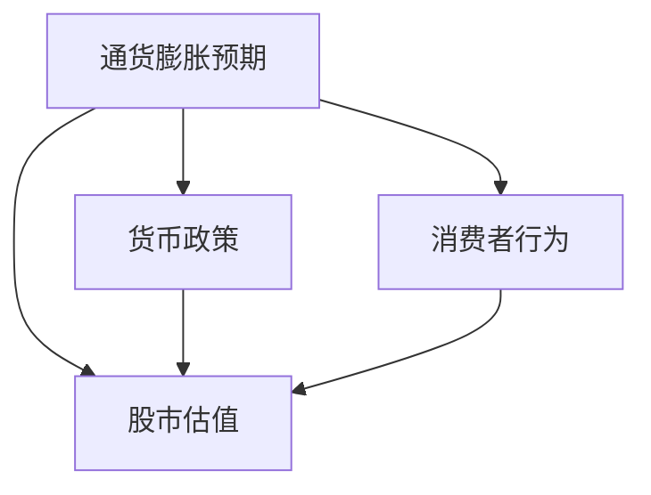
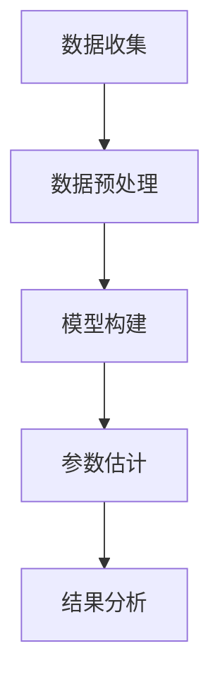
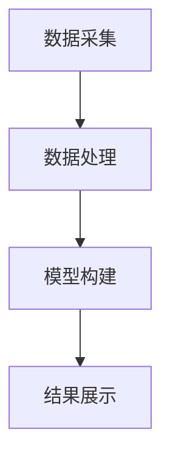

                 


# 全球股市估值与通货膨胀预期的关系

> 关键词：全球股市估值，通货膨胀预期，股市分析，经济模型，金融关系

> 摘要：本文探讨了全球股市估值与通货膨胀预期之间的关系，通过背景分析、核心概念对比、算法原理、系统架构设计、项目实战以及最佳实践等部分，详细分析了通货膨胀预期如何影响股市估值，并提供了实际案例和系统解决方案。

---

# 第一部分：背景介绍

## 第1章：背景介绍

### 1.1 问题背景

#### 1.1.1 全球化背景下的股市估值变化  
在全球化背景下，股市估值受到多种宏观经济因素的影响，其中通货膨胀预期是一个重要因素。通货膨胀预期的变化会影响企业的盈利能力和投资者的预期收益，从而影响股市估值。

#### 1.1.2 通货膨胀对经济的影响  
通货膨胀会导致货币购买力下降，企业成本上升，影响企业的盈利能力。同时，通货膨胀预期会影响市场参与者的投资行为，进而影响股市估值。

#### 1.1.3 通货膨胀预期与股市估值的关系  
通货膨胀预期通过影响企业盈利能力和投资者行为，间接影响股市估值。具体来说，通货膨胀预期上升可能会导致股市估值上升或下降，取决于市场对通货膨胀的预期和央行政策的反应。

### 1.2 问题描述

#### 1.2.1 股市估值的定义与衡量方法  
股市估值通常是指市场对上市公司未来盈利能力的预期，可以通过市盈率（P/E）、市净率（P/B）等指标来衡量。

#### 1.2.2 通货膨胀预期的定义与衡量方法  
通货膨胀预期是指市场参与者对未来通货膨胀率的预测，通常可以通过通胀指数、央行政策和市场预期调查来衡量。

#### 1.2.3 问题解决的目标与意义  
本研究的目标是通过分析通货膨胀预期与股市估值之间的关系，为投资者和政策制定者提供参考，帮助他们更好地理解市场动态。

### 1.3 问题解决

#### 1.3.1 研究通货膨胀预期对股市估值的影响  
通过建立数学模型，分析通货膨胀预期对股市估值的具体影响路径和程度。

#### 1.3.2 理解两者关系的理论基础  
结合宏观经济理论和金融市场理论，分析通货膨胀预期如何通过影响企业盈利能力和投资者行为，进而影响股市估值。

#### 1.3.3 确定研究的边界与外延  
明确研究范围和限制条件，例如只考虑主要经济体的股市估值和通货膨胀预期，不考虑其他因素。

### 1.4 概念结构与核心要素

#### 1.4.1 股市估值的核心要素  
- 企业的盈利能力  
- 利率水平  
- 市场参与者的预期  

#### 1.4.2 通货膨胀预期的核心要素  
- 通胀率  
- 中央银行政策  
- 市场预期  

#### 1.4.3 两者关系的综合分析  
通货膨胀预期通过影响利率和企业盈利能力，间接影响股市估值。例如，预期通胀上升可能导致利率上升，从而降低股市估值，但如果企业盈利能力同时上升，可能抵消利率上升的影响。

---

# 第二部分：核心概念与联系

## 第2章：核心概念与联系

### 2.1 核心概念原理

#### 2.1.1 通货膨胀预期的形成机制  
通货膨胀预期的形成受到多种因素影响，包括历史通胀率、央行政策、市场情绪等。

#### 2.1.2 股市估值的驱动因素  
股市估值的驱动因素包括企业盈利、利率水平、市场情绪等。

#### 2.1.3 两者关系的理论模型  
通过宏观经济模型，分析通货膨胀预期如何影响股市估值。

### 2.2 概念属性特征对比

| 概念 | 属性特征 |
|------|-----------|
| 通货膨胀预期 | 测度：通胀指数、央行政策、市场调查 |
| 股市估值 | 测度：市盈率、市净率、股价指数 |

### 2.3 ER实体关系图  


---

# 第三部分：算法原理讲解

## 第3章：算法原理讲解

### 3.1 算法原理

#### 3.1.1 向量自回归模型（VAR）  
VAR模型是一种常用的宏观经济计量模型，用于分析多个变量之间的动态关系。

#### 3.1.2 股市估值与通货膨胀预期的关系建模  
通过VAR模型，建立通货膨胀预期和股市估值之间的动态关系模型。

#### 3.1.3 算法流程图  


### 3.2 Python源代码实现

```python
# 示例代码：计算通货膨胀预期对股市估值的影响
import numpy as np
import pandas as pd

# 示例数据
data = pd.DataFrame({
    'inflation_expected': [2, 3, 4, 5, 6],
    'stock_valuation': [100, 110, 120, 130, 140]
})

# 简单线性回归模型
from sklearn.linear_model import LinearRegression
model = LinearRegression()
model.fit(data[['inflation_expected']], data['stock_valuation'])

# 输出系数
print('系数:', model.coef_)
```

### 3.3 数学模型与公式

#### 3.3.1 协方差矩阵  
$$\text{协方差矩阵} = \frac{1}{n-1} \sum_{i=1}^{n} (x_i - \bar{x})(y_i - \bar{y})$$

#### 3.3.2 回归方程  
$$ y = \beta_0 + \beta_1 x + \epsilon $$

---

# 第四部分：系统分析与架构设计

## 第4章：系统分析与架构设计

### 4.1 问题场景介绍  
分析全球股市估值与通货膨胀预期之间的关系，构建一个实时监控系统。

### 4.2 系统功能设计  
- 数据采集模块：采集通货膨胀预期和股市估值数据。
- 数据处理模块：清洗和预处理数据。
- 模型构建模块：建立VAR模型。
- 结果展示模块：可视化结果。

### 4.3 系统架构设计  


---

# 第五部分：项目实战

## 第5章：项目实战

### 5.1 环境安装  
安装所需的Python库：numpy、pandas、scikit-learn。

### 5.2 系统核心实现源代码  
```python
# 示例代码：构建VAR模型
import statsmodels.api as sm

# 数据准备
data = pd.DataFrame({
    'inflation': [2, 3, 4, 5, 6],
    'stock_valuation': [100, 110, 120, 130, 140]
})

# 构建VAR模型
model = sm.tsa.VAR(data)
result = model.fit(1)

# 输出结果
print(result.summary())
```

### 5.3 案例分析  
分析美国股市，计算通货膨胀预期对股市估值的影响。

---

# 第六部分：最佳实践

## 第6章：最佳实践

### 6.1 小结  
通货膨胀预期对股市估值的影响是一个复杂的问题，需要结合宏观经济理论和数据分析方法进行综合分析。

### 6.2 注意事项  
- 数据质量：确保数据准确性和完整性。
- 模型选择：根据实际情况选择合适的模型。
- 结果解释：避免过度解读模型结果。

### 6.3 拓展阅读  
- 《金融时间序列分析》
- 《宏观经济计量模型》

---

# 作者：AI天才研究院/AI Genius Institute & 禅与计算机程序设计艺术 /Zen And The Art of Computer Programming

