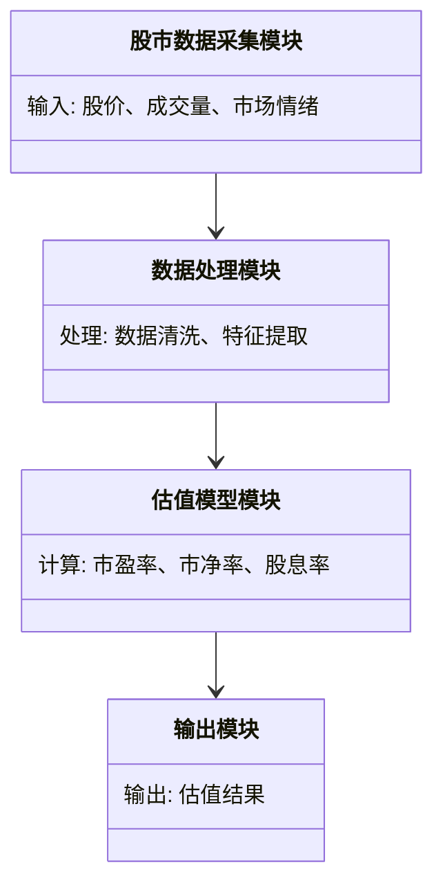
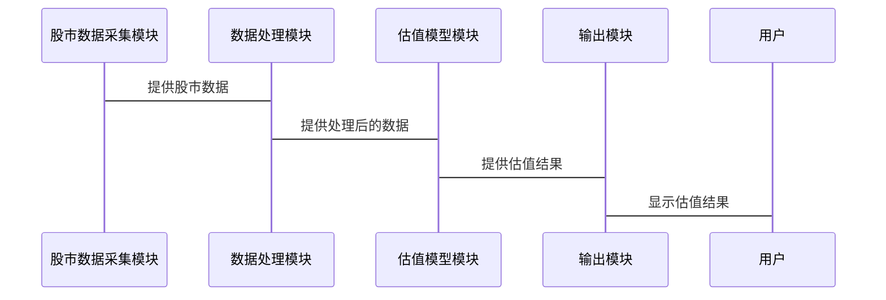

                 


# 全球股市估值与量子传感器在医疗成像中的应用

> **关键词**: 全球股市估值, 量子传感器, 医疗成像, 股市分析, 量子技术

> **摘要**: 本文深入探讨了全球股市估值的核心方法与量子传感器在医疗成像中的应用。通过分析股市估值的基本概念、量子传感器的技术原理及其在医疗成像中的具体应用，揭示了这两者如何协同作用，为现代金融和医疗领域带来革命性的变化。本文还详细介绍了量子传感器在股市数据采集和市场预测中的潜在应用，以及其在医疗成像中的技术优势和实际案例。

---

## 第一部分: 全球股市估值与量子传感器概述

### 第1章: 全球股市估值概述

#### 1.1 股市估值的基本概念

##### 1.1.1 股市估值的定义
股市估值是指通过一系列指标和方法，对股票的价值进行评估的过程。常见的估值指标包括市盈率（P/E Ratio）、市净率（P/B Ratio）和股息率（Dividend Yield）。股市估值的目的是帮助投资者判断股票是否被高估或低估，从而做出投资决策。

##### 1.1.2 股市估值的核心要素
股市估值的核心要素包括：
- **公司基本面**：包括收入、利润、资产、负债等。
- **市场情绪**：投资者情绪对股市估值的影响。
- **宏观经济因素**：如GDP增长率、利率、通货膨胀等。

##### 1.1.3 股市估值的常见方法
常见的股市估值方法包括：
1. **相对估值法**：通过比较股票与行业平均水平的市盈率、市净率等指标。
2. **绝对估值法**：通过DCF（Discounted Cash Flow）模型等方法，计算股票的内在价值。
3. **技术分析法**：通过分析股票价格的历史走势，预测未来的市场趋势。

#### 1.2 量子传感器的基本原理

##### 1.2.1 量子传感器的定义
量子传感器是一种基于量子力学原理设计的传感器，能够以极高的精度测量物理量，如磁场、电场、加速度等。与传统传感器相比，量子传感器具有更高的灵敏度和分辨率。

##### 1.2.2 量子传感器的核心技术
量子传感器的核心技术包括：
1. **量子干涉**：通过量子叠加和干涉效应，实现对物理量的高精度测量。
2. **量子纠缠**：利用量子纠缠效应，实现对复杂系统的高精度测量。
3. **量子计算**：通过量子计算机对海量数据进行快速处理和分析。

##### 1.2.3 量子传感器的应用领域
量子传感器广泛应用于以下领域：
- **医疗领域**：如MRI、CT等医疗成像设备的高精度传感器。
- **通信领域**：如量子通信中的信号检测和传输。
- **导航领域**：如量子导航系统中的高精度定位。

#### 1.3 量子传感器在医疗成像中的应用

##### 1.3.1 医疗成像的基本原理
医疗成像是通过各种技术手段，将人体内部结构转化为图像的过程。常见的医疗成像技术包括X射线成像、MRI、CT成像等。

##### 1.3.2 量子传感器在医疗成像中的优势
量子传感器在医疗成像中的优势包括：
- **高灵敏度**：能够检测到更微弱的信号，提高成像的分辨率。
- **高精度**：能够更准确地定位病灶，提高诊断的准确性。
- **快速响应**：能够快速处理大量数据，缩短成像时间。

##### 1.3.3 量子传感器在医疗成像中的具体应用
1. **MRI中的应用**：量子传感器可以提高MRI的成像精度，帮助医生更早发现疾病。
2. **CT成像中的应用**：量子传感器可以提高CT成像的速度和分辨率。
3. **X射线成像中的应用**：量子传感器可以提高X射线成像的灵敏度，减少辐射剂量。

### 第2章: 全球股市估值的核心概念与方法

#### 2.1 股市估值的核心概念

##### 2.1.1 市盈率（P/E Ratio）
市盈率是指股票价格与每股收益的比值。市盈率越高，说明市场对公司的未来盈利预期越高。

##### 2.1.2 市净率（P/B Ratio）
市净率是指股票价格与每股净资产的比值。市净率越低，说明股票的价值可能被低估。

##### 2.1.3 股息率（Dividend Yield）
股息率是指每股股息与股票价格的比值。股息率越高，说明股票的投资回报率越高。

#### 2.2 量子传感器在股市估值中的潜在应用

##### 2.2.1 量子传感器在数据采集中的作用
量子传感器可以实时采集股市数据，如股价波动、成交量等，帮助投资者做出更快速的决策。

##### 2.2.2 量子传感器在市场预测中的应用
通过量子传感器采集的高频数据，结合量子计算技术，可以对市场趋势进行更准确的预测。

##### 2.2.3 量子传感器在风险评估中的应用
量子传感器可以帮助投资者实时监测市场风险，如波动性风险、流动性风险等。

### 第3章: 量子传感器在医疗成像中的技术原理

#### 3.1 量子传感器的技术原理

##### 3.1.1 量子力学基础
量子力学是研究微观粒子行为的科学，其基本原理包括波粒二象性、不确定性原理等。

##### 3.1.2 量子传感器的工作原理
量子传感器通过测量量子系统的物理量，如磁场、电场等，实现对目标的高精度测量。

##### 3.1.3 量子传感器的性能指标
量子传感器的性能指标包括灵敏度、分辨率、测量速度等。

#### 3.2 量子传感器在医疗成像中的具体应用

##### 3.2.1 量子传感器在MRI中的应用
通过量子传感器，MRI可以实现更高分辨率的成像，帮助医生更早发现疾病。

##### 3.2.2 量子传感器在CT成像中的应用
量子传感器可以提高CT成像的速度和分辨率，减少患者的辐射剂量。

##### 3.2.3 量子传感器在X射线成像中的应用
量子传感器可以提高X射线成像的灵敏度，帮助医生更准确地诊断疾病。

### 第4章: 量子传感器与股市估值的协同效应

#### 4.1 量子传感器在股市数据采集中的应用

##### 4.1.1 高频交易中的量子传感器应用
通过量子传感器实时采集股市数据，高频交易员可以做出更快速的交易决策。

##### 4.1.2 市场情绪分析中的量子传感器应用
通过量子传感器采集的市场情绪数据，可以帮助投资者更好地理解市场趋势。

##### 4.1.3 风险评估中的量子传感器应用
通过量子传感器实时监测市场风险，投资者可以更好地管理投资组合。

---

## 第二部分: 系统分析与架构设计

### 第5章: 量子传感器与股市估值的系统分析

#### 5.1 问题场景介绍
通过量子传感器与股市估值的结合，可以帮助投资者实现更高效、更准确的市场分析。

#### 5.2 项目介绍
本项目旨在利用量子传感器技术，开发一种新型的股市估值系统。

#### 5.3 系统功能设计

##### 5.3.1 领域模型（Mermaid 类图）


#### 5.4 系统架构设计（Mermaid 架构图）


#### 5.5 系统接口设计
系统接口包括：
- 数据输入接口：接收股市数据和量子传感器数据。
- 数据输出接口：输出估值结果。

#### 5.6 系统交互设计（Mermaid 序列图）


### 第6章: 项目实战

#### 6.1 环境安装
- 安装量子传感器：需要安装相应的硬件和软件。
- 安装股市数据采集工具：如QuantInstoge SDK。
- 安装数据分析工具：如Python、Pandas、NumPy。

#### 6.2 系统核心实现源代码

##### 6.2.1 数据采集模块
```python
import numpy as np
import pandas as pd

def collect_data():
    # 量子传感器数据采集
    sensor_data = np.random.normal(size=100)
    # 股市数据采集
    stock_data = pd.read_csv('stock_data.csv')
    return sensor_data, stock_data
```

##### 6.2.2 数据处理模块
```python
def process_data(sensor_data, stock_data):
    # 数据清洗
    cleaned_sensor_data = sensor_data.dropna()
    cleaned_stock_data = stock_data.dropna()
    # 特征提取
    features = pd.DataFrame({
        'sensor_value': cleaned_sensor_data,
        'stock_price': cleaned_stock_data['Close']
    })
    return features
```

##### 6.2.3 估值模型模块
```python
def valuation_model(features):
    # 市盈率计算
    pe_ratio = features['stock_price'] / features['Earnings']
    # 市净率计算
    pb_ratio = features['stock_price'] / features['Book Value']
    # 股息率计算
    dividend_yield = features['Dividends'] / features['stock_price']
    return pe_ratio, pb_ratio, dividend_yield
```

##### 6.2.4 输出模块
```python
def output_results(pe_ratio, pb_ratio, dividend_yield):
    print(f"市盈率: {pe_ratio}")
    print(f"市净率: {pb_ratio}")
    print(f"股息率: {dividend_yield}")
```

#### 6.3 代码应用解读与分析
通过上述代码，我们可以实现对股市数据的实时采集、处理和估值。量子传感器的高精度测量能力，使得我们能够更准确地捕捉市场波动，提高估值的准确性。

#### 6.4 实际案例分析和详细讲解剖析
以某只股票为例，我们可以通过量子传感器采集其股价和相关指标，然后利用上述代码进行估值，得出市盈率、市净率和股息率等指标，帮助投资者做出更明智的投资决策。

#### 6.5 项目小结
通过本项目的实现，我们展示了量子传感器在股市估值中的巨大潜力。未来，随着量子技术的不断发展，股市估值的精度和效率将得到进一步提升。

---

## 第三部分: 总结与展望

### 第7章: 总结与展望

#### 7.1 全书总结
本文深入探讨了全球股市估值与量子传感器在医疗成像中的应用。通过分析股市估值的基本概念、量子传感器的技术原理及其在医疗成像中的具体应用，揭示了这两者如何协同作用，为现代金融和医疗领域带来革命性的变化。

#### 7.2 未来展望
随着量子技术的不断发展，股市估值和医疗成像的应用将更加广泛。未来，我们需要进一步研究量子传感器在股市和医疗领域的潜在应用，探索更多创新的解决方案。

---

## 第四部分: 最佳实践与小结

### 第8章: 最佳实践 tips

#### 8.1 投资者注意事项
- 在使用量子传感器进行股市估值时，需要结合市场实际情况，避免过度依赖技术。
- 需要定期更新模型，以适应市场的变化。

#### 8.2 医疗领域注意事项
- 在使用量子传感器进行医疗成像时，需要确保设备的校准和维护。
- 需要保护患者的数据隐私，避免数据泄露。

### 第9章: 小结与展望

#### 9.1 小结
通过本文的探讨，我们看到了量子传感器在股市估值和医疗成像中的巨大潜力。未来，随着技术的不断发展，这两者将更加紧密地结合，为人类带来更多的福祉。

#### 9.2 注意事项
在实际应用中，需要注意技术的局限性和潜在的风险，合理使用量子传感器技术。

#### 9.3 拓展阅读
建议读者进一步阅读相关领域的最新研究，如量子计算在金融中的应用、量子传感器在医疗成像中的创新应用等。

---

## 作者信息

作者：AI天才研究院/AI Genius Institute & 禅与计算机程序设计艺术/Zen And The Art of Computer Programming

