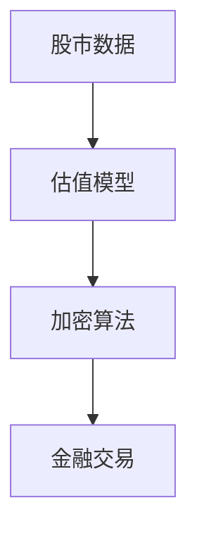
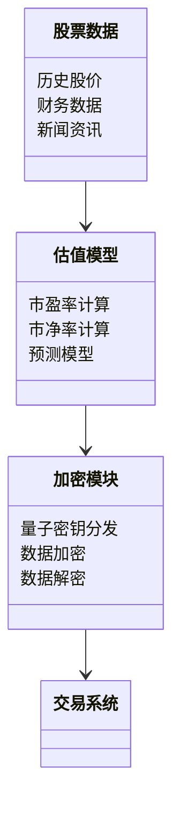
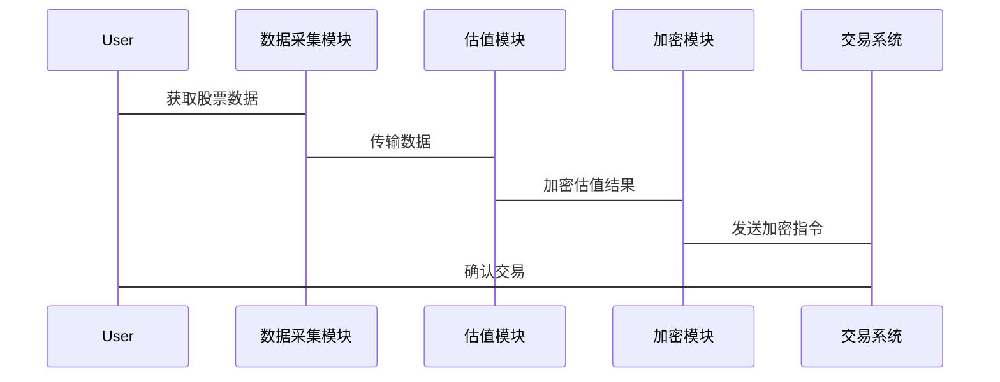

                 


# 全球股市估值与量子加密在金融领域的应用

> 关键词：全球股市估值、量子加密、金融安全、机器学习、量子密钥分发

> 摘要：本文将深入探讨全球股市估值与量子加密技术在金融领域的应用。首先，从背景出发，分析股市估值的重要性以及量子加密技术的兴起。接着，详细阐述股市估值和量子加密的核心概念与原理，包括它们的数学模型和算法实现。然后，结合实际案例，展示如何利用量子加密技术提升金融交易的安全性，以及如何通过机器学习优化股市估值模型。最后，总结量子加密与股市估值结合的优势与挑战，并展望未来的发展方向。

---

## 第一部分：背景与概念

### 第1章：背景介绍

#### 1.1 问题背景
- **股市估值的重要性**：股市估值是投资者评估股票价值的核心手段，直接影响投资决策。
- **量子加密技术的兴起**：随着量子计算的发展，量子加密技术在保障金融数据安全方面展现出巨大潜力。
- **传统金融安全的痛点**：传统加密算法面临被量子计算机破解的风险，金融交易的安全性受到威胁。

#### 1.2 问题描述
- **股市估值的复杂性**：市场波动、公司财务状况等多种因素影响股票价值，传统估值模型难以捕捉所有变量。
- **量子加密技术的应用场景**：在金融交易、数据传输等领域，量子加密技术可以提供更高的安全性。
- **两者结合的潜在价值**：将量子加密技术应用于股市估值，可以提升数据的安全性和模型的准确性。

#### 1.3 问题解决
- **股市估值的多维度分析方法**：结合技术分析和基本面分析，构建更全面的估值模型。
- **量子加密技术在金融中的应用**：通过量子密钥分发（QKD）技术，实现金融数据的 secure transmission。
- **两者的协同作用**：量子加密技术保护股市估值数据的安全，提升模型的可靠性和抗干扰能力。

#### 1.4 边界与外延
- **股市估值的边界条件**：模型的有效性依赖于数据的完整性和准确性。
- **量子加密技术的适用范围**：适用于需要高安全性的金融场景，如证券交易、数据传输等。
- **两者的相互影响**：量子加密技术的发展推动股市估值模型的优化，而股市估值的需求也促进了量子加密技术的创新。

### 第2章：核心概念与联系

#### 2.1 核心概念原理
- **股市估值的数学模型**：常用的估值方法包括市盈率（P/E）、市净率（P/B）等。
- **量子加密技术的基本原理**：基于量子力学的特性，如叠加态和纠缠态，实现密钥的安全分发。
- **两者的结合机制**：通过量子加密技术保护股市估值数据的安全，确保模型的准确性和数据的机密性。

#### 2.2 概念属性特征对比
| 特性       | 股市估值       | 量子加密技术       |
|------------|----------------|--------------------|
| 核心目标   | 评估股票价值   | 确保数据安全       |
| 技术基础   | 统计学、机器学习 | 量子力学、密码学   |
| 应用场景   | 投资决策       | 金融交易、数据传输 |

#### 2.3 ER实体关系图


---

## 第二部分：技术实现

### 第3章：算法原理讲解

#### 3.1 股市估值算法
- **常用估值方法**：市盈率、市净率、现金流折现法（DCF）。
- **机器学习在估值中的应用**：利用回归分析、神经网络等方法，预测股票未来价格。
- **算法实现步骤**：
  1. 数据采集：收集历史股价、财务数据等。
  2. 数据预处理：清洗、标准化。
  3. 模型训练：选择合适的算法，训练估值模型。
  4. 模型验证：通过回测检验模型的准确性。

#### 3.2 量子加密算法
- **量子密钥分发原理**：通过量子态的传输和测量，实现密钥的安全分发。
- **算法实现流程**：
  1. 生成量子密钥：利用量子随机数生成器生成随机密钥。
  2. 量子态传输：通过光纤等介质传输量子态。
  3. 密钥验证：确保密钥的完整性和安全性。

#### 3.3 算法实现代码
- **股市估值代码示例**：
```python
import pandas as pd
from sklearn.linear_model import LinearRegression

# 数据加载
data = pd.read_csv('stock_data.csv')

# 特征与目标分离
X = data[['PE', 'PB', 'ROE']]
y = data['Price']

# 模型训练
model = LinearRegression()
model.fit(X, y)

# 预测与评估
print(model.predict(X))  # 预测价格
print(model.score(X, y))  # R²值评估
```

- **量子加密代码示例**：
```python
import qiskit as q

# 量子电路定义
qc = q.QuantumCircuit(2)
qc.h(0)
qc.cx(0, 1)
qc.measure_all()

# 量子态模拟
simulator = q.Aer.get_backend('statevector_simulator')
result = q.execute(qc).result()
print(result.get_statevector())
```

---

### 第4章：数学模型与公式

#### 4.1 股市估值模型
- **市盈率模型**：
$$ P/E = \frac{Price}{Earnings} $$
- **市净率模型**：
$$ P/B = \frac{Price}{Book\ Value} $$
- **预测模型**：
$$ F(t) = a \cdot t + b $$

#### 4.2 量子加密模型
- **量子密钥分发公式**：
$$ \text{密钥生成} = \text{量子态叠加} $$

---

## 第三部分：系统分析与架构设计

### 第5章：系统分析与架构设计

#### 5.1 问题场景介绍
- **场景描述**：金融交易平台需要确保交易数据的安全性和高效性。
- **项目介绍**：设计一个基于量子加密的智能投顾系统，实现股票估值与交易的安全保护。

#### 5.2 系统功能设计
- **领域模型**：


- **系统架构设计**：


#### 5.3 系统接口设计
- **接口定义**：
  - 数据接口：提供API，获取实时股票数据。
  - 加密接口：提供加密和解密功能，保护数据传输。
  - 交易接口：处理加密后的交易指令。

#### 5.4 系统交互设计


---

## 第四部分：项目实战

### 第6章：项目实战与案例分析

#### 6.1 环境安装
- **环境要求**：
  - Python 3.8+
  - 安装qiskit、pandas、scikit-learn等库。
- **安装命令**：
  ```bash
  pip install qiskit pandas scikit-learn
  ```

#### 6.2 核心实现
- **股市估值实现**：
  ```python
  # 数据加载与预处理
  data = pd.read_csv('stock_data.csv')
  data = data.dropna()
  data = (data - data.mean()) / data.std()  # 标准化

  # 模型训练
  X = data[['PE', 'PB']]
  y = data['Price']
  model = LinearRegression()
  model.fit(X, y)

  # 预测与保存
  predictions = model.predict(X)
  pd.DataFrame({'Prediction': predictions}).to_csv('predictions.csv', index=False)
  ```

- **量子加密实现**：
  ```python
  # 量子电路定义
  qc = q.QuantumCircuit(2)
  qc.h(0)
  qc.cx(0, 1)
  qc.measure_all()

  # 量子态模拟
  simulator = q.Aer.get_backend('statevector_simulator')
  result = q.execute(qc).result()
  print(result.get_statevector())
  ```

#### 6.3 案例分析
- **案例背景**：某科技公司股票的估值与交易。
- **分析过程**：利用上述代码，生成预测股价，并通过量子加密技术保护交易指令。
- **结果解读**：预测股价与实际股价的对比，加密过程的安全性评估。

---

## 第五部分：总结与扩展

### 第7章：总结与展望

#### 7.1 最佳实践
- **技术实现**：建议使用量子加密技术保护金融数据，结合机器学习优化估值模型。
- **系统设计**：设计模块化、可扩展的系统架构，便于功能扩展和维护。
- **注意事项**：确保数据的完整性和准确性，防范量子计算时代的安全威胁。

#### 7.2 小结
- **核心要点**：量子加密与股市估值的结合，提升了金融交易的安全性和数据的准确性。
- **未来方向**：探索更多量子加密技术在金融领域的应用，如智能合约、风险管理等。

#### 7.3 注意事项
- **数据安全**：确保加密算法的强度，防止数据泄露。
- **算法优化**：不断优化估值模型，提高预测的准确性。
- **技术融合**：探索量子计算与其他金融技术的融合，推动金融创新。

#### 7.4 拓展阅读
- **推荐书籍**：
  - 《量子计算与量子密码学》
  - 《金融风险管理与数据分析》
- **推荐阅读论文**：
  - "Quantum Cryptography and Financial Security"
  - "Machine Learning in Stock Market Prediction"

---

## 作者：AI天才研究院/AI Genius Institute & 禅与计算机程序设计艺术 /Zen And The Art of Computer Programming

---

通过本文的详细讲解，读者可以全面理解全球股市估值与量子加密技术在金融领域的应用，并掌握相关的技术实现方法。

