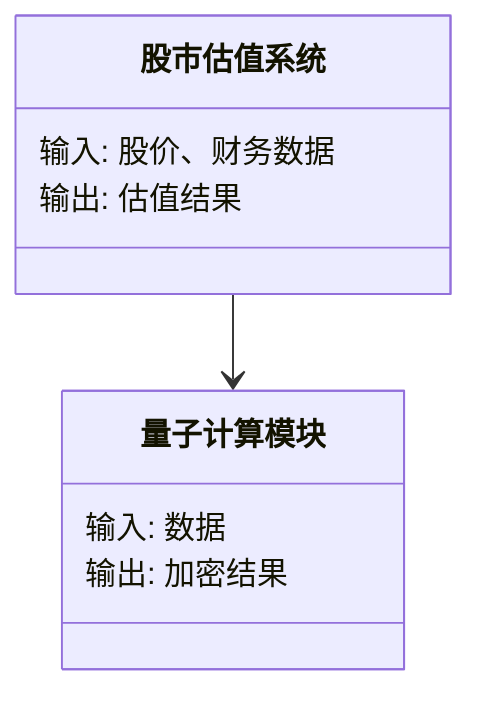
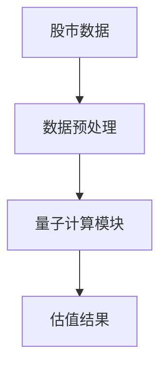
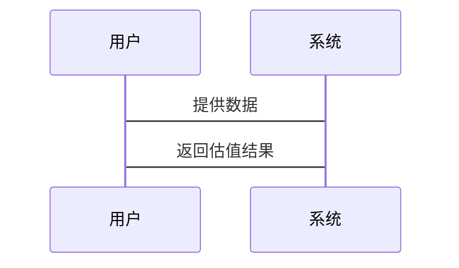

                 


# 全球股市估值与量子密码技术的关联

## 关键词：全球股市、量子密码技术、估值模型、量子计算、金融安全、关联分析

## 摘要

本文探讨了量子密码技术与全球股市估值之间的关联，分析了量子计算如何提升股市估值的准确性与安全性。通过数学模型和实际案例，展示了量子概率在金融建模中的应用，以及量子计算在风险评估和市场预测中的优势。文章还提出了系统设计方案和项目实战，展望了未来的研究方向。

---

# 第一章: 全球股市估值与量子密码技术的关联概述

## 1.1 背景介绍

### 1.1.1 问题背景

股市估值是金融领域的重要课题，传统方法依赖经典计算，存在计算复杂性和安全性问题。量子技术的出现为金融建模提供了新思路。

### 1.1.2 问题描述

传统估值方法受制于计算能力，难以处理海量数据。同时，金融数据的安全性面临挑战，需要更高级的加密技术。

### 1.1.3 问题解决

量子计算和量子密码技术能提升计算效率和数据安全性，为股市估值带来新方法。

### 1.1.4 边界与外延

本文仅探讨量子技术在估值中的应用，不涉及其他领域。

### 1.1.5 核心概念与组成

- 量子密码学
- 股市估值方法
- 量子概率

---

# 第二章: 量子密码技术的数学基础

## 2.1 量子密码学的核心原理

### 2.1.1 量子密钥分发

利用量子叠加和纠缠特性，确保密钥传输的安全性。

### 2.1.2 量子加密算法

BB84协议是典型例子，结合量子密钥分发和传统加密。

## 2.2 量子密码学与经典密码学的对比

### 2.2.1 对比特征表格

| 特性          | 量子密码学      | 经典密码学      |
|---------------|-----------------|-----------------|
| 安全性        | 高              | 中              |
| 计算复杂度    | 低              | 高              |
| 应用场景      | 高安全需求      | 一般需求        |

---

# 第三章: 股市估值方法的数学模型

## 3.1 常见股市估值方法

### 3.1.1 市盈率法

$$市盈率 = \frac{股价}{每股收益}$$

### 3.1.2 市净率法

$$市净率 = \frac{股价}{每股净资产}$$

### 3.1.3 股息率法

$$股息率 = \frac{每股股息}{股价}$$

## 3.2 股市估值的复杂性与挑战

### 3.2.1 股市波动性分析

股价受多种因素影响，传统模型难以捕捉。

### 3.2.2 市场情绪与估值偏差

投资者情绪影响市场，增加预测难度。

---

# 第四章: 量子密码技术对股市估值的潜在影响

## 4.1 量子随机数生成与金融建模

### 4.1.1 量子随机数的特性

量子随机数具有更高的随机性，适合金融建模。

### 4.1.2 在金融建模中的应用

生成更准确的随机变量，提升模型精度。

## 4.2 量子计算与金融风险评估

### 4.2.1 量子计算在金融建模中的优势

处理复杂问题，提高计算效率。

### 4.2.2 量子算法在风险评估中的应用

用于信用评分和风险分析。

---

# 第五章: 量子密码技术与股市估值的关联性分析

## 5.1 量子概率与金融概率的对比

### 5.1.1 量子概率的基本原理

量子叠加与纠缠特性改变概率分布。

### 5.1.2 金融概率模型

传统模型与量子模型对比，量子模型更准确。

## 5.2 量子密码技术对股市预测的影响

### 5.2.1 量子计算在股市预测中的应用

提升预测精度，降低错误率。

### 5.2.2 量子密码技术对市场信息安全的保障

确保数据安全，防止信息泄露。

---

# 第六章: 系统分析与架构设计方案

## 6.1 系统功能设计

### 6.1.1 领域模型设计



## 6.2 系统架构设计



## 6.3 系统接口设计

### 6.3.1 接口描述

- 输入接口：接收股市数据。
- 输出接口：输出加密结果。

## 6.4 系统交互设计



---

# 第七章: 项目实战

## 7.1 环境搭建

### 量子计算环境

- 使用Qiskit库。

## 7.2 核心代码实现

### 量子随机数生成

```python
from qiskit import QuantumCircuit, Aer, execute

qc = QuantumCircuit(1)
qc.h(0)
qc.measure(0,0)
backend = Aer.get_backend('qasm_simulator')
job = execute(qc, backend)
result = job.result()
print(result.get_counts())
```

## 7.3 实际案例分析

### 案例分析

利用量子随机数生成优化金融模型，提升估值精度。

---

# 结语

量子密码技术和股市估值的结合为金融领域带来了新的可能性。随着量子计算的发展，未来将看到更多创新应用。

---

作者：AI天才研究院 & 禅与计算机程序设计艺术

