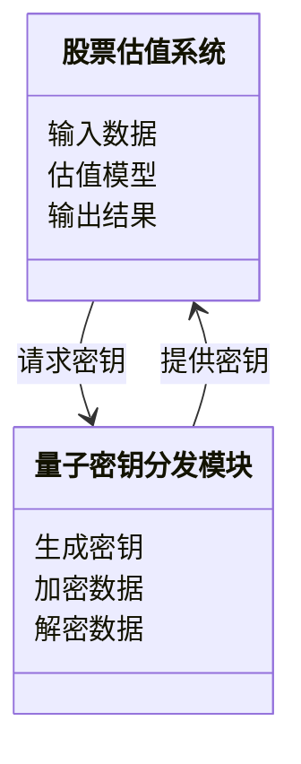
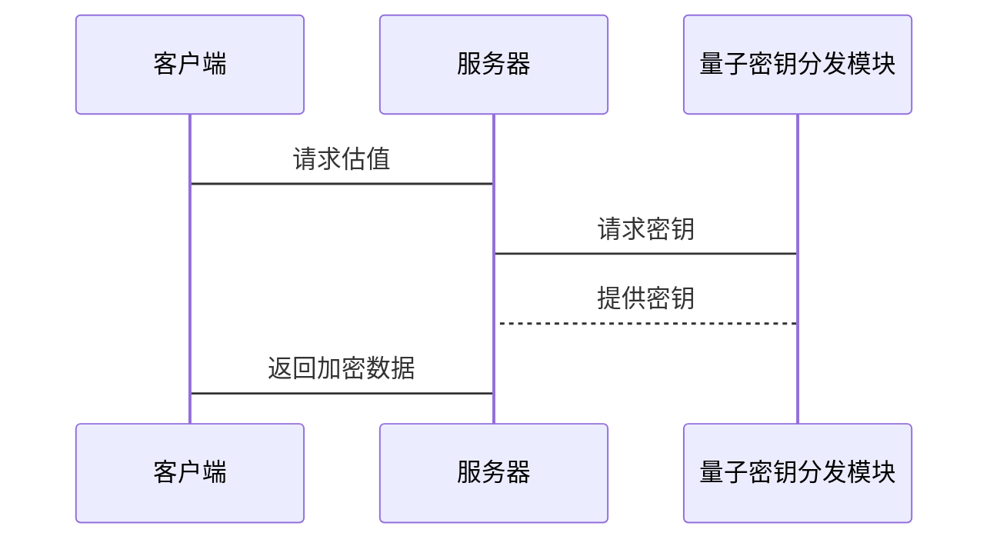

                 


# 全球股市估值与量子密钥分发在金融安全中的应用

> 关键词：全球股市估值，量子密钥分发，金融安全，量子加密，数据保护

> 摘要：本文探讨了全球股市估值的重要性以及如何通过量子密钥分发技术提升金融数据的安全性。文章详细介绍了量子密钥分发的基本原理及其在金融安全中的应用，结合具体案例分析了其在股市估值中的优势和应用场景。通过理论与实践的结合，本文为金融领域的技术从业者提供了新的视角和解决方案。

---

## 第一部分: 全球股市估值与量子密钥分发概述

### 第1章: 全球股市估值的现状与挑战

#### 1.1 全球股市估值的定义与重要性

全球股市估值是通过对上市公司财务数据的分析，对其市场价值进行评估的过程。它不仅是投资者决策的重要依据，也是衡量经济健康状况的重要指标。股市估值的核心在于通过市盈率、市净率、股息率等指标，对企业的内在价值进行量化评估。

- **市盈率（P/E Ratio）**：衡量股票价格是否合理的重要指标，计算公式为：市盈率 = 股票价格 / 每股净利润。  
- **市净率（P/B Ratio）**：用于评估股票相对于其账面价值的高低，计算公式为：市净率 = 股票价格 / 每股净资产。  
- **股息率（Dividend Yield）**：衡量股票分红能力的指标，计算公式为：股息率 = 每股股息 / 股票价格。

#### 1.2 传统股市估值方法的局限性

传统估值方法在面对全球化市场的波动性和复杂性时，暴露出诸多不足。例如，市盈率法在高增长行业中的适用性较差，市净率法在资产-heavy行业的适用性有限，而股息率法则难以应对低分红企业的评估。

此外，传统估值方法忽略了市场参与者的非理性行为和宏观经济环境的不确定性，导致估值结果可能存在较大偏差。特别是在全球金融危机中，传统估值方法的局限性更加明显，往往无法及时反映市场风险。

#### 1.3 金融安全与数据保护的重要性

金融数据的泄露可能引发严重的经济损失和信任危机。传统加密技术依赖于数学算法的复杂性，而随着量子计算的发展，传统加密算法（如RSA、AES）的安全性逐渐受到威胁。量子密钥分发作为一种基于量子力学原理的加密技术，能够提供更高的安全性。

---

### 第2章: 量子密钥分发的基本原理

#### 2.1 量子密钥分发的定义与特点

量子密钥分发（Quantum Key Distribution, QKD）是一种利用量子力学原理实现密钥安全分发的技术。其核心思想是通过量子态的不可克隆性和测量干扰性，确保密钥的传输过程无法被窃听。

- **不可克隆性**：量子态无法被精确复制，任何窃听行为都会破坏量子态的状态。  
- **测量干扰性**：一旦第三方试图测量量子态，系统会立即产生干扰，从而暴露窃听行为。

#### 2.2 量子密钥分发的数学模型

量子密钥分发的数学模型主要基于量子态的叠加原理和纠缠原理。例如，BB84协议利用正交基的随机选择和量子态的不可测量性，确保密钥的安全性。

- **量子态表示**：量子态可以用复数向量表示，例如，$|0\rangle = \begin{pmatrix} 1 \\ 0 \end{pmatrix}$ 和 $|1\rangle = \begin{pmatrix} 0 \\ 1 \end{pmatrix}$。  
- **量子密钥分发协议**：BB84协议通过随机选择测量基和比较基，确保密钥的正确性和安全性。

#### 2.3 量子密钥分发的实际应用

量子密钥分发已经在通信、金融等领域得到广泛应用。例如，瑞士的 Geneva-Lausanne 量子通信网络通过光纤实现了城市间的量子密钥分发，为金融交易提供了更高的安全性。

---

### 第3章: 量子密钥分发在金融安全中的应用

#### 3.1 金融数据保护的需求

金融数据的保护需要同时满足安全性、完整性和可用性。传统加密技术在面对量子计算威胁时显得力不从心，而量子密钥分发提供了更高的安全性。

- **安全性**：量子密钥分发的密钥传输过程无法被窃听，确保金融数据的安全性。  
- **完整性**：通过量子密钥分发生成的密钥确保数据的完整性，防止数据篡改。  
- **可用性**：量子密钥分发的高安全性为金融系统的可用性提供了保障。

#### 3.2 量子密钥分发在金融数据保护中的优势

量子密钥分发在金融数据保护中的优势主要体现在以下几个方面：

1. **抗量子攻击**：量子密钥分发的密钥生成过程依赖于量子力学原理，无法被量子计算机破解。  
2. **高安全性**：通过测量干扰性和不可克隆性，确保密钥的安全性。  
3. **高效率性**：量子密钥分发的密钥分发速度接近光速，能够满足金融交易的实时性要求。

#### 3.3 量子密钥分发在金融交易中的具体应用

量子密钥分发在金融交易中的具体应用包括：

1. **金融交易的加密传输**：通过量子密钥分发实现金融交易数据的加密传输，确保数据在传输过程中的安全性。  
2. **金融数据的加密存储**：利用量子密钥分发生成的密钥对金融数据进行加密存储，防止数据泄露。  
3. **金融系统的身份认证**：通过量子密钥分发实现金融系统的身份认证，确保系统访问的安全性。

---

## 第二部分: 全球股市估值与量子密钥分发的结合

### 第4章: 全球股市估值的复杂性

#### 4.1 全球化市场的波动性

全球化市场的波动性使得股市估值变得更加复杂。例如，全球经济环境的变化、地缘政治风险、货币政策调整等因素都会对股市估值产生重大影响。

#### 4.2 经济环境的不确定性

经济环境的不确定性是股市估值的核心挑战之一。例如，通货膨胀、利率变化、汇率波动等因素都会影响企业的盈利能力和股票的市场价值。

#### 4.3 市场参与者的多样性

市场的参与者包括机构投资者、个人投资者、政府基金等，不同参与者的行为和决策都会对股市估值产生影响。

---

### 第5章: 量子密钥分发在股市估值中的作用

#### 5.1 数据加密对估值准确性的影响

通过量子密钥分发实现的数据加密能够确保股市估值数据的准确性和完整性，防止数据篡改和泄露。

#### 5.2 量子密钥分发对估值模型的优化

量子密钥分发的高安全性为股市估值模型提供了更高的数据可靠性，能够优化估值模型的准确性和稳定性。

#### 5.3 量子密钥分发对估值系统的安全性提升

通过量子密钥分发实现的密钥管理能够提升股市估值系统的安全性，防止恶意攻击和数据泄露。

---

### 第6章: 具体应用场景分析

#### 6.1 高频交易中的数据加密

高频交易需要实时的交易数据加密，量子密钥分发的高安全性能够满足高频交易的实时性和安全性要求。

#### 6.2 股票交易的实时估值

通过量子密钥分发实现的实时数据加密和传输，能够提升股票交易的实时估值准确性和安全性。

---

## 第三部分: 系统分析与架构设计方案

### 第7章: 问题场景介绍

#### 7.1 问题背景

随着全球化市场的快速发展，股市估值的复杂性和金融数据的安全性要求越来越高。传统的估值方法和加密技术已经难以满足当前的需求。

#### 7.2 项目介绍

本项目旨在通过量子密钥分发技术提升全球股市估值的准确性和安全性，构建一个高效、安全的金融估值系统。

---

### 第8章: 系统功能设计

#### 8.1 领域模型

以下是领域模型的 Mermaid 类图：



#### 8.2 系统架构设计

以下是系统架构的 Mermaid 图：

```mermaid
client
    participant 客户端
    participant 服务器
    participant 量子密钥分发模块
    client -> 服务器: 请求估值
    服务器 -> 量子密钥分发模块: 请求密钥
    量子密钥分发模块 -> 服务器: 提供密钥
    服务器 -> 客户端: 返回加密数据
```

---

### 第9章: 系统接口设计与交互流程

#### 9.1 系统接口设计

系统接口设计主要涉及以下几个部分：

1. **密钥生成接口**：用于生成量子密钥。  
2. **数据加密接口**：用于对估值数据进行加密。  
3. **数据解密接口**：用于对加密数据进行解密。

#### 9.2 系统交互流程

以下是系统交互的 Mermaid 序列图：



---

## 第四部分: 项目实战

### 第10章: 环境安装与系统实现

#### 10.1 环境安装

需要安装以下工具：

1. **Quantum Key Distribution (QKD) 软件**：用于实现量子密钥分发。  
2. **金融数据处理工具**：用于处理股票估值数据。  
3. **开发环境**：建议使用 Python 和相关库（如 NumPy、Pandas）。

#### 10.2 核心代码实现

以下是量子密钥分发模块的核心代码：

```python
import random

def generate_key():
    basis = ['|0><0|', '|1><1|']
    key = []
    for _ in range(10):
        basis_choice = random.choice(basis)
        key.append(basis_choice)
    return key

def compare_bases(basis1, basis2):
    if basis1 == basis2:
        return True
    else:
        return False

# 示例代码
key = generate_key()
print("生成的密钥：", key)

# 比较基
print("比较基：", compare_bases(key[0], key[1]))
```

---

## 第五部分: 小结与展望

### 第11章: 小结

本文详细探讨了全球股市估值与量子密钥分发在金融安全中的应用。通过分析传统估值方法的局限性和量子密钥分发的优势，提出了结合量子技术提升股市估值准确性和安全性的解决方案。

---

### 第12章: 展望

随着量子计算技术的不断发展，量子密钥分发在金融领域的应用前景广阔。未来，可以通过进一步优化量子密钥分发算法和结合人工智能技术，进一步提升金融数据的安全性和股市估值的准确性。

---

## 作者

作者：AI天才研究院/AI Genius Institute & 禅与计算机程序设计艺术 /Zen And The Art of Computer Programming

---

通过本文的分析和实践，我们希望能够为金融领域的技术从业者提供新的思路和解决方案，推动金融技术的创新发展。

