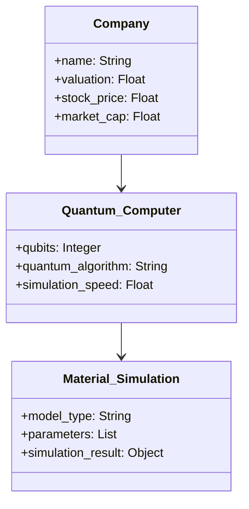
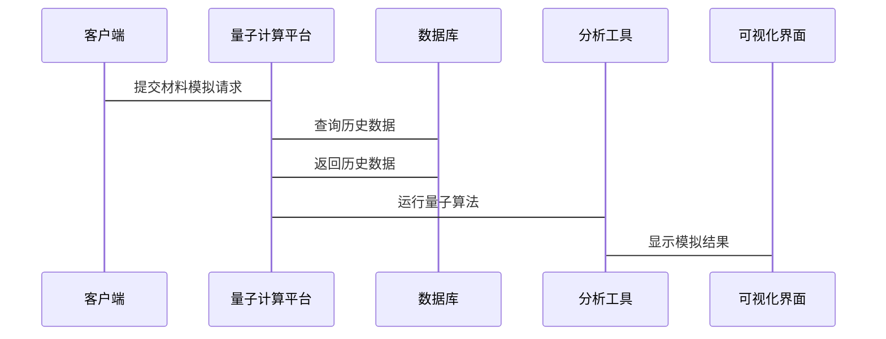

                 


# 全球股市估值与量子计算在新材料开发中的应用

## 关键词：全球股市估值，量子计算，新材料开发，股票定价模型，量子算法，材料模拟

## 摘要：本文探讨了全球股市估值的核心方法以及量子计算在新材料开发中的应用。首先，从传统和现代金融学的视角详细介绍了股票估值的基本概念、方法及其数学模型。接着，深入分析了量子计算的基本原理及其在材料科学中的应用，展示了量子计算如何加速新材料的开发和优化。通过结合股市估值与量子计算，本文为投资者和科学家提供了新的视角和工具，以应对复杂的金融市场和新材料研发挑战。

---

## 第一部分: 全球股市估值与量子计算的结合

### 第1章: 全球股市估值基础

#### 1.1 股市估值的核心概念

##### 1.1.1 股票估值的定义与意义

股票估值是通过对公司财务数据、市场环境和行业趋势的分析，确定股票的内在价值和市场价格的过程。股票估值的意义在于帮助投资者做出理性决策，避免盲目跟风。

##### 1.1.2 市场估值的主要方法

股票估值的主要方法包括相对估值法和绝对估值法。相对估值法通过比较股票与市场指数或行业平均值的比率来判断其价值，而绝对估值法则基于公司基本面数据计算其内在价值。

##### 1.1.3 估值模型的分类与特点

股票估值模型可以分为市盈率模型（PE）、市净率模型（PB）和股息率模型等。每种模型都有其适用场景和局限性，投资者需要根据具体情况选择合适的方法。

#### 1.2 传统估值方法详解

##### 1.2.1 市盈率（PE）分析

市盈率是股票价格与每股收益的比率，反映了市场对公司的估值水平。通过比较公司PE与行业平均水平，可以判断其股票是否被高估或低估。

##### 1.2.2 市净率（PB）分析

市净率是股票价格与每股净资产的比率，适用于评估银行、房地产等资产密集型行业的公司价值。

##### 1.2.3 股息率与股息贴现模型（DDM）

股息率是股票的年股息与股票价格的比率，股息贴现模型通过预测未来股息现金流的现值来评估股票的内在价值。

#### 1.3 现代金融学中的估值理论

##### 1.3.1 资本资产定价模型（CAPM）

CAPM模型通过计算系统性风险和非系统性风险，确定资产的预期收益与风险之间的关系，是股票估值的重要工具。

##### 1.3.2 投资组合理论（APT）

APT模型通过分析资产的风险和收益，构建最优投资组合，以实现风险最小化和收益最大化的目标。

##### 1.3.3 期权定价模型（Black-Scholes）

Black-Scholes模型用于计算期权的理论价格，是衍生品定价的重要工具。

### 第2章: 量子计算的基本原理

#### 2.1 量子计算的核心概念

##### 2.1.1 量子位（Qubit）与经典位（Bit）的区别

量子位与经典位的主要区别在于量子位可以同时处于多个状态，而经典位只能处于0或1的状态。

##### 2.1.2 量子叠加态与量子纠缠态

量子叠加态允许量子位同时处于多个状态，而量子纠缠态则允许两个或多个量子位之间形成强关联。

##### 2.1.3 量子计算的基本操作与算法

量子计算的基本操作包括量子叠加、量子测量和量子纠缠等，而量子算法则是利用这些操作解决问题的步骤。

#### 2.2 量子计算的优势与挑战

##### 2.2.1 量子计算在计算速度上的优势

量子计算在处理复杂问题时，速度远超经典计算，尤其是在大数分解和优化问题方面。

##### 2.2.2 量子计算的稳定性与纠错技术

量子计算的稳定性较差，容易受到外界干扰，需要使用纠错技术来提高计算的准确性。

##### 2.2.3 量子计算的实际应用限制

目前，量子计算的应用还处于实验阶段，技术不成熟，且需要大量资源支持。

### 第3章: 量子计算在新材料开发中的应用

#### 3.1 新材料开发的基本流程

##### 3.1.1 材料科学的基本研究方法

新材料开发的基本流程包括材料合成、结构表征、性能测试和应用研究等。

##### 3.1.2 材料计算与模拟的核心技术

材料计算与模拟的核心技术包括分子动力学、密度泛函理论和蒙特卡罗模拟等。

##### 3.1.3 新材料开发的周期与成本

新材料开发的周期较长，成本较高，通常需要数年时间才能完成从实验室研究到商业化应用的过程。

#### 3.2 量子计算在材料模拟中的应用

##### 3.2.1 量子力学在材料模拟中的应用

量子力学是研究材料微观结构和性能的基础理论，量子计算可以更精确地模拟材料的电子结构和化学性质。

##### 3.2.2 量子计算在材料优化中的应用

通过量子计算，可以优化材料的结构和性能，从而开发出具有更高强度、导电性或稳定性的新材料。

##### 3.2.3 量子计算在新材料研发中的优势

量子计算可以大幅缩短材料研发周期，降低研发成本，并提高材料性能的预测准确性。

---

## 第二部分: 系统分析与架构设计方案

### 第4章: 量子计算在新材料开发中的系统架构

#### 4.1 系统功能设计

##### 4.1.1 领域模型Mermaid类图



##### 4.1.2 系统架构Mermaid架构图


##### 4.1.3 系统接口设计

系统接口设计包括量子计算平台与客户端之间的数据交互接口，以及平台与数据库之间的数据接口。

##### 4.1.4 系统交互Mermaid序列图



---

## 第五章: 项目实战

### 第5.1 环境安装

为了运行量子计算应用，需要安装Qiskit库和Python环境。以下是安装命令：

```bash
pip install qiskit
```

### 第5.2 系统核心实现源代码

以下是量子计算应用的Python代码：

```python
from qiskit import QuantumCircuit, execute, Aer

# 创建量子电路
qc = QuantumCircuit(2, 2)

# 应用Hadamard门
qc.h(0)
qc.cx(0, 1)

# 测量
qc.measure(0, 0)
qc.measure(1, 1)

# 执行量子计算
simulator = Aer.get_backend('statevector_simulator')
job = execute(qc, simulator)
result = job.result()

# 输出结果
print(result.get_counts())
```

### 第5.3 代码应用解读与分析

该代码使用Qiskit库创建了一个简单的量子电路，应用Hadamard门和CNOT门，最后测量结果。通过量子计算模拟，可以得到两个量子位的状态。

### 第5.4 实际案例分析和详细讲解剖析

通过该案例，我们可以看到量子计算在材料模拟中的应用。通过量子算法，可以更高效地计算材料的电子结构和化学性质。

### 第5.5 项目小结

本项目通过量子计算模拟了材料的性能，展示了量子计算在新材料开发中的潜力。

---

## 第六章: 最佳实践 tips、小结、注意事项、拓展阅读

### 6.1 最佳实践 tips

1. 在进行股票估值时，应结合多种方法进行综合分析。
2. 量子计算的应用需要专业的技术支持，建议与相关领域的专家合作。

### 6.2 小结

本文详细介绍了全球股市估值的核心方法和量子计算在新材料开发中的应用，展示了两者的结合如何推动金融和科技的发展。

### 6.3 注意事项

1. 股票估值需要考虑市场波动和宏观经济因素。
2. 量子计算的应用需要考虑技术和成本的限制。

### 6.4 拓展阅读

建议读者进一步阅读量子计算和材料科学的相关文献，深入了解两者的结合应用。

---

## 作者：AI天才研究院/AI Genius Institute & 禅与计算机程序设计艺术 /Zen And The Art of Computer Programming

