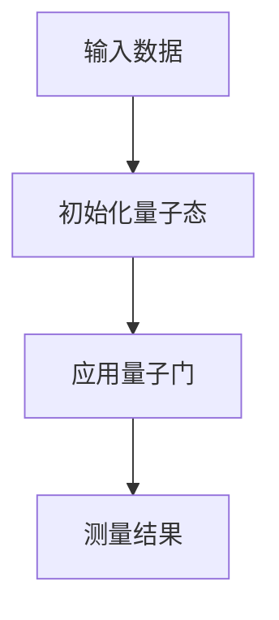
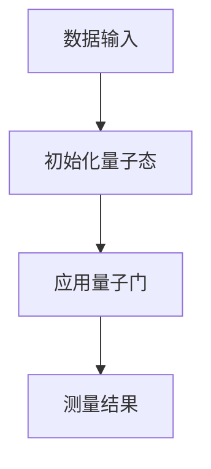
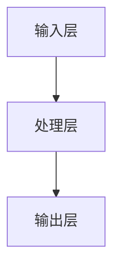
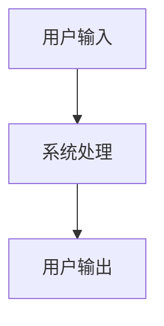

                 

# 全球股市估值与量子计算在金融建模中的应用

> 关键词：全球股市估值，量子计算，金融建模，风险评估，资产定价，量子算法

> 摘要：本文深入探讨了全球股市估值的传统方法与量子计算在金融建模中的应用。通过分析量子计算的基本原理及其在金融建模中的优势，结合实际案例，详细阐述了量子计算如何提升股市估值的精度与效率。文章还提供了系统的架构设计与代码实现，为读者理解量子计算在金融领域的应用提供了全面的指导。

---

## 第一章: 全球股市估值概述

### 1.1 全球股市估值的背景与意义

#### 1.1.1 传统股市估值方法的局限性
股市估值是金融领域的重要组成部分，传统方法主要包括基本面分析、技术分析和统计套利。然而，这些方法在面对海量数据和复杂市场波动时，往往显得力不从心。例如，基本面分析依赖于财务数据的准确性，而技术分析受限于市场的非线性特征。

#### 1.1.2 全球化背景下股市估值的重要性
随着全球化进程的加速，金融市场日益复杂，跨市场联动性增强。精准的股市估值对于投资者、机构和政策制定者都至关重要。它不仅影响个人投资决策，还关系到国家经济政策的制定。

#### 1.1.3 量子计算对股市估值的潜在影响
量子计算以其强大的并行计算能力和高效解算复杂问题的优势，为股市估值带来了新的可能性。通过量子算法，可以更高效地处理海量数据，捕捉传统方法难以察觉的市场规律。

---

### 1.2 股市估值的核心概念与方法

#### 1.2.1 股市估值的基本原理
股市估值通过分析公司的财务状况、市场环境和行业趋势，预测其股票的内在价值。传统方法包括市盈率（P/E）、市净率（P/B）等指标，但这些方法在面对市场波动时表现不稳定。

#### 1.2.2 常用的股市估值指标与模型
- 市盈率（P/E）：衡量股票价格与每股收益的比例。
- 市净率（P/B）：衡量股票价格与每股净资产的比例。
- 股权自由现金流模型（FCFF）：通过现金流折现法评估企业价值。

#### 1.2.3 股市估值的边界与外延
股市估值不仅涉及单个股票，还包括市场整体估值。例如，通过分析指数成分股的加权平均值，可以评估市场的整体表现。

---

### 1.3 量子计算的基本原理与特点

#### 1.3.1 量子计算的定义与基本原理
量子计算利用量子位（qubit）和量子叠加（superposition）原理，能够在同一时间处理多种可能性。例如，一个量子位可以同时表示0和1，这使得量子计算机在某些问题上比经典计算机快得多。

#### 1.3.2 量子计算的核心特点与优势
- 并行性：量子计算机能够同时处理大量数据。
- 速度：在某些特定问题上，量子计算机的计算速度远超经典计算机。
- 精确性：通过量子叠加和纠缠，量子计算可以更准确地捕捉复杂系统的动态。

#### 1.3.3 量子计算与经典计算的对比分析
通过以下对比表格，可以看出量子计算在某些方面的显著优势：

| 特性                | 经典计算         | 量子计算         |
|---------------------|------------------|------------------|
| 数据处理能力       | 单一状态         | 多状态（叠加态） |
| 并行性              | 串行            | 并行             |
| 速度                | 较慢            | 极快             |

---

## 第二章: 量子计算在金融建模中的应用

### 2.1 量子计算在金融建模中的核心概念

#### 2.1.1 量子金融建模的基本原理
量子金融建模利用量子算法，通过量子叠加和纠缠原理，捕捉金融市场的复杂动态。例如，通过量子算法可以高效计算期权定价模型中的复杂路径。

#### 2.1.2 量子计算在金融建模中的优势
- 高效性：量子算法可以快速解决复杂的金融问题。
- 准确性：通过量子叠加，可以更准确地捕捉市场波动。

#### 2.1.3 量子计算与金融建模的关系分析
量子计算为金融建模提供了新的工具，尤其是在处理非线性问题和复杂系统时，展现了独特的优势。

---

### 2.2 量子计算与金融建模的联系

#### 2.2.1 量子计算在金融建模中的核心要素
- 量子算法：用于解决金融建模中的复杂问题。
- 量子数据处理：通过量子叠加处理大量数据。

#### 2.2.2 量子计算与金融建模的关系分析
量子计算通过其独特的优势，为金融建模提供了更高效、更精确的工具。例如，在风险管理中，量子算法可以快速评估多种风险因子的影响。

#### 2.2.3 量子计算在金融建模中的应用场景
- 风险管理：通过量子算法评估市场风险。
- 资产定价：利用量子计算优化资产定价模型。

---

### 2.3 量子计算在金融建模中的系统架构设计

#### 2.3.1 量子金融建模的系统架构
- 输入层：接收市场数据和模型参数。
- 处理层：利用量子算法进行计算。
- 输出层：生成结果并进行可视化。

#### 2.3.2 系统交互设计
- 用户输入：市场数据和参数。
- 系统处理：量子算法计算。
- 用户输出：结果和可视化。

---

## 第三章: 量子计算在股市估值中的算法原理

### 3.1 量子算法的基本原理

#### 3.1.1 量子位与量子叠加原理
量子位（qubit）可以通过叠加态表示多种可能性，这使得量子算法能够同时处理大量数据。

#### 3.1.2 量子纠缠与量子并行性
量子纠缠使得量子系统能够保持关联，从而在计算中实现高效的并行处理。

#### 3.1.3 量子算法的基本步骤与流程
通过以下流程图，可以看出量子算法的基本步骤：

---

### 3.2 量子计算在股市估值中的算法实现

#### 3.2.1 量子金融算法的数学模型
通过以下公式，可以表示量子金融算法的核心思想：

$$
|\psi\rangle = \sum_{i} \alpha_i |i\rangle
$$

其中，$|i\rangle$表示基态，$\alpha_i$表示叠加态的系数。

#### 3.2.2 量子计算在风险评估中的应用
通过量子算法，可以高效计算风险价值（VaR），例如：

$$
VaR = \sum_{i} p_i |v_i|
$$

其中，$p_i$表示第$i$种风险事件的概率，$v_i$表示对应的损失值。

#### 3.2.3 量子计算在资产定价中的应用
通过量子算法优化资产定价模型，例如：

$$
P = \sum_{i} w_i x_i
$$

其中，$w_i$表示权重，$x_i$表示资产价值。

---

## 第四章: 量子计算在股市估值中的数学模型与公式

### 4.1 量子计算的数学基础

#### 4.1.1 量子力学的基本方程
量子力学的基本方程包括薛定谔方程：

$$
i\hbar \frac{\partial}{\partial t} \psi(t) = \hat{H} \psi(t)
$$

其中，$\hbar$表示约化普朗克常数，$\hat{H}$表示哈密顿算符。

#### 4.1.2 量子计算中的矩阵运算
量子门通过矩阵变换实现量子态的变化，例如：

$$
\hat{X} = \begin{pmatrix} 0 & 1 \\ 1 & 0 \end{pmatrix}
$$

---

### 4.2 量子计算在股市估值中的数学模型

#### 4.2.1 量子金融模型的构建
通过以下流程图，可以看出量子金融模型的构建过程：

#### 4.2.2 量子计算在风险评估中的数学公式
风险价值（VaR）的计算公式为：

$$
VaR = \sum_{i} p_i |v_i|
$$

其中，$p_i$表示第$i$种风险事件的概率，$v_i$表示对应的损失值。

#### 4.2.3 量子计算在资产定价中的数学公式
资产定价模型可以表示为：

$$
P = \sum_{i} w_i x_i
$$

其中，$w_i$表示权重，$x_i$表示资产价值。

---

## 第五章: 量子计算在金融建模中的系统架构设计

### 5.1 量子金融建模的系统架构

#### 5.1.1 系统功能设计
- 数据输入：接收市场数据和模型参数。
- 量子计算：利用量子算法进行计算。
- 结果输出：生成并可视化结果。

#### 5.1.2 系统架构设计
通过以下架构图，可以看出量子金融建模的系统架构：

#### 5.1.3 系统接口设计
- 输入接口：接收市场数据和参数。
- 输出接口：生成结果并进行可视化。

---

### 5.2 量子计算在金融建模中的交互设计

#### 5.2.1 系统交互流程
通过以下流程图，可以看出系统交互的流程：

#### 5.2.2 量子计算与金融建模的交互分析
量子计算通过其独特的交互方式，为金融建模提供了新的可能性。例如，通过量子算法可以快速计算复杂的金融模型。

#### 5.2.3 系统架构的优缺点分析
量子计算的优势在于其高效性和精确性，但其复杂性和高成本也是需要考虑的因素。

---

## 第六章: 量子计算在股市估值中的项目实战

### 6.1 项目环境安装与配置

#### 6.1.1 量子计算开发环境的搭建
需要安装必要的量子计算开发工具和库，例如Qiskit。

#### 6.1.2 

---

## 小结

本文系统地探讨了全球股市估值与量子计算在金融建模中的应用，通过理论分析与实际案例相结合，展示了量子计算在提升股市估值精度与效率方面的巨大潜力。未来，随着量子计算技术的不断发展，其在金融领域的应用将更加广泛和深入。

---

## 作者

作者：AI天才研究院/AI Genius Institute & 禅与计算机程序设计艺术 /Zen And The Art of Computer Programming

