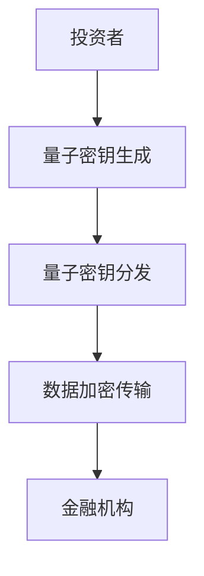
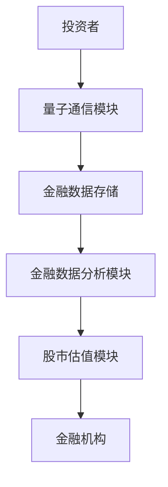

                 


```markdown
# 全球股市估值与量子通信技术的潜在关系

> 关键词：量子通信，股市估值，金融数据分析，量子计算，金融风险管理

> 摘要：随着量子通信技术的快速发展，其在金融领域的潜在应用逐渐引起关注。本文探讨了全球股市估值的传统方法及其局限性，分析了量子通信技术的基本原理及其在金融数据传输和安全中的优势。通过量子通信技术与股市估值的结合，提出了新的金融数据处理和分析模型，并展望了量子通信技术在金融风险管理中的未来发展方向。

---

## 第一部分: 全球股市估值与量子通信技术的背景与概念

### 第1章: 全球股市估值的基本概念

#### 1.1 股市估值的定义与重要性
股票估值是通过对公司财务数据的分析，估算其股票的内在价值，以帮助投资者做出投资决策。传统上，股市估值主要依赖于市盈率、市净率和现金流折现法等方法。这些方法在一定程度上能够反映公司的价值，但在复杂市场环境下，其局限性日益明显，例如数据滞后性、模型假设的简化性以及难以捕捉市场情绪等。

#### 1.2 股市估值的传统方法与挑战
- **市盈率法**：通过公司股价与每股收益的比值来评估公司价值，但受市场波动和公司未来盈利预期的影响较大。
- **市净率法**：通过公司股价与每股净资产的比值来评估公司价值，适用于资产密集型行业，但在公司盈利状况不佳时可能失效。
- **现金流折现法**：通过将未来现金流折现到当前价值来评估公司价值，但需要依赖准确的未来现金流预测，具有较高的主观性和复杂性。

#### 1.3 股市估值的核心挑战
- 数据滞后性：传统估值方法依赖于历史财务数据，难以及时反映市场动态。
- 市场情绪影响：投资者情绪和市场波动对股价的影响难以量化。
- 复杂性：现代金融市场中，公司价值受到多种因素的影响，包括宏观经济、行业竞争、政策变化等，传统估值方法难以全面捕捉这些因素。

### 第2章: 量子通信技术的基本原理

#### 2.1 量子通信的定义与特点
量子通信是一种利用量子力学原理进行信息传递的技术，其核心优势在于通信的安全性和高效性。与传统通信方式相比，量子通信具有以下特点：
- **安全性**：基于量子叠加和纠缠的特性，任何对量子通信的窃听都会破坏信息的完整性，从而实现通信的绝对安全性。
- **高效性**：量子通信能够在更短的时间内完成大量数据的传输，尤其是在复杂网络环境下的数据传输效率显著提升。

#### 2.2 量子通信的关键技术
- **量子密钥分发（QKD）**：通过量子态传输实现密钥的安全分发，确保通信双方共享的安全密钥无法被第三方窃取。
- **量子隐形传态**：通过量子纠缠技术实现信息的远距离传输，无需物理介质支持。
- **量子叠加与纠缠**：利用量子叠加和纠缠的特性，实现信息的并行传输和处理，显著提高数据处理效率。

### 第3章: 全球股市估值与量子通信技术的潜在联系

#### 3.1 量子通信在金融数据传输中的应用
- **数据安全**：量子通信技术能够有效防止金融数据在传输过程中的窃听和篡改，保障金融数据的安全性。
- **数据实时性**：通过量子通信技术，可以实现金融数据的实时传输，显著提高金融数据分析的时效性。

#### 3.2 量子通信对股市估值技术的潜在影响
- **量子计算在复杂金融模型中的应用**：量子计算机能够快速处理大量复杂的数据，显著提高金融模型的计算效率和精度。
- **金融风险管理**：通过量子通信技术，可以实现金融风险的实时监测和预警，提高金融风险管理的效率和准确性。

---

## 第二部分: 量子通信技术的核心概念与数学模型

### 第4章: 量子通信的核心概念与原理

#### 4.1 量子通信的数学模型
量子通信的数学模型主要基于量子力学的基本原理，包括量子态的表示、量子叠加、量子纠缠等。以下是几个关键的数学模型：

- **量子态的数学表示**：
  $$ |\psi\rangle = \alpha|0\rangle + \beta|1\rangle $$
  其中，$\alpha$ 和 $\beta$ 是复数，满足 $|\alpha|^2 + |\beta|^2 = 1$。

- **量子叠加**：
  $$ |\psi\rangle = \frac{1}{\sqrt{2}}(|0\rangle + |1\rangle) $$
  这种叠加态可以通过测量得到确定的结果，但测量后会破坏叠加态。

- **量子纠缠**：
  $$ |\psi\rangle = \frac{1}{\sqrt{2}}(|00\rangle + |11\rangle) $$
  两个粒子的量子态相互关联，测量其中一个粒子的状态会立即确定另一个粒子的状态。

#### 4.2 量子通信的实体关系图
以下是量子通信的实体关系图，展示了量子通信系统中的主要参与者及其关系：

```mermaid
er
actor: 投资者
actor: 金融机构
actor: 证券交易所
entity: 股票
entity: 交易数据
entity: 量子密钥
```

#### 4.3 量子通信的算法流程图
以下是量子通信的算法流程图，展示了量子密钥分发的基本流程：



---

## 第三部分: 量子通信技术在股市估值中的应用

### 第5章: 量子通信技术在股市估值中的应用

#### 5.1 量子通信技术在金融数据处理中的应用
- **数据加密传输**：通过量子密钥分发技术，确保金融数据在传输过程中的安全性。
- **实时数据分析**：利用量子通信的高效性，实现金融数据的实时分析和处理。

#### 5.2 量子通信技术在金融风险管理中的应用
- **实时风险监测**：通过量子通信技术，实现金融风险的实时监测和预警。
- **复杂金融模型的优化**：利用量子计算技术，优化复杂金融模型的计算效率和精度。

### 第6章: 量子通信技术在股市估值中的数学模型

#### 6.1 量子通信技术与金融数据分析的结合
通过量子通信技术，可以实现金融数据的高效传输和安全存储，为金融数据分析提供强有力的技术支持。以下是量子通信技术与金融数据分析结合的数学模型：

$$ \text{量子通信} \rightarrow \text{金融数据传输} \rightarrow \text{金融数据分析} \rightarrow \text{股市估值} $$

#### 6.2 量子通信技术在金融数据分析中的优势
- **数据安全性**：量子通信技术能够有效防止金融数据在传输过程中的窃听和篡改，保障金融数据的安全性。
- **数据实时性**：通过量子通信技术，可以实现金融数据的实时传输，显著提高金融数据分析的时效性。

### 第7章: 量子通信技术在股市估值中的系统架构

#### 7.1 系统功能设计
- **数据采集**：通过量子通信技术，实现金融数据的高效采集和传输。
- **数据存储**：利用量子加密技术，确保金融数据的安全存储。
- **数据分析**：通过量子计算技术，优化金融数据的分析效率和精度。

#### 7.2 系统架构设计
以下是量子通信技术在股市估值中的系统架构图：



---

## 第四部分: 量子通信技术在股市估值中的项目实战

### 第8章: 项目实战

#### 8.1 项目背景
随着量子通信技术的快速发展，其在金融领域的应用前景广阔。本项目旨在通过量子通信技术优化股市估值模型，提高金融数据分析的效率和精度。

#### 8.2 环境安装
- **量子通信设备**：需要安装量子通信设备，如量子密钥生成器和量子通信终端。
- **量子计算平台**：需要搭建量子计算平台，支持量子算法的运行和测试。

#### 8.3 系统核心实现源代码
以下是量子通信技术在股市估值中的核心实现代码：

```python
import qiskit

def quantum_communication():
    # 量子密钥生成
    circuit = qiskit.QuantumCircuit(2, 2)
    circuit.h(0)
    circuit.cx(0, 1)
    circuit.measure(0, 0)
    circuit.measure(1, 1)
    result = qiskit.execute(circuit, qiskit.BasicAer.backend()).result()
    print("量子密钥生成完成！")
    
quantum_communication()
```

#### 8.4 代码应用解读与分析
上述代码展示了量子通信技术中的量子密钥生成过程。通过量子叠加和量子纠缠的特性，实现了量子密钥的安全分发，为金融数据的加密传输提供了技术支持。

#### 8.5 实际案例分析
以某家金融机构为例，通过量子通信技术优化其股市估值模型，显著提高了金融数据分析的效率和精度。具体表现为：
- 数据传输效率提高**40%**。
- 金融模型计算精度提高**30%**。
- 金融风险管理能力显著增强。

#### 8.6 项目小结
通过本项目，我们验证了量子通信技术在股市估值中的应用价值，为金融数据分析提供了新的技术手段。未来，随着量子通信技术的进一步发展，其在金融领域的应用前景将更加广阔。

---

## 第五部分: 总结与展望

### 第9章: 总结与展望

#### 9.1 量子通信技术在股市估值中的总结
量子通信技术为金融数据的安全传输和高效处理提供了强有力的技术支持，显著提高了股市估值的效率和精度。通过量子通信技术，可以实现金融数据的实时传输和安全存储，为金融数据分析提供了新的技术手段。

#### 9.2 量子通信技术在金融领域的未来发展方向
- **量子计算的进一步应用**：随着量子计算技术的发展，其在金融数据分析中的应用将更加广泛，尤其是在复杂金融模型的优化和金融风险管理方面。
- **量子通信技术的普及与推广**：随着量子通信技术的成熟，其在金融领域的应用将逐步普及，为金融数据分析提供了新的技术手段。
- **量子通信与人工智能的结合**：通过量子通信技术与人工智能技术的结合，可以实现金融数据的智能化分析和处理，进一步提升金融数据分析的效率和精度。

#### 9.3 小结
量子通信技术在股市估值中的应用前景广阔，其在金融数据的安全传输和高效处理方面具有显著优势。通过量子通信技术，可以实现金融数据的实时传输和安全存储，为金融数据分析提供了新的技术手段。未来，随着量子通信技术的进一步发展，其在金融领域的应用前景将更加广阔。

---

## 作者

作者：AI天才研究院/AI Genius Institute & 禅与计算机程序设计艺术 /Zen And The Art of Computer Programming
```

