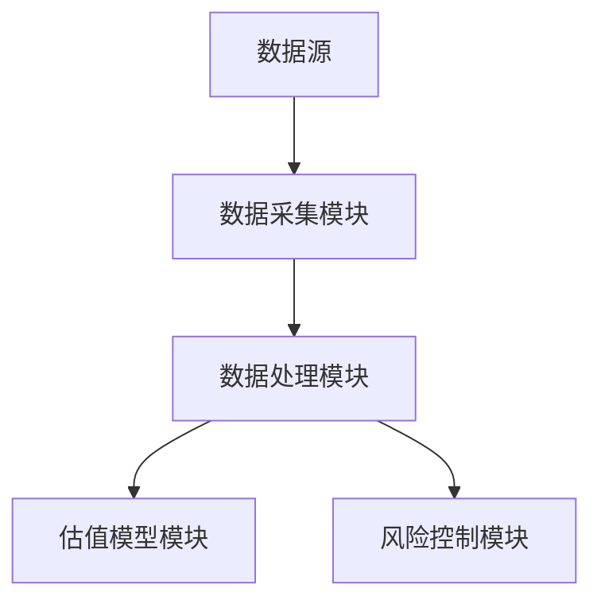
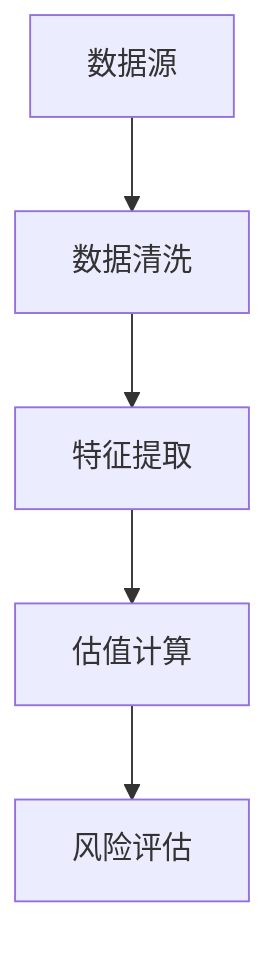
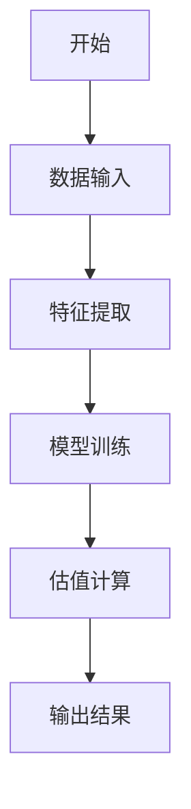

                 


# 全球股市估值与金融科技创新的关联

> **关键词**：全球股市估值、金融科技创新、人工智能、大数据分析、区块链技术

> **摘要**：本文探讨了金融科技创新如何影响全球股市估值的方法和结果。通过分析大数据、人工智能和区块链等技术对传统估值模型的优化，本文展示了金融科技创新如何提升股市估值的准确性和效率，同时指出了未来的发展趋势。

---

# 第1章: 全球股市估值的基本概念

## 1.1 股市估值的定义与传统方法

### 1.1.1 股市估值的基本概念

股市估值是通过对上市公司财务数据和市场信息的分析，评估其股票的内在价值。传统估值方法包括市盈率（P/E）、市净率（P/B）、股息率等指标。这些方法基于历史数据和市场假设，帮助投资者判断股票是否被高估或低估。

### 1.1.2 市盈率、市净率等传统估值指标

- **市盈率（P/E）**：股票价格除以每股收益，反映了投资者对每股收益的支付意愿。
- **市净率（P/B）**：股票价格除以每股净资产，适用于评估银行、保险公司等资产密集型行业的公司。
- **股息率**：股息与股票价格的比率，反映了股票的分红能力。

### 1.1.3 传统估值方法的优缺点

- **优点**：简单易懂，易于计算，适用于大多数行业。
- **缺点**：依赖历史数据，无法预测未来市场变化，且假设市场有效性和理性投资者行为。

---

## 1.2 全球股市估值的现状

### 1.2.1 不同市场环境下的估值差异

全球股市估值受经济周期、政策变化和地缘政治等因素影响，不同市场环境下的估值差异显著。例如，新兴市场的估值可能受到高增长预期的影响，而成熟市场的估值则更依赖于稳定的收益。

### 1.2.2 传统估值方法的局限性

传统估值方法在面对复杂市场环境时显得力不从心，例如：

- 高波动性市场中，市盈率和市净率可能无法准确反映公司价值。
- 在公司业绩不佳或亏损的情况下，传统指标可能失去参考价值。

### 1.2.3 现代金融理论对估值的影响

现代金融理论，如CAPM（资本资产定价模型）和APT（ arbitrage pricing theory），为传统估值方法提供了理论支持，但仍然依赖于假设条件，难以应对实际市场中的复杂性。

---

# 第2章: 金融科技创新的核心概念

## 2.1 金融科技创新的定义与范围

### 2.1.1 金融科技的定义

金融科技（Fintech）是指利用技术手段创新传统金融业务模式、改善金融服务效率的新兴领域。它涵盖了支付、借贷、投资、保险等多个金融领域。

### 2.1.2 金融科技的核心技术领域

- **大数据分析**：通过海量数据挖掘和分析，提供更精准的市场洞察。
- **人工智能**：利用机器学习算法优化投资决策和风险控制。
- **区块链技术**：通过分布式账本技术提升交易透明度和安全性。
- **云计算**：提供弹性计算资源，支持金融业务的扩展和创新。

### 2.1.3 金融科技对传统金融的颠覆性影响

金融科技通过技术创新降低了传统金融的交易成本，提高了服务效率，例如在线支付、智能投顾和自动化交易系统。

---

## 2.2 金融科技创新的主要驱动力

### 2.2.1 技术进步的推动

人工智能、大数据和区块链等技术的进步为金融创新提供了基础。

### 2.2.2 数据爆炸与计算能力提升

数据的快速增长和计算能力的提升为金融科技创新提供了新的可能性。

### 2.2.3 金融市场需求的变化

投资者对个性化服务和实时信息的需求推动了金融科技创新。

---

# 第3章: 全球股市估值与金融科技创新的关联

## 3.1 金融科技创新对股市估值的影响

### 3.1.1 大数据分析技术在估值中的应用

通过分析社交媒体、新闻媒体和公司财报等多源数据，大数据分析可以提供更全面的市场洞察。

### 3.1.2 人工智能算法对估值模型的优化

机器学习算法可以识别数据中的非线性关系，提高估值模型的准确性。

### 3.1.3 区块链技术在交易透明化中的作用

区块链技术可以确保交易数据的不可篡改性，提升估值模型的可信度。

---

## 3.2 传统估值方法的局限性与创新解决方案

### 3.2.1 传统估值方法的局限性分析

传统估值方法在处理复杂市场环境时表现不佳，例如高波动性和信息不对称问题。

### 3.2.2 金融科技创新如何弥补传统方法的不足

通过引入大数据和人工智能技术，金融科技创新可以更准确地捕捉市场动态，优化估值模型。

### 3.2.3 新型估值模型的优势与挑战

新型估值模型具有更高的准确性和适应性，但面临数据质量和模型解释性等挑战。

---

# 第4章: 金融科技创新对全球股市的影响

## 4.1 金融科技创新对股市流动性的影响

### 4.1.1 电子交易系统的普及

电子交易系统提高了交易效率，降低了交易成本。

### 4.1.2 算法交易的兴起

算法交易通过自动化决策提高了交易速度和效率。

### 4.1.3 交易速度与效率的提升

金融科技创新显著提升了交易效率，但可能导致市场波动加剧。

---

## 4.2 金融科技创新对股市风险管理的影响

### 4.2.1 风险评估模型的创新

通过大数据和人工智能技术，风险评估模型可以更准确地识别和量化风险。

### 4.2.2 金融衍生品的创新与风险控制

金融衍生品的创新为投资者提供了更多对冲工具，但也带来了复杂的风险。

### 4.2.3 系统性风险的监测与预警

金融科技创新通过实时数据分析，提高了系统性风险的监测和预警能力。

---

## 4.3 金融科技创新对股市信息透明度的影响

### 4.3.1 区块链技术在交易透明化中的应用

区块链技术确保了交易数据的透明和不可篡改。

### 4.3.2 大数据技术在信息整合中的作用

大数据技术可以整合多源信息，提供更全面的市场信息。

### 4.3.3 信息不对称的减少与市场效率的提升

信息透明度的提高有助于减少信息不对称，提升市场效率。

---

# 第5章: 全球股市估值与金融科技创新的系统分析

## 5.1 系统架构设计

### 5.1.1 系统功能模块划分

- 数据采集模块
- 数据处理模块
- 估值模型模块
- 风险控制模块

### 5.1.2 系统架构图（Mermaid）



---

## 5.2 数据流分析

### 5.2.1 数据流图（Mermaid）



---

## 5.3 算法实现

### 5.3.1 算法流程图（Mermaid）



### 5.3.2 代码实现（Python）

```python
import pandas as pd
from sklearn.linear_model import LinearRegression

# 数据准备
data = pd.read_csv('stock_data.csv')

# 特征选择
features = ['PE', 'PB', 'dividend_yield']
target = 'target_price'

# 模型训练
model = LinearRegression()
model.fit(data[features], data[target])

# 估值计算
new_data = pd.DataFrame({'PE': [15], 'PB': [2], 'dividend_yield': [0.05]})
predicted_price = model.predict(new_data[features])
print(f'预测股价为: {predicted_price[0]:.2f}')
```

---

## 5.4 数学模型

### 5.4.1 传统估值模型

$$ P = \frac{E}{P/E} $$

### 5.4.2 机器学习估值模型

$$ y = \beta_0 + \beta_1 x_1 + \beta_2 x_2 + \epsilon $$

---

# 第6章: 项目实战

## 6.1 环境搭建与数据准备

### 6.1.1 数据源的选择与获取

使用Yahoo Finance获取历史股价数据和财务数据。

### 6.1.2 数据清洗与预处理

- 处理缺失值
- 标准化数据
- 处理异常值

---

## 6.2 系统核心实现

### 6.2.1 环境安装

```bash
pip install pandas numpy scikit-learn
```

### 6.2.2 核心代码实现

```python
import pandas as pd
from sklearn.model_selection import train_test_split
from sklearn.metrics import mean_squared_error

# 数据加载
data = pd.read_csv('stock_data.csv')

# 特征选择
features = ['PE', 'PB', 'dividend_yield']
target = 'target_price'

# 数据分割
X_train, X_test, y_train, y_test = train_test_split(data[features], data[target], test_size=0.2, random_state=42)

# 模型训练
model = LinearRegression()
model.fit(X_train, y_train)

# 预测与评估
predicted_prices = model.predict(X_test)
print(f'均方误差: {mean_squared_error(y_test, predicted_prices):.2f}')
```

---

## 6.3 实际案例分析

### 6.3.1 案例背景

分析某科技公司股票的估值，使用传统方法和机器学习方法进行对比。

### 6.3.2 数据分析与模型训练

通过数据清洗和特征工程，训练机器学习模型。

### 6.3.3 模型评估与结果解读

对比传统估值方法和机器学习方法的预测结果，分析误差来源。

---

## 6.4 项目小结

金融科技创新通过引入大数据和人工智能技术，显著提升了股市估值的准确性和效率。然而，仍需关注数据质量和模型解释性等问题。

---

# 第7章: 总结与展望

## 7.1 全文总结

本文探讨了金融科技创新对全球股市估值的影响，分析了大数据、人工智能和区块链等技术在估值中的应用。

## 7.2 未来展望

未来，随着技术的不断进步，金融科技创新将在股市估值中发挥更大的作用，例如：

- 更加智能化的估值模型
- 更加个性化的投资服务
- 更加透明化的交易流程

---

# 作者

作者：AI天才研究院 & 禅与计算机程序设计艺术

