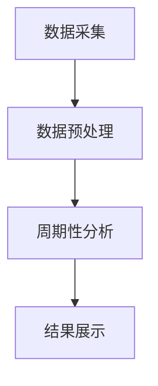
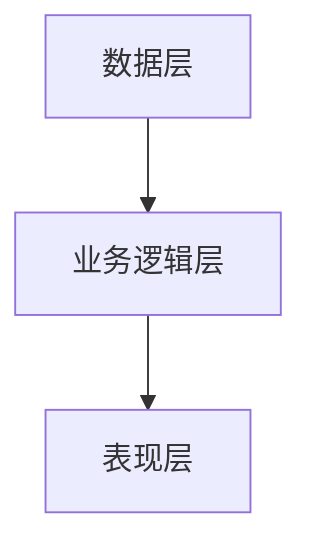
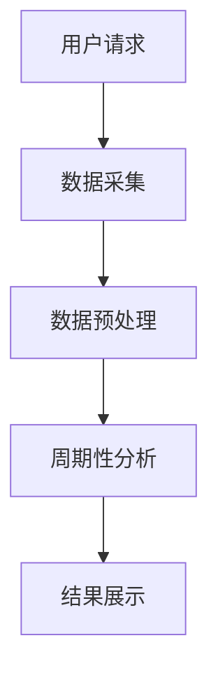

                 


# 全球股市估值周期性特征探讨

## 关键词：全球股市、周期性特征、估值模型、经济周期、技术分析、时间序列分析、市场波动

## 摘要：本文探讨了全球股市估值的周期性特征，分析了其背后的影响因素，提出了基于时间序列分析和机器学习的周期性特征提取方法，并通过实际案例展示了其在投资决策中的应用。

---

# 第1章: 全球股市估值周期性特征的背景与重要性

## 1.1 全球股市估值的周期性特征概述

### 1.1.1 股市估值的基本概念
股市估值是指对股票市场价格进行评估的过程，通常基于公司的基本面（如利润、收入、资产等）和技术面（如价格、成交量等）进行分析。股市估值的波动性是市场参与者的共同关注点，而周期性特征则是这种波动性的重要组成部分。

### 1.1.2 周期性特征的定义与分类
周期性特征是指在一定时间内，市场变量（如股价、指数等）表现出的规律性波动模式。周期性特征可以分为长期周期（如经济周期）和短期周期（如市场情绪波动）。常见的周期性特征包括：
- 经济周期：经济从衰退到复苏再到繁荣，再到衰退的循环。
- 市场情绪周期：投资者情绪从乐观到悲观再到乐观的循环。
- 季节性周期：某些市场变量在特定时间段内表现出规律性波动。

### 1.1.3 研究周期性特征的重要性
研究周期性特征有助于投资者更好地理解市场波动的规律，制定更科学的投资策略。例如：
- 在经济衰退周期，可以降低风险资产的配置。
- 在市场情绪乐观周期，可以增加高风险资产的投资。
- 在季节性波动周期，可以提前布局相关行业。

## 1.2 历史案例分析

### 1.2.1 20世纪重大股市波动回顾
20世纪的股市波动包括：
- 1929年美国经济大萧条与股市崩盘。
- 1987年“黑色星期一”股灾。
- 2008年全球金融危机。

### 1.2.2 21世纪以来的股市周期性分析
21世纪以来的股市波动包括：
- 2000年互联网泡沫破裂。
- 2008年全球金融危机后的复苏。
- 2020年新冠疫情引发的市场崩盘。

### 1.2.3 典型周期性波动案例解读
以2008年全球金融危机为例：
- 危机前的市场情绪过于乐观，投资者大量买入高杠杆金融产品。
- 危机发生后，市场情绪迅速转向悲观，股价大幅下跌。
- 政府救市政策出台后，市场情绪逐步恢复，股价开始回升。

## 1.3 周期性波动的驱动因素

### 1.3.1 经济周期与股市估值的关系
经济周期是影响股市估值的核心因素之一。在经济衰退周期，企业盈利下降，股价通常会下跌；在经济复苏和繁荣周期，企业盈利增长，股价通常会上涨。

### 1.3.2 政治经济事件的影响
政治经济事件（如战争、政策变化等）会引发市场波动，影响股市估值的周期性特征。

### 1.3.3 技术进步与市场结构变化
技术进步（如量化交易、高频交易）改变了市场的交易方式和价格形成机制，影响股市估值的周期性特征。

## 1.4 本章小结
本章介绍了全球股市估值周期性特征的背景与重要性，分析了其历史案例，并探讨了周期性波动的驱动因素。

---

# 第2章: 周期性特征的核心概念与联系

## 2.1 周期性特征的核心概念

### 2.1.1 周期性特征的定义与属性
周期性特征是市场变量在一定时间内表现出的规律性波动模式，具有周期性、重复性和可预测性。

### 2.1.2 周期性特征与其他波动特征的对比
| 特征类型 | 随机波动 | 周期性波动 |
|----------|----------|------------|
| 特征描述 | 无规律性 | 有规律性   |
| 预测难度 | 高 | 中等       |
| 影响因素 | 不可预测 | 可预测     |

### 2.1.3 周期性特征的数学表达式
周期性特征可以用正弦函数或余弦函数表示：
$$
y(t) = A \cdot \sin(Bt + C) + D
$$
其中，$A$ 是振幅，$B$ 是频率，$C$ 是相位，$D$ 是偏移量。

## 2.2 周期性特征的驱动因素分析

### 2.2.1 经济周期的数学模型
经济周期可以用马科维茨的经济周期模型来描述：
$$
Y_t = \alpha + \beta \cdot Z_t + \epsilon_t
$$
其中，$Y_t$ 是经济指标，$Z_t$ 是周期性因子，$\epsilon_t$ 是误差项。

### 2.2.2 市场情绪的周期性特征
市场情绪的周期性特征可以用投资者情绪指数（如恐慌指数VIX）来衡量：
$$
VIX_t = \sigma_t
$$
其中，$\sigma_t$ 是市场波动率。

### 2.2.3 政策因素的周期性影响
政策因素（如货币政策、财政政策）对股市估值的周期性影响可以通过回归模型来分析：
$$
R_t = \alpha + \beta \cdot P_t + \epsilon_t
$$
其中，$R_t$ 是股票收益，$P_t$ 是政策变量，$\epsilon_t$ 是误差项。

## 2.3 周期性特征的ER实体关系图


## 2.4 本章小结
本章详细阐述了周期性特征的核心概念，并分析了其与经济周期、市场情绪和政策因素的关系。

---

# 第3章: 周期性特征的算法原理与数学模型

## 3.1 时间序列分析方法

### 3.1.1 时间序列的基本概念
时间序列是指按时间顺序排列的数据序列，通常用于分析数据的动态变化规律。

### 3.1.2 周期性检测方法
周期性检测方法包括：
- 傅里叶变换：通过频域分析检测周期性成分。
- 自相关分析：通过自相关函数检测周期性。
- 模拟移动平均法：通过ARIMA模型预测周期性。

### 3.1.3 周期性特征提取算法
周期性特征提取算法可以通过以下步骤实现：
1. 数据预处理：去除数据中的趋势和噪声。
2. 周期性检测：使用傅里叶变换或自相关分析检测周期性成分。
3. 周期性提取：提取周期性成分的振幅、频率等参数。

## 3.2 傅里叶变换的周期性分析

### 3.2.1 傅里叶变换的基本原理
傅里叶变换是一种将时间序列从时域转换到频域的数学方法，可以用来检测周期性成分。

### 3.2.2 周期性特征提取的步骤
1. 对时间序列进行傅里叶变换。
2. 分析频域中的谱密度，确定周期性成分的频率。
3. 提取周期性成分的振幅和相位。

### 3.2.3 傅里叶变换在股市周期性分析中的应用
以下是一个简单的Python代码示例：

```python
import numpy as np
import matplotlib.pyplot as plt

# 生成时间序列数据
t = np.linspace(0, 10, 100)
y = np.sin(2 * np.pi * t / 5) + np.random.normal(0, 0.2, 100)

# 傅里叶变换
n = len(y)
Y = np.fft.fft(y)

# 绘制频域图
plt.figure(figsize=(10, 5))
plt.plot(np.abs(Y))
plt.title('FFT of Time Series Data')
plt.xlabel('Frequency')
plt.ylabel('Amplitude')
plt.show()
```

## 3.3 周期性特征的数学模型

### 3.3.1 周期函数的定义
周期函数是指在一定周期内重复出现的函数，例如：
$$
f(t) = \sin\left(\frac{2\pi t}{T}\right)
$$
其中，$T$ 是周期。

### 3.3.2 周期性特征的参数估计
周期性特征的参数估计可以通过最小二乘法实现：
$$
\hat{A} = \frac{2}{N}\sum_{t=1}^{N} y(t) \cdot \sin\left(\frac{2\pi t}{T}\right)
$$
$$
\hat{C} = \frac{2}{N}\sum_{t=1}^{N} y(t) \cdot \cos\left(\frac{2\pi t}{T}\right)
$$

### 3.3.3 周期性模型的验证与优化
周期性模型的验证可以通过计算拟合优度和残差平方和来实现：
$$
R^2 = 1 - \frac{\sum_{t=1}^{N} (y(t) - \hat{y}(t))^2}{\sum_{t=1}^{N} (y(t) - \bar{y})^2}
$$
其中，$\bar{y}$ 是样本均值。

## 3.4 本章小结
本章详细介绍了周期性特征的算法原理和数学模型，重点讲解了傅里叶变换和时间序列分析方法。

---

# 第4章: 系统分析与架构设计方案

## 4.1 项目背景与目标

### 4.1.1 项目背景介绍
本项目旨在通过分析全球股市估值的周期性特征，为投资者提供科学的投资决策支持。

### 4.1.2 项目目标与范围
项目目标：
- 提取全球股市估值的周期性特征。
- 分析周期性特征的影响因素。
- 预测未来市场的周期性波动。

项目范围：
- 数据范围：全球主要股市指数（如标普500、沪深300）。
- 时间范围：1970年至今。
- 方法范围：时间序列分析和机器学习。

### 4.1.3 项目的关键成功因素
- 数据的完整性和准确性。
- 模型的稳定性和可解释性。
- 结果的实用性和可操作性。

## 4.2 系统功能设计

### 4.2.1 需求分析与功能模块划分
功能模块包括：
- 数据采集模块：采集全球股市数据。
- 数据预处理模块：清洗和转换数据。
- 周期性分析模块：提取周期性特征。
- 结果展示模块：可视化分析结果。

### 4.2.2 系统功能流程图



### 4.2.3 功能模块的交互设计
用户可以通过界面选择数据范围和分析方法，系统将自动生成分析结果并展示。

## 4.3 系统架构设计

### 4.3.1 系统架构的总体设计
系统架构采用分层架构，包括数据层、业务逻辑层和表现层。

### 4.3.2 系统模块之间的关系


### 4.3.3 系统架构的优缺点分析
优点：
- 结构清晰，易于扩展。
- 分层设计提高了系统的可维护性。

缺点：
- 系统性能可能受到分层架构的限制。

## 4.4 系统接口设计

### 4.4.1 系统接口的定义与规范
接口定义：
- 数据采集接口：从数据库或API获取数据。
- 数据预处理接口：清洗和转换数据。
- 周期性分析接口：提取周期性特征。
- 结果展示接口：可视化分析结果。

### 4.4.2 接口交互流程图



## 4.5 本章小结
本章详细介绍了系统的架构设计和功能设计，为后续的实现提供了理论基础。

---

# 第5章: 项目实战与代码实现

## 5.1 项目实战

### 5.1.1 环境安装
需要安装以下Python库：
- pandas
- numpy
- matplotlib
- scikit-learn

### 5.1.2 系统核心实现源代码

```python
import pandas as pd
import numpy as np
import matplotlib.pyplot as plt
from sklearn.metrics import mean_squared_error

# 数据采集
data = pd.read_csv('stock_data.csv')

# 数据预处理
data = data.dropna()
data['date'] = pd.to_datetime(data['date'])
data.set_index('date', inplace=True)

# 时间序列分析
from statsmodels.tsa.arima_model import ARIMA

model = ARIMA(data['price'], order=(5, 1, 0))
model_fit = model.fit()

# 预测
forecast = model_fit.forecast(steps=30)

# 可视化
plt.figure(figsize=(10, 5))
plt.plot(data['price'], label='实际值')
plt.plot(forecast[0], label='预测值')
plt.title('时间序列预测')
plt.xlabel('时间')
plt.ylabel('价格')
plt.legend()
plt.show()
```

### 5.1.3 代码应用解读与分析
以上代码实现了以下功能：
1. 数据采集：从CSV文件中读取股票数据。
2. 数据预处理：清洗数据并设置时间索引。
3. 时间序列分析：使用ARIMA模型进行预测。
4. 可视化：绘制实际值和预测值的对比图。

### 5.1.4 实际案例分析
以标普500指数为例，使用ARIMA模型预测未来30天的股价走势。

### 5.1.5 详细讲解剖析
1. 数据采集：获取全球主要股市指数的历史数据。
2. 数据预处理：处理缺失值和异常值。
3. 时间序列分析：提取周期性特征并进行预测。
4. 结果展示：可视化分析结果并解释。

## 5.2 本章小结
本章通过实际案例展示了如何利用时间序列分析方法提取股市估值的周期性特征，并进行了预测和可视化。

---

# 第6章: 最佳实践与注意事项

## 6.1 小结
本文详细探讨了全球股市估值的周期性特征，分析了其背后的影响因素，并提出了基于时间序列分析的周期性特征提取方法。

## 6.2 注意事项
1. 数据质量：周期性分析需要高质量的数据支持。
2. 模型选择：不同市场环境下需要选择合适的分析模型。
3. 风险控制：周期性分析结果仅供参考，投资需谨慎。

## 6.3 拓展阅读
推荐阅读以下书籍和文章：
- 《时间序列分析与应用》。
- 《金融数据分析与建模》。
- 《股市投资心理分析》。

---

# 作者：AI天才研究院/AI Genius Institute & 禅与计算机程序设计艺术 /Zen And The Art of Computer Programming

