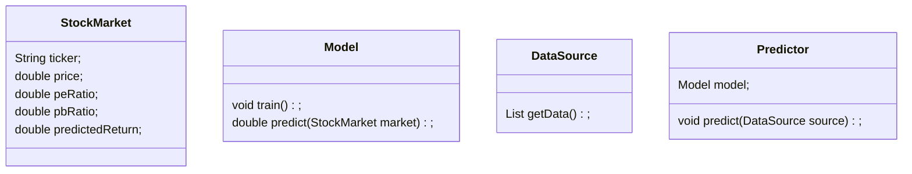
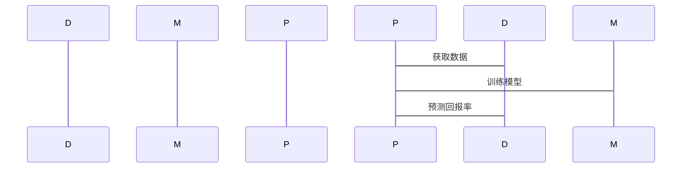

                 


# 全球股市估值和未来回报率预测概述

## 关键词：全球股市、估值模型、回报率预测、机器学习、金融分析

## 摘要：
本文系统地探讨了全球股市估值与未来回报率预测的核心概念、算法原理、系统架构及项目实战。通过分析股市估值的背景与意义，介绍了多种估值模型与预测方法，并结合实际案例展示了如何运用数据驱动与模型驱动相结合的方式进行预测。同时，本文还详细阐述了系统设计与实现，为读者提供了一个从理论到实践的完整指南。

---

# 第一部分: 全球股市估值与未来回报率预测概述

## 第1章: 全球股市估值与回报率预测的背景与意义

### 1.1 全球股市的基本概念与特点

#### 1.1.1 全球股市的定义与分类
全球股市是指全球范围内不同国家或地区的股票市场，主要包括发达市场（如美国、欧洲）和新兴市场（如中国、印度）。每个市场的特点和风险偏好有所不同，但都受到宏观经济、行业动态和市场情绪的影响。

#### 1.1.2 不同市场的特点与差异
- **发达市场**：交易量大、流动性高、监管严格，波动性相对较小。
- **新兴市场**：增长潜力大，但风险较高，受政策和经济波动影响较大。

#### 1.1.3 股市估值的重要性与意义
准确的估值可以帮助投资者做出更明智的投资决策，降低风险，提高投资回报率。

### 1.2 影响股市的主要因素

#### 1.2.1 宏观经济因素
- **GDP增长率**：经济繁荣通常带来股市上涨。
- **利率水平**：低利率环境通常有利于股市上涨。
- **通货膨胀**：适度通胀有助于股市，但过高通胀可能引发市场调整。

#### 1.2.2 行业与公司基本面
- **行业周期**：不同行业在不同经济周期表现不同。
- **公司盈利**：公司盈利能力是股市估值的核心因素。

#### 1.2.3 市场情绪与行为
- **投资者情绪**：市场情绪波动影响短期股价。
- **市场行为**：如追涨杀跌等行为加剧市场波动。

### 1.3 股市估值与回报率预测的挑战

#### 1.3.1 数据的复杂性与不完全性
股市数据包含大量噪声，且受多种因素影响，难以建立准确的预测模型。

#### 1.3.2 市场的不确定性和波动性
股市受宏观经济、政策和突发事件影响，具有高度不确定性。

#### 1.3.3 模型的选择与优化
不同模型适用于不同场景，选择合适的模型并进行优化是关键。

---

## 第2章: 股市估值的核心概念与方法

### 2.1 股市估值的基本原理

#### 2.1.1 估值的定义与目标
估值是通过分析公司基本面和市场环境，确定其股票的合理价格。

#### 2.1.2 估值的核心要素
- **公司盈利**：市盈率（PE）= 股价 / 每股收益。
- **资产价值**：市净率（PB）= 股价 / 每股净资产。
- **现金流**：现金流折现模型（DCF）预测未来现金流的现值。

#### 2.1.3 估值的边界与外延
估值受市场环境、行业特点和公司特殊因素的影响，具有一定的局限性。

### 2.2 常见的估值模型与方法

#### 2.2.1 市盈率（PE）模型
适用于盈利稳定的公司，通过比较PE与行业平均水平判断估值高低。

#### 2.2.2 市净率（PB）模型
适用于资产密集型行业，通过比较PB与行业平均水平判断估值高低。

#### 2.2.3 现金流折现模型（DCF）
通过预测未来现金流并折现至现值，确定股票的内在价值。

### 2.3 回报率预测的理论基础

#### 2.3.1 预测的基本概念
回报率预测是通过分析历史数据和市场趋势，预测未来股票的收益。

#### 2.3.2 预测的驱动因素
- **宏观经济因素**：GDP、利率、通胀等。
- **行业因素**：行业周期、政策变化等。
- **公司因素**：盈利能力、财务状况等。

#### 2.3.3 预测的不确定性与风险
市场波动和突发事件可能导致预测结果与实际结果差异较大。

---

## 第3章: 股市估值与回报率预测的核心概念联系

### 3.1 核心概念原理

#### 3.1.1 估值与回报率的关系
准确的估值是实现高回报率的基础，回报率预测反过来验证估值的合理性。

#### 3.1.2 数据驱动与模型驱动的结合
数据驱动基于历史数据进行预测，模型驱动基于理论进行预测，两者结合可以提高预测准确性。

#### 3.1.3 不同估值方法的优劣势对比
- **PE模型**：简单易用，但受盈利波动影响较大。
- **PB模型**：适用于资产密集型行业，但忽视了盈利因素。
- **DCF模型**：较为复杂，但考虑了未来现金流的全貌。

### 3.2 概念属性特征对比表格

| 概念       | 数据驱动 | 模型驱动 | 适用场景       |
|------------|----------|----------|----------------|
| 市盈率模型  | 高       | 中       | 稳定成长企业   |
| 市净率模型  | 中       | 高       | 资产密集型行业 |
| 现金流模型  | 中       | 高       | 高成长企业     |

---

## 第4章: 股市估值与回报率预测的算法原理

### 4.1 算法原理概述

#### 4.1.1 时间序列分析
时间序列分析是一种基于历史数据预测未来趋势的方法，常用的模型包括ARIMA和GARCH。

#### 4.1.2 机器学习模型
机器学习模型（如随机森林、支持向量机）通过非线性关系捕捉数据特征，提高预测准确性。

### 4.2 重点算法解析

#### 4.2.1 ARIMA模型

##### 4.2.1.1 ARIMA模型原理
ARIMA（自回归积分滑动平均模型）通过捕捉数据的自相关性和趋势，预测未来值。

##### 4.2.1.2 ARIMA模型实现
```python
from statsmodels.tsa.arima_model import ARIMA
model = ARIMA(train_data, order=(5,1,0))
model_fit = model.fit()
```

#### 4.2.2 随机森林模型

##### 4.2.2.1 随机森林模型原理
随机森林通过构建多个决策树并集成预测结果，提高模型的鲁棒性和准确性。

##### 4.2.2.2 随机森林模型实现
```python
from sklearn.ensemble import RandomForestRegressor
model = RandomForestRegressor(n_estimators=100)
model.fit(X_train, y_train)
```

### 4.3 数学公式

#### 4.3.1 ARIMA模型公式
$$ y_t = \phi_1 y_{t-1} + \phi_2 y_{t-2} + \epsilon_t $$

#### 4.3.2 随机森林模型公式
随机森林通过集成多个决策树的预测结果，公式为：
$$ \hat{y} = \frac{1}{N} \sum_{i=1}^{N} T_i(x) $$
其中，$T_i$表示第i棵决策树的预测结果，$N$为决策树的数量。

---

## 第5章: 股市估值与回报率预测的系统分析与架构设计

### 5.1 系统功能设计

#### 5.1.1 领域模型


#### 5.1.2 系统架构
```mermaid
rect
    partition DataSource
    partition Model
    partition Predictor
    partition UI
```

### 5.2 接口设计

#### 5.2.1 数据接口
- `getData()`: 获取历史数据。
- `trainModel()`: 训练预测模型。

#### 5.2.2 预测接口
- `predictReturn()`: 预测未来回报率。

### 5.3 交互流程



---

## 第6章: 股市估值与回报率预测的项目实战

### 6.1 环境配置

#### 6.1.1 安装Python环境
使用Anaconda或Miniconda安装Python和相关库。

#### 6.1.2 安装依赖库
```bash
pip install pandas numpy scikit-learn statsmodels
```

### 6.2 系统核心实现

#### 6.2.1 数据获取与预处理
```python
import pandas as pd
data = pd.read_csv('stock_data.csv')
data = data.dropna().diff().dropna()
```

#### 6.2.2 模型训练与预测
```python
from sklearn.ensemble import RandomForestRegressor
model = RandomForestRegressor(n_estimators=100)
model.fit(X_train, y_train)
y_pred = model.predict(X_test)
```

#### 6.2.3 结果分析
绘制预测值与实际值的对比图，计算相关指标（如MAE、RMSE）。

### 6.3 案例分析

#### 6.3.1 案例选择
以某上市公司为例，分析其估值和回报率预测。

#### 6.3.2 结果展示
通过图表展示预测结果，并与实际数据对比，分析模型的准确性和适用性。

---

## 第7章: 股市估值与回报率预测的最佳实践

### 7.1 小结

#### 7.1.1 核心要点总结
- 理解股市估值的基本概念与方法。
- 掌握时间序列分析与机器学习模型的应用。
- 熟悉系统设计与项目实现的全过程。

### 7.2 注意事项

#### 7.2.1 数据质量
确保数据来源可靠，清洗数据，去除噪声。

#### 7.2.2 模型选择
根据实际情况选择合适的模型，避免过度拟合。

#### 7.2.3 风险管理
合理控制投资风险，避免过度依赖模型预测。

### 7.3 拓展阅读

#### 7.3.1 推荐书籍
- 《投资学》（书籍名称）
- 《机器学习实战》（书籍名称）

#### 7.3.2 在线资源
- [Quantitative Finance Stack Exchange](https://quant.stackexchange.com/)
- [Kaggle股票预测比赛](https://www.kaggle.com/competitions/)

---

## 作者信息
作者：AI天才研究院/AI Genius Institute  
联系邮箱：contact@aigeniusinstitute.com  
网站：https://www.aigeniusinstitute.com/

