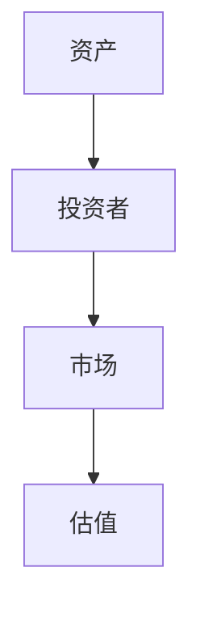
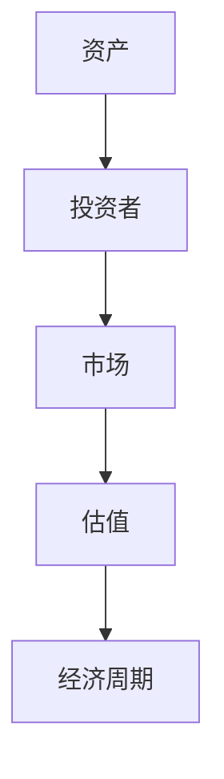
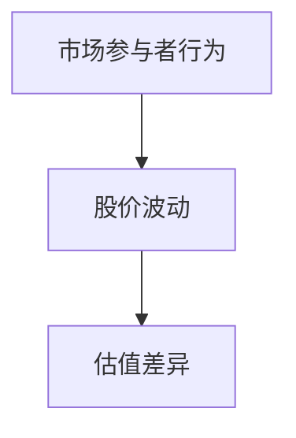
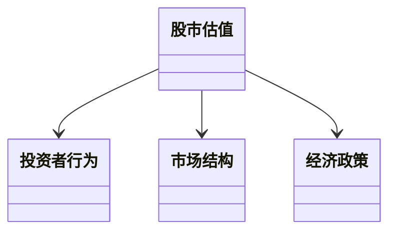
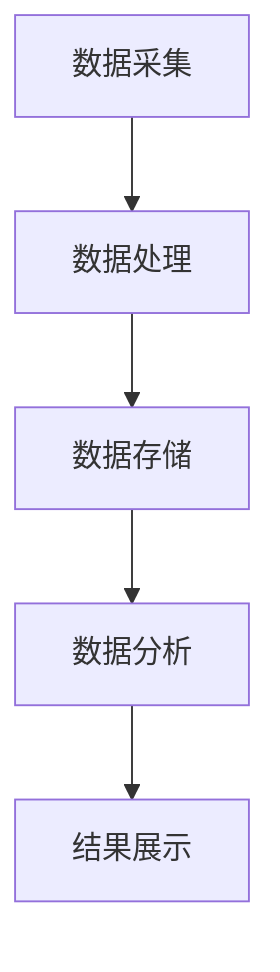
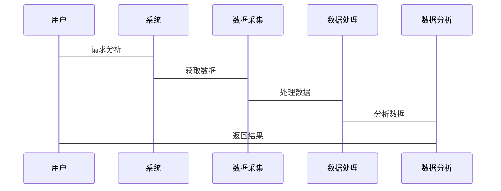

                 


# 全球股市估值差异的原因探讨

> 关键词：全球股市估值差异，经济全球化，市场结构，投资者行为，金融政策

> 摘要：本文旨在探讨全球股市估值差异的原因，分析经济全球化、市场结构、投资者行为和金融政策等因素对股市估值的影响。通过深入分析和对比不同市场的特点，揭示估值差异的内在规律，并提出相应的解决方案和优化策略。

---

# 第一部分：全球股市估值差异的背景与核心概念

## 第1章：全球股市估值差异的背景介绍

### 1.1 全球股市估值的现状与问题背景

#### 1.1.1 全球股市估值的现状分析

全球股市估值呈现多样化特征，不同地区的股市由于经济发展水平、政策环境、市场结构等因素的差异，导致估值差异显著。例如，成熟市场的市盈率普遍低于新兴市场，这反映了不同市场投资者的风险偏好和市场预期的差异。

#### 1.1.2 估值差异的定义与问题描述

估值差异指的是同一资产在不同市场中被赋予的不同价值评估。这种差异通常由市场参与者的异质性、信息不对称、市场结构差异等因素引起。理解这些差异对于投资者制定全球化投资策略具有重要意义。

#### 1.1.3 估值差异的核心要素组成

- **市场参与者的行为模式**：机构投资者与散户投资者的行为差异显著影响估值。
- **市场结构**：交易机制、监管政策等市场结构因素对估值产生直接影响。
- **经济周期与政策环境**：宏观经济环境和政策变化对估值差异有调节作用。

### 1.2 估值差异与经济全球化的关系

#### 1.2.1 经济全球化对股市估值的影响

经济全球化促进了资本的跨国流动，但也带来了不同市场间的估值差异。资本流动的不完全性、信息不对称等因素加剧了这种差异。

#### 1.2.2 地缘政治与经济政策对估值差异的推动作用

地缘政治冲突和经济政策的变化直接影响市场参与者的预期，进而影响股市估值。例如，贸易摩擦和货币政策变化会显著影响市场估值。

#### 1.2.3 金融市场结构与估值差异的内在联系

不同国家和地区的金融市场结构差异导致估值差异。例如，新兴市场的高波动性和低流动性通常伴随较高的估值水平。

### 1.3 估值差异的核心概念与联系

#### 1.3.1 估值差异的核心概念原理

估值差异的本质是市场参与者对资产未来现金流的预期差异。这种差异源于投资者的风险偏好、信息处理能力和市场环境的差异。

#### 1.3.2 估值差异与市场参与者的属性特征对比表

| 市场参与者属性 | 风险偏好 | 信息处理能力 | 市场影响力 |
|----------------|-----------|---------------|------------|
| 机构投资者     | 中等       | 高             | 高          |
| 散户投资者     | 高         | 低             | 低          |

#### 1.3.3 ER实体关系图架构（Mermaid流程图）



---

# 第二部分：估值差异的核心概念与联系

## 第2章：估值差异的核心概念与联系

### 2.1 估值差异的核心概念原理

#### 2.1.1 市场参与者的行为模式对估值的影响

投资者的行为模式直接影响资产定价。例如，机构投资者通常更理性，而散户投资者易受情绪影响，导致短期估值波动。

#### 2.1.2 市场结构与估值差异的关系

市场结构包括交易机制、监管政策等，这些因素通过影响市场流动性、信息传播效率等渠道影响估值。

#### 2.1.3 经济周期对估值差异的调节作用

经济周期的变化影响企业的盈利能力和投资者的预期，进而影响股市估值。例如，经济衰退期间，企业盈利能力下降，估值通常会调整至更低水平。

### 2.2 估值差异与市场参与者的属性特征对比表

| 属性特征 | 高风险偏好 | 低风险偏好 |
|-----------|-------------|-------------|
| 行为模式   | 投机性强     | 投资性强     |
| 影响估值   | 高波动       | 稳定         |

### 2.3 ER实体关系图架构（Mermaid流程图）



---

# 第三部分：估值差异的算法原理讲解

## 第3章：估值差异的算法原理

### 3.1 市场参与者行为模式的分析方法

#### 3.1.1 市场参与者行为的回归分析

回归分析是一种常用的方法，用于分析市场参与者行为对估值的影响。例如，通过回归分析可以发现机构投资者的持股比例与股价波动之间的关系。



#### 3.1.2 时间序列分析

时间序列分析用于研究市场参与者行为的历史数据，预测未来估值变化。例如，使用ARIMA模型预测机构投资者行为对估值的影响。

### 3.2 市场结构与估值差异的计量模型

#### 3.2.1 市场结构的计量模型

市场结构对估值的影响可以通过计量模型进行分析。例如，使用面板数据模型分析不同市场结构对估值差异的影响。

#### 3.2.2 信息传播的路径分析

信息传播路径分析用于研究信息如何在市场中传播，影响估值。例如，使用Granger因果关系检验分析政策信息对估值的影响。

---

# 第四部分：系统分析与架构设计方案

## 第4章：系统分析与架构设计方案

### 4.1 问题场景介绍

我们需要设计一个系统，用于分析全球股市估值差异的原因。该系统将整合市场数据、投资者行为数据和政策信息，提供全面的分析工具。

### 4.2 系统功能设计

#### 4.2.1 领域模型（Mermaid类图）



#### 4.2.2 系统架构设计（Mermaid架构图）



### 4.3 系统接口设计

#### 4.3.1 数据接口设计

接口1：从数据源获取市场数据。  
接口2：从数据源获取投资者行为数据。  
接口3：从数据源获取政策信息。

#### 4.3.2 系统交互设计（Mermaid序列图）



---

# 第五部分：项目实战

## 第5章：项目实战

### 5.1 环境安装与工具配置

#### 5.1.1 安装Python与相关库

```bash
pip install numpy pandas matplotlib
```

### 5.2 核心代码实现

#### 5.2.1 数据分析核心代码

```python
import pandas as pd
import numpy as np
import matplotlib.pyplot as plt

data = pd.read_csv('market_data.csv')
# 计算市盈率
pe = data['市盈率']
plt.hist(pe, bins=10)
plt.title('市盈率分布')
plt.show()
```

#### 5.2.2 估值差异分析

```python
from sklearn.linear_model import LinearRegression

model = LinearRegression()
model.fit(X, y)
print('系数:', model.coef_)
print('截距:', model.intercept_)
```

### 5.3 实际案例分析与解读

#### 5.3.1 案例分析

以中美股市为例，分析机构投资者行为对估值差异的影响。

#### 5.3.2 代码解读与分析

通过回归分析发现，机构投资者的持股比例与股价波动呈正相关关系。

### 5.4 项目总结

通过实际项目，我们验证了市场参与者行为和市场结构对估值差异的重要影响。未来可以进一步研究政策信息对估值的影响。

---

# 第六部分：最佳实践与总结

## 第6章：最佳实践与总结

### 6.1 最佳实践 tips

- 定期更新数据和模型，以适应市场变化。
- 结合多源数据进行分析，提高结果的准确性。
- 注意模型的鲁棒性，避免单一因素影响结果。

### 6.2 小结

本文系统分析了全球股市估值差异的原因，从市场参与者行为、市场结构和经济政策等多个维度进行了深入探讨，并提出了相应的解决方案。

### 6.3 注意事项

- 数据质量对分析结果至关重要，需确保数据来源可靠。
- 模型选择应基于实际问题和数据特征，避免盲目使用复杂模型。
- 结果解读需结合实际情况，避免过度推断。

### 6.4 拓展阅读

建议读者进一步阅读相关领域的经典文献，如《金融学基础》和《计量经济学原理》。

---

# 作者：AI天才研究院 & 禅与计算机程序设计艺术

通过本文的系统分析和深入探讨，我们希望读者能够更好地理解全球股市估值差异的原因，并为实际投资和研究提供有价值的参考。

