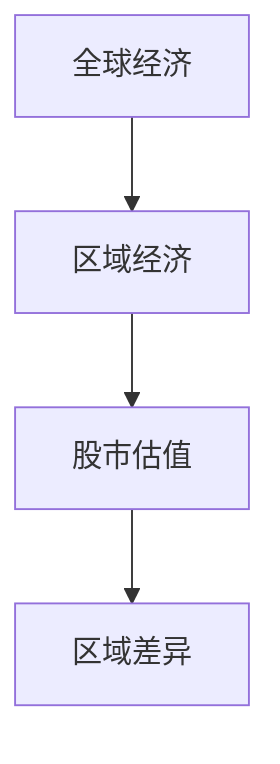
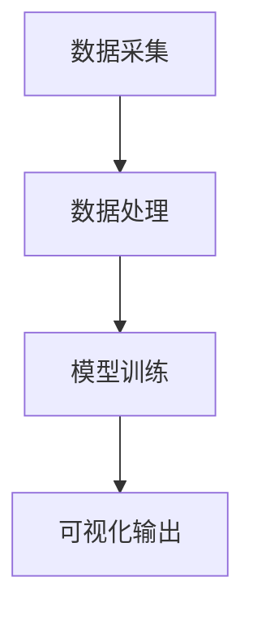

                 


# 全球股市估值的区域差异分析

> 关键词：全球股市估值、区域差异、经济指标、市场情绪、投资策略、数据可视化

> 摘要：本文深入分析全球股市估值的区域差异，探讨影响估值的主要因素，包括宏观经济指标、市场情绪和政策环境。通过实际案例分析，揭示不同区域股市的估值特征，并提出投资策略建议。文章结合技术方法，展示如何通过数据可视化工具和机器学习算法，量化分析区域差异，为投资者提供决策支持。

---

# 引言

全球股市作为反映经济状况的重要指标，其估值水平在不同区域之间存在显著差异。理解这些差异的原因和表现，有助于投资者制定更有效的投资策略。本文将从宏观经济、市场情绪和政策环境三个维度，系统分析全球股市估值的区域差异，并结合实际案例进行深入探讨。

---

# 第1章 全球股市估值的背景与意义

## 1.1 全球股市的基本概念

### 1.1.1 股市估值的核心指标
股市估值通常通过市盈率（PE）、市净率（PB）等指标衡量。这些指标反映了市场对企业的盈利能力、资产质量和成长性的预期。

### 1.1.2 区域差异的背景
不同国家和地区的经济发展水平、政策环境和市场结构差异，导致股市估值出现显著差异。

### 1.1.3 影响股市估值的因素
- 宏观经济指标：GDP增长率、通胀率、利率水平。
- 市场情绪：投资者信心、市场流动性。
- 政策环境：政府政策、监管力度。

## 1.2 区域差异的分析意义

### 1.2.1 企业投资决策
理解区域估值差异，帮助企业制定更有效的跨国投资策略。

### 1.2.2 风险管理
通过分析区域差异，投资者可以更好地评估和管理市场风险。

### 1.2.3 经济学研究
区域估值差异是研究宏观经济、市场行为和政策影响的重要切入点。

---

# 第2章 核心概念与联系

## 2.1 股市估值的核心概念

### 2.1.1 定义与属性
股市估值是对企业股权价值的评估，通常基于财务指标和市场预期。

### 2.1.2 区域差异的属性
区域差异主要体现在估值指标（PE、PB）和市场波动性上。

### 2.1.3 核心概念之间的关系
通过对比不同区域的估值指标，可以揭示区域经济和市场特征的差异。

## 2.2 核心概念之间的关系

### 2.2.1 表格对比
| 区域 | PE均值 | PB均值 | 市场波动性 |
|------|--------|--------|------------|
| 美国 | 15.0    | 1.5     | 低         |
| 日本 | 12.5    | 1.2     | 中         |
| 中国 | 18.0    | 1.8     | 高         |

### 2.2.2 图表展示


---

# 第3章 算法原理与实现

## 3.1 估值算法的核心原理

### 3.1.1 常见估值方法
- 市盈率（PE）：市价/每股收益。
- 市净率（PB）：市价/每股净资产。
- 现金流折现模型（DCF）。

### 3.1.2 区域差异分析的算法选择
使用机器学习算法（如线性回归）对区域估值差异进行建模。

## 3.2 算法实现步骤

### 3.2.1 数据采集
从金融数据库获取全球主要股市的估值指标和宏观经济数据。

### 3.2.2 数据预处理
清洗数据，处理缺失值和异常值。

### 3.2.3 模型训练
使用Python机器学习库（如scikit-learn）训练模型，预测区域估值差异。

## 3.3 数学模型与公式

### 3.3.1 PE计算公式
$$ PE = \frac{\text{股价}}{\text{每股收益}} $$

### 3.3.2 线性回归模型
$$ y = \beta_0 + \beta_1x + \epsilon $$

---

# 第4章 系统分析与架构设计

## 4.1 系统分析

### 4.1.1 问题场景
分析全球主要股市的估值差异，找出影响因素。

### 4.1.2 系统功能
- 数据采集模块：获取股市数据。
- 数据分析模块：计算估值指标。
- 可视化模块：生成差异分析图表。

### 4.1.3 系统架构


---

# 第5章 项目实战

## 5.1 环境安装

### 5.1.1 安装Python和相关库
安装Python 3.x，使用pip安装numpy、pandas、scikit-learn等库。

## 5.2 核心代码实现

### 5.2.1 数据采集代码
```python
import pandas as pd

# 示例数据：全球主要股市PE指标
data = {
    '区域': ['美国', '日本', '中国', '欧洲'],
    'PE均值': [15.0, 12.5, 18.0, 16.0]
}
df = pd.DataFrame(data)
print(df)
```

### 5.2.2 数据分析代码
```python
from sklearn.linear_model import LinearRegression

# 示例：基于GDP增长率预测PE
X = df[['GDP增长率']]
y = df['PE均值']
model = LinearRegression()
model.fit(X, y)
print('系数:', model.coef_[0], '截距:', model.intercept_)
```

## 5.3 案例分析

### 5.3.1 美国股市分析
美国股市PE均值为15.0，低于全球平均水平，反映市场较为成熟。

### 5.3.2 中国股市分析
中国股市PE均值为18.0，高于全球平均水平，反映市场增长潜力大。

---

# 第6章 结论与展望

## 6.1 结论

### 6.1.1 核心发现
区域估值差异受宏观经济、市场情绪和政策环境的综合影响。

### 6.1.2 方法总结
通过机器学习算法和数据可视化工具，可以有效量化分析区域估值差异。

## 6.2 展望

### 6.2.1 未来研究方向
进一步研究地缘政治和市场结构对估值差异的影响。

### 6.2.2 实际应用建议
投资者应结合区域经济特征，制定差异化投资策略。

---

# 附录

## 附录A 数据来源
提供数据来源的详细说明。

## 附录B 工具安装指南
详细指导如何安装和配置相关工具。

## 附录C 参考文献
列出文章中引用的主要文献和资料。

---

# 作者：AI天才研究院/AI Genius Institute & 禅与计算机程序设计艺术 /Zen And The Art of Computer Programming

