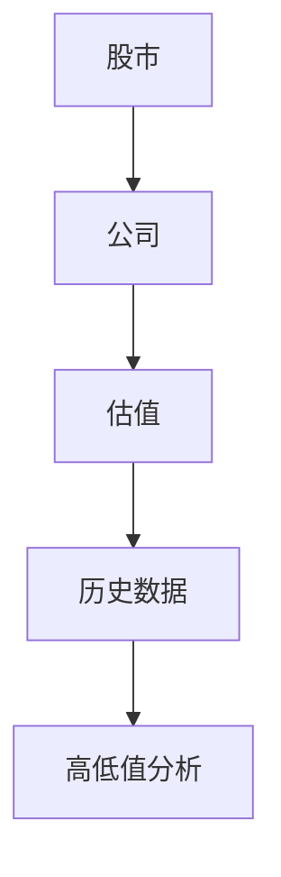
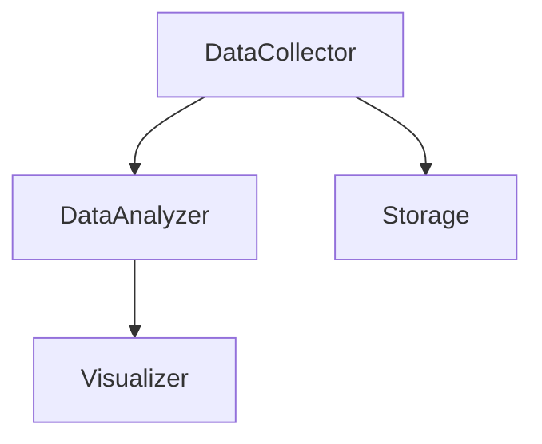

                 


---

# 全球股市估值的历史高低值分析

> 关键词：股市估值、历史高低值、PE、PB、时间序列分析、技术分析

> 摘要：本文系统地分析了全球股市估值的历史高低值，通过介绍核心概念、理论方法、技术实现和实际案例，帮助读者理解如何识别和利用市场估值周期。文章从背景介绍、理论基础到实战项目，全面解析了股市估值的分析过程，为投资者和研究者提供了深入的指导和参考。

---

## 第1章：背景介绍与核心概念

### 1.1 股市估值的基本概念

#### 1.1.1 股票估值的定义与意义
股票估值是指对一家公司内在价值的评估，通过分析其财务状况、行业地位和市场前景，确定其股票的合理价格范围。对于投资者而言，准确的估值可以帮助识别被低估或高估的投资机会，优化资产配置。

#### 1.1.2 市场估值与个股估值的区别
- **市场估值**：反映整体市场的价格水平，通常通过指数点位和市盈率（PE）等指标衡量。
- **个股估值**：针对单个公司的内在价值评估，结合行业特点和公司财务数据。

#### 1.1.3 历史高低值分析的重要性
通过研究历史估值数据，投资者可以识别市场的周期性波动，判断当前市场是否处于高估或低估状态，从而做出更明智的投资决策。

### 1.2 历史高低值分析的背景与问题描述

#### 1.2.1 全球股市的历史演变
从1929年大萧条到2008年金融危机，全球股市经历了多次重大波动，这些事件对估值分析产生了深远影响。

#### 1.2.2 市场波动与估值变化的关系
经济危机、政策变化和技术创新等因素如何影响市场估值，是历史高低值分析的重要内容。

#### 1.2.3 问题解决
通过分析历史数据，识别估值周期，帮助投资者在市场波动中获利。

### 1.3 核心概念与联系

#### 1.3.1 实体关系图


---

## 第2章：股市估值的理论与方法

### 2.1 常用估值指标与模型

#### 2.1.1 PE与PB
- **市盈率（PE）**：$ PE = \frac{Price}{Earnings} $
- **市净率（PB）**：$ PB = \frac{Price}{Book\ Value} $

#### 2.1.2 股息率与股息收益率
- 股息率：$ Dividend Yield = \frac{Dividend}{Price} \times 100\% $
- 股息收益率：基于股息与买入成本的比率。

#### 2.1.3 预估现金流与贴现模型
- 现金流折现模型（DCF）：通过预测未来现金流，计算现值，评估公司价值。

### 2.2 历史高低值分析的算法原理

#### 2.2.1 数据预处理与清洗
- 去除缺失值和异常值，标准化数据格式。

#### 2.2.2 时间序列分析方法
- 移动平均（MA）、指数平滑（ES）等方法识别趋势和周期。

#### 2.2.3 基于统计的高低值识别算法
- 使用均值和标准差，识别偏离均值的估值点。

### 2.3 数学模型与公式

#### 2.3.1 市盈率计算公式
$$ PE = \frac{Price}{Earnings} $$

#### 2.3.2 市净率计算公式
$$ PB = \frac{Price}{Book\ Value} $$

---

## 第3章：全球主要股市的历史估值分析

### 3.1 美国股市的历史估值分析

#### 3.1.1 美国股市的历史表现
- 大萧条时期（1929-1933）：PE降至个位数。
- 网络泡沫（1995-2000）：PE高达50以上。

#### 3.1.2 历史高低值的识别与分析
- 使用PE和PB指标，识别高低点。

#### 3.1.3 不同周期下的估值变化
- 长期牛市中PE偏高，经济衰退时PB较低。

### 3.2 欧洲股市的历史估值分析

#### 3.2.1 欧洲股市的结构
- 英国、德国、法国等市场。

#### 3.2.2 欧元区债务危机的影响
- 市场恐慌导致PE和PB双双下降。

---

## 第4章：技术分析与系统设计

### 4.1 技术分析与工具实现

#### 4.1.1 数据采集与清洗
- 使用Yahoo Finance API获取历史数据。

#### 4.1.2 数据分析与建模
- 使用Pandas进行时间序列分析。

#### 4.1.3 数据可视化
- 用Matplotlib绘制PE和PB的趋势图。

### 4.2 系统架构设计

#### 4.2.1 系统功能设计
- 数据采集模块、分析模块和可视化模块。

#### 4.2.2 系统架构图


---

## 第5章：项目实战与优化

### 5.1 项目实战

#### 5.1.1 环境安装
- Python、Pandas、NumPy安装。

#### 5.1.2 代码实现
```python
import pandas as pd
import matplotlib.pyplot as plt

# 数据获取
data = pd.read_csv('stock_data.csv')

# 数据清洗
data = data.dropna()

# 时间序列分析
pe = data['PE'].rolling(10).mean()

# 可视化
plt.plot(data['Date'], data['PE'], label='PE')
plt.plot(data['Date'], pe, label='Moving Average')
plt.show()
```

### 5.2 优化与扩展

#### 5.2.1 引入机器学习
- 使用LSTM模型预测PE和PB的变化。

#### 5.2.2 扩展市场分析
- 比较不同地区的估值变化。

---

## 第6章：总结与展望

### 6.1 总结
历史高低值分析是理解股市波动的关键，通过技术手段识别这些点，投资者可以做出更明智的决策。

### 6.2 展望
未来，随着技术进步，股市估值分析将更加精准，结合AI和大数据，为投资者提供更强大的工具。

---

作者：AI天才研究院/AI Genius Institute & 禅与计算机程序设计艺术 /Zen And The Art of Computer Programming

