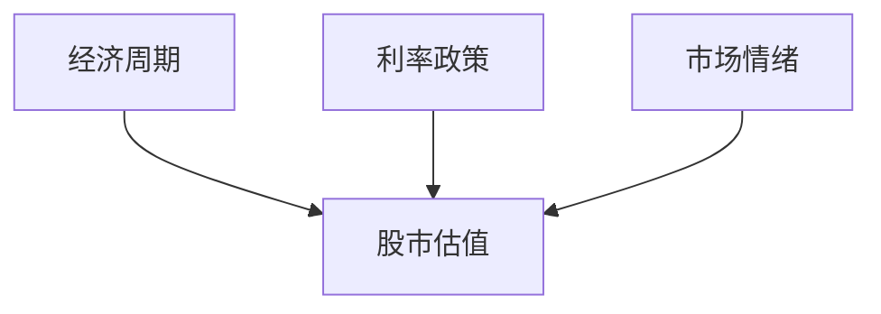
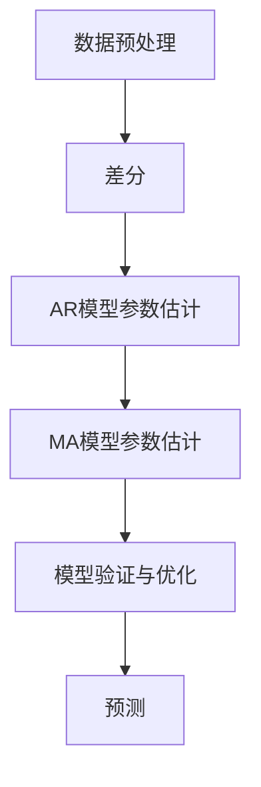
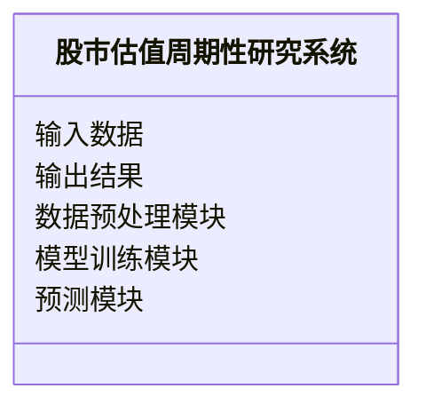
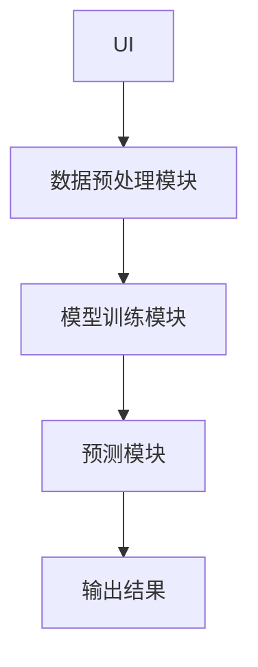
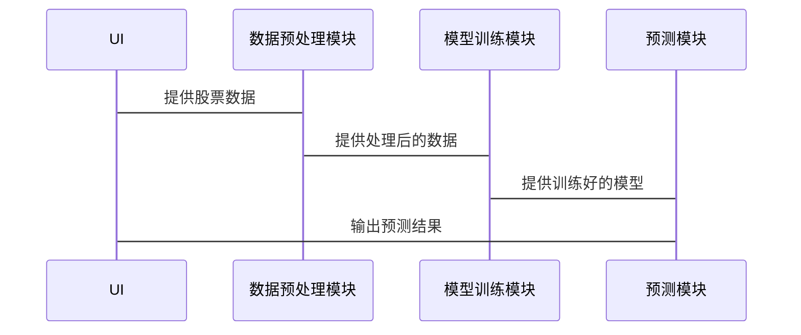

                 


# 全球股市估值的周期性特征研究

## 关键词：股市估值、周期性特征、时间序列分析、机器学习、LSTM、ARIMA

## 摘要：  
本文系统研究了全球股市估值的周期性特征，从经济周期、市场情绪、政策因素等多个维度探讨了影响股市估值周期性的核心要素。通过结合时间序列分析和机器学习算法，本文提出了基于ARIMA和LSTM的混合模型，用于预测股市估值的周期性变化，并通过实际案例验证了模型的有效性。文章最后总结了研究的成果和应用价值。

---

# 第一部分：全球股市估值的周期性特征概述

## 第1章：背景介绍

### 1.1 股市估值的基本概念  
#### 1.1.1 股票估值的定义与意义  
股票估值是指通过对公司财务数据、市场环境和行业趋势等多方面因素的分析，对股票的内在价值进行估算的过程。其意义在于帮助投资者做出理性的投资决策，避免盲目跟风。  

#### 1.1.2 股市估值的核心要素  
- 公司基本面：包括收入、利润、资产负债情况等。  
- 市场环境：如宏观经济政策、利率水平、通货膨胀率等。  
- 行业趋势：行业竞争格局、技术创新等。  

#### 1.1.3 股市估值与市场周期的关系  
股市估值与市场周期密切相关。在经济繁荣期，估值通常较高；而在经济衰退期，估值可能被低估。  

### 1.2 全球股市周期性特征的背景  
#### 1.2.1 股市周期的基本类型  
股市周期主要包括上升周期、下降周期、震荡周期和横盘周期。  

#### 1.2.2 经济周期对股市的影响  
经济周期的波动直接影响股市估值的变化。例如，加息周期通常会导致股市估值下降，而降息周期则可能推高股市估值。  

#### 1.2.3 全球化背景下的股市联动性  
全球化使得全球股市之间的联动性增强，一个地区的经济波动可能迅速影响全球股市估值。  

### 1.3 本研究的目的与意义  
#### 1.3.1 研究的必要性  
通过对全球股市估值周期性特征的研究，可以帮助投资者更好地把握市场规律，优化投资策略。  

#### 1.3.2 研究的创新点  
结合时间序列分析和机器学习算法，构建混合模型预测股市估值周期性变化。  

#### 1.3.3 研究的预期成果  
本文旨在为投资者和研究者提供一套有效的股市估值周期性分析方法，并验证其在实际应用中的可行性。

---

# 第二部分：股市估值周期性特征的核心概念与联系

## 第2章：核心概念与联系

### 2.1 股市估值的核心概念  
#### 2.1.1 市盈率（P/E）的定义与计算  
市盈率 = 股票价格 / 每股净利润。它反映了市场对公司的盈利能力的预期。  

#### 2.1.2 市净率（P/B）的定义与计算  
市净率 = 股票价格 / 每股净资产。它反映了市场对公司的资产价值的评估。  

#### 2.1.3 股息率的定义与计算  
股息率 = 每股股息 / 股票价格。它反映了股票的投资回报率。  

### 2.2 影响股市估值周期性的主要因素  
#### 2.2.1 经济周期的影响  
经济繁荣期通常伴随着股市估值的上升，而经济衰退期则可能导致股市估值的下降。  

#### 2.2.2 利率政策的影响  
加息政策通常会导致股市估值下降，因为资金成本增加，投资者更倾向于选择债券等固定收益资产。  

#### 2.2.3 市场情绪的影响  
市场情绪的波动是影响股市估值的重要因素，恐慌情绪可能导致股市估值的快速下降。  

### 2.3 股市估值周期性特征的概念模型  
#### 2.3.1 概念模型的构建  
通过分析经济周期、利率政策和市场情绪等因素，构建一个综合的概念模型，用于解释股市估值的周期性变化。  

#### 2.3.2 概念属性特征对比表格  
| 因素 | 经济周期 | 利率政策 | 市场情绪 |  
|------|----------|----------|----------|  
| 影响 | 波动性大 | 确定性强 | 不可测性高 |  

#### 2.3.3 ER实体关系图架构的Mermaid流程图  


---

# 第三部分：股市估值周期性特征的算法原理

## 第3章：算法原理讲解

### 3.1 时间序列分析方法  
#### 3.1.1 时间序列的基本概念  
时间序列是指按照时间顺序排列的数据，通常用于分析数据的变化趋势和周期性特征。  

#### 3.1.2 ARIMA模型的原理与应用  
ARIMA（Auto-Regressive Integrated Moving Average）模型是一种常用的时间序列预测模型，适用于具有趋势和季节性特征的数据。  

#### 3.1.3 使用Mermaid流程图展示ARIMA模型的步骤  


#### 3.1.4 ARIMA模型的数学公式  
$$ ARIMA(p, d, q) = y_t = \phi_1 y_{t-1} + \dots + \phi_p y_{t-p} + \theta_1 \epsilon_{t-1} + \dots + \theta_q \epsilon_{t-q} + \epsilon_t $$  

### 3.2 基于机器学习的股市周期性预测  
#### 3.2.1 LSTM神经网络的原理  
LSTM（长短期记忆网络）是一种特殊的RNN（循环神经网络），能够有效捕捉时间序列中的长期依赖关系。  

#### 3.2.2 使用Mermaid流程图展示LSTM模型的结构  
```mermaid
graph TD
    LSTM --> Input
    LSTM --> Hidden State
    LSTM --> Output
```

#### 3.2.3 使用Python代码实现示例  
```python
import numpy as np
from keras.models import Sequential
from keras.layers import LSTM, Dense

# 示例数据
data = np.random.random((1000, 1))

# 模型构建
model = Sequential()
model.add(LSTM(50, input_shape=(None, 1)))
model.add(Dense(1))
model.compile(loss='mean_squared_error', optimizer='adam')

# 训练模型
model.fit(data, data, epochs=5, batch_size=32)
```

#### 3.2.4 LSTM模型的数学公式  
$$ LSTM(t) = \text{tanh}(W_{c} \cdot c_{t-1} + W_{x} \cdot x_t) $$  

### 3.3 数学模型与公式  
#### 3.3.1 ARIMA模型的数学公式  
$$ ARIMA(p, d, q) = y_t = \phi_1 y_{t-1} + \dots + \phi_p y_{t-p} + \theta_1 \epsilon_{t-1} + \dots + \theta_q \epsilon_{t-q} + \epsilon_t $$  

#### 3.3.2 LSTM模型的数学公式  
$$ LSTM(t) = \text{tanh}(W_{c} \cdot c_{t-1} + W_{x} \cdot x_t) $$  

---

# 第四部分：股市估值周期性特征的系统分析与架构设计

## 第4章：系统分析与架构设计方案

### 4.1 问题场景介绍  
本文构建了一个基于时间序列分析和机器学习的混合模型，用于研究全球股市估值的周期性特征。  

### 4.2 系统功能设计  
#### 4.2.1 领域模型Mermaid类图  


#### 4.2.2 系统架构Mermaid架构图  


#### 4.2.3 系统接口设计  
- 输入接口：接收股票数据和市场数据。  
- 输出接口：输出预测结果和可视化报告。  

#### 4.2.4 系统交互Mermaid序列图  


---

# 第五部分：项目实战

## 第5章：项目实战

### 5.1 环境安装  
#### 5.1.1 安装Python和相关库  
```bash
pip install numpy
pip install pandas
pip install keras
pip install tensorflow
```

### 5.2 系统核心实现源代码  
#### 5.2.1 数据预处理代码  
```python
import numpy as np
import pandas as pd

# 读取数据
data = pd.read_csv('stock_data.csv')

# 数据清洗
data = data.dropna()
data = data.iloc[:, 1:]  # 去除时间列
```

#### 5.2.2 模型训练代码  
```python
from keras.models import Sequential
from keras.layers import LSTM, Dense

# 模型构建
model = Sequential()
model.add(LSTM(50, input_shape=(None, 1)))
model.add(Dense(1))
model.compile(loss='mean_squared_error', optimizer='adam')

# 训练模型
model.fit(data, data, epochs=5, batch_size=32)
```

### 5.3 代码应用解读与分析  
通过对股票数据进行训练，模型能够捕捉到数据中的周期性特征，并生成预测结果。  

### 5.4 实际案例分析  
#### 5.4.1 数据获取与可视化  
通过获取某股票的历史数据，并绘制其价格走势，观察其周期性特征。  

#### 5.4.2 模型预测与结果分析  
利用训练好的模型，对未来一段时间的股票价格进行预测，并分析预测结果的准确性。  

### 5.5 项目小结  
通过本项目，我们验证了基于时间序列分析和机器学习的混合模型在股市估值周期性研究中的有效性。

---

# 第六部分：最佳实践与总结

## 第6章：最佳实践

### 6.1 小结  
本文通过分析经济周期、利率政策和市场情绪等因素，构建了基于时间序列分析和机器学习的混合模型，用于研究全球股市估值的周期性特征。  

### 6.2 注意事项  
在实际应用中，需要结合具体市场环境和政策变化，对模型进行实时优化和调整。  

### 6.3 拓展阅读  
建议读者进一步研究其他时间序列分析方法，如GARCH模型，并探索其在股市估值周期性研究中的应用。

---

# 作者信息

作者：AI天才研究院/AI Genius Institute & 禅与计算机程序设计艺术 /Zen And The Art of Computer Programming

