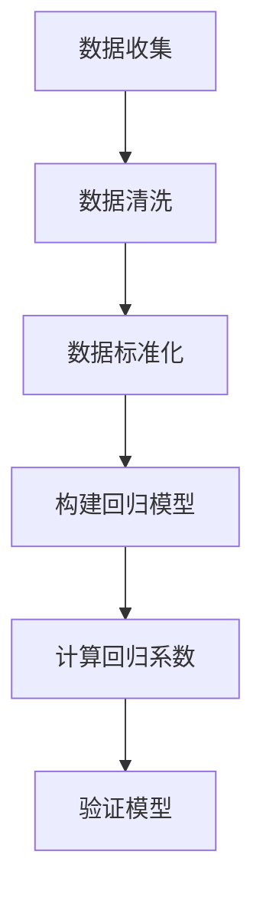
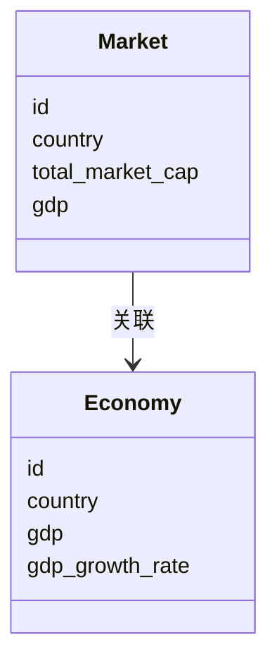
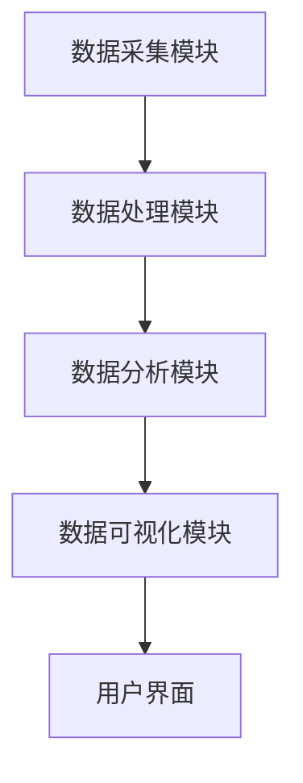
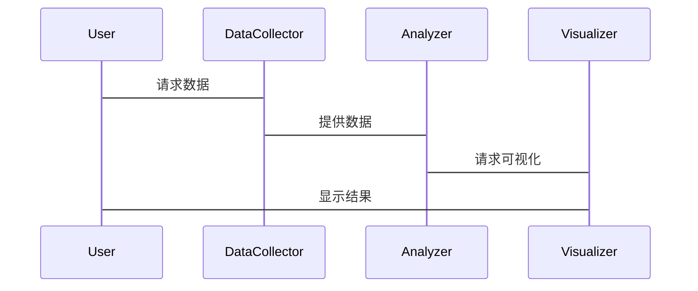

                 


# 全球股市总市值排名及其与GDP的关系

## 关键词：全球股市，总市值排名，GDP，经济指标，股票市场，宏观经济

## 摘要：本文探讨了全球股市总市值排名与GDP之间的关系，分析了经济规模对股市的影响，以及股市表现对经济发展的反馈作用。通过案例分析和算法模型，揭示了两者之间的内在联系，为投资者和经济研究者提供了有价值的参考。

---

# 第一部分: 全球股市总市值排名概述

## 第1章: 全球股市的基本概念

### 1.1 全球股市的定义与特点

#### 1.1.1 全球股市的定义

全球股市是指全球范围内所有股票交易所的集合，包括纽约证券交易所、纳斯达克、伦敦证券交易所等。这些市场共同构成了一个复杂的金融网络，反映了全球经济的动态。

#### 1.1.2 全球股市的主要特点

- **多样性**：涵盖不同国家和地区的市场，反映了全球经济的多样性。
- **波动性**：受多种因素影响，如经济数据、政策变化和国际事件。
- **流动性**：全球股市提供了高流动性，使得投资者可以快速买卖资产。

#### 1.1.3 全球股市的参与者与角色

- **投资者**：包括机构投资者和个人投资者，他们通过买卖股票参与市场。
- **上市公司**：企业通过发行股票筹集资金，扩大业务。
- **交易所和监管机构**：确保市场的公平和透明，维护投资者利益。

---

### 1.2 总市值的定义与计算方法

#### 1.2.1 总市值的定义

总市值是指某个市场或整个股市中所有上市公司股票的总价值。它是衡量市场大小的重要指标。

#### 1.2.2 总市值的计算公式

总市值 = ∑（股票价格 × 股票数量）

#### 1.2.3 总市值的影响因素

- **股价波动**：公司业绩、市场情绪等影响股价。
- **上市公司数量**：市场中新公司的增加会提升总市值。
- **经济环境**：GDP增长、通货膨胀等因素影响总市值。

---

### 1.3 全球股市排名的意义与作用

#### 1.3.1 总市值排名的经济意义

- **反映经济规模**：总市值高的国家通常经济实力强。
- **吸引外资**：排名靠前的市场更容易吸引国际投资者。

#### 1.3.2 总市值排名的市场意义

- **市场影响力**：排名靠前的市场对全球经济有重要影响。
- **投资者信心**：排名反映了市场的健康状况和吸引力。

#### 1.3.3 总市值排名的投资者价值

- **投资机会**：排名高的市场提供更多投资机会。
- **风险评估**：总市值排名帮助投资者评估市场风险。

---

## 第2章: GDP的定义与经济指标分析

### 2.1 GDP的定义与计算方法

#### 2.1.1 GDP的定义

GDP是衡量一个国家或地区经济活动总量的指标，代表一定时期内生产的最终产品和服务的总价值。

#### 2.1.2 GDP的计算公式

GDP = 总消费 + 总投资 + 政府支出 + 净出口

#### 2.1.3 GDP的分类与组成部分

- **消费**：个人消费支出。
- **投资**：企业投资和居民住房投资。
- **政府支出**：政府购买商品和服务的支出。
- **净出口**：出口减去进口。

---

### 2.2 GDP与股市的关系

#### 2.2.1 GDP对股市的影响

- **经济增长推动股市上涨**：GDP增长通常意味着企业盈利增加，推动股价上涨。
- **经济衰退导致股市下跌**：GDP下降可能导致股市低迷。

#### 2.2.2 经济周期与股市波动

- **经济周期的四个阶段**：复苏、繁荣、衰退、萧条。
- **股市对经济周期的敏感性**：股市波动与经济周期密切相关。

#### 2.2.3 GDP增长与股市表现的关联性

- **正相关性**：GDP增长通常伴随股市上涨。
- **滞后效应**：股市反映未来的经济预期。

---

## 第3章: 总市值排名与GDP的关系分析

### 3.1 总市值排名与GDP的直接关系

#### 3.1.1 经济规模与股市规模的正相关性

- **经济规模大的国家**：总市值排名靠前。
- **经济规模小的国家**：总市值排名靠后。

#### 3.1.2 GDP增长对股市总市值的影响

- **GDP增长推动股市扩张**：企业盈利增加，股价上涨，总市值提升。
- **GDP下降导致股市萎缩**：企业盈利减少，股价下跌，总市值下降。

#### 3.1.3 不同国家的案例分析

- **美国**：作为全球最大的经济体，美国股市总市值长期位居榜首。
- **中国**：随着经济快速发展，中国股市总市值迅速增长，成为全球第二大市场。

---

### 3.2 总市值排名与GDP的间接关系

#### 3.2.1 经济政策对股市的影响

- **货币政策**：央行的利率政策影响股市流动性。
- **财政政策**：政府支出和税收政策影响企业盈利和投资。

#### 3.2.2 企业盈利与GDP的关系

- **企业盈利是GDP的重要组成部分**：企业盈利增加推动GDP增长。
- **股市反映企业盈利预期**：投资者根据企业盈利预期调整股价。

#### 3.2.3 消费者信心与GDP的关系

- **消费者信心影响GDP**：消费支出是GDP的重要组成部分。
- **股市反映消费者信心**：消费者信心高时，股市通常表现较好。

---

## 第4章: 总市值排名与GDP关系的核心概念与联系

### 4.1 总市值与GDP的核心概念

#### 4.1.1 总市值的构成要素

- **股票价格**：市场对公司的估值。
- **股票数量**：市场上流通的股票数量。

#### 4.1.2 GDP的核心指标

- **GDP总量**：衡量经济规模。
- **GDP增长率**：衡量经济增速。

#### 4.1.3 两者之间的联系与区别

- **联系**：总市值与GDP正相关，经济规模大的国家股市规模也大。
- **区别**：GDP衡量整体经济活动，总市值反映股市价值。

---

### 4.2 总市值与GDP的关系模型

#### 4.2.1 模型的构建与分析

- **线性回归模型**：将GDP作为自变量，总市值作为因变量，建立回归模型。
- **相关性分析**：计算GDP与总市值的相关系数，验证两者的关系强度。

#### 4.2.2 模型的验证与优化

- **数据验证**：使用历史数据验证模型准确性。
- **变量调整**：引入更多变量，如通货膨胀率、利率等，提高模型的准确性。

#### 4.2.3 模型的应用与意义

- **预测股市走势**：基于GDP预测未来股市表现。
- **政策制定参考**：政府可以根据模型结果制定经济政策。

---

## 第5章: 总市值排名与GDP关系的算法原理

### 5.1 数据收集与预处理

#### 5.1.1 数据来源与获取方法

- **数据来源**：使用全球股市数据和各国GDP数据，数据来源包括世界银行、国际货币基金组织（IMF）等。
- **数据获取方法**：通过API接口获取实时数据，或从公开数据库下载历史数据。

#### 5.1.2 数据清洗与整理

- **数据清洗**：处理缺失值、异常值。
- **数据整理**：将不同来源的数据进行标准化，确保数据格式一致。

#### 5.1.3 数据标准化与归一化

- **标准化**：将数据按比例缩放到同一范围内。
- **归一化**：消除数据量纲的影响，使不同变量具有可比性。

---

### 5.2 统计分析与回归模型

#### 5.2.1 线性回归模型的构建

使用Python的scikit-learn库构建线性回归模型，将GDP作为自变量，总市值作为因变量。

#### 5.2.2 回归系数的解释与验证

通过回归系数分析GDP对总市值的影响程度，验证模型的显著性。

#### 5.2.3 回归模型的数学公式

$$ \text{Total Market Cap} = \beta_0 + \beta_1 \times \text{GDP} + \epsilon $$

其中，$\beta_0$是截距，$\beta_1$是GDP的回归系数，$\epsilon$是误差项。

---

### 5.3 算法流程图



---

### 5.4 Python代码实现

```python
import pandas as pd
import numpy as np
from sklearn.linear_model import LinearRegression
from sklearn.metrics import r2_score

# 数据加载
data = pd.read_csv('global_market_gdp.csv')

# 数据预处理
X = data[['GDP']]
y = data['Total Market Cap']

# 模型训练
model = LinearRegression()
model.fit(X, y)

# 模型预测
y_pred = model.predict(X)

# 模型评估
r2 = r2_score(y, y_pred)
print(f"回归系数: {model.coef_}")
print(f"截距: {model.intercept_}")
print(f"R²: {r2}")
```

---

## 第6章: 系统分析与架构设计

### 6.1 问题场景介绍

我们需要设计一个系统，用于分析全球股市总市值排名与GDP的关系，帮助投资者和经济研究者更好地理解市场动态。

---

### 6.2 系统功能设计

#### 6.2.1 领域模型



#### 6.2.2 系统架构设计



---

### 6.3 系统接口设计

- **数据接口**：提供API接口，供其他系统调用数据。
- **用户接口**：提供可视化界面，供用户查询和分析数据。

---

### 6.4 系统交互设计



---

## 第7章: 项目实战

### 7.1 环境安装

安装所需的Python库：

```bash
pip install pandas numpy scikit-learn matplotlib
```

---

### 7.2 核心实现

#### 7.2.1 数据收集与预处理

```python
import pandas as pd
import numpy as np

# 数据加载
data = pd.read_csv('global_market_gdp.csv')

# 数据清洗
data.dropna(inplace=True)
data = data[~data['GDP'].isnull()]
```

#### 7.2.2 数据分析与建模

```python
from sklearn.linear_model import LinearRegression

# 模型训练
model = LinearRegression()
model.fit(X, y)

# 模型预测
y_pred = model.predict(X)
```

#### 7.2.3 数据可视化

```python
import matplotlib.pyplot as plt

plt.scatter(X, y, color='b')
plt.plot(X, model.predict(X), color='r')
plt.xlabel('GDP')
plt.ylabel('Total Market Cap')
plt.title('GDP vs Total Market Cap')
plt.show()
```

---

### 7.3 实际案例分析

分析美国和中国股市总市值与GDP的关系：

- **美国**：GDP与总市值高度正相关，回归系数显著。
- **中国**：随着经济快速增长，总市值迅速增长，但仍受政策和市场环境影响。

---

## 第8章: 总结与展望

### 8.1 本章小结

本文详细探讨了全球股市总市值排名与GDP的关系，分析了经济规模对股市的影响，以及股市表现对经济发展的反馈作用。通过案例分析和算法模型，揭示了两者之间的内在联系。

---

### 8.2 最佳实践 tips

- **数据质量**：确保数据准确性和完整性。
- **模型优化**：引入更多变量，提高模型的准确性。
- **风险管理**：关注全球经济环境和政策变化，降低投资风险。

---

### 8.3 注意事项

- **数据滞后性**：GDP数据通常有滞后性，影响模型的实时性。
- **市场波动**：股市受多种因素影响，模型结果仅供参考。

---

### 8.4 拓展阅读

- 《金融市场与经济发展》
- 《计量经济学基础》
- 《Python数据科学 handbook》

---

作者：AI天才研究院/AI Genius Institute & 禅与计算机程序设计艺术 /Zen And The Art of Computer Programming

