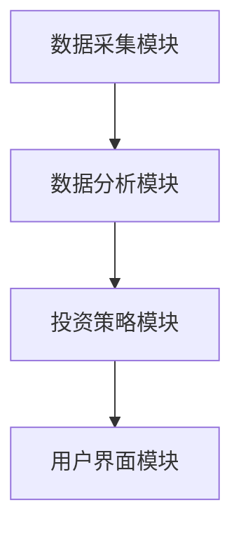
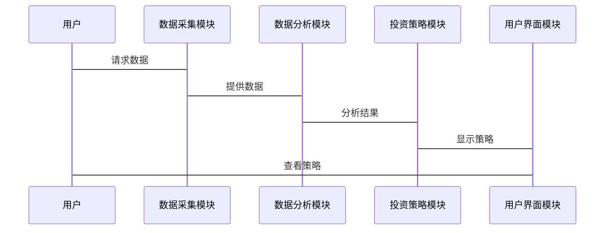

                 


# 公司债务水平与特价股票投资的关系

> 关键词：公司债务、股票投资、特价股票、资本结构、WACC、资产定价模型

> 摘要：本文探讨了公司债务水平与特价股票投资之间的关系，分析了债务对公司价值和股价的影响，提出了基于数学模型的投资策略，并通过实例展示了如何利用这些模型进行投资决策。

---

## 第1章: 公司债务与特价股票的基本概念

### 1.1 公司债务的定义与分类

#### 1.1.1 公司债务的定义
公司债务是指公司通过借款或其他方式形成的负债，是公司资本结构的重要组成部分。债务融资具有杠杆效应，能够放大股东收益，但也增加了财务风险。

#### 1.1.2 公司债务的主要分类
1. **短期债务**：如应付账款、短期贷款等，通常用于满足公司短期资金需求。
2. **长期债务**：如长期债券、银行贷款等，用于支持公司长期项目或资本支出。
3. **无息债务**：如应付账款、应付票据等，不产生利息支出。
4. **有息债务**：如银行贷款、债券等，需要定期支付利息。

#### 1.1.3 公司债务的特征与优势
1. **杠杆效应**：债务融资可以放大股东收益，但同时也增加了财务风险。
2. **资本成本低**：通常债务融资的成本低于股权融资。
3. **税务优势**：债务利息可以在税前扣除，降低税后成本。

### 1.2 特价股票的定义与特点

#### 1.2.1 特价股票的定义
特价股票是指价格低于其内在价值，具有较大上涨潜力的股票。通常，这类股票可能被市场低估，或公司处于困境中，但具有扭亏为盈的潜力。

#### 1.2.2 特价股票的主要类型
1. **困境股**：公司财务状况不佳，但具有重组或复苏的潜力。
2. **价值股**：市场价格低于其内在价值，通常为低估值的蓝筹股。
3. **成长股**：公司具有较高的成长性，但市场价格尚未反映其未来增长潜力。

#### 1.2.3 特价股票的投资价值与风险
1. **投资价值**：价格低廉，上涨空间大，具有较高的潜在回报。
2. **投资风险**：公司基本面可能存在问题，股价波动较大。

### 1.3 公司债务与特价股票的关系

#### 1.3.1 公司债务对股价的影响
公司债务水平影响公司的财务健康状况，进而影响股价。高债务可能导致公司财务风险增加，股价波动加剧。

#### 1.3.2 特价股票与公司债务水平的关联性
1. **高债务公司**：可能更容易成为特价股票，因为市场可能低估其价值。
2. **低债务公司**：通常财务更加稳健，股价波动较小，不太可能成为特价股票。

#### 1.3.3 债务水平对投资决策的影响
1. **高债务公司**：适合风险承受能力强的投资者。
2. **低债务公司**：适合风险厌恶型投资者。

---

## 第2章: 公司债务水平与股票投资的理论基础

### 2.1 资本结构理论

#### 2.1.1 资本结构的定义与组成
资本结构是指公司资本中股权和债务的比例。合理的资本结构能够降低资本成本，提高公司价值。

#### 2.1.2 资本结构与公司价值的关系
资本结构影响公司价值，杠杆原理可能导致公司价值最大化或最小化。

#### 2.1.3 Modigliani-Miller定理的简介
Modigliani-Miller定理指出，在无摩擦市场中，公司价值与资本结构无关。但在现实市场中，债务融资成本低于股权融资成本，因此资本结构会影响公司价值。

### 2.2 资产定价模型

#### 2.2.1 CAPM模型的原理与应用
CAPM模型用于估计资产的预期收益，考虑了系统性风险和非系统性风险。

$$ E(R_i) = R_f + \beta_i (R_m - R_f) $$

其中：
- \( E(R_i) \)：资产的预期收益
- \( R_f \)：无风险利率
- \( \beta_i \)：资产的beta系数
- \( R_m \)：市场预期收益
- \( R_f \)：无风险利率

#### 2.2.2 WACC（加权平均资本成本）的计算公式
$$ WACC = \left( \frac{D}{V} \right) \times cost\_debt \times (1 - t) + \left( \frac{E}{V} \right) \times cost\_equity $$

其中：
- \( D \)：债务总额
- \( E \)：股权总额
- \( V \)：公司总价值
- \( cost\_debt \)：债务成本
- \( cost\_equity \)：股权成本
- \( t \)：税率

#### 2.2.3 债务与股权在资产定价中的作用
债务成本和股权成本共同影响公司的加权平均资本成本，进而影响资产定价。

### 2.3 债务与股票投资的理论联系

#### 2.3.1 债务对公司价值的影响
高债务可能导致公司财务风险增加，但可能通过杠杆效应提高股东收益。

#### 2.3.2 债务对股票价格波动的影响
高债务公司股价波动较大，因为市场对债务风险更加敏感。

#### 2.3.3 债务与股票投资风险的平衡
投资者需要在债务风险和收益之间找到平衡点，制定合适的投资策略。

---

## 第3章: 公司债务水平与特价股票投资的数学模型

### 3.1 公司债务与股票价值的数学关系

#### 3.1.1 Modigliani-Miller模型的数学公式
$$ V = \frac{E}{1 - \frac{D}{V}} $$

其中：
- \( V \)：公司总价值
- \( E \)：股权价值
- \( D \)：债务价值

#### 3.1.2 WACC的计算公式与应用
WACC用于评估公司项目的资本成本，影响股票价值。

#### 3.1.3 债务与股票价值的平衡点分析
通过数学模型找到债务与股票价值的平衡点，优化资本结构。

### 3.2 特价股票投资的数学模型

#### 3.2.1 特价股票投资的收益与风险模型
$$ expected\_return = \alpha + \beta \times market\_return $$

其中：
- \( \alpha \)：特异风险
- \( \beta \)：系统性风险

#### 3.2.2 基于债务水平的股票定价模型
$$ stock\_price = \frac{E}{1 - \frac{D}{V}} $$

#### 3.2.3 债务与股票投资的回归分析
通过回归分析研究债务水平与股票投资回报之间的关系。

### 3.3 数学模型的实例分析

#### 3.3.1 某公司债务水平与股价关系的案例分析
分析某公司的债务水平和股价波动，验证数学模型的有效性。

#### 3.3.2 基于数学模型的特价股票投资策略制定
制定基于数学模型的投资策略，选择具有高回报潜力的特价股票。

#### 3.3.3 模型的优缺点与改进方向
总结模型的优缺点，并提出改进方向，如引入更多变量或优化算法。

---

## 第4章: 公司债务与股票投资的系统分析与架构设计

### 4.1 系统分析

#### 4.1.1 问题场景介绍
分析公司债务与股票投资的关系，制定有效的投资策略。

#### 4.1.2 系统功能需求分析
1. 数据采集：收集公司债务和股价数据。
2. 数据分析：分析债务与股价的关系。
3. 投资策略制定：基于分析结果制定投资策略。

#### 4.1.3 系统边界与外部实体
1. 数据源：公司财务报表、股票市场数据。
2. 用户：投资者、金融分析师。

### 4.2 系统架构设计

#### 4.2.1 系统架构的模块划分
1. 数据采集模块
2. 数据分析模块
3. 投资策略模块
4. 用户界面模块

#### 4.2.2 各模块之间的交互关系
- 数据采集模块向数据分析模块提供数据。
- 数据分析模块为投资策略模块提供分析结果。
- 用户通过用户界面模块查看投资策略。

#### 4.2.3 系统架构的mermaid图展示


### 4.3 接口与交互设计

#### 4.3.1 系统接口的设计规范
1. 数据接口：API接口用于数据采集。
2. 用户接口：友好的用户界面供用户查看投资策略。

#### 4.3.2 系统交互的mermaid序列图展示


---

## 第5章: 项目实战

### 5.1 环境安装

#### 5.1.1 安装Python
安装Python 3.x版本，确保环境支持数据处理和分析。

#### 5.1.2 安装必要的库
安装pandas、numpy、scipy等库，用于数据处理和分析。

### 5.2 系统核心实现源代码

#### 5.2.1 数据采集代码
```python
import pandas as pd
import requests

url = "https://example.com/data"
response = requests.get(url)
data = response.json()
df = pd.DataFrame(data)
```

#### 5.2.2 数据分析代码
```python
import pandas as pd
import numpy as np

# 计算WACC
def calculate_wacc(df):
    debt = df['debt'].sum()
    equity = df['equity'].sum()
    value = debt + equity
    cost_debt = df['cost_debt'].mean()
    cost_equity = df['cost_equity'].mean()
    tax_rate = df['tax_rate'].mean()
    wacc = (debt / value) * cost_debt * (1 - tax_rate) + (equity / value) * cost_equity
    return wacc

wacc = calculate_wacc(df)
print(f"WACC: {wacc}")
```

#### 5.2.3 投资策略代码
```python
import pandas as pd
import numpy as np

# 基于债务水平的股票筛选
def screen_stocks(df):
    debt_ratio = df['debt'] / df['value']
    high_debt_stocks = df[debt_ratio > 0.5]
    return high_debt_stocks

high_debt_stocks = screen_stocks(df)
print(high_debt_stocks)
```

### 5.3 代码应用解读与分析

#### 5.3.1 数据采集代码解读
通过API接口采集公司债务和股价数据，存储在DataFrame中。

#### 5.3.2 数据分析代码解读
计算WACC，评估公司的资本成本，进而影响股票价值。

#### 5.3.3 投资策略代码解读
筛选债务水平较高的股票，作为潜在的特价股票投资标的。

### 5.4 实际案例分析与详细讲解剖析

#### 5.4.1 案例分析
分析某公司债务水平与股价关系，验证投资策略的有效性。

#### 5.4.2 详细讲解剖析
通过案例分析，展示如何利用数学模型和系统分析制定投资策略。

### 5.5 项目小结

#### 5.5.1 项目总结
总结项目的主要成果和经验教训。

#### 5.5.2 项目改进方向
提出未来的研究方向和优化建议。

---

## 第6章: 最佳实践、小结、注意事项、拓展阅读

### 6.1 最佳实践

#### 6.1.1 数据分析技巧
1. 确保数据的准确性和完整性。
2. 使用多种模型进行验证和交叉检验。

#### 6.1.2 投资策略优化
1. 定期调整投资组合。
2. 结合市场环境动态调整策略。

### 6.2 小结

#### 6.2.1 核心内容回顾
回顾文章的核心内容，强调债务水平与特价股票投资之间的关系。

#### 6.2.2 研究成果总结
总结研究的主要成果，提出未来的研究方向。

### 6.3 注意事项

#### 6.3.1 投资风险提示
提示投资者注意债务风险和市场波动风险。

#### 6.3.2 数据依赖性
强调数据分析的局限性，提醒投资者注意数据的准确性和完整性。

### 6.4 拓展阅读

#### 6.4.1 相关书籍推荐
推荐相关书籍，供读者深入学习。

#### 6.4.2 相关论文推荐
推荐相关论文，供读者进一步研究。

---

## 作者

作者：AI天才研究院/AI Genius Institute & 禅与计算机程序设计艺术 /Zen And The Art of Computer Programming

