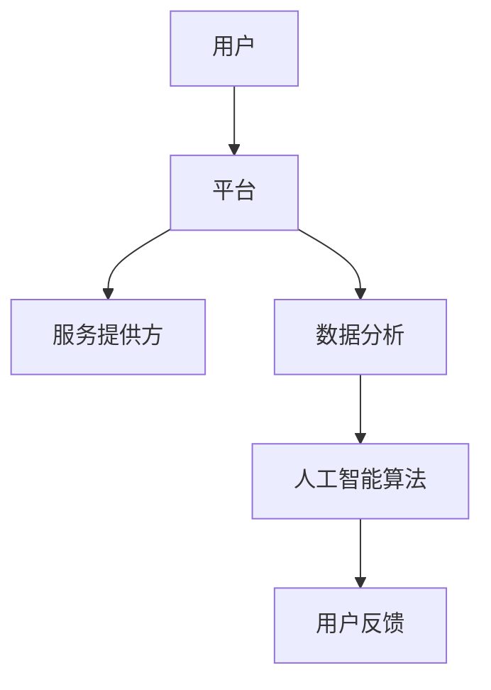
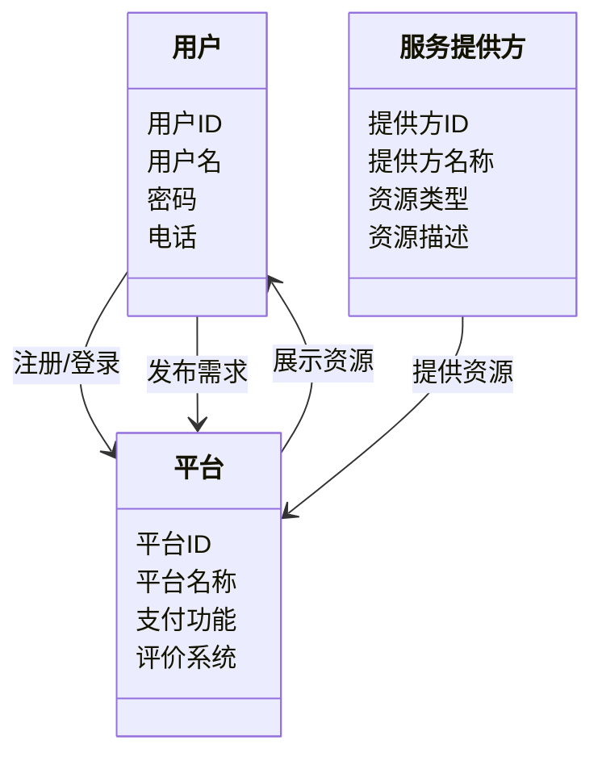
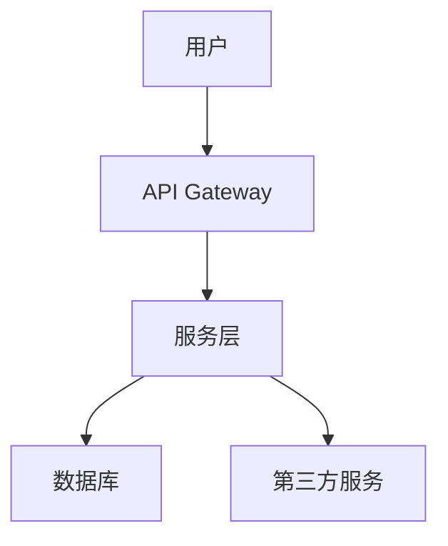

                 


# 共享经济模式对传统行业的影响与投资机会

## 关键词：共享经济，传统行业，投资机会，商业模式，技术创新，风险管理

## 摘要：  
共享经济作为一种新兴的经济模式，通过数字化技术与闲置资源的高效匹配，正在对传统行业产生深远的影响。本文从共享经济的核心概念出发，分析其对传统行业的具体影响，探讨投资机会与风险，并结合实际案例，总结共享经济模式的成功经验与未来发展趋势。通过系统分析与实践案例，本文为投资者和企业提供了共享经济时代的战略参考。

---

## 第一章: 共享经济的定义与核心特征

### 1.1 共享经济的基本概念

#### 1.1.1 共享经济的定义与内涵

共享经济是一种基于数字化技术的经济模式，通过平台将闲置资源与需求方高效匹配，实现资源的最优配置。其核心在于“共享”而非“拥有”，通过技术手段降低交易成本，提高资源利用率。

#### 1.1.2 共享经济的核心特征

共享经济具有以下核心特征：

- **去中心化**：通过平台连接供给方和需求方，减少中间环节。
- **资源闲置利用**：通过共享闲置资源，创造新的经济价值。
- **技术驱动**：依赖大数据、人工智能、区块链等技术实现资源匹配与信任机制。
- **灵活性与普惠性**：满足多样化需求，降低用户门槛。

#### 1.1.3 共享经济与传统经济的对比

| 特性         | 共享经济          | 传统经济          |
|--------------|-------------------|-------------------|
| 资源利用     | 高效匹配，闲置利用 | 专有资源，低效利用 |
| 交易方式     | 去中心化平台       | 中心化机构       |
| 成本结构     | 技术驱动，低交易成本 | 高中间成本       |
| 用户参与     | 平台参与，灵活     | 企业主导，固定     |

### 1.2 共享经济的模式与分类

#### 1.2.1 共享经济的主要模式

- **P2P模式**：点对点直接连接供给方与需求方，如滴滴出行、Airbnb。
- **B2P模式**：企业通过平台提供共享服务，如共享办公空间WeWork。
- **C2C模式**：个人通过平台共享资源，如二手交易平台闲鱼。

#### 1.2.2 共享经济的分类与应用场景

- **交通出行**：滴滴出行、Uber。
- **住宿共享**：Airbnb。
- **办公空间**：WeWork。
- **物品共享**：共享单车、共享充电宝。

#### 1.2.3 共享经济的典型案例分析

以滴滴出行为例，其通过移动互联网技术，将闲置的私家车资源与出行需求高效匹配，重构了传统出租车行业。

### 1.3 共享经济的技术支撑与社会影响

#### 1.3.1 共享经济的技术基础

- **大数据分析**：通过用户行为数据优化资源配置。
- **人工智能**：实现智能匹配与需求预测。
- **区块链**：构建信任机制，确保交易安全。

#### 1.3.2 共享经济对社会资源分配的影响

共享经济通过优化资源配置，减少资源浪费，推动可持续发展。

#### 1.3.3 共享经济对传统行业的影响

共享经济正在颠覆传统行业，推动行业从“拥有”向“使用”转变。

---

## 第二章: 共享经济对传统行业的影响

### 2.1 传统行业在共享经济中的变革

#### 2.1.1 传统行业面临的挑战

- 资源利用率低。
- 交易成本高。
- 服务模式单一。

#### 2.1.2 共享经济对传统行业的机遇

- 提高资源利用率。
- 创新服务模式。
- 拓展市场空间。

#### 2.1.3 传统行业与共享经济的融合

通过平台化转型，传统行业可以更好地适应共享经济模式。

### 2.2 共享经济对具体行业的分析

#### 2.2.1 共享经济对交通行业的影响

- **案例分析**：滴滴出行重构了传统出租车行业。
- **影响分析**：提高了车辆利用率，降低了出行成本。

#### 2.2.2 共享经济对住宿行业的影响

- **案例分析**：Airbnb改变了传统酒店业的格局。
- **影响分析**：提供个性化住宿服务，满足多样化需求。

#### 2.2.3 共享经济对金融行业的影响

- **案例分析**：P2P借贷平台（如Lending Club）。
- **影响分析**：降低融资成本，提高资金流动性。

### 2.3 共享经济对就业模式的改变

#### 2.3.1 共享经济下的灵活就业

- 自由职业者、兼职司机、民宿房东等新型就业形式。

#### 2.3.2 共享经济对传统就业结构的影响

- 传统全职就业模式受到冲击。
- 新型就业模式提供更多灵活性。

#### 2.3.3 共享经济对社会保障体系的挑战

- 如何为灵活就业者提供社会保障是亟待解决的问题。

---

## 第三章: 共享经济的投资机会与风险分析

### 3.1 共享经济的投资价值

#### 3.1.1 共享经济的市场潜力

- 全球共享经济市场规模持续增长。
- 新兴领域（如共享办公、共享医疗）潜力巨大。

#### 3.1.2 共享经济的投资热点

- 技术驱动的共享平台。
- 新兴行业（如共享教育、共享健身）。

#### 3.1.3 共享经济的未来发展趋势

- 技术与场景深度融合。
- 共享经济全球化发展。

### 3.2 共享经济的投资风险

#### 3.2.1 市场风险

- 市场竞争激烈。
- 用户需求变化快。

#### 3.2.2 技术风险

- 技术迭代快，平台维护成本高。
- 数据安全风险。

#### 3.2.3 政策风险

- 监管政策变化。
- 法律合规风险。

### 3.3 共享经济的投资策略

#### 3.3.1 投资者如何选择共享经济项目

- 关注市场需求。
- 评估团队能力。
- 分析商业模式。

#### 3.3.2 共享经济项目的估值方法

- 市盈率法。
- 市净率法。
- 现金流折现法。

#### 3.3.3 投资风险的应对策略

- 分散投资。
- 建立风险评估机制。
- 保持灵活性。

### 3.4 共享经济的成功案例分析

#### 3.4.1 典型共享经济企业的成功经验

- 滴滴出行：技术创新与市场拓展并重。
- Airbnb：用户信任机制与平台服务优化。

#### 3.4.2 共享经济失败案例的教训

- Ofo：资金链断裂与管理问题。
- 共享办公：过度扩张与市场需求不符。

#### 3.4.3 投资者如何从案例中吸取经验

- 关注商业模式的可持续性。
- 重视团队能力和执行力。
- 风险控制是投资成功的关键。

---

## 第四章: 共享经济的商业模式与技术创新

### 4.1 共享经济的商业模式

#### 4.1.1 共享经济的主要商业模式

- 平台佣金模式。
- 广告收入模式。
- 数据变现模式。

#### 4.1.2 共享经济商业模式的特点

- 依赖平台经济。
- 以用户为中心。
- 数据驱动决策。

#### 4.1.3 共享经济商业模式与传统商业模式的对比

| 模式         | 共享经济商业模式         | 传统商业模式         |
|--------------|-------------------------|---------------------|
| 收入来源     | 平台佣金、广告、数据     | 产品销售、服务收费   |
| 用户参与     | 用户既是供给方也是需求方 | 用户单向消费         |
| 技术依赖     | 高                     | 低                 |

### 4.2 共享经济的技术创新

#### 4.2.1 技术创新对共享经济的影响

- 大数据技术：优化资源配置。
- 人工智能：提升用户体验。
- 区块链：增强信任机制。

#### 4.2.2 共享经济的技术架构设计



#### 4.2.3 技术创新带来的投资机会

- 投资于技术创新能力强的共享平台。
- 关注技术驱动的新兴领域。

---

## 第五章: 共享经济的系统分析与架构设计

### 5.1 系统分析

#### 5.1.1 问题场景介绍

- 用户需求多样化。
- 资源分配不均。
- 平台信任机制缺失。

#### 5.1.2 项目介绍

以共享办公空间为例，设计一个平台实现企业间的资源共享。

### 5.2 系统功能设计

#### 5.2.1 领域模型设计



#### 5.2.2 系统架构设计



---

## 第六章: 项目实战

### 6.1 环境安装

- 安装Python 3.8及以上版本。
- 安装Django框架。

### 6.2 系统核心实现源代码

```python
from django.shortcuts import render, redirect
from django.contrib.auth.models import User
from django.contrib.auth import authenticate, login, logout
from .models import Resource, Request

def home(request):
    return render(request, 'home.html')

def register(request):
    if request.method == 'POST':
        username = request.POST['username']
        password = request.POST['password']
        user = User.objects.create_user(username, '', password)
        user.save()
        return redirect('/login')
    return render(request, 'register.html')

def login_view(request):
    if request.method == 'POST':
        username = request.POST['username']
        password = request.POST['password']
        user = authenticate(request, username=username, password=password)
        if user is not None:
            login(request, user)
            return redirect('/home')
        else:
            return render(request, 'login.html', {'error': 'Invalid credentials'})
    return render(request, 'login.html')

def post_resource(request):
    if request.method == 'POST':
        title = request.POST['title']
        description = request.POST['description']
        resource = Resource.objects.create(title=title, description=description, user=request.user)
        resource.save()
        return redirect('/my-resources')
    return render(request, 'post_resource.html')

def request_resource(request):
    if request.method == 'POST':
        title = request.POST['title']
        description = request.POST['description']
        request_obj = Request.objects.create(title=title, description=description, user=request.user)
        request_obj.save()
        return redirect('/my-requests')
    return render(request, 'request_resource.html)
```

### 6.3 代码应用解读与分析

- 用户模块：实现用户注册、登录、注销功能。
- 资源模块：允许用户发布资源和需求。
- 平台匹配：通过算法匹配供需双方。

### 6.4 实际案例分析

- 通过共享办公空间的案例，展示平台如何实现资源匹配与用户管理。

### 6.5 项目小结

- 共享经济的核心在于高效匹配供需。
- 技术实现是关键，需要结合实际需求进行优化。

---

## 第七章: 共享经济的最佳实践与未来展望

### 7.1 最佳实践 tips

- 投资者应关注技术驱动的共享平台。
- 企业应注重用户体验与信任机制。
- 政府需加强监管与政策支持。

### 7.2 小结

共享经济通过技术创新与模式创新，正在改变传统行业的格局。其影响深远，既带来机遇也伴随挑战。

### 7.3 未来展望

- 共享经济将与更多新兴技术（如元宇宙）深度融合。
- 全球化发展将成为趋势。
- 可持续发展将成为共享经济的核心理念。

---

## 作者：AI天才研究院 & 禅与计算机程序设计艺术

---

**本文是基于共享经济模式对传统行业的影响与投资机会的专业技术分析，通过系统分析与实际案例，为读者提供了深入的见解与实践指导。**

