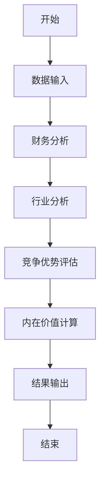

                 


# 内在价值的计算：价值投资者必备技能

> 关键词：价值投资，内在价值，财务分析，DCF模型，竞争优势

> 摘要：  
内在价值是价值投资的核心理念，它是企业未来现金流的现值，反映了企业的真正价值。本文将从内在价值的定义、计算方法、系统架构设计到实际案例分析，逐步解析内在价值的计算过程。通过结合技术分析和财务模型，帮助投资者提升内在价值评估能力，找到具有安全边际的投资标的。

---

## 第一部分：内在价值的核心概念

### 第1章：内在价值的定义与背景

#### 1.1 投资的基本问题
投资的核心在于如何将资金分配到能够创造最大价值的资产上。价值投资者关注的是资产的内在价值，而不是市场的短期波动。内在价值是资产的真实价值，反映了其未来现金流的折现值。

#### 1.2 内在价值的定义
内在价值是指一家公司在未来能够产生的自由现金流的现值。它是基于对公司未来盈利能力、成长潜力和财务状况的全面评估得出的。内在价值与市场价值不同，市场价值受情绪和市场波动影响，而内在价值更注重企业的基本面。

#### 1.3 内在价值与市场价值的关系
市场价值是资产在市场上的价格，可能高于或低于其内在价值。当市场价值低于内在价值时，投资机会出现；当市场价值高于内在价值时，投资风险增大。价值投资者通过寻找市场价值与内在价值的差异，挖掘被低估的投资标的。

---

### 第2章：价值投资的核心理念

#### 2.1 价值投资的起源
价值投资由本杰明·格雷厄姆和戴维·多德提出，强调以低于内在价值的价格买入优质资产。这种方法注重安全边际，即买入价格与内在价值之间的差距，以降低投资风险。

#### 2.2 内在价值与安全边际
安全边际是内在价值与买入价格之间的差额。通过计算内在价值，投资者可以确定一个合理的买入价格，并在市场波动中保持投资的稳定性。

#### 2.3 内在价值的适用场景
内在价值的计算适用于对具有稳定现金流和可持续竞争优势的企业进行估值。它特别适合长期投资者，而对那些依赖市场情绪波动的短期交易者则参考价值较低。

---

## 第二部分：内在价值的计算方法

### 第3章：内在价值的核心要素

#### 3.1 财务指标分析
内在价值的计算依赖于对企业财务状况的全面分析，包括资产负债表、利润表和现金流量表。

- 资产负债表：评估企业的资产和负债结构，判断其财务健康状况。
- 利润表：分析企业的收入和利润情况，评估其盈利能力。
- 现金流量表：了解企业的现金流来源和用途，判断其流动性。

#### 3.2 行业分析与竞争优势
内在价值的计算还需要考虑企业所处的行业环境和竞争优势。

- 行业生命周期：分析行业所处的阶段（幼稚期、成长期、成熟期、衰退期），判断企业的成长潜力。
- 可持续竞争优势：评估企业在行业中的竞争优势，如成本优势、品牌优势、技术壁垒等。

#### 3.3 财务健康状况评估
企业的财务健康状况直接影响其未来现金流的稳定性。

- 财务风险：通过债务率、流动比率等指标评估企业的偿债能力。
- 财务造假识别：通过财务数据的异常波动和逻辑性分析，识别潜在的财务造假行为。

---

### 第4章：内在价值计算的数学模型

#### 4.1 现金流折现模型（DCF）
现金流折现模型是计算内在价值的核心方法之一。

- 自由现金流计算：企业产生的、可用于再投资的现金流。
- 折现率确定：通常使用加权平均资本成本（WACC）作为折现率。
- 终值计算：假设企业在无限期后停止增长，终值可通过永续增长率计算。

公式：
$$ \text{内在价值} = \sum_{t=1}^{n} \frac{\text{自由现金流}_t}{(1 + r)^t} + \frac{\text{终值}}{(1 + r)^n} $$

#### 4.2 相对估值法
相对估值法通过比较市场中类似资产的价格，估算目标资产的内在价值。

- 市盈率（P/E）：股价与每股收益的比率。
- 市净率（P/B）：股价与每股净资产的比率。
- 市销率（P/S）：股价与每股销售收入的比率。

公式：
$$ \text{市盈率} = \frac{\text{股价}}{\text{每股收益}} $$

#### 4.3 内在价值计算的优缺点对比

| 方法       | 优点                           | 缺点                           |
|------------|--------------------------------|--------------------------------|
| DCF模型     | 精确性高，考虑了未来现金流       | 计算复杂，依赖假设（如增长率、折现率） |
| 相对估值法   | 简单易用，适用于横向比较         | 受市场情绪影响，缺乏准确性     |

---

## 第三部分：系统分析与架构设计

### 第5章：内在价值评估的系统架构

#### 5.1 系统功能模块划分
- 数据输入：获取企业的财务数据和行业信息。
- 财务分析：计算各项财务指标。
- 行业分析：评估行业环境和竞争优势。
- 内在价值计算：使用模型计算内在价值。
- 结果输出：显示评估结果和投资建议。

#### 5.2 系统架构设计


#### 5.3 系统接口设计
- 输入接口：接收企业的财务报表数据。
- 输出接口：显示内在价值计算结果和投资建议。

---

## 第四部分：项目实战

### 第6章：内在价值评估的实战分析

#### 6.1 实战环境安装
- 数据来源：获取企业的财务报表和行业数据。
- 工具安装：安装Python和相关数据分析库（如Pandas、NumPy）。

#### 6.2 核心代码实现
```python
import pandas as pd
import numpy as np

# 示例数据：企业财务数据
data = {
    '年份': [2020, 2021, 2022],
    '营业收入': [100, 120, 150],
    '净利润': [20, 30, 40],
    '自由现金流': [25, 35, 45]
}
df = pd.DataFrame(data)

# 计算DCF模型
def calculate_dcf(free_cash_flow, discount_rate, perpetual_growth_rate):
    terminal_value = free_cash_flow[-1] * (1 + perpetual_growth_rate) / (discount_rate - perpetual_growth_rate)
    present_value = 0
    for i in range(len(free_cash_flow)):
        present_value += free_cash_flow[i] / (1 + discount_rate)**i
    total_value = present_value + terminal_value / (1 + discount_rate)**len(free_cash_flow)
    return total_value

discount_rate = 0.1
perpetual_growth_rate = 0.02
intrinsic_value = calculate_dcf(df['自由现金流'], discount_rate, perpetual_growth_rate)
print(f"内在价值：{intrinsic_value}")
```

#### 6.3 实战案例分析
以某企业为例，分析其内在价值，并与市场价值进行对比，判断是否存在投资机会。

---

## 第五部分：最佳实践与小结

### 第7章：最佳实践与小结

#### 7.1 最佳实践
- 确保数据的准确性和完整性。
- 合理假设增长率和折现率。
- 结合相对估值法验证结果。

#### 7.2 小结
内在价值是价值投资的核心，通过系统的分析和计算，投资者可以更好地识别被低估的投资标的。然而，内在价值的计算需要结合实际数据和市场环境，不断完善模型和假设。

#### 7.3 注意事项
- 内在价值的计算依赖于假设，需谨慎选择增长率和折现率。
- 财务造假和行业变化可能影响内在价值的准确性。
- 投资者需持续关注企业的财务状况和行业动态。

---

## 作者信息

作者：AI天才研究院/AI Genius Institute & 禅与计算机程序设计艺术 /Zen And The Art of Computer Programming

---

以上是《内在价值的计算：价值投资者必备技能》的完整目录大纲和文章内容。

