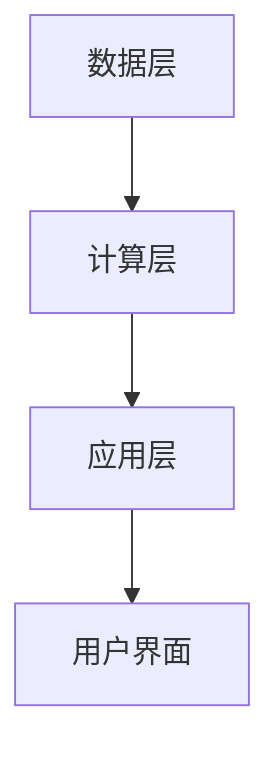

                 


# 净净股票策略：格雷厄姆理论的现代演绎

> 关键词：净净股票策略，格雷厄姆投资理论，价值投资，内在价值，安全边际，现代投资策略，股票分析

> 摘要：本文详细探讨了净净股票策略的背景、核心概念、算法原理、系统架构以及实际应用。通过结合格雷厄姆的经典价值投资理论，本文提出了在现代市场环境下的改进策略，并通过具体案例和代码实现，展示了如何将理论应用于实际投资决策中。

---

# 第一部分：净净股票策略的背景与概述

## 第1章：净净股票策略概述

### 1.1 格雷厄姆投资理论的起源

格雷厄姆是价值投资之父，他的投资理念强调以低于内在价值的价格购买优质股票。他提出的“安全边际”概念，即购买价格与内在价值之间的差距，被认为是投资成功的关键。格雷厄姆的投资策略在20世纪取得了巨大成功，但随着市场的变化，其原始理论在现代环境中需要进行调整。

### 1.2 净净股票策略的定义与特点

净净股票策略是一种基于格雷厄姆价值投资理论的现代演绎。其核心在于通过分析企业的基本面，计算其内在价值，并以低于内在价值的价格买入优质股票。与传统价值投资相比，净净股票策略更注重对财务数据的量化分析，结合现代市场环境进行动态调整。

### 1.3 净净股票策略的应用场景

- **适合的投资者类型**：适合长期投资者、价值投资者以及具备一定财务分析能力的个人投资者。
- **不适合的投资者类型**：短线交易者、投机者以及缺乏基本面分析能力的投资者。
- **现代市场环境对策略的影响**：随着市场的波动加剧，净净股票策略需要结合技术分析和风险管理，以应对市场变化。

---

# 第二部分：净净股票策略的核心概念与联系

## 第2章：价值投资的原理与方法

### 2.1 价值投资的核心原理

- **安全边际的定义与计算**：安全边际=内在价值-市场价格。通过计算安全边际，投资者可以确定投资的安全性。
- **内在价值的评估方法**：内在价值是企业未来现金流的现值，可通过净现值模型、股息贴现模型等方法计算。

### 2.2 净净股票策略的现代演绎

- **格雷厄姆原始模型的改进**：引入动态市盈率、ROE等指标，更全面地评估企业的价值。
- **与其他投资策略的对比**：与成长投资、指数投资等策略相比，净净股票策略更注重安全性和确定性。

---

# 第三部分：净净股票策略的算法原理与数学模型

## 第3章：内在价值的计算方法

### 3.1 净现值模型

净现值（NPV）是评估投资项目的重要指标，其计算公式为：

$$ NPV = \sum_{t=1}^{n} \frac{CF_t}{(1+r)^t} $$

其中，CF_t为第t年的现金流，r为折现率。

### 3.2 股息贴现模型（DDM）

股息贴现模型用于评估股票的内在价值，其公式为：

$$ P = \frac{D_1}{k - g} $$

其中，D_1为第一年的股息，k为贴现率，g为股息增长率。

### 3.3 自由现金流模型

自由现金流模型的计算公式为：

$$ FCF = EBIT(1 - t) + Depreciation - Capital Expenditure $$

其中，EBIT为息税前利润，t为税率，Depreciation为折旧，Capital Expenditure为资本支出。

---

# 第四部分：系统分析与架构设计

## 第4章：系统功能与架构设计

### 4.1 系统功能设计

- **数据采集**：收集企业的财务数据、市场数据等。
- **模型计算**：计算内在价值、安全边际等指标。
- **风险评估**：分析市场风险、行业风险等。

### 4.2 系统架构设计

系统架构包括数据层、计算层和应用层，如下图所示：



### 4.3 系统接口设计

- 数据接口：与金融数据源对接，获取实时数据。
- 计算接口：提供API供其他系统调用计算结果。

---

# 第五部分：项目实战

## 第5章：量化分析与代码实现

### 5.1 环境安装

安装Python环境，安装pandas、numpy、yfinance等库：

```bash
pip install pandas numpy yfinance
```

### 5.2 核心实现代码

以下是计算内在价值的Python代码示例：

```python
import pandas as pd
import numpy as np

def calculate_intrinsic_value(free_cash_flow, discount_rate, growth_rate):
    return free_cash_flow / (discount_rate - growth_rate)

# 示例数据
free_cash_flow = 100
discount_rate = 0.1
growth_rate = 0.05

iv = calculate_intrinsic_value(free_cash_flow, discount_rate, growth_rate)
print(f"内在价值：{iv}")
```

### 5.3 风险管理与案例解读

案例分析：以某公司为例，计算其内在价值，并对比市场价格，评估其投资价值。

---

# 第六部分：总结与展望

## 第6章：总结与展望

### 6.1 总结

净净股票策略是一种结合传统价值投资理论与现代市场环境的策略，通过量化分析和风险管理，能够帮助投资者在复杂市场中获得稳定收益。

### 6.2 未来展望

未来的研究可以进一步优化模型，引入更多动态因素，如宏观经济指标和行业周期分析，以提高策略的有效性。

---

作者：AI天才研究院/AI Genius Institute & 禅与计算机程序设计艺术 /Zen And The Art of Computer Programming

